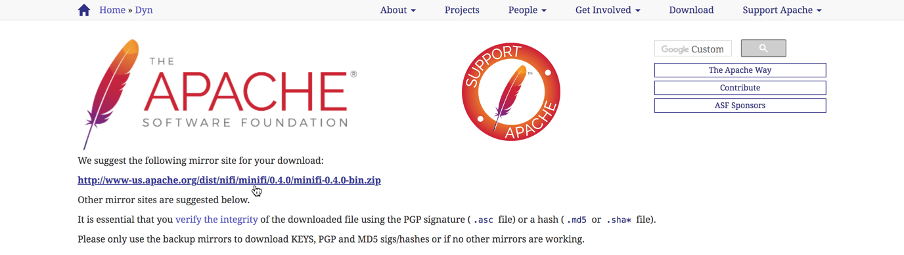
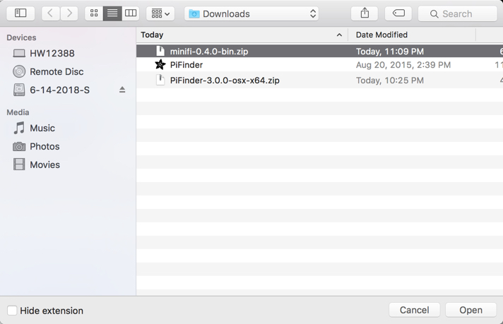
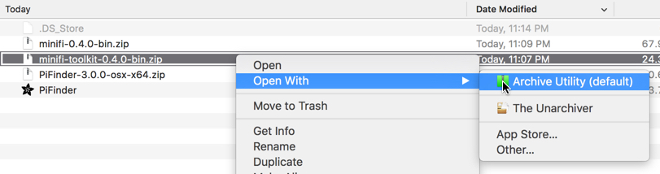
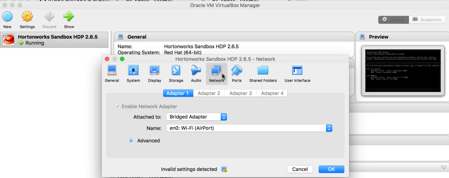
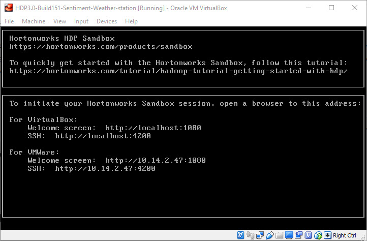
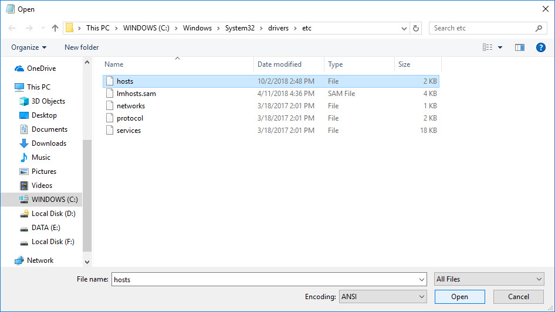
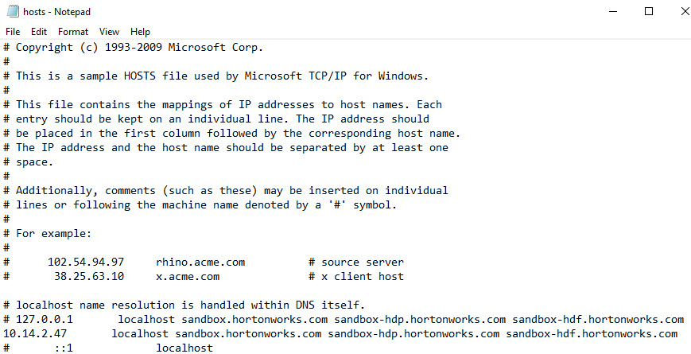
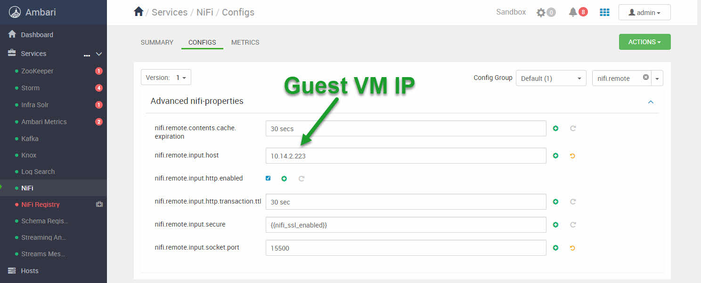
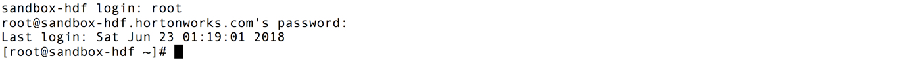
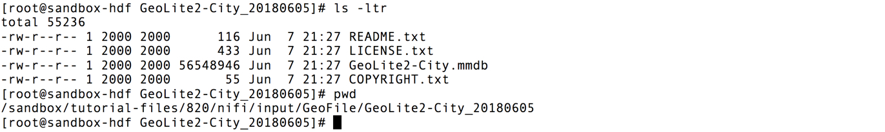

# Deploy IoT Weather Station and Connected Data Architecture

## Introduction

You'll make an IoT Weather Station with a Raspberry Pi and Sense HAT. Additionally, you'll add on data analytics to this IoT Weather Station Platform with Connected Data Architecture communication between the MiNiFi, HDF Sandbox and HDP Sandbox.

## Prerequisites

- Enabled Connected Data Architecture

## Outline

- [Step 1: Setup Raspberry Pi Weather Station Node](#step-1-setup-raspberry-pi-weather-station-node)
- [Step 2: Configure Bridged Adapter Network for VirtualBox](#step-2-configure-bridged-adapter-network-for-virtualbox)
- [Step 3: Map Bridged IP to Desired Hostname in hosts file](#step-3-map-bridged-ip-to-desired-hostname-in-hosts-file)
- [Step 4: Verify Prerequisites Have Been Covered](#step-4-verify-prerequisites-have-been-covered)
- [Step 5: Start HDF Sandbox and Setup NiFi Site-To-Site](#step-5-start-hdf-setup-site-to-site)
- [Summary](#summary)
- [Further Reading](#further-reading)
- [Appendix A: Install Raspbian OS onto Raspberry Pi](#appendix-a-install-raspbian)
- [Appendix B: Reset Raspberry Pi Time and Date for your Region](#reset-rpi-time-date)

### Step 1: Setup Raspberry Pi Weather Station Node

### 1.1: Connect Sense HAT Hardware to Raspberry Pi

1\. Connect the Sense HAT's 40 female pins to the Raspberry Pi's 40 male pins.

**Figure 1:** Sense HAT 40 female pin headers

**Figure 2:** Raspberry Pi 40 male pin headers

**Figure 3:** Sense HAT female pins connected to Raspberry Pi male pins

> Note: If you haven't installed Raspbian OS on your Raspberry Pi, refer to **Appendix A**.

### 1.2: Power the Raspberry Pi and Establish Internet Connection

Plug into the Raspberry Pi a micro USB (could be phone charger) connector to provide power and ethernet to provide internet access.

**Figure 4:** Raspberry Pi Ethernet Cable Connected for Internet Access

### 1.3: SSH into the Raspberry Pi

You'll use **Adafruit's Pi Finder** to discover your Raspberry Pi's IP address, so you can access it remotely, this approach works best in a home network.

1\. Download **Adafruit's Pi Finder** for your appropriate OS at [Adafruit-Pi-Finder Latest Releases](https://github.com/adafruit/Adafruit-Pi-Finder/releases/tag/3.0.0)

2\. Open Raspberry **Pi Finder** and **Click Find My Pi!**:

**Figure 5:** Pi Finder GUI

**Pi Finder** - used to detect _Raspberry Pi IP address_ in a home setting

3\. Results include the **IP address**, **SSH User** and **SSH Password** of your Raspberry Pi:

**Figure 6:** Pi Finder Found My Pi

4\. SSH into the Pi from your laptop by pressing the **Terminal** button.

**Figure 7:** Pi Raspbian OS CLI

### 1.4: Install the Sense HAT Software onto Raspberry Pi

Download and install the Sense HAT Software using the following command:

~~~bash
sudo apt-get update
sudo apt-get install sense-hat
sudo pip3 install pillow
~~~

Now you have the Sense HAT software library, so you can create a program to retrieve sensor readings, you will utilize it in the next tutorial.

### 1.5: Install MiNiFi Java Agent onto Raspberry Pi

In this section, you install Java 8 and JDK 1.8 onto the Raspberry Pi because it is required to run MiNiFi.

Download and Install Java 8 and JDK1.8:

~~~bash
sudo apt-get update && sudo apt-get install oracle-java8-jdk
~~~

> Note: the install will take approximately 10 minutes depending on Raspbian OS resources being used.

1\. Download MiNiFi Java Agent from [Apache nifi minifi Downloads](http://nifi.apache.org/minifi/download.html) under section **Releases -> MiNiFi (Java) -> Binaries**.

2\. Click on **minifi-[latest-version]-bin.zip**, then download MiNiFi from any of the links provided onto your computer.

**Figure 8:** Downloading MiNiFi

3\. Use Pi Finder's **Upload** button to transport MiNiFi application onto your
Raspberry Pi. Select **minifi-[latest-version]-bin.zip** and click **Open**.

**Figure 9:** Uploading MiNiFi to Raspberry Pi

4\. Use the Pi Finder's **Terminal** button to enter the Raspberry Pi and then Unzip the MiNiFi project.

~~~bash
unzip minifi-[latest-version]-bin.zip
~~~

A MiNiFi Agent is installed onto the Raspberry Pi. We'll explain more about the MiNiFi Agent in the next tutorial.

### 1.6: Download MiNiFi Toolkit onto your Computer

In this section, you download MiNiFi toolkit onto your computer because it is needed to convert NiFi flow to MiNiFi flow format. In the next tutorial, you will build the MiNiFi flow in NiFi.

1\. Download MiNiFi Toolkit from [Apache nifi minifi Downloads](http://nifi.apache.org/minifi/download.html) under section **Releases -> MiNiFi Toolkit Binaries -> [latest-version] - Compatible with MiNiFi Java [latest-version]**.

2\. Click on **minifi-toolkit-[latest-version]-bin.zip** then download MiNiFi Toolkit from any of the links provided onto your computer.

3\. Go to the location where MiNiFi was downloaded and Unzip MiNiFi Toolkit
using your favorite decompression software:

**Figure 10:** Extracting MiNiFi Toolkit

Now MiNiFi Toolkit is available for use in the next tutorial.

### 1.7: Calibrate Raspberry Pi Timezone

Why is it important to calibrate the timezone on the Raspberry Pi?

In order for your system to have the correct time and date, the timezone needs to be calibrated. An area where this configuration is important is in the next tutorial when you create the Python script that draws timestamp for each sensor readings.

SSH into the Raspberry Pi using Adafruit's Pi Finder **Terminal** button.

1\. Type `sudo raspi-config`

- **raspi-config** is used for changing OS configurations and will be used to recalibrate the current date/time for your timezone

**Figure 11:** raspi-config main menu

2\. Select **4. Internationalisation Options**. Press "Enter" on keyboard.

3\. Select **I2 Change Timezone**.

**Figure 12:** Internationalisation Options Menu

4\. Select your appropriate **Geographic area**.

- Ex: US

**Figure 13:** Geographic area Selection Items

5\. Select your appropriate **Time zone**.

- Ex: Pacific Ocean

**Figure 14:** Time Zone Selection Items

6\. You are brought back to the menu. Select **<Finish>**. Your new calibrated time should display:

**Figure 15:** Time Zone Calibrated

### Step 2: Configure Bridged Adapter Network For VirtuaBox

### VirtualBox User

Open VirtualBox Manager. If your Guest VM is running, it will need to be stopped.

1\. Click the Settings gear.

2\. In the window that opens, navigate to the **Network** tab.

3\. In the **Attached to** field, select from the dropdown menu, **Bridged Adapter**.

**Figure 16:** Setting VirtualBox Guest VM to Bridged Adapter

> Note: You can keep the default setting for the Name of the Bridged Network.

4\. Make sure in **System** tab that the Base Memory is set to **32GB of RAM**.

Since we are using VirtualBox, both the welcome screen and ssh
that are under both header sections are for VirtualBox. You will see you can
access the web applications from the hostname, ex: **localhost**, or the
explicit **IP address**.

**Figure 17:** VirtualBox Sandbox Welcome

### Step 3: Map Bridged IP to Desired Hostname in hosts file

### Windows User

Click your search bar, type **notepad**, right click on it and select **Run as administrator**. When the popup window appears, click **yes**.

In **notepad**, click **file**, **open...**, navigate path **This PC -> WINDOWS(C:) -> Windows -> System32 -> drivers -> etc** and next to **File name**, click on the dropdown with **Text Documents (*.txt)** and choose **All Files**.

Select **hosts** file and **open** it.

**Figure 18:** hosts file

Copy the line with the current IP address mapped to the sandbox hostnames. Comment out that line. Now paste the line below the commented out line.

Earlier when we turn on the sandbox, we were able to get the IP address from the
virtual machine window.

For example on VirtualBox, the IP address **10.14.2.223** is the one generated for this current session in an office space, but your IP will probably be different.

**Figure 19:** modify hosts file

Save the modified file, **ctrl + s**.

### Mac User

Similar to windows, open the **hosts** file at path **/private/etc/hosts**. Modify the file with your Bridged IP mapped to the sandbox hostnames.

For example, **10.14.2.223** is the VirtualBox IP generated for this current session in an office space, but your IP will be different.

~~~bash
##
# Host Database
#         
# localhost is used to configure the loopback interface
# when the system is booting.  Do not change this entry.
##       
# 127.0.0.1       localhost sandbox-hdp.hortonworks.com sandbox-hdf.hortonworks.com sandbox-host
10.14.2.223       localhost sandbox.hortonworks.com sandbox-hdp.hortonworks.com sandbox-hdf.hortonworks.com
255.255.255.255 broadcasthost
::1             localhost
~~~

Save the modified file.

### Linux User

Similar to windows, open the **hosts** file at path **/etc/hosts**. Modify the file with your Bridged IP mapped to the sandbox hostnames.

For example, **10.14.2.223** is the VirtualBox Guest VM IP generated for this current session in an office space, but your IP will be different.

~~~bash
# File is generated from /sandbox/gen-hosts.sh
# Do not remove the following line, or various programs
# that require network functionality will fail.
127.0.0.1         localhost.localdomain localhost sandbox-hdp.hortonworks.com sandbox-hdf.hortonworks.com sandbox-host
10.14.2.223       localhost sandbox.hortonworks.com sandbox-hdp.hortonworks.com sandbox-hdf.hortonworks.com
~~~

Save the modified file.

## Step 4: Verify Prerequisites Have Been Covered

**Setup Ambari admin password for "HDF" and "HDP"**

If you need help setting the Ambari admin password,

- for HDP, reference **Admin Password Reset** in [Learning the Ropes of HDP Sandbox](https://hortonworks.com/tutorial/learning-the-ropes-of-the-hortonworks-sandbox/)
- for HDF, reference **Admin Password Reset** in [Learning the Ropes of HDF Sandbox](https://hortonworks.com/tutorial/getting-started-with-hdf-sandbox/)

**Started up all required services for "HDF" and "HDP"**

If unsure, login to Ambari **admin** Dashboard

- for HDF at http://sandbox-hdf.hortonworks.com:8080 and verify **NiFi** starts up, else start it.
- for HDP at http://sandbox-hdp.hortonworks.com:8080 and verify **HDFS**, **HBase** and **Zeppelin** starts up, else start them.

### Step 5: Configure NiFi via HDF's Ambari

1\. Login to Ambari at http://sandbox-hdf.hortonworks.com:8080:

> Note: The user/password is **admin** and the password you set.

You will configure NiFi Site-To-Site protocol by exposing an IP address and a socket port, so external NiFi nodes or MiNiFi agents can connect to NiFi master node.

Head to **Advanced NiFi-Properties** in Ambari Config Settings for NiFi. Update the following configurations similar to the image below:

1\. Enter **NiFi Service** in Ambari Stack

2\. Enter **NiFi Configs**

3\. Filter search for `nifi.remote`

4\. Insert `<your-guest-vm-bridged-ip-address>` in **nifi.remote.input.host**. For example, we inserted `10.14.2.223`.

5\. Verify **nifi.remote.input.http.enabled** checked

6\. Insert `15500` in **nifi.remote.input.socket.port**.

7\. Save the configuration. Write in Notes `Configured NiFi for Socket Site-To-Site`

**Figure 20:** Update NiFi Config for Site-to-Site

Now NiFi is configured for Socket Site-To-Site protocol. If you encounter issues deploying MiNiFi to NiFi flow, it could be because the value **nifi.remote.iput.host** changed or **nifi.remote.input.socket.port** you chose is already being used. Of course there are other reasons for issues, but these two are ones to be mindful of.

> Note: Now that you know where to find the Guest VM Sandbox IP address, set the mapping for it to the hostnames: "[ip-adr] sandbox-hdf.hortonworks.com sandbox-hdp.hortonworks.com". Refer to "[Learning the Ropes of HDP Sandbox](https://hortonworks.com/tutorial/learning-the-ropes-of-the-hortonworks-sandbox/#environment-setup)".

### 5.1: Restart NiFi

Restart NiFi from Ambari with the **orange restart button** for the changes to take effect.

### 5.2: Add GeoLite2 database to HDF Sandbox CentOS

Add the GeoLite2 to HDF Sandbox CentOS, which is a database filled with Public IP Addresses mapped to geographic insights.

1\. Access HDF Web Shell Client at http://sandbox-hdf.hortonworks.com:4200. User/Password is `root/hadoop`.

**Figure 21:** HDF Web Shell

> Note: You will be prompted to change the password if this is your first time logging into the Sandbox.

2\. Create directory for GeoFile. Change permissions of the directory to ensure NiFi has access.

~~~
mkdir -p /sandbox/tutorial-files/820/nifi/input/GeoFile
chmod 777 -R /sandbox/tutorial-files/820/nifi/
~~~

3\. Download GeoLite2-City.mmdb to specified location GeoEnrichIP looks:

~~~
cd /sandbox/tutorial-files/820/nifi/input/GeoFile
wget http://geolite.maxmind.com/download/geoip/database/GeoLite2-City.tar.gz
tar -zxvf GeoLite2-City.tar.gz
~~~

4\. Get the full pathname to GeoLite2-City.mmdb:

~~~
cd GeoLite2-City_[date-updated]
ls
pwd
~~~

**Figure 22:** Path to Geolite DB Lookup Table "GeoLite2-City.mmdb"

Note down the folder name that GeoLite2-City.mmdb is located in on your system. According to the image above, the full pathname is: `/sandbox/tutorial-files/820/nifi/input/GeoFile/GeoLite2-City_20180605/GeoLite2-City.mmdb`

> Note: GeoLite2-City_[date-updated] according to the image above is GeoLite2-City_20170704. However, at the time you download the GeoLite DB file, your [date-updated] will most likely be different than 20170704, so if needed, update the full pathname.

This full pathname will be used in a later tutorial when you extend the NiFi Flow to pull in geographic insights.

## Summary

Congratulations! You know how to setup your own IoT Weather Station using the Raspberry Pi, Sense HAT, MiNiFi, HDF Sandbox and HDP Sandbox. You are also familiar with how to install MiNiFi onto the Raspberry Pi. You also have begun setting up Connected Data Architecture between HDF and HDP SB nodes in a Docker Network. In the next tutorials, you'll focus on data preprocessing, data storing into a noSQL datastore and analyzing the data in real-time as it saves to the datastore.

## Further Reading

- Learn to Install Raspbian OS through the official [Raspberry Pi Software Guide](https://www.raspberrypi.org/learning/software-guide/quickstart/)
- Learn to explore the Pi Finder through [The Adafruit Raspberry Pi Finder Guide](https://learn.adafruit.com/the-adafruit-raspberry-pi-finder/overview)
- Explore the functionality of each pin through [Raspberry Pi Pinout Diagram](http://www.jameco.com/Jameco/workshop/circuitnotes/raspberry_pi_circuit_note_fig2a.jpg)

### Appendix A: Install Raspbian OS onto Raspberry Pi

For users who need help installing Raspbian OS onto their Raspberry Pi, we have provided a step-by-step procedure. First you insert the microSD card into your computer, then download the Raspbian Image OS to your computer. We will walk you through two approaches for creating the bootable Raspbian OS. Approach 1 uses Etcher SD Card Image Utility GUI program whereas Approach 2 uses CLI.

Recommended Hardware:

- [IoT Weather Station Electronics List](http://a.co/8FNMlUu)

### Insert microSD Card into Computer

1\. Connect MicroSD to microSD Adapter.

**Figure 23:** MicroSD on left and microSD Card Adapter on right

2\. Insert the microSD Adapter into the computer.

**Figure 24:** microSD Adapter Inserted into Computer

### Download Raspbian OS Image

3\. Download [Raspbian Jessie Lite OS Image](https://www.raspberrypi.org/downloads/raspbian/) onto your host machine.

4\. Unzip the OS Image.

### Approach 1: Create a Bootable Raspbian OS on microSD Card with Etcher.io

You will create a Raspbian bootable OS on microSD card using etcher.io graphic install wizard instead of the command line.

1\. Download and install Etcher SD card image utility from etcher.io

2\. Use Etcher to transfer the Raspbian image to the location of your SD card. **Select Image** of Raspbian OS from the download location, then **Select Drive** (your microSD Card may already be selected by default) and choose **Flash!** to create a bootable Flash Image on the microSD.

**Figure 25:** Etcher Dashboard to Create a Bootable OS on microSD

**Figure 26:** Flash Complete, Bootable OS Now Created

Once the operation completes, Etcher automatically unmounts the SD card and is safe to eject.

### Approach 2: Create a Bootable Raspbian OS on microSD with CLI (MAC/Linux)

1\. See a list of all devices that are mounted on laptop using command:

~~~bash
df
~~~

2\. Note down the device path listed next to the volume, look for the most recent volume added, it'll probably have the path **/Volumes/BOOT** under **Mounted On** column.

3\. Open Disk Utility, select SD card, then press **Unmount**, so we can write to the entire card.

**Figure 27:** MAC Disk Utility to Unmount Device for Writing to it

4\. Head to terminal, in the Downloads folder where the Raspbian OS is located, run the DD command to write a bootable Raspbian OS onto micro SD card:

~~~
sudo dd bs=1m if=2017-02-16-raspbian-jessie-lite.img of=/dev/rdisk2
~~~

> Note: Explanation of three arguments used in dd: **bs = block size**, **if = location of raspbian input file**, **of = location of peripheral device output file**. Notice how in the **of=** argument, SD card volume changes from disk2s1 to rdisk2 to ensure the entire SD card is overloaded, not just the partition.

The DD operation will take 1 to 5 minutes until completion.

**Figure 28:** Progress of Creating Bootable OS on microSD

After the dd operation completes, you should see the Raspbian bootable OS successfully transferred over to the SD card.

5\. To setup a headless raspberry pi, ssh can be enabled by placing a file named **ssh** onto the boot partition's base directory, the following is an example of how that would look:

~~~
boot jmedel$ pwd
boot jmedel$ touch ssh
boot jmedel$ ls
COPYING.linux           bcm2708-rpi-cm.dtb    cmdline.txt   fixup_x.dat   ssh
LICENCE.broadcom        bcm2709-rpi-2-b.dtb   config.txt    issue.txt     start.elf
LICENSE.oracle          bcm2710-rpi-3-b.dtb   fixup.dat     kernel.img    start_cd.elf
bcm2708-rpi-b-plus.dtb  bcm2710-rpi-cm3.dtb   fixup_cd.dat  kernel7.img   start_db.elf
bcm2708-rpi-b.dtb       bootcode.bin          fixup_db.dat  overlays      start_x.elf
~~~

**Figure 29:** Create SSH file to Enable SSH Access to Raspberry Pi

> Note: the path to the SD card is `/Volumes/boot`. `touch ssh` creates a new file. `ls -ltr` verifies new file was created.

6\. Eject the microSD card Adapter and remove it from your laptop. Insert the microSD card into the micro SD card slot of the Raspberry Pi.

**Figure 30:** MicroSD Inserted into Raspberry Pi

7\. Connect ethernet cable to the Raspberry Pi to give it internet access, connect the 5V for power and the Pi should start up.

**Figure 31:** Raspberry Pi Ethernet Cable Connected for Internet Access

The Pi's default login credentials:

~~~bash
username/password = pi/raspberry
~~~

> Note: you will need the password for ssh access to the Raspberry Pi.
