# Setting up the Development Environment

## Introduction

Now that we have the fundamentals down for Sentiment Analysis, let's setup the
development environment for building the Sentiment Analysis application. First,
we will need to create a Twitter Application through Twitter's Developer portal,
which will allow us to obtain API KEYS and TOKENS needed to connect to Twitter's
API data feed. Lastly, we will setup and configure services for HDF and HDP
Sandbox, so later we can use the tools for processing data.

## Prerequisites

- Enabled Connected Data Architecture

## Outline

- [Create a Twitter Application](#creating-a-twitter-application)
- [Verify Prerequisites Have Been Covered](#verify-prerequisites-have-been-covered)
- [Manually Setup Development Environment](#manually-setup-development-environment)
- [Summary](#summary)
- [Further Reading](#further-readings)

## Create a Twitter Application

After creating and registering the Twitter Application, Twitter will provide you authorized access to pull live data through their API as long as you have the **Consumer API Keys** and **Access Tokens**. First you must apply for developer account, then once Twitter accepts your application, you will be able to create Twitter applications.

### Apply for a Twitter Developer Account

1\. To create new applications, Twitter requires you must go to their website -> [apply for a developer account](https://developer.twitter.com/en/apply-for-access.html)

2\. Click the **purple apply** button.

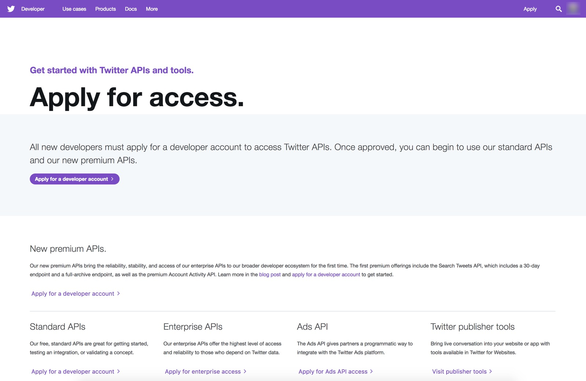

3\. Select the Twitter account you want to associate as admin of this developer account, then press **blue continue** button.

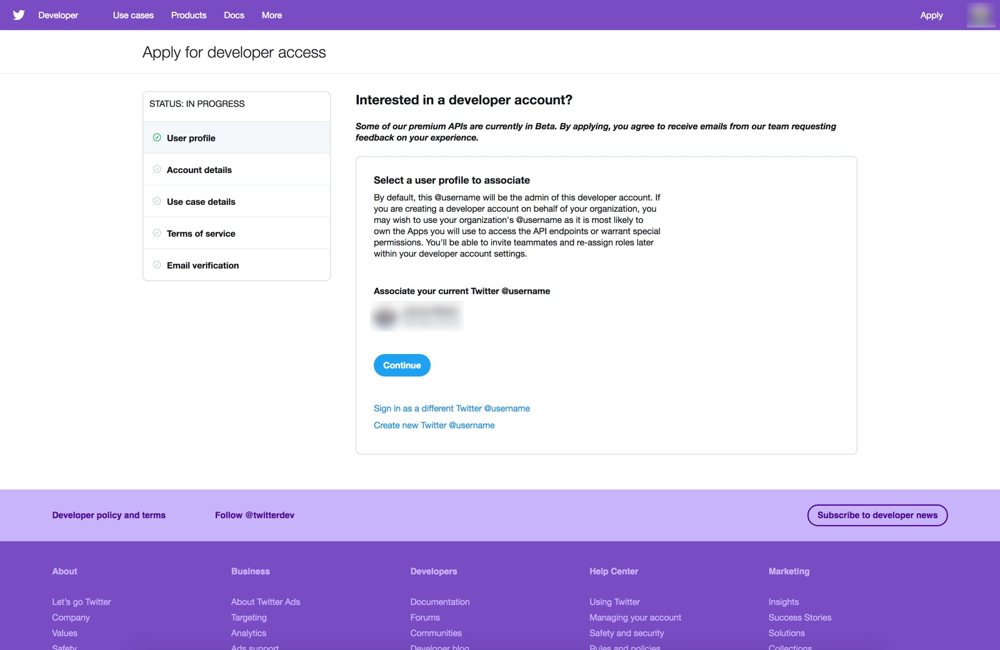

4\. Fill in the details for your developer account, then press **blue continue** button.

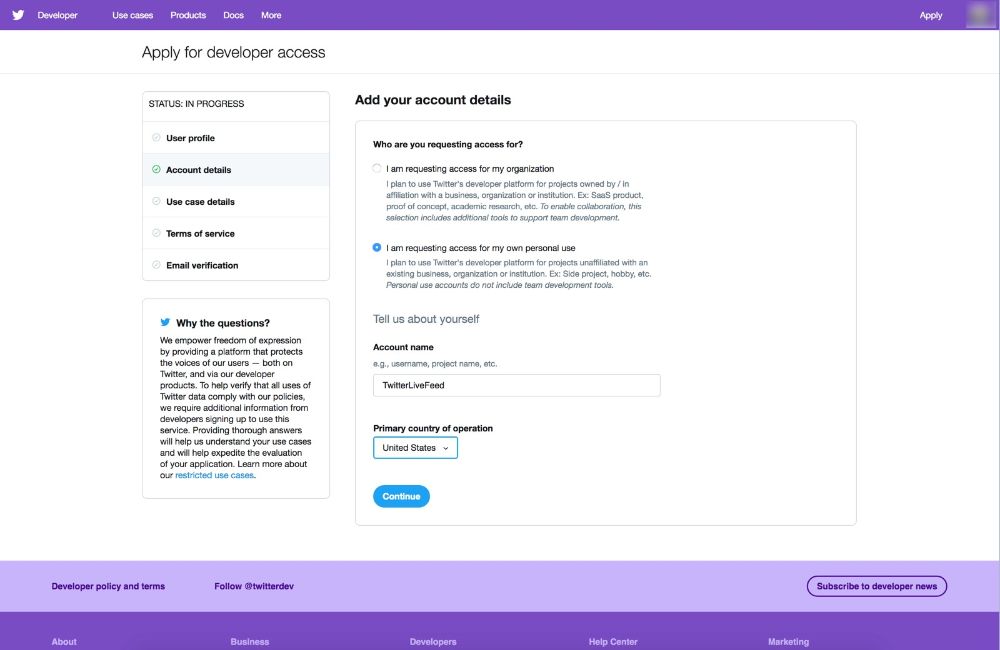

5\. Provide project details, then press the **blue continue** button.

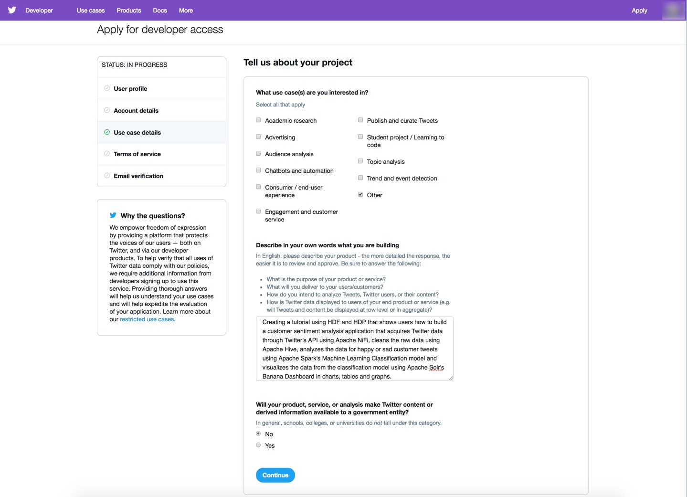

6\. Read and agree to Terms of Service, then press the **blue submit application** button.

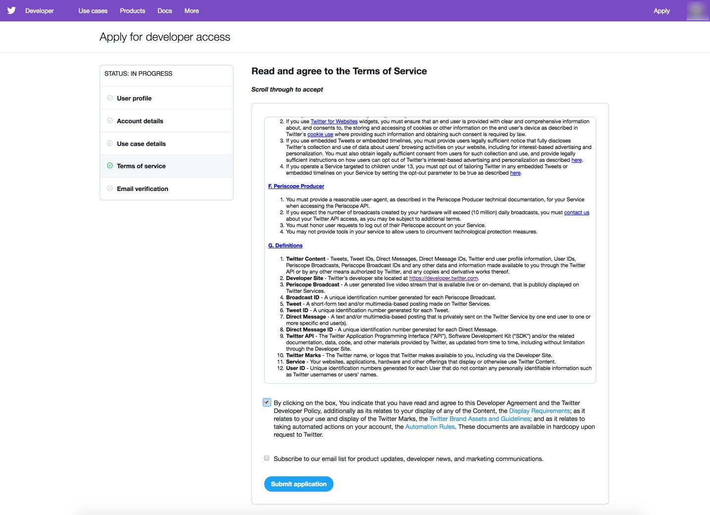

7\. Verify you received the verification email to complete the application.

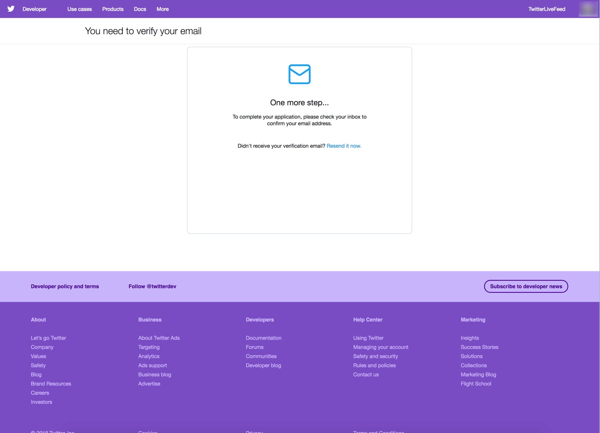

8\. Open your email inbox, select **Verify your Twitter Developer Account**, then press the yellow orange **confirm your email** button.

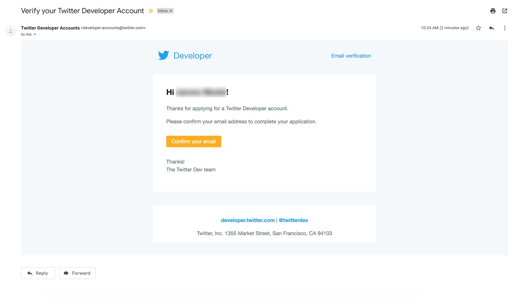

9\. Welcome to your new Twitter developer account. Press on **Create an app** to go to the Apps page.

### Create a New Twitter Application

1\. Press the **blue Create an app** button.

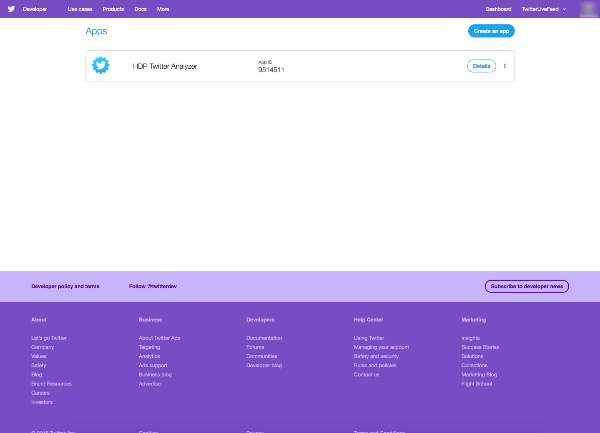

2\. Enter your app details. Then press the **blue Create** button.

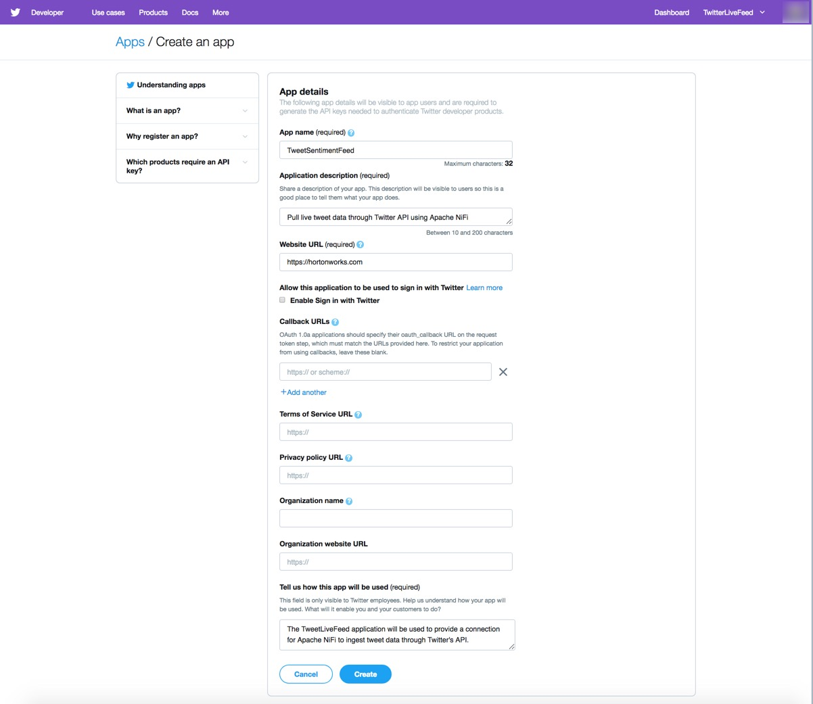

3\. Review Twitter's Developer Terms, then press the **blue Create** button.

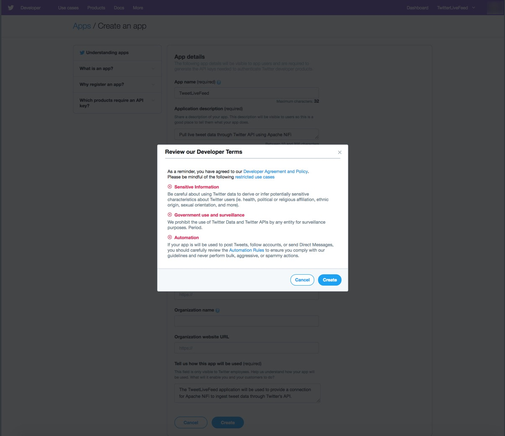

4\. A green checkmark should appear in the top right corner notifying you that the application was created successfully. You will be taken to the page showing summary about your app.

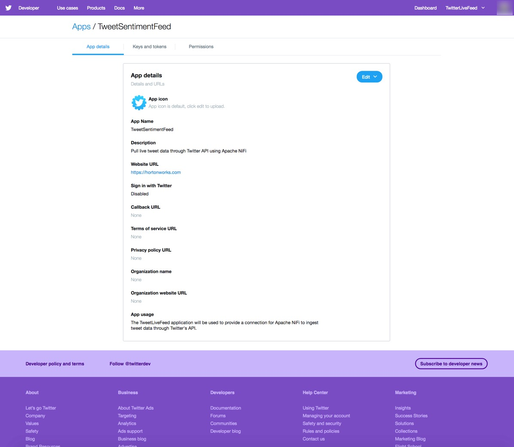

Application at this point was created successfully! Switch to the Permissions tab.

### Change Application's Permissions

Since we are only going to be reading live data, let's check the permissions.

The access permission shows **Read and Write**. Press **Edit**.

The **Edit** button drops down to **Access permission** and **Additional permissions**. Change **Read and Write**
permission to **Read Only**. Then press the **blue Save** button.

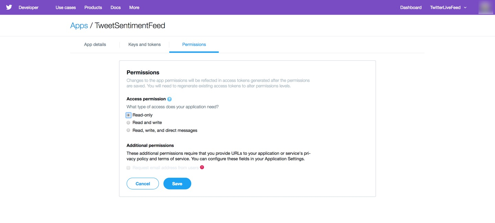

A green checkmark should appear in the top corner notifying you that the application was updated successfully.

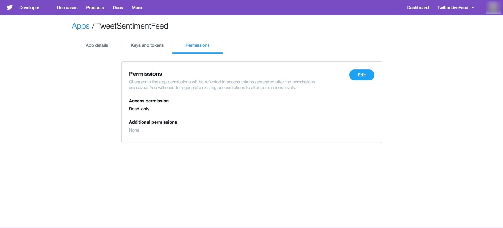

You will need to regenerate access tokens for the changes to take effect. Switch to the Keys and tokens tab.

### Get Keys & Tokens from Application

In order for you to have authorization access to pull data from your application's live feed, we need to get **Consumer API Keys** and **Access Tokens**.

1\. Initially the Access tokens are not created, so let's create the Access tokens. The changes we made earlier to the permissions will take effect too. Press the **blue Create** button.

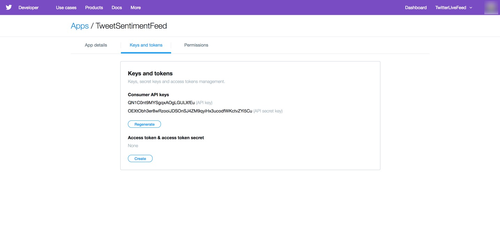

2\. The access tokens will be created.

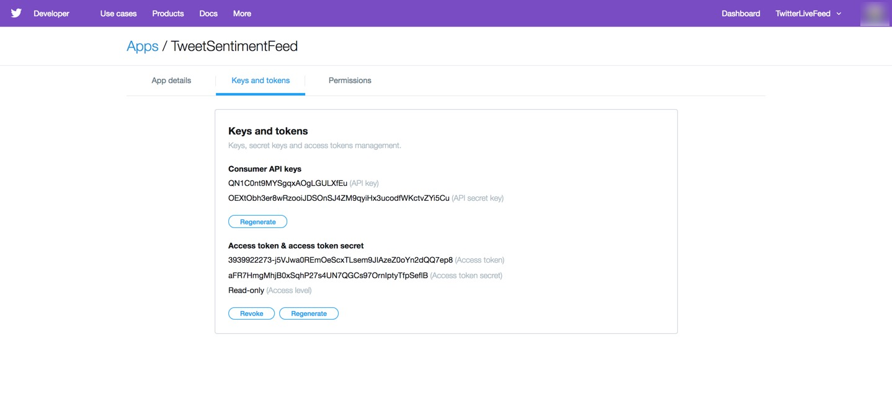

**Save the keys and tokens as they appear on "your" web page**. The following keys and tokens are just examples from a previous application setup and are no longer usable, so you will need to get the keys and tokens from your developer account.

- Example: **Consumer API Key**

~~~bash
QN1C0nt9MYSgqxAOgLGULXfEu
~~~

- Example: **Consumer API Secret Key**

~~~bash
OEXtObh3er8wRzooiJDSOnSJ4ZM9qyiHx3ucodfWKctvZYi5Cu
~~~

- Example: **Access Token**

~~~bash
3939922273-j5VJwa0REmOeScxTLsem9JIAzeZ0oYn2dQQ7ep8
~~~

- Example: **Access Token Secret**

~~~bash
aFR7HmgMhjB0xSqhP27s4UN7QGCs97OrnIptyTfpSeflB
~~~

## Verify Prerequisites Have Been Covered

**Map sandbox IP to desired hostname in hosts file**

- If you need help mapping Sandbox IP to hostname, reference **Environment
Setup -> Map Sandbox IP To Your Desired Hostname In The Hosts File** in [Learning the Ropes of HDP Sandbox](https://hortonworks.com/tutorial/learning-the-ropes-of-the-hortonworks-sandbox/)

**Setup Ambari admin password for "HDF" and "HDP"**

If you need help setting the Ambari admin password,

- for HDP, reference **Admin Password Reset** in [Learning the Ropes of HDP Sandbox](https://hortonworks.com/tutorial/learning-the-ropes-of-the-hortonworks-sandbox/)
- for HDF, reference **Admin Password Reset** in [Learning the Ropes of HDF Sandbox](https://hortonworks.com/tutorial/getting-started-with-hdf-sandbox/)

**Started up all required services for "HDF" and "HDP"**

If unsure, login to Ambari **admin** Dashboard

- for HDF at http://sandbox-hdf.hortonworks.com:8080 and verify **NiFi** starts up, else start it.
- for HDP at http://sandbox-hdp.hortonworks.com:8080 and verify **HDFS**, **Spark2**, **HBase** and **Zeppelin** starts up, else start them.

## Manually Setup Development Environment

### Overview of HDF and HDP Sandbox Environment Setup

The first task will be to setup NiFi service on HDF Sandbox since we will need to use it to build a dataflow for acquiring Twitter data. The second task will be to setup Hive, HDFS, Spark and HBase on HDP Sandbox, so we can focus on cleaning, preprocessing and building a machine learning for delivering visual insight to the user on their Twitter data.

### Setting Up HDF Sandbox for Application Development

Open HDF Sandbox Web Shell Client at [http://sandbox-hdf.hortonworks.com:4200](http://sandbox-hdf.hortonworks.com:4200) with login `root/hadoop`. If this login is the first one, then you will be prompted to set a new password, remember it.

### Setup NiFi Service

The following shell code synchronizes CentOS7 System Clock with UTC, which HDF Sandbox runs on and is needed for NiFi's GetTwitter processor. By updating the CentOS7 System Clock, we will avoid running into
authorization errors when connecting to the Twitter API Feed through GetTwitter processor.

The second part of the code cleans up the NiFi flow that is already prebuilt into HDF Sandbox by backing up the flow and removing it. Copy and paste the code line by line into the web shell.

~~~bash
echo "Synchronizing CentOS7 System Clock with UTC for GetTwitter Processor"
# Install Network Time Protocol
yum install -y ntp
service ntpd stop
# Use the NTPDATE to synchronize CentOS7 sysclock within few ms of UTC
ntpdate pool.ntp.org
service ntpd start

echo "Existing flow on NiFi canvas backed up to flow.xml.gz.bak"
mv /var/lib/nifi/conf/flow.xml.gz /var/lib/nifi/conf/flow.xml.gz.bak
~~~

For the changes in NiFi to take effect, we need to **restart NiFi**. Open Ambari at http://sandbox-hdf.hortonworks.com:8080 with user `admin` and the password you set.

Click the **NiFi service** from Ambari stack of services, press **Service Actions**
dropdown, select **Restart All**.

A Background Operation Running window will pop up with **Restart all components for NiFi** progress bar loading and turning green once the restart is successful.

### Setup Kafka Service

If Kafka is off, make sure to turn it on from Ambari.

We will need to create a Kafka topic on HDF for Spark to stream data into from HDP.

~~~bash
/usr/hdf/current/kafka-broker/bin/kafka-topics.sh --create --zookeeper sandbox-hdf.hortonworks.com:2181 --replication-factor 1 --partitions 10 --topic tweetsSentiment
~~~

### Setting Up HDP Sandbox for Application Development

Open HDP Sandbox Web Shell Client at http://sandbox-hdp.hortonworks.com:4200 with login `root/hadoop`. On first login, you will be prompted to update the password.

### Setup Kafka Service

If Kafka is off, make sure to turn it on from Ambari at http://sandbox-hdp.hortonworks.com:8080 with user `admin` and the password you set.

We will need to enter the HDP sandbox web shell to create a Kafka topic on HDP for NiFi to publish messages to the Kafka queue.

~~~bash
/usr/hdp/current/kafka-broker/bin/kafka-topics.sh --create --zookeeper sandbox-hdp.hortonworks.com:2181 --replication-factor 1 --partitions 10 --topic tweets
~~~

### Setup Hive Service

The first set of commands will setup **Hive**, so we can create, read and write to tables built on top of JSON data by installing maven, downloading Hive-JSON-Serde library and compiling that library. Copy and paste the code line by line in the HDP sandbox web shell.

~~~bash
echo "Setting Up Maven needed for Compiling and Installing Hive JSON-Serde Lib"
wget http://repos.fedorapeople.org/repos/dchen/apache-maven/epel-apache-maven.repo -O /etc/yum.repos.d/epel-apache-maven.repo
yum install -y apache-maven
mvn -version

echo "Setting up Hive JSON-Serde Libary"
git clone https://github.com/rcongiu/Hive-JSON-Serde
cd Hive-JSON-Serde
# Compile JsonSerDe source to create JsonSerDe library jar file
mvn -Phdp23 clean package
# Give JsonSerDe library jar file to Hive and Hive2 library
cp json-serde/target/json-serde-1.3.9-SNAPSHOT-jar-with-dependencies.jar /usr/hdp/3.0.0.0-1634/hive/lib
cd ~/
~~~

For the updates in **Hive** to take effect, we need to **restart Hive**, so it can access Hive-JSON-Serde library. **Open Ambari** at http://sandbox-hdp.hortonworks.com:8080 with user `admin` and the password you set.

Click the **Hive** service from Ambari stack of services, press **Service Actions**
dropdown, select **Restart All**.

A Background Operation Running window will pop up with **Restart all components for Hive** progress bar loading and turning green once the restart is successful.

### Setup HDFS Service

The next set of commands will setup **HDFS** for holding the Tweet data that will be accessed by Spark. We will create tweets folder that will hold a zipped file. This data will be copied over to HDFS where it will be later loaded by Spark to refine the historical data for creating a machine learning model. Run the code line by line in your HDP sandbox web shell.

~~~bash
echo "Setting up HDFS for Tweet Data"
HDFS_TWEET_STAGING="/sandbox/tutorial-files/770/tweets_staging"
LFS_TWEETS_PACKAGED_PATH="/sandbox/tutorial-files/770/tweets"
sudo -u hdfs mkdir -p $LFS_TWEETS_PACKAGED_PATH
# Create tweets_staging hdfs directory ahead of time for hive
sudo -u hdfs hdfs dfs -mkdir -p $HDFS_TWEET_STAGING
# Change HDFS ownership of tweets_staging dir to maria_dev
sudo -u hdfs hdfs dfs -chown -R maria_dev $HDFS_TWEET_STAGING
# Change HDFS tweets_staging dir permissions to everyone
sudo -u hdfs hdfs dfs -chmod -R 777 $HDFS_TWEET_STAGING
# give anyone rwe permissions to /sandbox/tutorial-files/770
sudo -u hdfs hdfs dfs -chmod -R 777 /sandbox/tutorial-files/770
sudo -u hdfs wget https://github.com/hortonworks/data-tutorials/raw/master/tutorials/cda/building-a-sentiment-analysis-application/application/setup/data/tweets.zip -O $LFS_TWEETS_PACKAGED_PATH/tweets.zip
sudo -u hdfs unzip $LFS_TWEETS_PACKAGED_PATH/tweets.zip -d $LFS_TWEETS_PACKAGED_PATH
sudo -u hdfs rm -rf $LFS_TWEETS_PACKAGED_PATH/tweets.zip
# Remove existing (if any) copy of data from HDFS. You could do this with Ambari file view.
sudo -u hdfs hdfs dfs -rm -r -f $HDFS_TWEET_STAGING/* -skipTrash
# Move downloaded JSON file from local storage to HDFS
sudo -u hdfs hdfs dfs -put $LFS_TWEETS_PACKAGED_PATH/* $HDFS_TWEET_STAGING
~~~

### Setup Spark Service

For **Spark** Structured Streaming, we will need to leverage SBT package manager. The commands below install SBT. Run the code line by line in the HDP web shell.

~~~bash
curl https://bintray.com/sbt/rpm/rpm | sudo tee /etc/yum.repos.d/bintray-sbt-rpm.repo
yum install -y sbt
~~~

### Setup HBase Service

For **HBase** since we will be storing streams of data into it from NiFi, we will need to create a table ahead of time, so we wont' have to switch between both applications:

~~~bash
#!/bin/bash
# -e: causes echo to process escape sequences, build confirmation into it
# -n: tells hbase shell this is a non-interactive session
echo -e "create 'tweets_sentiment','social_media_sentiment'" | hbase shell -n
~~~

## Summary

Congratulations! The development environment is setup and configured, so we can began acquiring the customer sentiment data via NiFi ingesting the Twitter API feed.

## Further Reading

- [NiFi System Administrator's Guide](https://nifi.apache.org/docs/nifi-docs/html/administration-guide.html)
- [Hive SerDe Library Doc](https://cwiki.apache.org/confluence/display/Hive/SerDe)
- [HDFS Commands Guide Doc](https://hadoop.apache.org/docs/r3.0.0/hadoop-project-dist/hadoop-hdfs/HDFSCommands.html)
- [Setting Up a Spark Development Environment with Scala](https://hortonworks.com/tutorial/setting-up-a-spark-development-environment-with-scala/#sbt)
- [Administering Ambari](https://docs.hortonworks.com/HDPDocuments/Ambari-2.7.0.0/administering-ambari/content/amb_introducing_ambari_administration.html)
- [Solr's Banana Installation and Quick Start](https://github.com/lucidworks/banana)
