# Acquiring Twitter Data

## Introduction

Our next objective is to acquire sentiment data from Twitter's **[Decahose stream](https://developer.twitter.com/en/docs/tweets/sample-realtime/overview/streaming-likes)** API.

You will build one NiFi flow in a process group that ingests data from Twitter using
your KEYS and TOKENS you obtained from creating your Twitter Developer App.
Next you will massage the data extracting meaningful insight from JSON content
from the Twitter feed. Finally, you will store the data into a Kafka topic "tweets".

You will build the second NiFi flow in another process group to consume data from
Kafka topic "tweetsSentiment", which has a trained sentiment model built with an
external service SparkML and send the data to be stored into HBase.

## Prerequisites

- Enabled Connected Data Architecture
- Setup the Development Environment

## Outline

- [Approach 1: Build a NiFi Flow For Acquisition and Storage](#approach-1-build-a-nifi-flow-for-acquisition-and-storage)
- [Approach 2: Import NiFi Flow For Acquisition and Storage](#approach-2-import-nifi-flow-for-acquisition-and-storage)
- [Summary](#summary)
- [Further Reading](#further-reading)

## Approach 1: Build a NiFi Flow For Acquisition and Storage

After starting your sandbox, open HDF **NiFi UI** at http://sandbox-hdf.hortonworks.com:9090/nifi.

### 1\. Create AcquireTwitterData Process Group

This capture group ingests Twitter's **[Decahose stream](https://developer.twitter.com/en/docs/tweets/sample-realtime/overview/streaming-likes)** through Twitter's [Sentiment Detection API](https://developer.twitter.com/en/use-cases/analyze.html), preprocesses the data and stores it into Kafka later analysis.

Drop the process group icon  onto the NiFi canvas.

Insert the Process Group Name: `AcquireTwitterData` or one of your choice.

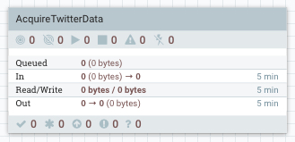

Double click on the process group to dive into it. At the bottom of the canvas, you will see **NiFi Flow >> AcquireTwitterData** breadcrumb. Let's began connecting the processors for data ingestion, preprocessing and storage.

### Ingest Twitter Data Source

Drop the processor icon onto the NiFi canvas. Add the **GetTwitter**.

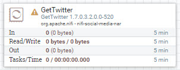

Hold **control + mouse click** on **GetTwitter** to configure the processor:

**Table 1: Settings Tab**

| Setting | Value     |
| :------------- | :------------- |
| Name | GrabGardenHose |

**Table 2: Scheduling Tab**

| Scheduling     | Value     |
| :------------- | :------------- |
| Run Schedule       | `1 sec`       |

**Table 3: Properties Tab**

| Property     | Value     |
| :------------| :---------|
| **Twitter Endpoint**  | `Filter Endpoint` |
| **Consumer Key**  | `<Your-Consumer-API-Key>` |
| **Consumer Secret**  | `<Your-Consumer-API-Secret-Key>` |
| **Access Token**  | `<Your-Access-Token>` |
| **Access Token Secret**  | `<Your-Access-Token-Secret>` |
| Languages  | `en` |
| Terms to Filter On | `AAPL,ORCL,GOOG,MSFT,DELL` |

Click **APPLY**.

### Pull Key Attributes from JSON Content of FlowFile

Drop the processor icon onto the NiFi canvas. Add the **EvaluateJsonPath**.

Create connection between **GetTwitter** and **EvaluateJsonPath** processors. Hover
over **GetTwitter** to see arrow icon, press on processor and connect it to
**EvaluateJsonPath**.

Configure Create Connection:

| Connection | Value     |
| :------------- | :------------- |
| For Relationships     | success (**checked**) |

Click **ADD**.

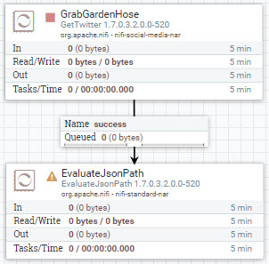

Configure **EvaluateJsonPath** processor:

**Table 4: Settings Tab**

| Setting | Value     |
| :------------- | :------------- |
| Name | `PullKeyAttributes` |
| Automatically Terminate Relationships | failure (**checked**) |
| Automatically Terminate Relationships | unmatched (**checked**) |

**Table 5: Scheduling Tab**

| Scheduling | Value     |
| :------------- | :------------- |
| Concurrent Tasks       | `4`       |
| Run Schedule       | `1 sec`       |

**Table 6: Properties Tab**

To add a new user defined property in case one the following properties in the
table isn't defined, press the plus button **+**.

| Property | Value     |
| :------------- | :------------- |
| **Destination**       | `flowfile-attribute` |
| **Return Type**       | `json` |
| twitter.handle       | `$.user.screen_name` |
| twitter.hashtags       | `$.entities.hashtags[0].text` |
| twitter.language       | `$.lang` |
| twitter.location       | `$.user.location` |
| twitter.msg       | `$.text` |
| twitter.time       | `$.created_at` |
| twitter.tweet_id       | `$.id` |
| twitter.unixtime       | `$.timestamp_ms` |
| twitter.user       | `$.user.name` |
| twitter.geo       | `$.geo` |
| twitter.coordinates       | `$.coordinates` |
| twitter.place       | `$.place` |

Click **APPLY**.

### Route FlowFiles Attributes Containing Non-Empty Tweets

Drop the processor icon onto the NiFi canvas. Add the **RouteOnAttribute**.

Create connection between **EvaluateJsonPath** and **RouteOnAttribute** processors. Hover
over **EvaluateJsonPath** to see arrow icon, press on processor and connect it to
**RouteOnAttribute**.

Configure Create Connection:

| Connection | Value     |
| :------------- | :------------- |
| For Relationships     | matched (**checked**) |

Click **ADD**.

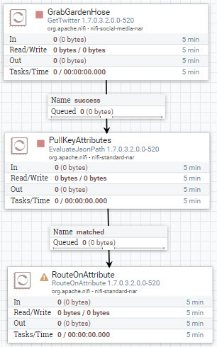

Configure **RouteOnAttribute** processor:

**Table 7: Settings Tab**

| Setting | Value     |
| :------------- | :------------- |
| Name | `FindOnlyTweets` |
| Automatically Terminate Relationships | unmatched (**checked**) |

**Table 8: Scheduling Tab**

| Scheduling | Value     |
| :------------- | :------------- |
| Concurrent Tasks       | `2`       |
| Run Schedule       | `1 sec`       |

**Table 9: Properties Tab**

To add a new user defined property in case one the following properties in the
table isn't defined, press the plus button **+**.

| Property | Value     |
| :------------- | :------------- |
| **Routing Strategy**       | `Route to Property name` |
| filterTweetAndLocation       | `${twitter.msg:isEmpty():not():and(${twitter.location:isEmpty():not()})}` |

Click **APPLY**.

### Put FlowFile Contents to Kafka Topic via KafkaProducer API

Drop the processor icon onto the NiFi canvas. Add the **PublishKafka_0_10** processor.

Create connection between **RouteOnAttribute** and both **PublishKafka_0_10** processors. Hover
over **RouteOnAttribute** to see arrow icon, press on processor and connect it to
**PublishKafka_0_10**.

Configure Create Connection:

| Connection | Value     |
| :------------- | :------------- |
| For Relationships     | filterTweetAndLocation (**checked**) |

Click **ADD**.

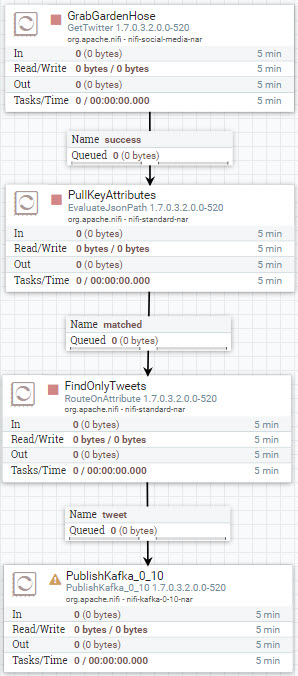

Configure **PublishKafka_0_10** processor for relationship connection **tweet**:

**Table 10: Settings Tab**

| Setting | Value     |
| :------------- | :------------- |
| Automatically Terminate Relationships | failure (**checked**) |
| Automatically Terminate Relationships | success (**checked**) |

**Table 11: Scheduling Tab**

| Scheduling | Value     |
| :------------- | :------------- |
| Run Schedule       | `1 sec`       |

**Table 12: Properties Tab**

| Property | Value     |
| :------------- | :------------- |
| **Kafka Brokers**       | `sandbox-hdp.hortonworks.com:6667` |
| **Topic Name**       | `tweets` |

Click **APPLY**. The yellow warning sign on **PublishKafka_0_10** should turn to
a red stop symbol. Now you have a completed NiFi flow with no warnings and ready
to acquire data and send to Kafka topic `tweets`.

### Start Process Group Flow to Acquire Data

At the breadcrumb, select **NiFi Flow** level. Hold **control + mouse click** on the **AcquireTwitterData** process group, then click the **start** option.

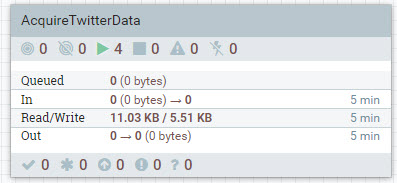

Once NiFi writes your twitter data to Kafka, which you can check by viewing data provenance, you can turn off the process group by holding **control + mouse click** on the **AcquireTwitterData** process group, then choose **stop** option.

### Verify NiFi Stored Data

Enter the **AcquireTwitterData** process group, press **control + mouse click** on PublishKafka_0_10 processor of your choice, then press **View data provenance**.

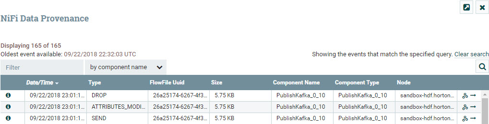

Press on **i** icon on the left row to view details about a provenance event. Choose the event with the type **SEND**. In the Provenance Event window, choose **CONTENT** tab. On **Output Claim**, choose **VIEW**.

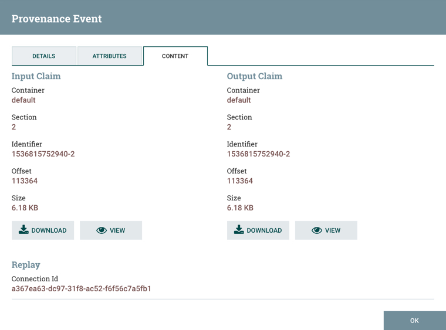

You will be able to see the data NiFi sent to the external process Kafka. The data below shows tweets dataset.

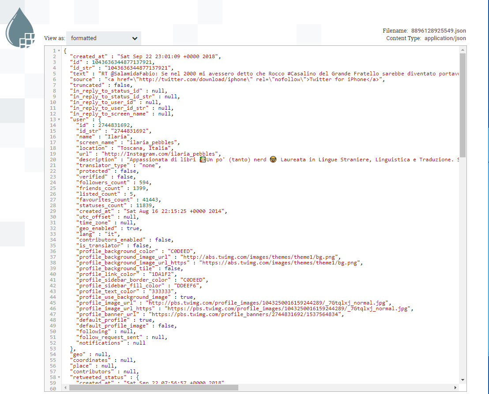

### 2\. Create StreamTweetsToHBase Process Group

Make sure to exit the **AcquireTwitterData** process group and head back to **NiFi Flow** level.

This capture group consumes data from Kafka that was brought in by Spark Structured Streaming and streams the contents of the flowfiles to HBase.

Drop the process group icon  onto the NiFi canvas next to **AcquireTwitterData** process group.

Insert the Process Group Name: `StreamTweetsToHBase` or one of your choice.

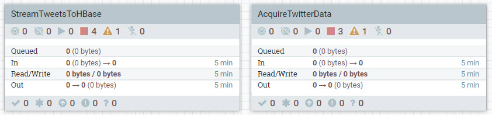

### Create New Controller Service

We are going to create a new controller service that will be needed later when we are configuring PutHBaseJSON processor.

Right click on the **StreamTweetsToHBase** process group, select configure. Click on the **Controller Services**. Click the **+** button to create a new controller service.

Insert into the **Filter** field,  `HBase_1_1_2_ClientService` and then press **ADD**.

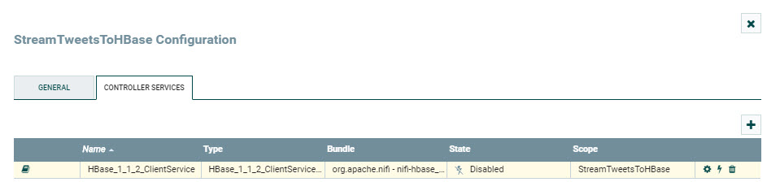

Select the **gear** icon on the far right. Click on the **Properties** tab. Configure the properties for the controller service:

**Table 13: Properties Tab**

| Property | Value     |
| :------------- | :------------- |
| Hadoop Configuration Files       | `/etc/hbase/conf/hbase-site.xml,/etc/hadoop/conf/core-site.xml`       |

Click **OK**. Now let's exit the controller services.

Double click on the process group to dive into it. At the bottom of the canvas, you will see **NiFi Flow >> StreamTweetsToHBase** breadcrumb. Let's began connecting the processors for data ingestion, preprocessing and storage.

### Poll Kafka Topic for Data using KafkaConsumer API

Drop the processor icon onto the NiFi canvas. Add the **ConsumeKafka_0_10** processor.

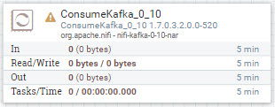

Configure **ConsumeKafka_0_10** processor:

**Table 14: Scheduling Tab**

| Scheduling | Value     |
| :------------- | :------------- |
| Run Schedule       | `1 sec`       |

**Table 15: Properties Tab**

| Property | Value     |
| :------------- | :------------- |
| **Kafka Broker**       | `sandbox-hdf.hortonworks.com:6667` |
| **Topic Name(s)**       | `tweetsSentiment` |
| **Group ID**       | `1` |

Click **APPLY**.

### Pull Key Attributes from JSON Content of FlowFile

Jump to the previous process group **AcquireTwitterData**, copy the EvaluateJsonPath processor named **PullKeyAttributes** by right clicking and press **copy**.

Jump back to the **StreamTweetsToHBase** process group and paste the PullKeyAttributes processor near **ConsumeKafka_0_10** by right clicking on the NiFi canvas and pressing **paste**.

Create connection between **ConsumeKafka_0_10** and **PullKeyAttributes** processors. Hover
over **ConsumeKafka_0_10** to see arrow icon, press on processor and connect it to
**PullKeyAttributes**.

Configure Create Connection:

| Connection | Value     |
| :------------- | :------------- |
| For Relationships     | success (**checked**) |

Click **ADD**.

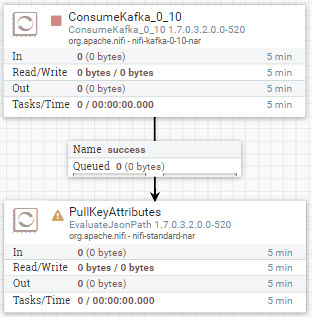

**PullKeyAttributes** processor is already configured.

### Create JSON From Input FlowFile Attributes and Output JSON FlowFile Content

Drop the processor icon onto the NiFi canvas. Add the **AttributesToJSON**.

Create connection between **PullKeyAttributes** and **AttributesToJSON** processors. Hover
over **PullKeyAttributes** to see arrow icon, press on processor and connect it to
**AttributesToJSON**.

Configure Create Connection:

| Connection | Value     |
| :------------- | :------------- |
| For Relationships     | matched (**checked**) |

Click **ADD**.

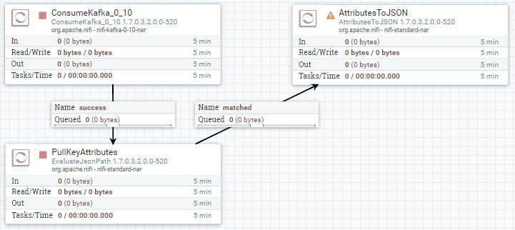

Configure **AttributesToJSON** processor:

**Table 16: Settings Tab**

| Setting | Value     |
| :------------- | :------------- |
| Automatically Terminate Relationships | failure (**checked**) |

**Table 17: Scheduling Tab**

| Scheduling | Value     |
| :------------- | :------------- |
| Run Schedule       | `1 sec`       |

**Table 18: Properties Tab**

| Property | Value     |
| :------------- | :------------- |
| **Attributes List**       | `twitter.handle, twitter.language, twitter.location, twitter.tweet_id, twitter.unixtime, twitter.sentiment` |
| **Destination**       | `flowfile-content` |

Click **APPLY**.

### Route FlowFiles Attributes Containing Non-Empty Tweets

Drop the processor icon onto the NiFi canvas. Add the **RouteOnAttribute**.

Create connection between **AttributesToJSON** and **RouteOnAttribute** processors. Hover
over **AttributesToJSON** to see arrow icon, press on processor and connect it to
**RouteOnAttribute**.

Configure Create Connection:

| Connection | Value     |
| :------------- | :------------- |
| For Relationships     | matched (**checked**) |

Click **ADD**.

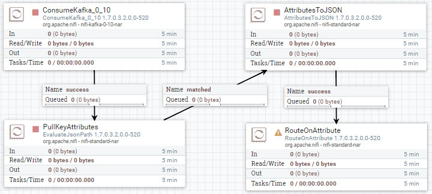

Configure **RouteOnAttribute** processor:

**Table 19: Settings Tab**

| Setting | Value     |
| :------------- | :------------- |
| Name | `IfTweetsHaveSentimentAndTime` |
| Automatically Terminate Relationships | unmatched (**checked**) |

**Table 20: Scheduling Tab**

| Scheduling | Value     |
| :------------- | :------------- |
| Concurrent Tasks       | `2`       |
| Run Schedule       | `1 sec`       |

**Table 21: Properties Tab**

To add a new user defined property in case one the following properties in the
table isn't defined, press the plus button **+**.

| Property | Value     |
| :------------- | :------------- |
| **Routing Strategy**       | `Route to 'matched' if all match` |
| filterTweetAndLocation       | `${twitter.unixtime:isEmpty():not():and(${twitter.sentiment:isEmpty():not()})}` |

Click **APPLY**.

### Stream Contents of FlowFile to HBase Data Table

Drop the processor icon onto the NiFi canvas. Add the **PutHBaseJSON** processor.

Create connection between **RouteOnAttribute** and both **PutHBaseJSON** processors. Hover
over **RouteOnAttribute** to see arrow icon, press on processor and connect it to
**PutHBaseJSON**.

Configure Create Connection:

| Connection | Value     |
| :------------- | :------------- |
| For Relationships     | matched (**checked**) |

Click **ADD**.

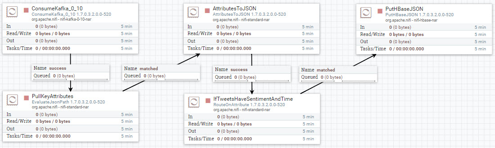

Configure **RouteOnAttribute** processor:

**Table 22: Settings Tab**

| Setting | Value     |
| :------------- | :------------- |
| Automatically Terminate Relationships | failure (**checked**) |
| Automatically Terminate Relationships | success (**checked**) |

**Table 23: Properties Tab**

| Property | Value     |
| :------------- | :------------- |
| **HBase Client Service**       | `HBase_1_1_2_ClientService` |
| **Table Name**       | `tweets_sentiment` |
| Row Identifier Field Name       | `twitter.unixtime` |
| **Column Family**       | `social_media_sentiment` |

Click **APPLY**.

The yellow warning sign on **PutHBaseJSON** should turn to
a red stop symbol. Now you have a completed NiFi flow with no warnings and ready
to consume data from Kafka topic `tweetsSentiment` and stream records to HBase Data Table.

Exit **StreamTweetsToHBase** process group, we will need to use this process group later to pull in data from Kafka on HDF that is coming from Spark Structured Streaming on HDP.

We are done building the NiFi flows, you can head to the summary, then onward to the next area of development for this data pipeline.

## Approach 2: Import NiFi Flow For Acquisition and Storage

Download the NiFi template [AcquireTweetsStreamTweets.xml](https://raw.githubusercontent.com/hortonworks/data-tutorials/master/tutorials/cda/building-a-sentiment-analysis-application/application/development/nifi-template/AcquireTweetsStreamTweets.xml) to your local computer.

After starting your sandbox, open HDF **NiFi UI** at http://sandbox-hdf.hortonworks.com:9090/nifi.

Open the Operate panel if not already open, then press the **Upload Template** icon .

Press on Select Template icon .

The file browser on your local computer will appear, find **AcquireTweetsStreamTweets.xml** template you just downloaded, then press **Open**, then press **UPLOAD**.

You should receive a notification that the **Template successfully imported.** Press OK to acknowledge.

Drop the **Template** icon  onto the NiFi canvas.

Add Template called **AcquireTweetsStreamTweets**.

You will notice on the process group called **AcquireTwitterData**, there is one yellow warning. Double click on that process group to enter it. Zoom in if needed. **GrabGardenHose** processor has the warning. The reason is that we need to update the **Consumer API Key and Consumer API Secret Key** and the **Access Token and Access Token Secret** in the processor's **properties table** for the warning to go away.

**Table 24: Properties Tab**

| Property     | Value     |
| :------------| :---------|
| **Twitter Endpoint**  | `Filter Endpoint` |
| **Consumer Key**  | `<Your-Consumer-API-Key>` |
| **Consumer Secret**  | `<Your-Consumer-API-Secret-Key>` |
| **Access Token**  | `<Your-Access-Token>` |
| **Access Token Secret**  | `<Your-Access-Token-Secret>` |
| Languages  | `en` |
| Terms to Filter On | `AAPL,ORCL,GOOG,MSFT,DELL` |

Start the NiFi flow. Hold **control + mouse click** on each process group, then click the **start** option.

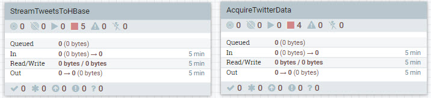

Once NiFi writes tweet data to Kafka on HDP, you can check the provenance events quickly by looking at the PublishKafka_0_10 processor inside the **AcquireTwitterData** process group.

To turn off a process group, you can do so by holding **control + mouse click** on for instance the **AcquireTwitterData** process group, then choose **stop** option.

## Summary

Congratulations! You built two dataflows in their own separate process groups: **AcquireTwitterData** and **StreamTweetsToHBase**. Now using the **AcquireTwitterData** process group, we can acquire Twitter data from Twitter's **[Decahose stream](https://developer.twitter.com/en/docs/tweets/sample-realtime/overview/streaming-likes)** API. The data pipeline filters for tweets before publishing messages into **Kafka topic 'tweets'**, which is picked up by the external service Spark. The data pipeline also updates the flowfile content in JSON with key value pairs to that will help us do a calculation for sentiment score of each tweet in a later part of the demo. The other dataflow **StreamTweetsToHBase** ingests Kafka messages and streams the content to HBase.

## Further Reading

- [NiFi User Guide](https://nifi.apache.org/docs/nifi-docs/html/user-guide.html)
