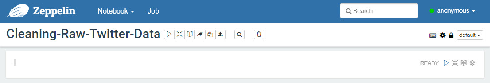
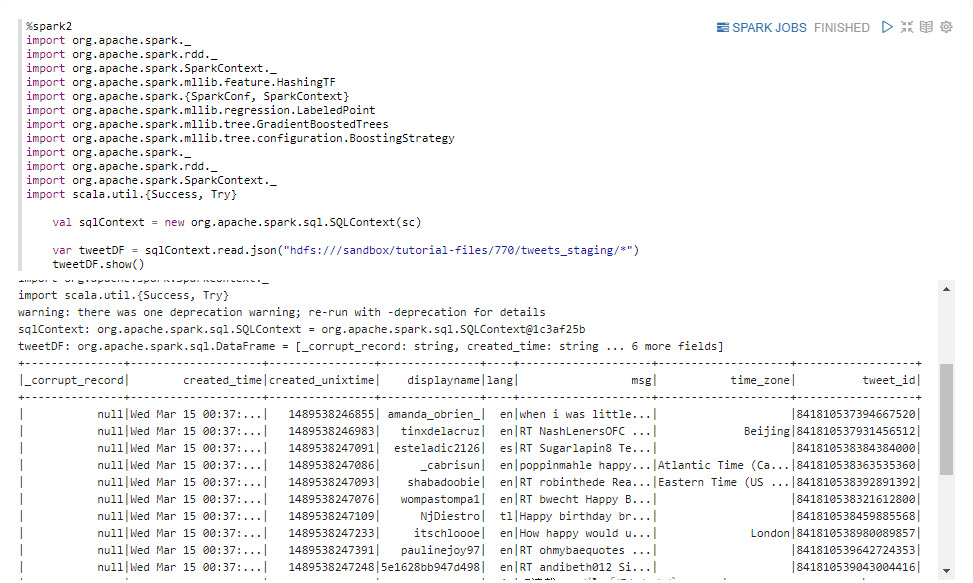
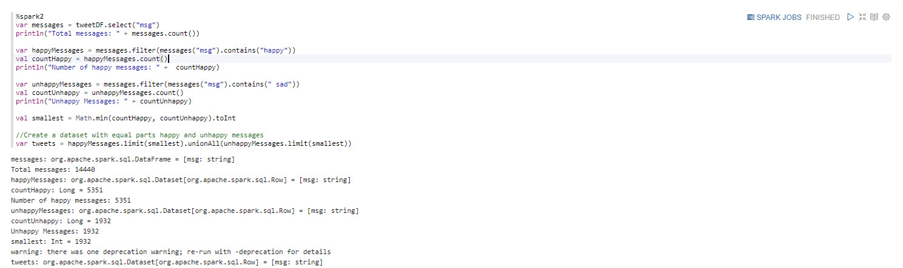
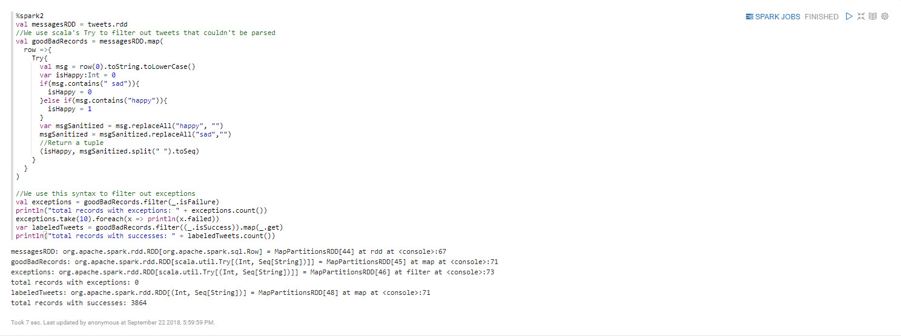
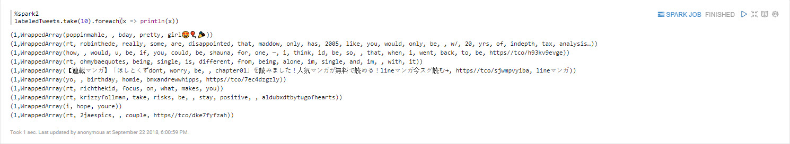
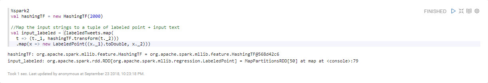
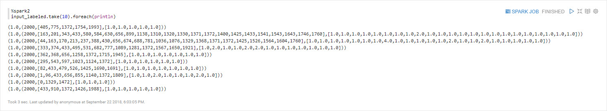
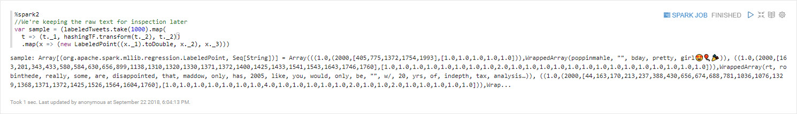
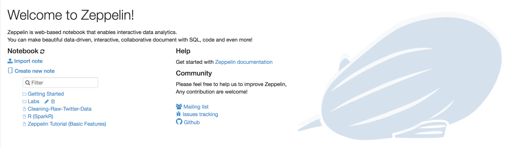

# Cleaning the Raw Twitter Data

## Introduction

Our next objective is to **load the tweet data** that is currently in HDFS into Spark. We will **clean the records** to prevent bias in the model. We will **label our data**, so later our model that we create in next phase of development will be able to learn between happy and sad. We will **transform the data** into a feature vector (feature array) since Gradient Boosting model expects that format for the input.

## Prerequisites

- Enabled Connected Data Architecture
- Setup the Development Environment
- Acquired Twitter Data

## Outline

- [Approach 1: Write Spark Code to Clean Raw Twitter Data](#approach-1-write-spark-code-to-clean-raw-twitter-data)
- [Approach 2: Import Zeppelin Notebook via Zeppelin UI](#approach-2-import-zeppelin-notebook-via-zeppelin-ui)
- [Summary](#summary)
- [Further Reading](#further-reading)

## Approach 1: Write Spark Code to Clean Raw Twitter Data

You will create a Zeppelin Notebook that uses Scala Spark to clean the raw decahose stream of tweets and refine it to be used in creating the sentiment classification model.

### Create Zeppelin Notebook for Cleansing Data

Open Zeppelin UI at http://sandbox-hdp.hortonworks.com:9995.

1\. Create new note.

Insert note name as `Cleaning-Raw-Twitter-Data`, then press **Create Note**.

Now the notebook is created and we will start writing the code to clean the data.

### Configuration

Before starting this model you should make sure **HDFS** and **Spark2** are started and the shell interpreter is binded to this notebook.

### Load data into Spark

Lets load the tweets into Spark SQL and take a look at them. Copy and paste the Scala Spark code into Zeppelin notebook:

~~~scala
%spark2
import org.apache.spark._
import org.apache.spark.rdd._
import org.apache.spark.SparkContext._
import org.apache.spark.mllib.feature.HashingTF
import org.apache.spark.{SparkConf, SparkContext}
import org.apache.spark.mllib.regression.LabeledPoint
import org.apache.spark.mllib.tree.GradientBoostedTrees
import org.apache.spark.mllib.tree.configuration.BoostingStrategy
import org.apache.spark._
import org.apache.spark.rdd._
import org.apache.spark.SparkContext._
import scala.util.{Success, Try}

    val sqlContext = new org.apache.spark.sql.SQLContext(sc)

    var tweetDF = sqlContext.read.json("hdfs:///sandbox/tutorial-files/770/tweets_staging/*")
    tweetDF.show()
~~~

> Note: loading the data sometimes takes 5 to 15 minutes.

### Clean Records

In the following code we'll **clean-up** the data to **prevent bias in the model**.
We want to remove any tweet that doesn’t contain “happy” or “sad”. We’ve also chosen to select an equal number of happy and sad tweets to prevent bias in the model. Since we’ve loaded our data into a Spark DataFrame, we can use SQL-like statements to transform and select our data.

~~~scala
%spark2
var messages = tweetDF.select("msg")
println("Total messages: " + messages.count())

var happyMessages = messages.filter(messages("msg").contains("happy"))
val countHappy = happyMessages.count()
println("Number of happy messages: " +  countHappy)

var unhappyMessages = messages.filter(messages("msg").contains(" sad"))
val countUnhappy = unhappyMessages.count()
println("Unhappy Messages: " + countUnhappy)

val smallest = Math.min(countHappy, countUnhappy).toInt

//Create a dataset with equal parts happy and unhappy messages
var tweets = happyMessages.limit(smallest).unionAll(unhappyMessages.limit(smallest))
~~~

### Label the Data

**In the following code we label the data and force our model to learn the difference between happy and sad.** Now label each happy tweet as 1 and unhappy tweets as 0. In order to prevent our model from cheating, we’re going to remove the words happy and sad from the tweets. This will force it to infer whether the user is happy or sad by the presence of other words.

Finally, we also split each tweet into a collection of words. For convenience we convert the Spark Dataframe to an RDD which lets you easily transform data using the map function.

We now have a collection of tuples of the form (Int, Seq[String]), where a 1 for the first term indicates happy and 0 indicates sad. The second term is a sequence of words, including emojis. We removed the words happy and sad from the list of words.

~~~scala
%spark2
val messagesRDD = tweets.rdd
//We use scala's Try to filter out tweets that couldn't be parsed
val goodBadRecords = messagesRDD.map(
  row =>{
    Try{
      val msg = row(0).toString.toLowerCase()
      var isHappy:Int = 0
      if(msg.contains(" sad")){
        isHappy = 0
      }else if(msg.contains("happy")){
        isHappy = 1
      }
      var msgSanitized = msg.replaceAll("happy", "")
      msgSanitized = msgSanitized.replaceAll("sad","")
      //Return a tuple
      (isHappy, msgSanitized.split(" ").toSeq)
    }
  }
)

//We use this syntax to filter out exceptions
val exceptions = goodBadRecords.filter(_.isFailure)
println("total records with exceptions: " + exceptions.count())
exceptions.take(10).foreach(x => println(x.failed))
var labeledTweets = goodBadRecords.filter((_.isSuccess)).map(_.get)
println("total records with successes: " + labeledTweets.count())
~~~

Let's take a look at our progress.

~~~scala
%spark2
labeledTweets.take(10).foreach(x => println(x))
~~~

### Transform Data

Gradient Boosting expects as input a vector (feature array) of fixed length, so we need a way to convert our tweets into some numeric vector that represents that tweet. A standard way to do this is to use the [hashing trick](https://en.wikipedia.org/wiki/Feature_hashing), in which we hash each word and index it into a fixed-length array. What we get back is an array that represents the count of each word in the tweet. This approach is called the [bag of words model](https://en.wikipedia.org/wiki/Bag-of-words_model), which means we are representing each sentence or document as a collection of discrete words and ignore grammar or the order in which words appear in a sentence. An alternative approach to bag of words would be to use an algorithm like Doc2Vec or Latent Semantic Indexing, which would use machine learning to build a vector representations of tweets.

In Spark we’re using HashingTF for feature hashing. Note that we’re using an array of size 2000. Since this is smaller than the size of the vocabulary we’ll encounter on Twitter, it means two words with different meaning can be hashed to the same location in the array. Although it would seem this would be an issue, in practice this preserves enough information that the model still works. This is actually one of the strengths of feature hashing, that it allows you to represent a large or growing vocabulary in a fixed amount of space.

~~~scala
%spark2
val hashingTF = new HashingTF(2000)

//Map the input strings to a tuple of labeled point + input text
val input_labeled = (labeledTweets.map(
  t => (t._1, hashingTF.transform(t._2)))
  .map(x => new LabeledPoint((x._1).toDouble, x._2)))
~~~

Let's take a look at how our vectors are hashed.

~~~scala
%spark2
input_labeled.take(10).foreach(println)
~~~

As you can see, we've converted each tweet into a vector of integers. This will work great for a machine learning model, but we want to preserve some tweets in a form we can read.

~~~scala
%spark2
//We're keeping the raw text for inspection later
var sample = (labeledTweets.take(1000).map(
  t => (t._1, hashingTF.transform(t._2), t._2))
  .map(x => (new LabeledPoint((x._1).toDouble, x._2), x._3)))
~~~

## Approach 2: Import Zeppelin Notebook via Zeppelin UI

Open HDP **Zeppelin UI** at http://sandbox-hdp.hortonworks.com:9995.

1\. Click **Import note**. Select **Add from URL**.

Insert the following URL cause we are going to import **Cleaning-Raw-Twitter-Data** notebook:

~~~bash
https://raw.githubusercontent.com/hortonworks/data-tutorials/master/tutorials/cda/building-a-sentiment-analysis-application/application/development/zeppelin-notebook/Cleaning-Raw-Twitter-Data.json
~~~

Click **Import Note**.

Your notebook **Cleaning-Raw-Twitter-Data** should be a part of the list of notebooks now.

Click on notebook **Cleaning-Raw-Twitter-Data**. Then press the **play** button for all paragraphs to be executed. The **play** button is near the title of this notebook at the top of the webpage.

Now we are finished cleaning the Twitter data. We can head to the summary to review how we cleaned the data and prepared it to be ready for visualization.

<!--

## Approach 3: Auto Deploy Zeppelin Notebook via REST Call

Open HDP **sandbox web shell client** at `sandbox-hdp.hortonworks.com:4200`.

We will use the Zeppelin REST Call API to import a notebook that uses SparkSQL or Hive to analyze Tweets.

~~~bash
NOTEBOOK_NAME="Cleaning-Raw-Twitter-Data"
wget https://github.com/james94/data-tutorials/raw/master/tutorials/cda/building-a-cybersecurity-breach-detection-application/application/development/shell/zeppelin-auto-deploy.sh
bash zeppelin-auto-deploy.sh $NOTEBOOK_NAME
~~~
 -->

## Summary

Congratulations! Reflecting on the steps we took to refine the data: **loaded the data** from HDFS into Spark, **cleaned the records** that didn't contain happy or sad to prevent a bias in the model, **labeled tweets** as 1 for happy and 0 for sad to teach the model to differentiate between happy versus sad and **transformed the data** into a vector of fixed length since Gradient Boosting expects that format as input. The twitter data has been preprocessed and is ready for the next phase of development, which is building the machine learning model.

## Further Reading

- [Spark SQL, DataFrames and Datasets Guide](https://spark.apache.org/docs/latest/sql-programming-guide.html)
- [RDD Programming Guide](https://spark.apache.org/docs/latest/rdd-programming-guide.html)
