# Acquiring NASA Server Log Data

## Introduction

You have been brought onto the project as a Data Engineer with the following responsibilities: acquire the NASA Server Log data feed, preprocess the data and store it into a storage.

## Prerequisites

- Enabled CDA for your appropriate system.
- Setup Development Environment

## Outline

- [Approach 1: Build a NiFi Flow to Acquire NASA Server Logs](#approach-1-build-a-nifi-flow-to-acquire-nasa-server-logs)
- [Approach 2: Import NiFi AcquireNASALogs via UI](#approach-2-import-nifi-acquirenasalogs-via-ui)
- [Approach 3: Auto Deploy NiFi Flow via REST Call](#approach-3-auto-deploy-nifi-flow-via-rest-call)
- [Summary](#summary)
- [Further Reading](#further-reading)

## Approach 1: Build a NiFi Flow to Acquire NASA Server Logs

After starting your sandbox, open HDF **NiFi UI** at [http://sandbox-hdf.hortonworks.com:9090/nifi](http://sandbox-hdf.hortonworks.com:9090/nifi).

### 1\. Create AcquireNASALogData Process Group

This capture group ingests NASA's server log data from the month of August 1995, preprocesses the data, stores it into Kafka, HDFS and local file system for later analysis.

Drop the process group icon 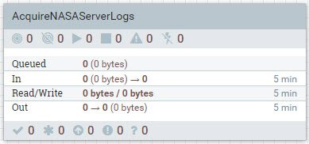 onto the NiFi canvas.

Insert the Process Group Name: `AcquireNASAServerLogs` or one of your choice, then click **ADD**.

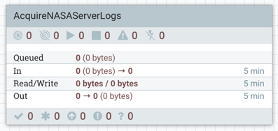

Double click on the process group to dive into it. At the bottom of the canvas, you will see **NiFi Flow >> AcquireNASAServerLogs** breadcrumb. Let's began connecting the processors for data ingestion, preprocessing and storage.

### Ingest NASA Server Log Data Source

Drop the processor icon onto the NiFi canvas. Add the **GetFile**.

Hold **control + mouse click** on **GetFile** to configure the processor:

**Table 1: Settings Tab**

| Setting | Value     |
| :------------- | :------------- |
| Name | GrabNASALogs |

**Table 2: Scheduling Tab**

| Scheduling     | Value     |
| :------------- | :------------- |
| Run Schedule       | `60 sec`       |

**Table 3: Properties Tab**

| Property     | Value     |
| :------------| :---------|
| **Input Directory**  | `/sandbox/tutorial-files/200/nifi/input/NASALogs` |
| **Keep Source File**  | `true` |

Click **APPLY**.

### Split text file by 100,000 lines each

Drop the processor icon onto the NiFi canvas. Add the **SplitText**.

Create connection between **GetFile** and **SplitText** processors. Hover
over **GetFile** to see arrow icon, press on processor and connect it to
**SplitText**.

Configure Create Connection:

| Connection | Value     |
| :------------- | :------------- |
| For Relationships     | success (**checked**) |

Click **ADD**.

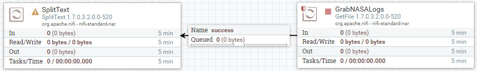

Hold **control + mouse click** on **SplitText** to configure the processor:

**Table 1: Settings Tab**

| Setting | Value     |
| :------------- | :------------- |
| Name | Split100000LinesOfText |
| Automatically Terminate Relationships | failure (**checked**) |
| Automatically Terminate Relationships | original (**checked**) |

**Table 2: Scheduling Tab**

| Scheduling     | Value     |
| :------------- | :------------- |
| Run Schedule       | `60 sec`       |

**Table 3: Properties Tab**

| Property     | Value     |
| :------------| :---------|
| **Line Split Count**  | `100000` |

Click **APPLY**.

### Split text file by 10,000 lines each

Drop the processor icon onto the NiFi canvas. Add the **SplitText**.

Create connection between **Split100000LinesOfText** and **SplitText** processors. Hover
over **Split100000LinesOfText** to see arrow icon, press on processor and connect it to
**SplitText**.

Configure Create Connection:

| Connection | Value     |
| :------------- | :------------- |
| For Relationships     | splits (**checked**) |

Click **ADD**.

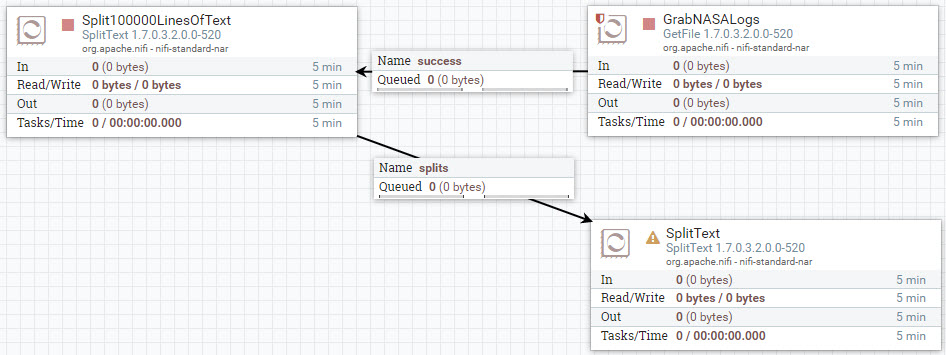

Hold **control + mouse click** on **SplitText** to configure the processor:

**Table 1: Settings Tab**

| Setting | Value     |
| :------------- | :------------- |
| Name | Split10000LinesOfText |
| Automatically Terminate Relationships | failure (**checked**) |
| Automatically Terminate Relationships | original (**checked**) |

**Table 2: Scheduling Tab**

| Scheduling     | Value     |
| :------------- | :------------- |
| Run Schedule       | `60 sec`       |

**Table 3: Properties Tab**

| Property     | Value     |
| :------------| :---------|
| **Line Split Count**  | `10000` |

Click **APPLY**.

### Split text file by 1,000 lines each

Drop the processor icon onto the NiFi canvas. Add the **SplitText**.

Create connection between **Split10000LinesOfText** and **SplitText** processors. Hover
over **Split10000LinesOfText** to see arrow icon, press on processor and connect it to
**SplitText**.

Configure Create Connection:

| Connection | Value     |
| :------------- | :------------- |
| For Relationships     | splits (**checked**) |

Click **ADD**.

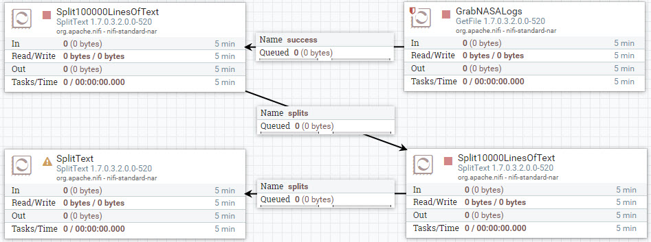

Hold **control + mouse click** on **SplitText** to configure the processor:

**Table 1: Settings Tab**

| Setting | Value     |
| :------------- | :------------- |
| Name | Split1000LinesOfText |
| Automatically Terminate Relationships | failure (**checked**) |
| Automatically Terminate Relationships | original (**checked**) |

**Table 2: Scheduling Tab**

| Scheduling     | Value     |
| :------------- | :------------- |
| Run Schedule       | `10 sec`       |

**Table 3: Properties Tab**

| Property     | Value     |
| :------------| :---------|
| **Line Split Count**  | `1000` |

Click **APPLY**.

### Split text file by 100 lines each

Drop the processor icon onto the NiFi canvas. Add the **SplitText**.

Create connection between **Split1000LinesOfText** and **SplitText** processors. Hover
over **Split1000LinesOfText** to see arrow icon, press on processor and connect it to
**SplitText**.

Configure Create Connection:

| Connection | Value     |
| :------------- | :------------- |
| For Relationships     | splits (**checked**) |

Click **ADD**.

Hold **control + mouse click** on **SplitText** to configure the processor:

**Table 1: Settings Tab**

| Setting | Value     |
| :------------- | :------------- |
| Name | Split100LinesOfText |
| Automatically Terminate Relationships | failure (**checked**) |
| Automatically Terminate Relationships | original (**checked**) |

**Table 2: Scheduling Tab**

> Note: This scheduling strategy is experimental

| Scheduling     | Value     |
| :------------- | :------------- |
| Scheduling Strategy       | `Event Driven`       |

- **Event Driven** means the processor is scheduled to run when triggered by an
event

**Table 3: Properties Tab**

| Property     | Value     |
| :------------| :---------|
| **Line Split Count**  | `100` |

Click **APPLY**.

### Split text file by 10 lines each

Drop the processor icon onto the NiFi canvas. Add the **SplitText**.

Create connection between **Split100LinesOfText** and **SplitText** processors. Hover
over **Split100LinesOfText** to see arrow icon, press on processor and connect it to
**SplitText**.

Configure Create Connection:

| Connection | Value     |
| :------------- | :------------- |
| For Relationships     | splits (**checked**) |

Click **ADD**.

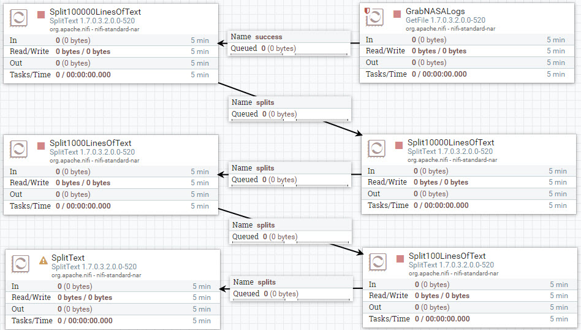

Hold **control + mouse click** on **SplitText** to configure the processor:

**Table 1: Settings Tab**

| Setting | Value     |
| :------------- | :------------- |
| Name | Split10LinesOfText |
| Automatically Terminate Relationships | failure (**checked**) |
| Automatically Terminate Relationships | original (**checked**) |

**Table 2: Scheduling Tab**

> Note: This scheduling strategy is experimental

| Scheduling     | Value     |
| :------------- | :------------- |
| Scheduling Strategy       | `Event Driven`       |

- **Event Driven** means the processor is scheduled to run when triggered by an
event

**Table 3: Properties Tab**

| Property     | Value     |
| :------------| :---------|
| **Line Split Count**  | `10` |

Click **APPLY**.

### Split text file by 1 lines each

Drop the processor icon onto the NiFi canvas. Add the **SplitText**.

Create connection between **Split10LinesOfText** and **SplitText** processors. Hover
over **Split10LinesOfText** to see arrow icon, press on processor and connect it to
**SplitText**.

Configure Create Connection:

| Connection | Value     |
| :------------- | :------------- |
| For Relationships     | splits (**checked**) |

Click **ADD**.

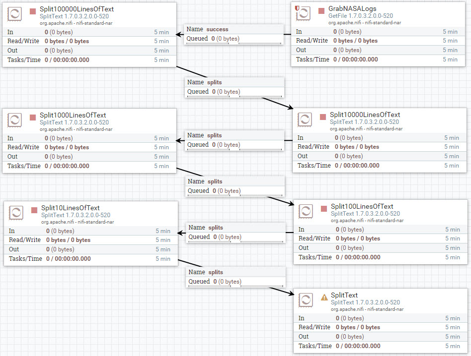

Hold **control + mouse click** on **SplitText** to configure the processor:

**Table 1: Settings Tab**

| Setting | Value     |
| :------------- | :------------- |
| Name | Split1LinesOfText |
| Automatically Terminate Relationships | failure (**checked**) |
| Automatically Terminate Relationships | original (**checked**) |

**Table 2: Scheduling Tab**

> Note: This scheduling strategy is experimental

| Scheduling     | Value     |
| :------------- | :------------- |
| Scheduling Strategy       | `Event Driven`       |

- **Event Driven** means the processor is scheduled to run when triggered by an
event

**Table 3: Properties Tab**

| Property     | Value     |
| :------------| :---------|
| **Line Split Count**  | `1` |

Click **APPLY**.

### Extract Regex Patterns from FlowFile Content into Attributes

Drop the processor icon onto the NiFi canvas. Add the **ExtractText**.

Create connection between **Split1LinesOfText** and **ExtractText** processors. Hover
over **Split1LinesOfText** to see arrow icon, press on processor and connect it to
**ExtractText**.

Configure Create Connection:

| Connection | Value     |
| :------------- | :------------- |
| For Relationships     | splits (**checked**) |

Click **ADD**.

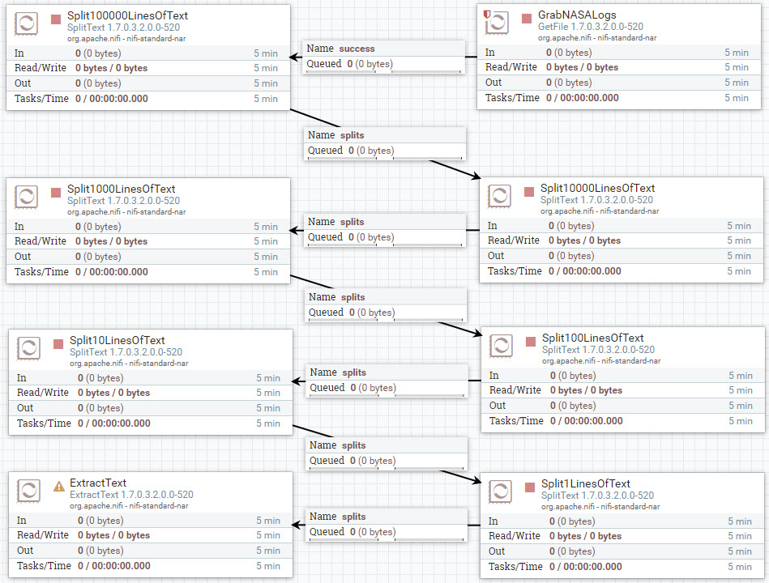

Hold **control + mouse click** on **ExtractText** to configure the processor:

**Table 1: Settings Tab**

| Setting | Value     |
| :------------- | :------------- |
| Automatically Terminate Relationships | unmatched (**checked**) |

**Table 2: Scheduling Tab**

| Scheduling     | Value     |
| :------------- | :------------- |
| Run Schedule       | `0 sec`       |

**Table 3: Properties Tab**

Add a user defined by property by pressing the **+** button.

| Property     | Value     |
| :------------| :---------|
| IP  | `(\b(?:\d{1,3}\.){3}\d{1,3}\b)` |
| Request_Type  | `\"(.*?)\"` |
| Response_Code  | `HTTP\/\d\.\d" (\d{3})` |
| Time | `\[(.*?)\]` |

Click **APPLY**.

### Route FlowFiles Attributes Containing Valid IP Addresses

Drop the processor icon onto the NiFi canvas. Add the **RouteOnAttribute**.

Create connection between **ExtractText** and **RouteOnAttribute** processors. Hover
over **ExtractText** to see arrow icon, press on processor and connect it to
**RouteOnAttribute**.

Configure Create Connection:

| Connection | Value     |
| :------------- | :------------- |
| For Relationships     | matched (**checked**) |

Click **ADD**.

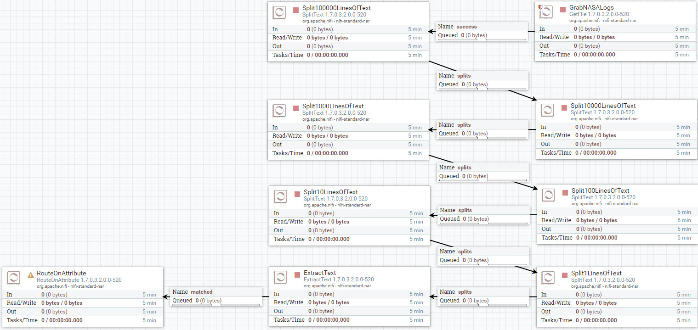

Hold **control + mouse click** on **RouteOnAttribute** to configure the processor:

**Table 1: Settings Tab**

| Setting | Value     |
| :------------- | :------------- |
| Automatically Terminate Relationships | unmatched (**checked**) |

**Table 2: Scheduling Tab**

| Scheduling     | Value     |
| :------------- | :------------- |
| Run Schedule       | `0 sec`       |

**Table 3: Properties Tab**

Add a user defined by property by pressing the **+** button.

| Property     | Value     |
| :------------| :---------|
| **Routing Strategy**  | `Route to 'matched' if all match` |
| Check_requestType  | `${Request_Type:isEmpty():not()}` |
| Check_time  | `${Time:isEmpty():not()}` |
| Check_to_remove_hostname | `${IP:startsWith('1'):or(${IP:startsWith('2')})}` |

Click **APPLY**.

### Add Geo FlowFile Attributes Based on IP Address

Drop the processor icon onto the NiFi canvas. Add the **GeoEnrichIP**.

Create connection between **RouteOnAttribute** and **GeoEnrichIP** processors. Hover
over **RouteOnAttribute** to see arrow icon, press on processor and connect it to
**GeoEnrichIP**.

Configure Create Connection:

| Connection | Value     |
| :------------- | :------------- |
| For Relationships     | matched (**checked**) |

Click **ADD**.

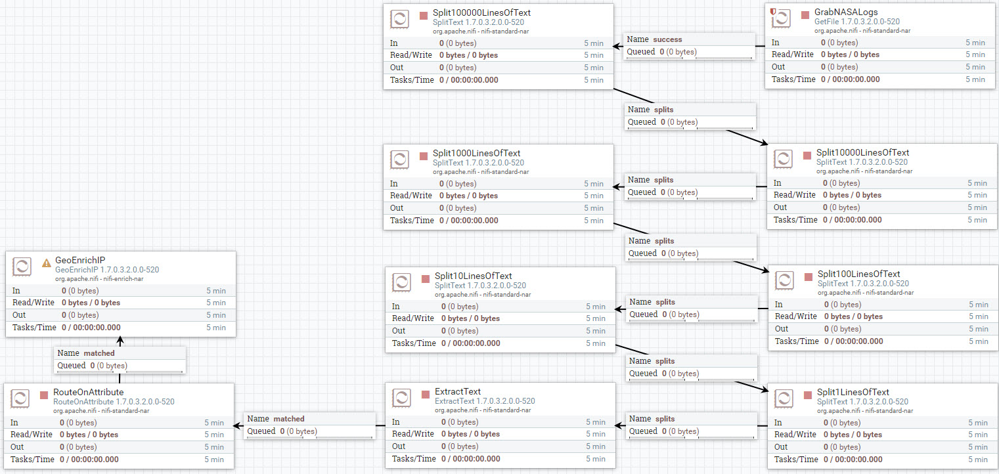

Hold **control + mouse click** on **GeoEnrichIP** to configure the processor:

**Table 1: Settings Tab**

| Setting | Value     |
| :------------- | :------------- |
| Automatically Terminate Relationships | not found (**checked**) |

**Table 2: Scheduling Tab**

| Scheduling     | Value     |
| :------------- | :------------- |
| Run Schedule       | `0 sec`       |

**Table 3: Properties Tab**

Add a user defined by property by pressing the **+** button.

> Note: on your local file system, GeoLite2-City folder will have timestamp attached to it: GeoLite2-City_20180911. Check directory path to folder.

| Property     | Value     |
| :------------| :---------|
| **MaxMind Database File**  | `/sandbox/tutorial-files/200/nifi/input/GeoFile/GeoLite2-City_<timestamp>/GeoLite2-City.mmdb` |
| **IP Address Attribute**  | `IP` |

Click **APPLY**.

### Route FlowFiles Attributes Containing Non-Empty Cities

Drop the processor icon onto the NiFi canvas. Add the **RouteOnAttribute**.

Create connection between **GeoEnrichIP** and **RouteOnAttribute** processors. Hover
over **GeoEnrichIP** to see arrow icon, press on processor and connect it to
**RouteOnAttribute**.

Configure Create Connection:

| Connection | Value     |
| :------------- | :------------- |
| For Relationships     | found (**checked**) |

Click **ADD**.

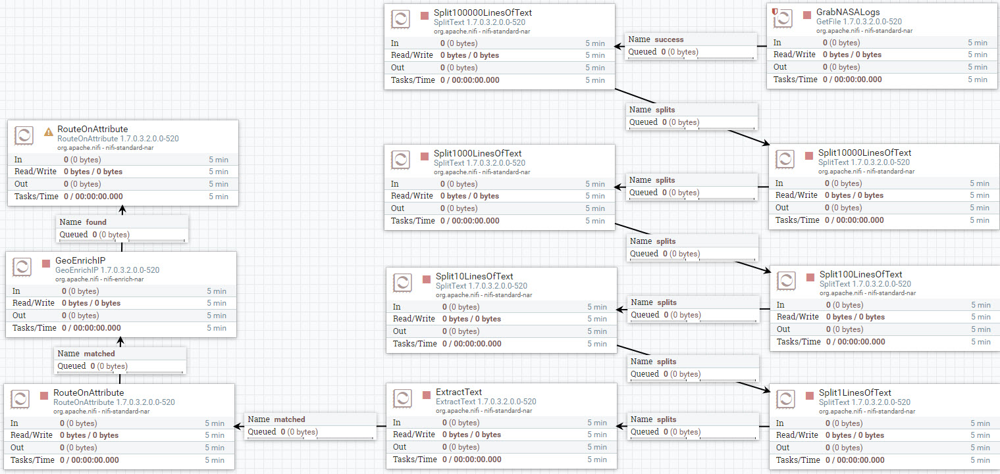

Hold **control + mouse click** on **RouteOnAttribute** to configure the processor:

**Table 1: Settings Tab**

| Setting | Value     |
| :------------- | :------------- |
| Automatically Terminate Relationships | unmatched (**checked**) |

**Table 2: Scheduling Tab**

| Scheduling     | Value     |
| :------------- | :------------- |
| Run Schedule       | `0 sec`       |

**Table 3: Properties Tab**

Add a user defined by property by pressing the **+** button.

| Property     | Value     |
| :------------| :---------|
| **Routing Strategy**  | `Route to 'matched' if all match` |
| Check_city  | `${IP.geo.city:isEmpty():not()}` |

Click **APPLY**.

### Search and Replace Content of FlowFile via Regex

Drop the processor icon onto the NiFi canvas. Add the **ReplaceText**.

Create connection between **RouteOnAttribute** and **ReplaceText** processors. Hover
over **RouteOnAttribute** to see arrow icon, press on processor and connect it to
**ReplaceText**.

Configure Create Connection:

| Connection | Value     |
| :------------- | :------------- |
| For Relationships     | matched (**checked**) |

Click **ADD**.

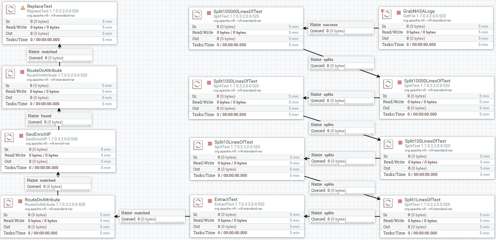

Hold **control + mouse click** on **ReplaceText** to configure the processor:

**Table 1: Settings Tab**

| Setting | Value     |
| :------------- | :------------- |
| Automatically Terminate Relationships | failure (**checked**) |

**Table 2: Scheduling Tab**

| Scheduling     | Value     |
| :------------- | :------------- |
| Run Schedule       | `0 sec`       |

**Table 3: Properties Tab**

Copy and paste the property values in between the double quotes:

~~~bash
Property = Value
Search Value = "(?s)(^.*$)"
Replacement Value = "${IP}|${Time}|${Request_Type}|${Response_Code}|${IP.geo.city}|${IP.geo.country}|${IP.geo.country.isocode}|${IP.geo.latitude}|${IP.geo.longitude}"
~~~

Click **APPLY**.

### Merge FlowFiles Once a Set Number Has Accumulated

Drop the processor icon onto the NiFi canvas. Add the **MergeContent**.

Create connection between **ReplaceText** and **MergeContent** processors. Hover
over **ReplaceText** to see arrow icon, press on processor and connect it to
**MergeContent**.

Configure Create Connection:

| Connection | Value     |
| :------------- | :------------- |
| For Relationships     | success (**checked**) |

Click **ADD**.

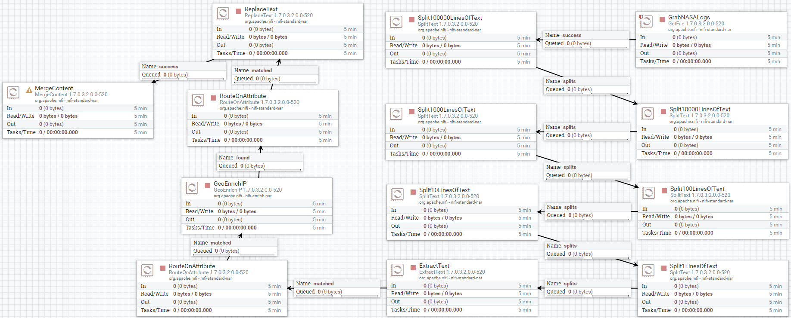

Hold **control + mouse click** on **MergeContent** to configure the processor:

**Table 1: Settings Tab**

| Setting | Value     |
| :------------- | :------------- |
| Automatically Terminate Relationships | failure (**checked**) |
| Automatically Terminate Relationships | original (**checked**) |

**Table 2: Scheduling Tab**

| Scheduling     | Value     |
| :------------- | :------------- |
| Run Schedule       | `0 sec`       |

**Table 3: Properties Tab**

> Note: press shift + enter to next line for demarcator

| Property     | Value     |
| :------------| :---------|
| **Minimum Number of Entries**  | `20` |
| **Maximum Number of Entries**  | `40` |
| **Maximum Number of Bins**  | `100` |
| **Delimiter Strategy**  | `Text` |
| **Demarcator**  | press **{shift + enter}** |

Click **APPLY**.

### Update Merged FlowFile Attribute Name

Drop the processor icon onto the NiFi canvas. Add the **UpdateAttribute**.

Create connection between **MergeContent** and **UpdateAttribute** processors. Hover
over **MergeContent** to see arrow icon, press on processor and connect it to
**UpdateAttribute**.

Configure Create Connection:

| Connection | Value     |
| :------------- | :------------- |
| For Relationships     | merged (**checked**) |

Click **ADD**.

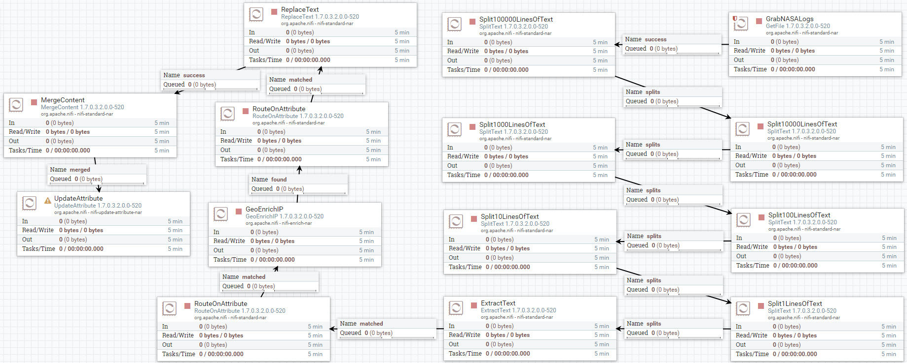

Hold **control + mouse click** on **UpdateAttribute** to configure the processor:

**Table 2: Scheduling Tab**

| Scheduling     | Value     |
| :------------- | :------------- |
| Run Schedule       | `0 sec`       |

**Table 3: Properties Tab**

| Property     | Value     |
| :------------| :---------|
| filename  | `logsample-${now():format("HHmmssSSS")}-${UUID()}-.txt` |

Click **APPLY**.

### Write Contents of FlowFile to Hadooop Distributed File System

Drop the processor icon onto the NiFi canvas. Add the **PutHDFS**.

Create connection between **UpdateAttribute** and **PutHDFS** processors. Hover
over **UpdateAttribute** to see arrow icon, press on processor and connect it to
**PutHDFS**.

Configure Create Connection:

| Connection | Value     |
| :------------- | :------------- |
| For Relationships     | success (**checked**) |

Click **ADD**.

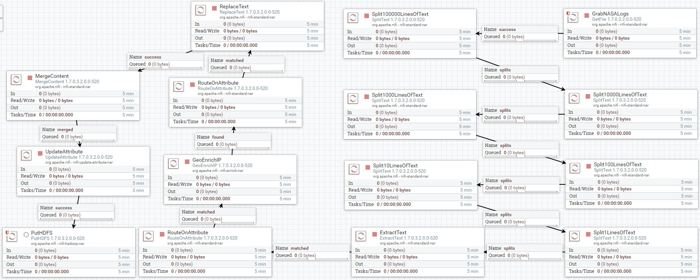

Hold **control + mouse click** on **PutHDFS** to configure the processor:

**Table 1: Settings Tab**

| Setting | Value     |
| :------------- | :------------- |
| Automatically Terminate Relationships | failure (**checked**) |
| Automatically Terminate Relationships | success (**checked**) |

**Table 2: Scheduling Tab**

| Scheduling     | Value     |
| :------------- | :------------- |
| Run Schedule       | `0 sec`       |

**Table 3: Properties Tab**

| Property     | Value     |
| :------------| :---------|
| Hadoop Configuration Resources  | `/etc/hadoop/conf/core-site.xml,/etc/hadoop/conf/hdfs-site.xml` |
| **Directory**  | `/sandbox/tutorial-files/200/nifi/output/NASALogsAug1995` |

Click **APPLY**.

The PutHDFS processor's yellow cone sign should change to a red stop sign.

### Start Process Group Flow to Acquire Data

At the breadcrumb, select **NiFi Flow** level. Hold **control + mouse click** on the **AcquireNASAServerLogs** process group, then click the **start** option.

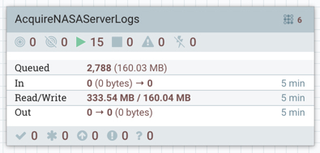

Once NiFi writes your server data to HDFS, which you can check by viewing data provenance, you can turn off the process group by holding **control + mouse click** on the **AcquireNASAServerLogs** process group, then choose **stop** option.

## Approach 2: Import NiFi AcquireNASALogs via UI

Download the NiFi template [AcquireNASAServerLogs.xml](application/development/nifi-template/AcquireNASAServerLogs.xml) to your local computer.

After starting your sandbox, open HDF **NiFi UI** at http://sandbox-hdf.hortonworks.com:9090/nifi.

Open the Operate panel if not already open, then press the **Upload Template** icon .

Press on Select Template icon .

The file browser on your local computer will appear, find **AcquireNASAServerLogs.xml** template you just downloaded, then press **Open**, then press **UPLOAD**.

You should receive a notification that the **Template successfully imported.** Press OK to acknowledge.

Drop the **Template** icon  onto the NiFi canvas.

Add Template called **AcquireNASAServerLogs**.

Start the NiFi flow. Hold **control + mouse click** on the **AcquireNASAServerLogs** process group, then click the **start** option.

Once NiFi writes your server data to HDFS, which you can check by viewing data provenance, you can turn off the process group by holding **control + mouse click** on the **AcquireNASAServerLogs** process group, then choose **stop** option.

## Approach 3: Auto Deploy NiFi Flow via REST Call

Open HDF Sandbox Web Shell Client at http://sandbox-hdf.hortonworks.com:4200. Copy and paste the following shell code:

~~~bash
NIFI_TEMPLATE="AcquireNASAServerLogs"
wget https://github.com/hortonworks/data-tutorials/raw/master/tutorials/cda/building-a-server-log-analysis-application/application/development/shell/nifi-auto-deploy.sh
bash nifi-auto-deploy.sh $NIFI_TEMPLATE
~~~

Open HDF **NiFi UI** at http://sandbox-hdf.hortonworks.com:9090/nifi. Your NiFi was just uploaded, imported and started. You just have to make sure to turn on the PutHDFS processor, so NiFi can store data into HDFS.

## Summary

Congratulations! You now know how to build a NiFi flow from scratch that ingests NASA Server Log data, enriches the data with geographic insight and stores the data into HDFS.

## Further Reading

- [NiFi User Guide](https://nifi.apache.org/docs/nifi-docs/html/user-guide.html)
- [NiFi REST API](https://nifi.apache.org/docs/nifi-docs/rest-api/index.html)
