# Cleaning the Raw NASA Log Data

## Introduction

You have been brought onto the project as a Data Engineer with the following responsibilities: load in HDFS data into Spark DataFrame, analyze the various columns of the data to discover what needs cleansing, each time you hit checkpoints in cleaning up the data, you will register the DataFrame as a temporary table for later visualization in a different notebook and when the cleaning is complete, you will create a Hive table for ability to visualize the data with external visualization tools.

## Prerequisites

- Enabled CDA for your appropriate system.
- Setup Development Environment
- Acquired NASA Server Log Data

## Outline

- [Approach 1: Clean Raw NASA Log Data with Spark Zeppelin Interpreter](#approach-1-clean-raw-nasa-log-data-with-spark-zeppelin-interpreter)
- [Approach 2: Import Zeppelin Notebook to Clean NASA Log Data via UI](#approach-2-import-zeppelin-notebook-to-clean-nasa-log-data-via-ui)
- [Summary](#summary)
- [Further Reading](#further-reading)

<!-- - [Approach 3: Auto Deploy Zeppelin Notebook to Clean NASA Log Data via Script](#approach-3-auto-deploy-zeppelin-notebook-to-clean-nasa-log-data-via-script) -->

## Approach 1: Clean Raw NASA Log Data with Spark Zeppelin Interpreter

Open HDP **Zeppelin UI** at http://sandbox-hdp.hortonworks.com:9995.

1\. Click **Create new note**. Insert **Note Name** `Cleaning-Raw-NASA-Log-Data`, then press **Create Note**.

We are taken to the new Zeppelin Notebook.

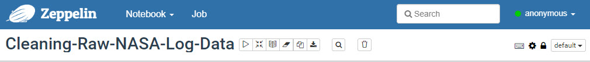

### Loading External Library

We will use Zeppelin's %dep interpreter to import external databricks: spark-csv_2.11:1.4.0 dataset. Copy and paste the following code into the zeppelin notebook note:

~~~
%dep
z.reset()
z.load("com.databricks:spark-csv_2.11:1.4.0")
~~~

Press **{shift + enter}** or the **play** button to compile that note in the notebook.

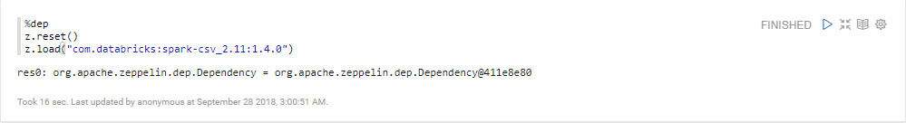

### Loading the DataFrame from HDFS

We will load the dataframe from HDFS directory `/sandbox/tutorial-files/200/nifi/output/NASALogsAug1995`
using PySpark's `sqlContext.read.format()` function. Then we will use `.show()` function to display the
content of the dataframe. Copy and paste the following pyspark code into the next available note in the notebook:

~~~python
%pyspark
from pyspark.sql.types import StructType, StructField, DoubleType, StringType
schema = StructType([
    # Represents a field in a StructType
    StructField("IP",           StringType()),
    StructField("Time",         StringType()),
    StructField("Request_Type", StringType()),
    StructField("Response_Code",StringType()),
    StructField("City",         StringType()),
    StructField("Country",      StringType()),
    StructField("Isocode",      StringType()),
    StructField("Latitude",     StringType()),
    StructField("Longitude",    StringType())
])

logs_df = sqlContext.read \
                    .format("com.databricks.spark.csv") \
                    .schema(schema) \
                    .option("header", "false") \
                    .option("delimiter", "|") \
                    .load("/sandbox/tutorial-files/200/nifi/output/NASALogsAug1995")
logs_df.show(truncate=False)
~~~

How many rows are displayed from the dataframe, `logs_df`?
When we tested the demo, there was 20 rows displayed.

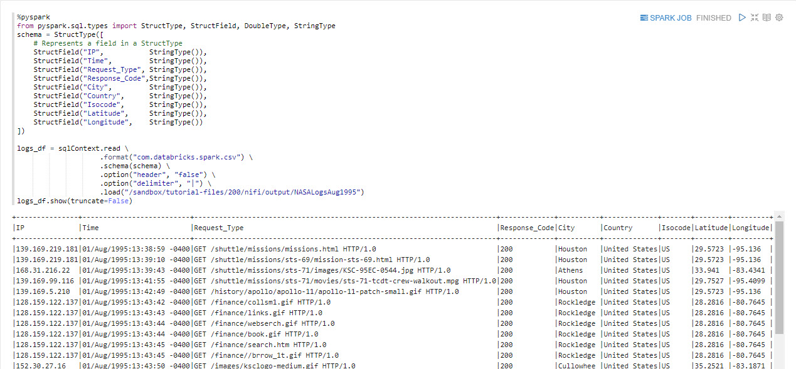

### Parsing the Timestamp

From the **Time** column, we will parse for the timestamp and drop the old **Time** column with the new **Timestamp** column.

~~~python
%pyspark
from pyspark.sql.functions import udf

months = {
  'Jan': 1, 'Feb': 2, 'Mar':3, 'Apr':4, 'May':5, 'Jun':6, 'Jul':7, 'Aug':8,  'Sep': 9, 'Oct':10, 'Nov': 11, 'Dec': 12
}

def parse_timestamp(time):
    """ This function takes a Time string parameter of logs_df dataframe
    Returns a string suitable for passing to CAST('timestamp') in the format YYYY-MM-DD hh:mm:ss
    """
    return "{0:04d}-{1:02d}-{2:02d} {3:02d}:{4:02d}:{5:02d}".format(
      int(time[7:11]),
      months[time[3:6]],
      int(time[0:2]),
      int(time[12:14]),
      int(time[15:17]),
      int(time[18:20])
    )

udf_parse_timestamp = udf(parse_timestamp)

# Assigning the Timestamp name to the new column and dropping the old Time column
parsed_df = logs_df.select('*',
                udf_parse_timestamp(logs_df['Time'])
                .cast('timestamp')
                .alias('Timestamp')).drop('Time')  
# Stores the dataframe in cache for the future use
parsed_df.cache()                                  
# Displays the results
parsed_df.show()
~~~

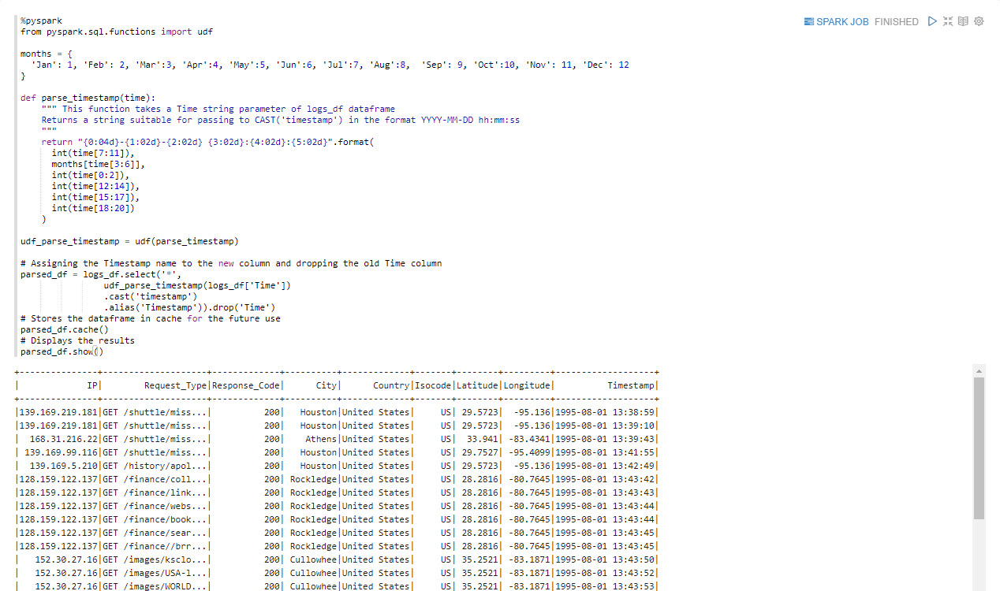

### Cleaning the Request_Type Column

Currently the Request_type has **GET** and **HTTP/1.0** surrounding the actual data being requested,
so we will remove these two from each line.

~~~python
%pyspark
from pyspark.sql.functions import split, regexp_extract
path_df = parsed_df.select('*', regexp_extract('Request_Type', r'^.*\w+\s+([^\s]+)\s+HTTP.*', 1)
                    .alias('Request_Path')).drop('Request_Type')

# Cache the dataframe
path_df.cache()
# Displays the results
path_df.show(truncate=False)
~~~

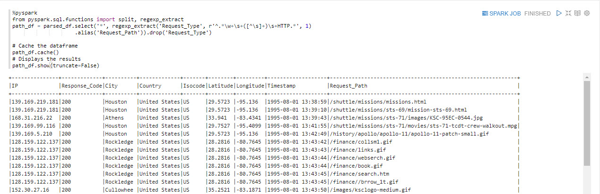

### Filtering for Most Frequent Hosts Hitting NASA Server

We want to filter on which which hosts are most frequently hitting NASA's server and then store the data into a temporary table.

~~~python
%pyspark
# Group the dataframe by IP column and then counting
most_frequent_hosts = parsed_df.groupBy("IP").count()

# Displays the results
most_frequent_hosts.show()

# Registering most_frequent_hosts variable as a temporary table
most_frequent_hosts.registerTempTable("most_frequent_hosts")
~~~

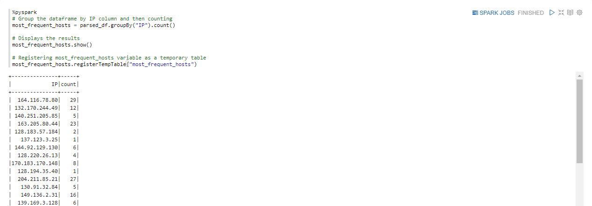

### Filtering for Count of Each Response Code

Our aim is to find the amount of times that each response code has occurred and store the result into a temporary table for later use.

~~~python
%pyspark
# Groups the dataframe by Response_Code column and then counting
status_count = path_df.groupBy('Response_Code').count()
# Displays the results
status_count.show()
# Registering status_count variable as a temporary table
status_count.registerTempTable("status_count")
~~~

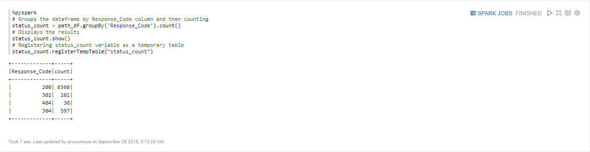

### Filtering Records Where Response Code is 200

Create the dataframe where records with Response Code 200 will be stored, cache the dataframe and display the results.

~~~python
%pyspark
# Creating dataframe where Response Code is 200
success_logs_df = parsed_df.select('*').filter(path_df['Response_Code'] == 200)
# Cache the dataframe
success_logs_df.cache()
# Displays the results
success_logs_df.show()
~~~

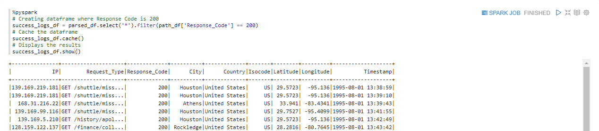

Extract the hour, display the results and register the dataframe as a temporary table for the SQL interpreter to use later.

~~~python
%pyspark
from pyspark.sql.functions import hour
# Extracting the Hour
success_logs_by_hours_df = success_logs_df.select(hour('Timestamp').alias('Hour')).groupBy('Hour').count()
# Displays the results
success_logs_by_hours_df.show()
# Registering Temporary Table that can be used by SQL interpreter
success_logs_by_hours_df.registerTempTable("success_logs_by_hours_df")
~~~

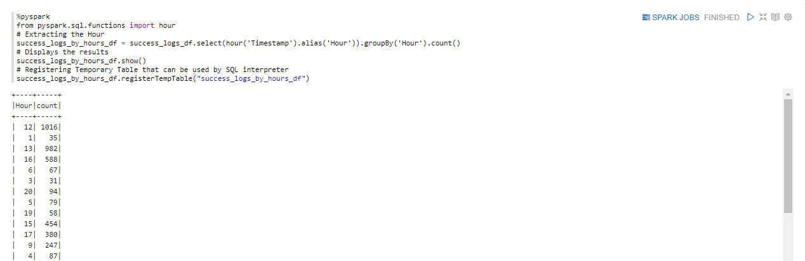

### Cleaning the Request_Path Column for Type Extensions

The Request_Path column contains the type extension. We will first show the current state of the Request_Path column before cleaning is done.

~~~python
%pyspark
# Show the current Request_Path Column before applying cleansing
from pyspark.sql.functions import split, regexp_extract
extension_df = path_df.select(regexp_extract('Request_Path', '(\\.[^.]+)$',1).alias('Extension'))
extension_df.show(truncate=False)
~~~

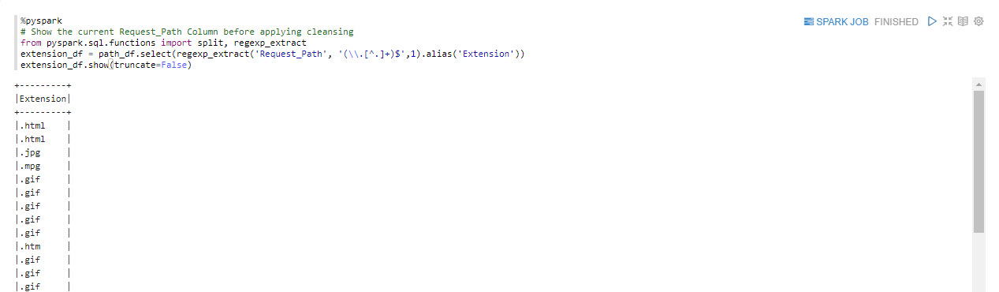

### How Should We Clean this Request_Path Column?

In the column, we see that each extension has a dot (.).
We will replace this character with a blank character.

~~~python
%pyspark
from pyspark.sql.functions import split, regexp_replace
# Replace the dot character with the blank character
extension_df = extension_df.select(regexp_replace('Extension', '\.','').alias('Extension'))
# Displays the results
extension_df.show(truncate=False)
~~~

There may also be some rows in the column that are blank, so we will replace a blank row with the word **None**.

~~~python
%pyspark
from pyspark.sql.functions import *
# Replaces the blank value with the value 'None' in Extension
extension_df = extension_df.replace('', 'None', 'Extension').alias('Extension')
extension_df.cache()
# Shows the results
extension_df.show(truncate=False)
~~~

Next we will group the dataframe by extension type, count the rows, display the results and register the dataframe in a temporary table.

~~~python
%pyspark
# Groups the dataframe by Extension and then count the rows
extension_df_count = extension_df.groupBy('Extension').count()
# Displays the results
extension_df_count.show()
# Registers the temporary table
extension_df_count.registerTempTable('extension_df_count')
~~~

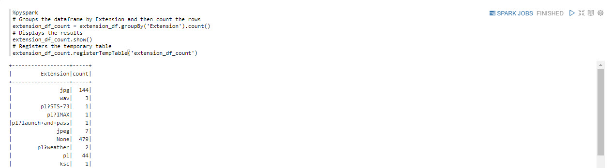

Create a temporary table for DataFrame `path_df`.

~~~python
%pyspark
path_df.registerTempTable("path_df")
~~~

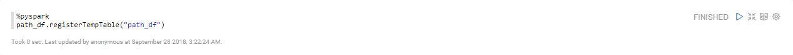

Now that the dataframe is registered as a temporary table.

We can head to the summary to review how we cleaned the data and prepared it to be ready for visualization.

## Approach 2: Import Zeppelin Notebook to Clean NASA Log Data via UI

Open HDP **Zeppelin UI** at [http://sandbox-hdp.hortonworks.com:9995](http://sandbox-hdp.hortonworks.com:9995).

1\. Click **Import note**. Select **Add from URL**.

Insert the following URL cause we are going to import **Cleaning-Raw-NASA-Log-Data** notebook:

~~~bash
https://raw.githubusercontent.com/hortonworks/data-tutorials/master/tutorials/cda/building-a-server-log-analysis-application/application/development/zeppelin-notebook/Cleaning-Raw-NASA-Log-Data.json
~~~

Click **Import Note**.

Your notebook **Cleaning-Raw-NASA-Log-Data** should be a part of the list of notebooks now.

Click on notebook **Cleaning-Raw-NASA-Log-Data**. Then press the **play** button for all paragraphs to be executed. The **play** button is near the title of this notebook at the top of the webpage.

Now we are finished cleaning the NASA Server Log data. We can head to the summary to review how we cleaned the data and prepared it to be ready for visualization.

<!--
## Approach 3: Auto Deploy Zeppelin Notebook to Clean NASA Log Data via Script

Open HDP **sandbox web shell client** at [http://sandbox-hdp.hortonworks.com:4200](http://sandbox-hdp.hortonworks.com:4200).

We will use the Zeppelin REST Call API to import a notebook that uses SparkSQL to analyze NASA's server logs for possible breaches.

~~~bash
NOTEBOOK_NAME="Cleaning-Raw-NASA-Log-Data"
wget https://github.com/james94/data-tutorials/raw/master/tutorials/cda/building-a-server-log-analysis-application/application/development/shell/zeppelin-auto-deploy.sh
bash zeppelin-auto-deploy.sh $NOTEBOOK_NAME
~~~

Now we are finished cleaning the NASA Server Log data. We can head to the summary to review how we cleaned the data and prepared it to be ready for visualization.

-->

## Summary

Congratulations! You just discovered which columns needed cleansing after analysis of the dirty data. Now we are ready to visualize the data in another notebook to illustrate our new insight to the data, such as Response Code occurring at 200, network traffic locations by country and city, etc.

## Further Reading

- [Spark SQL, DataFrames and Datasets Guide](https://spark.apache.org/docs/latest/sql-programming-guide.html)
