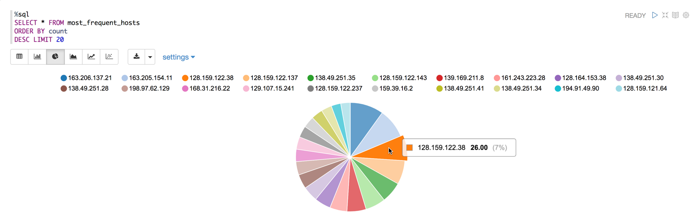
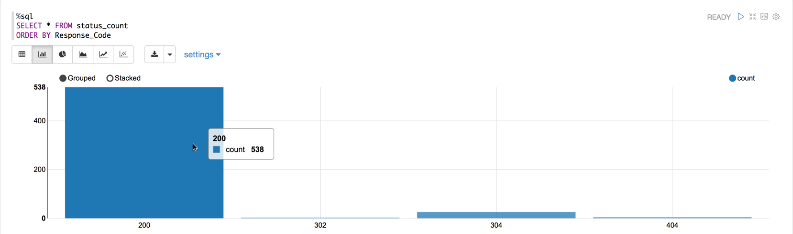
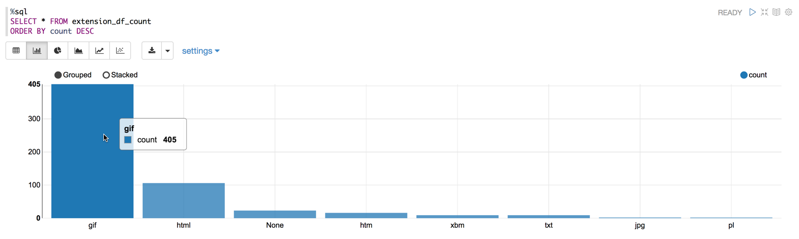
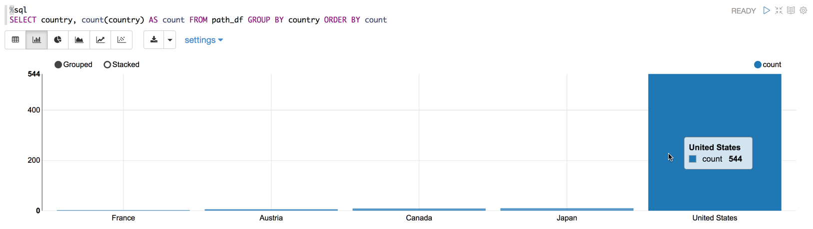
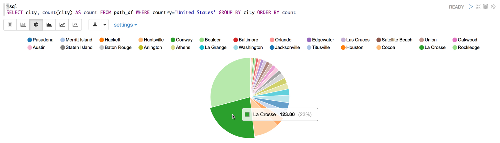

# Visualizing NASA Log Data

## Introduction

You have been brought onto the project as a Data Analyst with the following responsibilities: visualize most frequent hosts hitting NASA's Server, visualize response code occurrences and records with code 200, visualize the type extension and network traffic location by country and city.

## Prerequisites

- Enabled CDA for your appropriate system.
- Setup Development Environment
- Acquired NASA Server Log Data
- Cleaned the Raw NASA Log Data

## Outline

- [Approach 1: Visualize NASA Log Data with Spark Zeppelin Interpreter](#approach-1-visualize-nasa-log-data-with-spark-zeppelin-interpreter)
- [Approach 2: Import Zeppelin Notebook to Visualize NASA Log Data via UI](#approach-2-import-zeppelin-notebook-to-visualize-nasa-log-data-via-ui)
- [Summary](#summary)
- [Further Reading](#further-reading)

<!-- - [Approach 3: Auto Deploy Zeppelin Notebook to Visualize NASA Log Data via Script](#approach-3-auto-deploy-zeppelin-notebook-to-visualize-nasa-log-data-via-script) -->

## Approach 1: Visualize NASA Log Data with Spark Zeppelin Interpreter

Open HDP **Zeppelin UI** at [http://sandbox-hdp.hortonworks.com:9995](http://sandbox-hdp.hortonworks.com:9995).

1\. Click **Create new note**. Insert **Note Name** `Visualizing-NASA-Log-Data`, then press **Create Note**.

We are taken to the new Zeppelin Notebook.

### Visualizing Hosts Hitting NASA Server via Pie Chart

We will display a count for each hosts hitting NASA's server.
This data will illustrate who are the most frequent hosts connecting to NASA's server.

Run the following SQL code:

~~~sql
%sql
SELECT * FROM most_frequent_hosts
ORDER BY count
DESC LIMIT 20
~~~

Then select pie chart.

### What Do You See By Hovering in the Pie Chart?

Each pie slice shows a clear count of each host hitting NASA's server. For example,
host at IP 163.206.137.21 hit the server 35 times, 10% of server hits comes from this host.

### Visualizing Response Code Occurrences via Bar Graph

A bar graph will create a nice a clear visual of which response code occurs most often

Run the following SQL code:

~~~sql
%sql
SELECT * FROM status_count
ORDER BY Response_Code
~~~

Then select bar chart.

### What Response Code Occurs Most Frequently?

In the bar graph, we can see Response Code 200 occurs 538 times. Response Code 200
means the request was received, understood and being processed.

### Visualizing the Records with Response Code 200

So earlier in cleaning the data, we filtered the records down to ones that only have response code 200.
Now we will visualize the occurences of records with success hits per hour.

Run the following SQL code:

~~~sql
%sql
SELECT * FROM success_logs_by_hours_df
ORDER BY Hour
~~~

then select bar chart.

### Visualizing Type Extensions

Our objective is to find the number of different extensions available in our data set.
We will group the column and then count the records in each group.

Run the following SQL code:

~~~sql
%sql
SELECT * FROM extension_df_count
ORDER BY count DESC
~~~

then select bar chart.

### Visualizing Network Traffic Locations

We will look at the network traffic per country and for cities within the United States

### Network Traffic Locations By Country

Run the following SQL code:

~~~sql
%sql
SELECT country, count(country) AS count FROM path_df GROUP BY country ORDER BY count
~~~

### Network Traffic Locations By City of a Country

Run the following SQL code:

~~~sql
%sql
SELECT city, count(city) AS count FROM path_df WHERE country='United States' GROUP BY city ORDER BY count
~~~

Now we are finished visualizing the NASA Server Log data. We can head to the summary to review how we visualized the data.

## Approach 2: Import Zeppelin Notebook to Visualize NASA Log Data via UI

Open HDP **Zeppelin UI** at [http://sandbox-hdp.hortonworks.com:9995](http://sandbox-hdp.hortonworks.com:9995).

1\. Click **Import note**. Select **Add from URL**.

Insert the following URL cause we are going to import **Visualizing-NASA-Log-Data** notebook:

~~~bash
https://raw.githubusercontent.com/hortonworks/data-tutorials/master/tutorials/cda/building-a-server-log-analysis-application/application/development/zeppelin-notebook/Visualizing-NASA-Log-Data.json
~~~

Click **Import Note**.

Your notebook **Visualizing-NASA-Log-Data** should be a part of the list of notebooks now.

Click on notebook **Visualizing-NASA-Log-Data**. Then press the **play** button for all paragraphs to be executed. The **play** button is near the title of this notebook at the top of the webpage.

Now we are finished visualizing the NASA Server Log data. We can head to the summary to review how we visualized the data.

<!--
## Approach 3: Auto Deploy Zeppelin Notebook to Visualize NASA Log Data via Script

Open HDP **sandbox web shell client** at [http://sandbox-hdp.hortonworks.com:4200](http://sandbox-hdp.hortonworks.com:4200).

We will use the Zeppelin REST Call API to import a notebook that uses SparkSQL to analyze NASA's server logs for possible breaches.

~~~bash
NOTEBOOK_NAME="Visualizing-NASA-Log-Data"
wget https://github.com/james94/data-tutorials/raw/master/tutorials/cda/building-a-server-log-analysis-application/application/development/shell/zeppelin-auto-deploy.sh
bash zeppelin-auto-deploy.sh $NOTEBOOK_NAME
~~~

-->

## Summary

Congratulations! You just visualized important aspects of the data from the NASA Server logs, such as how many times particular hosts hit the server, response codes indicating success rate of data transfer and where the network traffic location is the heaviest.

## Further Reading

- [Data Visualization](https://en.wikipedia.org/wiki/Data_visualization)
