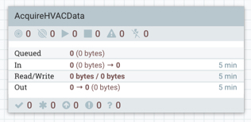
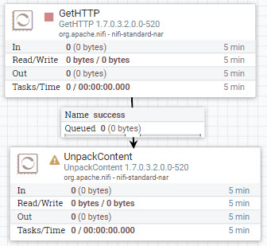
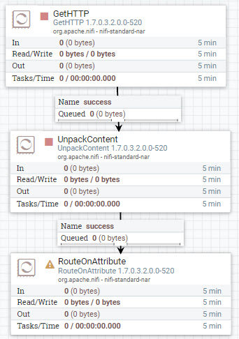
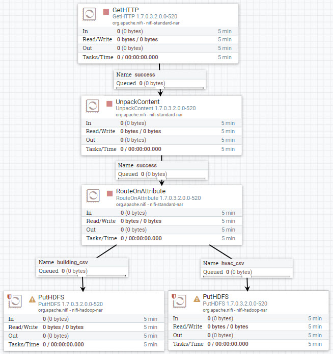
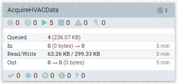
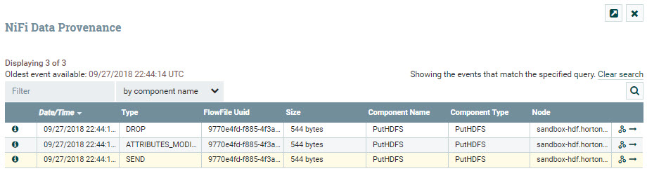
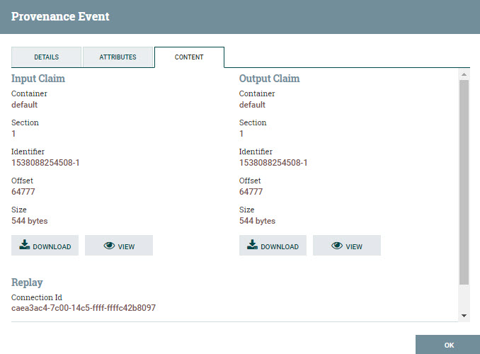
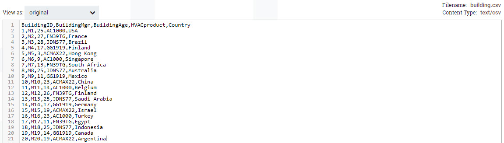
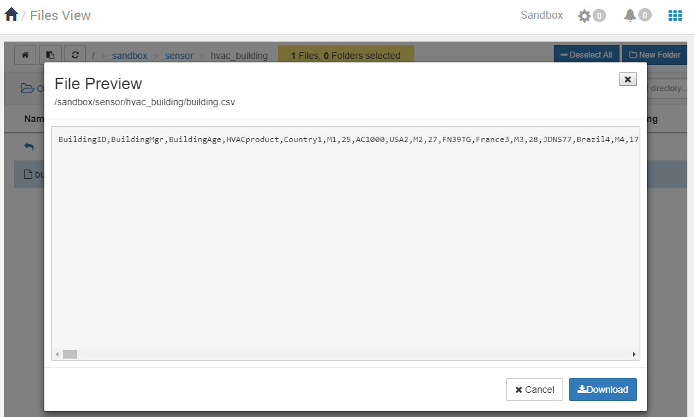

# Acquiring HVAC Sensor Data

## Introduction

You have been brought onto the project as a Data Engineer with the following responsibilities: acquire the HVAC sensor data feed, split the feed into two separate flows and store them into their respective locations in storage. You have been tasked with using [Apache NiFi](https://nifi.apache.org/docs.html) to build this portion of the data pipeline.

## Prerequisites

- Enabled CDA for your appropriate system
- Set up the Development Environment

## Outline

- [Approach 1: Build a NiFi Flow to Acquire HVAC Sensor Data](#approach-1-build-a-nifi-flow-to-acquire-hvac-sensor-data)
- [Approach 2: Import NiFi AcquireHVACData Process Group via UI](#approach-2-import-nifi-acquirehvacdata-process-group-via-ui)
- [Approach 3: Auto Deploy NiFi Flow via REST Call](#approach-3-auto-deploy-nifi-flow-via-rest-call)
- [Summary](#summary)
- [Further Reading](#further-reading)

## Approach 1: Build a NiFi Flow to Acquire HVAC Sensor Data

After starting your sandbox, open HDF **NiFi UI** at `http://sandbox-hdf.hortonworks.com:9090/nifi`.

### Create AcquireHVACData Process Group

Drop the process group icon  onto the NiFi canvas.

Add the Process Group Name: `AcquireHVACData` or one of your choice.

Double click on the process group to dive into it. At the bottom of the canvas, you will see **NiFi Flow >> AcquireHVACData** breadcrumb. Let's began connecting the processors for data ingestion, preprocessing and storage.

### Ingest Sensor Data Source

Drop the processor icon onto the NiFi canvas. Add the **GetHTTP**.

Hold **control + mouse click** on **GetHTTP** to configure the processor:

**Table 1: Scheduling Tab**

| Scheduling     | Value     |
| :------------- | :------------- |
| Run Schedule       | `1 sec`       |

**Table 2: Properties Tab**

| Property     | Value     |
| :------------| :---------|
| **URL**  | `http://s3.amazonaws.com/hw-sandbox/tutorial14/SensorFiles.zip` |
| **Filename**  | `HVACSensorFiles.zip` |

Click **APPLY**.

### Decompress Content of FlowFile

Drop the processor icon onto the NiFi canvas. Add the **UnpackContent**.

Create connection between **GetHTTP** and **UnpackContent** processors. Hover
over **GetHTTP** to see arrow icon, press on processor and connect it to
**UnpackContent**.

Configure Create Connection:

| Connection | Value     |
| :------------- | :------------- |
| For Relationships     | success (**checked**) |

Click **ADD**.

Configure **UnpackContent** processor:

**Table 3: Settings Tab**

| Setting | Value     |
| :------------- | :------------- |
| Automatically Terminate Relationships | failure (**checked**) |
| Automatically Terminate Relationships | original (**checked**) |

**Table 4: Scheduling Tab**

| Scheduling | Value     |
| :------------- | :------------- |
| Run Schedule       | `1 sec`       |

**Table 5: Properties Tab**

| Property | Value     |
| :------------- | :------------- |
| **Packaging Format**       | `zip` |

Click **APPLY**.

### Route the FlowFiles Into Two Flows Based on Their Attributes

Drop the processor icon onto the NiFi canvas. Add the **RouteOnAttribute**.

Create connection between **UnpackContent** and **RouteOnAttribute** processors. Hover
over **UnpackContent** to see arrow icon, press on processor and connect it to
**RouteOnAttribute**.

Configure Create Connection:

| Connection | Value     |
| :------------- | :------------- |
| For Relationships     | success (**checked**) |

Click **ADD**.

Configure **RouteOnAttribute** processor:

**Table 6: Settings Tab**

| Setting | Value     |
| :------------- | :------------- |
| Automatically Terminate Relationships | unmatched (**checked**) |

**Table 7: Scheduling Tab**

| Scheduling | Value     |
| :------------- | :------------- |
| Run Schedule       | `1 sec`       |

**Table 8: Properties Tab**

Press the **+** button to add a user defined property for routing property name **building** and **hvac**.

| Property | Value     |
| :------------- | :------------- |
| **Routing Strategy**       | `Route to Property name` |
| **building_csv**       | `${filename:equals('building.csv')}` |
| **hvac_csv**       | `${filename:equals('HVAC.csv')}` |

Click **APPLY**.

### Store the Data Into Storage

Drop the processor icon onto the NiFi canvas. Add 2 **PutHDFS** processors.

Create connection between **RouteOnAttribute** and both **PutHDFS** processors. Hover
over **RouteOnAttribute** to see arrow icon, press on processor and connect it to
**PutHDFS**. Repeat the the previous step to connect to the other **PutHDFS** processor.

For one of the **PutHDFS** processors, Configure Create Connection:

| Connection | Value     |
| :------------- | :------------- |
| For Relationships     | building_csv (**checked**) |

Click **ADD**.

For the other **PutHDFS** processor, Configure Create Connection:

| Connection | Value     |
| :------------- | :------------- |
| For Relationships     | hvac_csv (**checked**) |

Click **ADD**.

Configure **PutHDFS** processor for relationship connection **building_csv**:

**Table 9: Settings Tab**

| Setting | Value     |
| :------------- | :------------- |
| Automatically Terminate Relationships | failure (**checked**) |
| Automatically Terminate Relationships | success (**checked**) |

**Table 10: Scheduling Tab**

| Scheduling | Value     |
| :------------- | :------------- |
| Run Schedule       | `1 sec`       |

**Table 11: Properties Tab**

Press the **+** button to add a user defined property for routing property name **building** and **hvac**.

| Property | Value     |
| :------------- | :------------- |
| Hadoop Configuration Resources       | `/etc/hadoop/conf/core-site.xml,/etc/hadoop/conf/hdfs-site.xml` |
| **Directory**       | `/sandbox/sensor/hvac_building` |
| **Conflict Resolution Strategy**       | `replace` |

Click **APPLY**.

Configure **PutHDFS** processor for relationship connection **hvac_csv**:

**Table 12: Settings Tab**

| Setting | Value     |
| :------------- | :------------- |
| Automatically Terminate Relationships | failure (**checked**) |
| Automatically Terminate Relationships | success (**checked**) |

**Table 13: Scheduling Tab**

| Scheduling | Value     |
| :------------- | :------------- |
| Run Schedule       | `1 sec`       |

**Table 14: Properties Tab**

Press the **+** button to add a user defined property for routing property name **building** and **hvac**.

| Property | Value     |
| :------------- | :------------- |
| Hadoop Configuration Resources       | `/etc/hadoop/conf/core-site.xml,/etc/hadoop/conf/hdfs-site.xml` |
| **Directory**       | `/sandbox/sensor/hvac_machine` |
| **Conflict Resolution Strategy**       | `replace` |

Click **APPLY**.

### Start Process Group Flow to Acquire Data

At the breadcrumb, select **NiFi Flow** level. Hold **control + mouse click** on the **AcquireHVACData** process group, then click the **start** option.

Once NiFi writes your sensor data to HDFS, which you can check by viewing data provenance, you can turn off the process group by holding **control + mouse click** on the **AcquireHVACData** process group, then choose **stop** option.

### Verify NiFi Stored Data

Enter the **AcquireHVACData** process group, press **control + mouse click** on PutHDFS processor of your choice, then press **View data provenance**.

Press on **i** icon on the left row to view details about a provenance event. Choose the event with the type **SEND**. In the Provenance Event window, choose **CONTENT** tab. On **Output Claim**, choose **VIEW**.

You will be able to see the data NiFi sent to the external process HDFS via NiFi's data provenance. The data below shows hvac dataset.

Let's verify that the data is actually present in **HDFS** from Ambari **Files View**. Login to HDP Ambari at http://sandbox-hdp.hortonowrks.com:8080.

Click the Ambari Views selector at the top right corner, then click **Files View**.

By entering the path: `/sandbox/sensor/hvac_building`, you should be able to view the `.csv` data for **building.csv**. The HVAC.csv is in the hvac_temperature folder.

The **building.csv** data does look distorted, but when we clean it further with Apache Hive, it will be formatted appropriately in a table.

## Approach 2: Import NiFi AcquireHVACData Process Group via UI

Head to HDF Ambari at http://sandbox-hdp.hortonowrks.com:8080 with login user `admin` and the password you set, then enter the NiFi UI using Ambari Quick Link and import the NiFi template.

Download the NiFi template [acquire-hvac-data.xml](application/development/nifi-template/acquire-hvac-data.xml) to your local computer.

After starting your sandbox, open HDF **NiFi UI** at `http://sandbox-hdf.hortonworks.com:9090/nifi`.

Open the Operate panel if not already open, then press the **Upload Template** icon .

Press on Select Template icon .

The file browser on your local computer will appear, find **acquire-hvac-data.xml** template you just downloaded, then press **Open**, then press **UPLOAD**.

You should receive a notification that the **Template successfully imported.** Press OK to acknowledge.

Drop the **Template** icon  onto the NiFi canvas.

Add Template called **acquire-hvac-data**.

Start the NiFi flow. Hold **control + mouse click** on the **AcquireHVACData** process group, then click the **start** option.

Once NiFi writes your sensor data to HDFS, which you can check quickly by looking at the PutHDFS processors inside the process group, you can turn off the process group by holding **control + mouse click** on the **AcquireHVACData** process group, then choose **stop** option.

## Approach 3: Auto Deploy NiFi Flow via REST Call

Open HDF Sandbox Web Shell Client at http://sandbox-hdf.hortonworks.com:4200. Copy and paste the following shell code:

~~~bash
NIFI_TEMPLATE="acquire-hvac-data"
wget https://raw.githubusercontent.com/hortonworks/data-tutorials/master/tutorials/cda/building-an-hvac-system-analysis-application/application/development/shell/nifi-auto-deploy.sh
bash nifi-auto-deploy.sh $NIFI_TEMPLATE
~~~

Open HDF **NiFi UI** at http://sandbox-hdf.hortonworks.com:9090/nifi. You will see the NiFi template was uploaded, imported and started.

Once NiFi writes your sensor data to HDFS, which you can check quickly by looking at the PutHDFS processors inside the process group, you can turn off the process group by holding **control + mouse click** on the **AcquireHVACData** process group, then choose **stop** option.

## Summary

Congratulations! You have now added a NiFi dataflow to the data pipeline to ingest the data from the sensors embedded on HVAC machine systems, prepared the data to be in a readable format for external services to do data analysis. In the next portion of the data pipeline, you will use Apache Hive to perform cleaning and analysis on the data.

## Further Reading

- [Apache NiFi User Guide](https://nifi.apache.org/docs/nifi-docs/html/user-guide.html)
