# Cleaning Raw HVAC Data

## Introduction

Your next objective as a Data Engineer is to use Hive Query Language similar to SQL to clean HVAC sensor data from HVAC machines and HVAC buildings into a useful format using Apache Zeppelin's JDBC Hive Interpreter. You will gain a practical experience with creating Hive tables that run on ORC files for fast and efficient data processing. You will gain insight to writing Hive scripts that enrich our data to reveal to us when temperature is at a cold, normal or hot state. Additionally, you will learn to write Hive queries on the data to determine which particular buildings are associated with these temperature states.

## Prerequisites

- Enabled CDA for your appropriate system
- Set up the Development Environment
- Acquired HVAC Sensor Data

## Outline

- [Upload HVAC Sensor Data into Tables](#upload-hvac-sensor-data-into-tables)
- [Refine the Raw Sensor Data](#refine-the-raw-sensor-data)
- [Summary](#summary)
- [Further Reading](#further-reading)

## Upload HVAC Sensor Data into Tables

Open Ambari UI at http://sandbox-hdp.hortonworks.com:8080 and login with `admin` and the password you set.

Before we can get to cleaning the data with Apache Hive, we need to upload the HVAC sensor data into Hive Tables.

There are a few different ways to import CSV data into Hive Tables. We can use Data Analytics Studio, Zeppelin's JDBC Hive interpreter or Hive shell. We will use Zeppelin's JDBC Hive interpreter to transfer our HVAC sensor data into Hive Tables.

### Open Zeppelin UI from Ambari

Click on **Zeppelin Notebook** service in Ambari stack, in the box on the rightside called **Quick Links**, click on **[Zeppelin UI](http://sandbox-hdp.hortonworks.com:9995/)**.

Click **Create new note**.

Insert **Note Name** as `Cleaning-Raw-HVAC-Data`, select `jdbc` for default interpreter, then click **Create**.

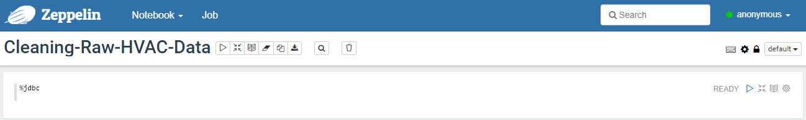

### Create Database HVAC Sensor Data

Copy and paste the following Hive code into Zeppelin:

Create database **hvac_sensors**. Copy and paste the Hive query, press **shift + enter** to execute the code:

~~~sql
%jdbc(hive)
CREATE DATABASE IF NOT EXISTS hvac_sensors;
~~~

Verify the **hvac_sensors** database was created successfully:

~~~sql
%jdbc(hive)
SHOW DATABASES;
~~~

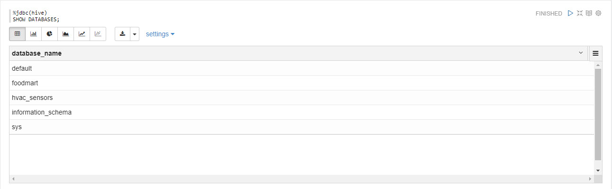

### Upload HVAC Building CSV Data into Hive Table

The process of uploading the building.csv data into Hive requires that we create an external table to verify that Hive has access to the data, but doesn't own the original CSV data to keep it safe from being deleted in case the external table were to be deleted. Next we create an internal table called building, which is in ORC format and we move the data from the external table to the internal table, so data is owned by Hive, but the original CSV data is still safe.

### Create External Hive Table

First we will create an external table referencing the HVAC building CSV data.

~~~sql
%jdbc(hive)
CREATE EXTERNAL TABLE IF NOT EXISTS hvac_sensors.building_csv (
    `BuildingID` INT,
    `BuildingMgr` STRING,
    `BuildingAge` INT,
    `HVACproduct` STRING,
    `Country` STRING
)
ROW FORMAT DELIMITED
FIELDS TERMINATED BY ','
STORED AS TEXTFILE
LOCATION '/sandbox/sensor/hvac_building'
TBLPROPERTIES("skip.header.line.count"="1");
~~~

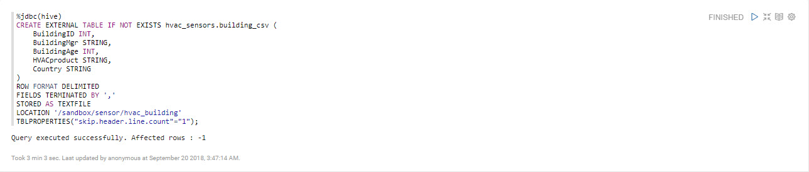

We created an external table **building_csv** into database **hvac_sensors**, we used backticks characters for each attribute to avoid running into reserved keyword issues with Hive, told Hive to store the data in the table as a textfile, and told Hive the original building.csv data is located in directory `/sandbox/sensor/hvac_building`. We first created an external table to keep the original data safe from being deleted if the table were to get deleted.

Next we will verify the import was successful by printing a sample of the first 5 rows:

~~~sql
%jdbc(hive)
SELECT * FROM hvac_sensors.building_csv LIMIT 5;
~~~

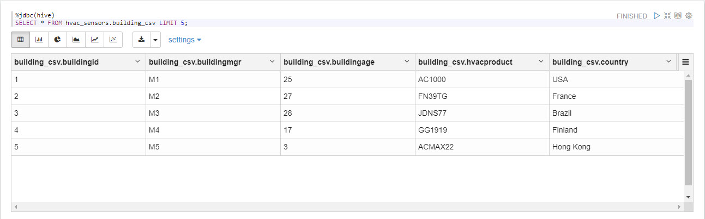

### Create Internal Hive Table to Copy Over External Table Data

Now we will create an internal hive table. We also have more file format options as storage for the data in the table, we will use **Apache ORC format** since it provides great compression and excellent performance.

~~~sql
%jdbc(hive)
CREATE TABLE IF NOT EXISTS hvac_sensors.building (
  `BuildingID` INT,
  `BuildingMgr` STRING,
  `BuildingAge` INT,
  `HVACproduct` STRING,
  `Country` STRING
)
COMMENT 'Building holds HVAC product'
STORED AS ORC;
~~~

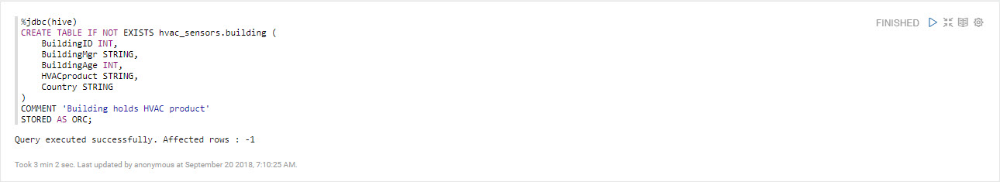

With the internal table created, we can copy the external table data into this internal hive table.

~~~sql
%jdbc(hive)
INSERT OVERWRITE TABLE hvac_sensors.building SELECT * FROM hvac_sensors.building_csv;
~~~

For verification that the data was copied successfully, like we did earlier, we can use **select** query to show us the 5 first rows of the data.

~~~sql
%jdbc(hive)
SELECT * FROM hvac_sensors.building LIMIT 5;
~~~

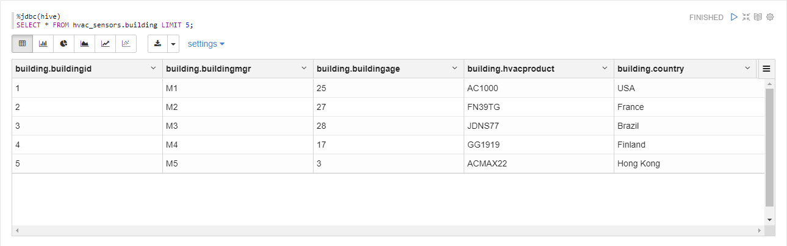

### Upload HVAC Machine CSV Data into Hive Table

The process of uploading the HVAC.csv data into Hive is similar to the process we went through earlier with HVAC building.csv. We will perform the same process for HVAC.csv.

### Create External Hive Table

We will create an external Hive table referencing the HVAC machine csv data.

~~~sql
%jdbc(hive)
CREATE EXTERNAL TABLE IF NOT EXISTS hvac_sensors.hvac_machine_csv (
  `Date` STRING,
  `Time` STRING,
  `TargetTemp` INT,
  `ActualTemp` INT,
  `System` INT,
  `SystemAge` INT,
  `BuildingID` INT
)
ROW FORMAT DELIMITED
FIELDS TERMINATED BY ','
STORED AS TEXTFILE
LOCATION '/sandbox/sensor/hvac_machine'
TBLPROPERTIES("skip.header.line.count"="1");
~~~

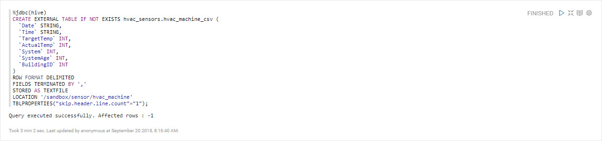

Let's verify the import was successfully by printing a sample of the first 5 rows:

~~~sql
%jdbc(hive)
SELECT * FROM hvac_sensors.hvac_machine_csv LIMIT 5;
~~~

### Create Internal Hive Table to Copy Over External Table Data

Now we will create an internal hive table with table file format stored as **Apache ORC format**.

~~~sql
%jdbc(hive)
CREATE TABLE IF NOT EXISTS hvac_sensors.hvac_machine (
  `Date` STRING,
  `Time` STRING,
  `TargetTemp` INT,
  `ActualTemp` INT,
  `System` INT,
  `SystemAge` INT,
  `BuildingID` INT
)
COMMENT 'hvac_machine holds data on attributes of the machine'
STORED AS ORC;
~~~

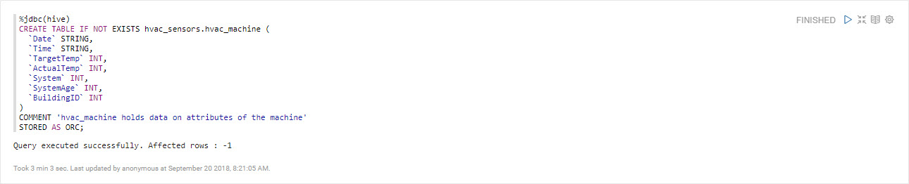

With the internal table created, we can copy the external table data into this internal hive table.

~~~sql
%jdbc(hive)
INSERT OVERWRITE TABLE hvac_sensors.hvac_machine SELECT * FROM hvac_sensors.hvac_machine_csv;
~~~

Now let's verify that the data was copied from the external table to the internal table successfully using **select**.

~~~sql
%jdbc(hive)
SELECT * FROM hvac_sensors.hvac_machine LIMIT 5;
~~~

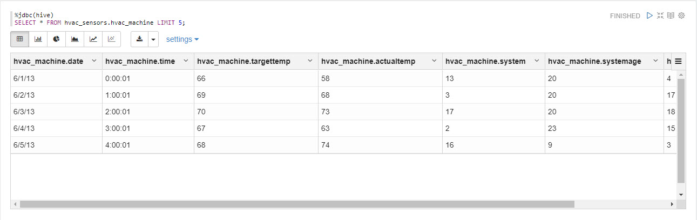

## Refine the Raw Sensor Data

We will write Hive scripts to clean the raw sensor data in effort to acquire these key insights:

- Reduce heating and cooling expenses
- Keep indoor temperatures in a comfortable range between 65-70 degrees
- Identify which HVAC products are reliable

~~~sql
%jdbc(hive)
CREATE TABLE hvac_sensors.hvac_temperatures AS
SELECT *, targettemp - actualtemp AS temp_diff,
IF((targettemp - actualtemp) > 5, 'COLD',
IF((targettemp - actualtemp) < -5, 'HOT', 'NORMAL'))
AS temprange,
IF((targettemp - actualtemp) > 5, '1',
IF((targettemp - actualtemp) < -5, '1', 0))
AS extremetemp FROM hvac_sensors.hvac_machine;
~~~

> Note: the above query may take 10 to 15 minutes to complete

What's this query does?

- Creates a new table **hvac_temperatures** and copies data from the **hvac** table
- On the Query Results page, use the slider to scroll to the right. You will notice that two new attributes appear in the **hvac_temperatures** table

What are the two new attributes?

- **temprange** and **extremetemp**

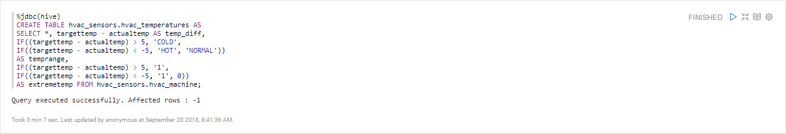

Let's load 10 rows from the **hvac_temperatures** table:

~~~sql
%jdbc(hive)
SELECT * FROM hvac_sensors.hvac_temperatures LIMIT 10;
~~~

What does the data in the **temprange** column indicate about the actual temperature?

- **NORMAL** – within 5 degrees of the target temperature.
- **COLD** – more than five degrees colder than the target temperature.
- **HOT** – more than 5 degrees warmer than the target temperature.

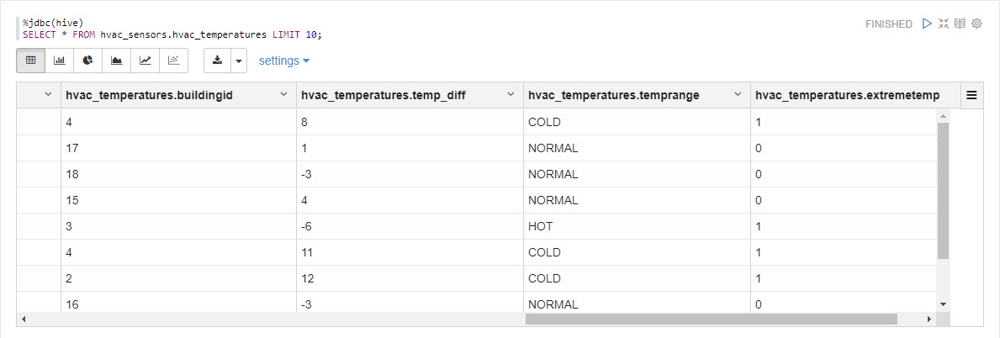

Now we will create a table that combines hvac_temperatures and buildings table.

~~~sql
%jdbc(hive)
CREATE TABLE IF NOT EXISTS hvac_sensors.hvac_building
AS SELECT h.*, b.country, b.hvacproduct, b.buildingage, b.buildingmgr
FROM hvac_sensors.building b JOIN hvac_sensors.hvac_temperatures h ON b.buildingid = h.buildingid;
~~~

Which tables is **hvac_sensors.hvac_building** data coming from?

- **hvac_temperature** and **buildings**

After the query successfully creates the **hvac_sensors.hvac_building**, you will receive the following message: **Query executed successfully. Affected rows : -1.**.

Let's load 10 rows from the data from the new `hvac_sensors.hvac_building`

~~~sql
%jdbc(hive)
SELECT * FROM hvac_sensors.hvac_building LIMIT 10;
~~~

## Summary

You've successfully uploaded the HVAC CSV sensor data to Hive and refined the data into a useful format. You learned to create Hive tables that run on ORC files for fast and efficient data processing. You learned to write Hive scripts to enrich our data to reveal to us when temperature is at a cold, normal or hot state. Additionally, you used the data to bring insight into which particular buildings are associated with these temperature range levels: **NORMAL, HOT OR COLD**. Our next step is to use Zeppelin's other data visualization tools to story tell our the results from the data analysis.

## Further Reading

- [Importing Data from CSV Files into Hive Tables](http://www.informit.com/articles/article.aspx?p=2756471&seqNum=4)
- [How can I upload ORC files to Hive?](https://community.hortonworks.com/questions/47594/how-can-i-upload-ocr-files-to-hive.html)
- [Optimizing Hive queries for ORC formatted tables](https://community.hortonworks.com/articles/68631/optimizing-hive-queries-for-orc-formatted-tables.html)
