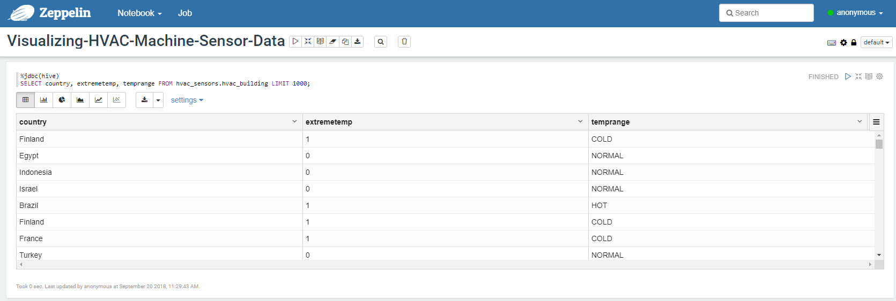
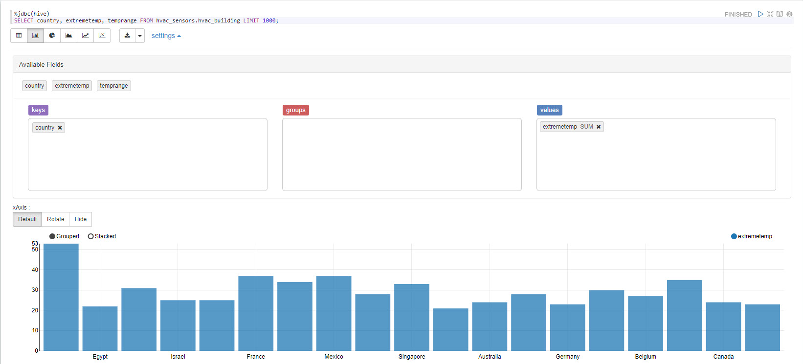
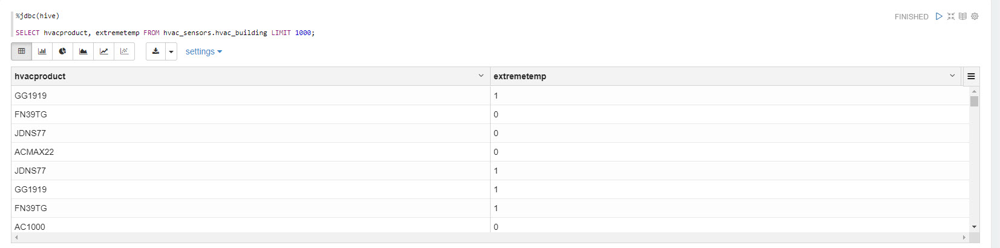
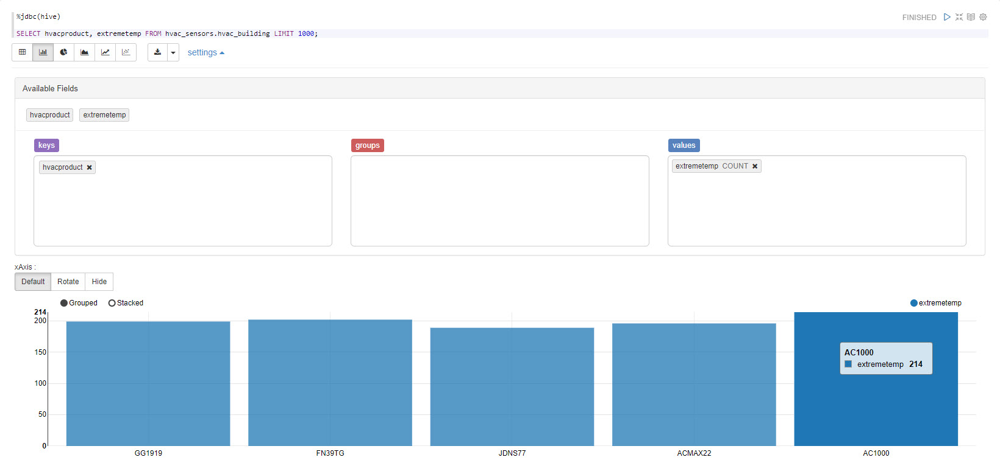

# Visualizing Sensor Data Related To HVAC Machine Systems

## Introduction

Your next objective is to act as a Data Analyst and use Apache Zeppelin built-in visualization tools to provide insights on your data, such as illustrating which countries have the most extreme temperature and the amount of **NORMAL** events there are compared to **HOT** and **COLD**. You will also illustrate which HVAC units result in the most `extremetemp` readings.

## Prerequisites

- Enabled CDA for your appropriate system
- Set up the Development Environment
- Acquired HVAC Sensor Data
- Cleaned Raw HVAC Data

## Outline

- [Visualize HVAC Building Temperature Characteristics Per Country](#visualize-hvac-building-temperature-characteristics-per-country)
- [Visualize Extreme Temperature in Buildings Having HVAC Products](#visualize-extreme-temperature-in-buildings-having-hvac-products)

## Visualize HVAC Building Temperature Characteristics Per Country

Click on **Zeppelin Notebook** service in Ambari stack, in the box on the rightside called **Quick Links**, click on **[Zeppelin UI](http://sandbox-hdp.hortonworks.com:9995/)**.

Click **Create new note**.

Insert **Note Name** as `Visualizing-HVAC-Machine-Sensor-Data`, select `jdbc` for default interpreter, then click **Create**.

We will use the JDBC Hive interpreter to run Hive queries and visualize the results.

First we need to select the columns from `hvac_sensors.hvac_building` table that will illustrate hvac_building **country** location, whether **temperature** in a hvac_building is extreme and what the **temprange** level is for an hvac_building. Copy and paste the Hive query:

~~~sql
%jdbc(hive)
SELECT country, extremetemp, temprange FROM hvac_sensors.hvac_building LIMIT 1000;
~~~

Select the **bar chart** button located just under the query to change the table visualization to bar chart.

Let's further configure this chart, click **settings** to open up more available fields.

-   Arrange the fields according to the following image.
-   Drag the field `temprange` into the **groups** box.
-   Click **SUM** on `extremetemp` and change it to **COUNT**.
-   Make sure that `country` is the only field under **Keys**.

From the chart above we can see the countries that HVAC Buildings come from that have the most extreme temperature indicated by a count for ***extremetemp*** associated with ***temprange level*** for **NORMAL** events there are compared to **HOT** and **COLD**.

## Visualize Extreme Temperature in Buildings Having HVAC Products

Is it possible to figure out which buildings might need HVAC upgrades, and which do not? Let’s determine that answer in the steps ahead...

Let's create one more note to visualize which types of HVAC systems result in the least amount of `extremetemp` readings.

Copy and paste the Hive query into the next Zeppelin note:

~~~sql
%jdbc(hive)

select hvacproduct, extremetemp from hvac_sensors.hvac_building;
~~~

Arrange the fields according to the following image so we can recreate the chart below.

Now choose bar chart, then arrange the fields for `hvacproduct` and `extremetemp`.

-   Make sure that `hvacproduct` is in the **Keys** box.
-   Make sure that `extremetemp` is in the **Values** box and that it is set to **COUNT**.

Now we can see which HVAC units result in the most `extremetemp` readings. Thus we can make a more informed decision when purchasing new HVAC systems.

## Summary

We’ve successfully gained more insights on our data by visualizing certain key attributes using Apache Zeppelin. We learned to visualize a graph that shows the countries that have the most extreme temperature and the amount of **NORMAL** events there are compared to **HOT** and **COLD**. We learned to see which HVAC units result in the most `extremetemp` readings.

## Further Reading

-   [How to create Map Visualization in Apache Zeppelin](https://community.hortonworks.com/questions/78430/how-to-create-map-visualization-in-apache-zeppelin.html)
-   [Using Angular within Apache Zeppelin to create custom visualizations](https://community.hortonworks.com/articles/75834/using-angular-within-apache-zeppelin-to-create-cus.html)
