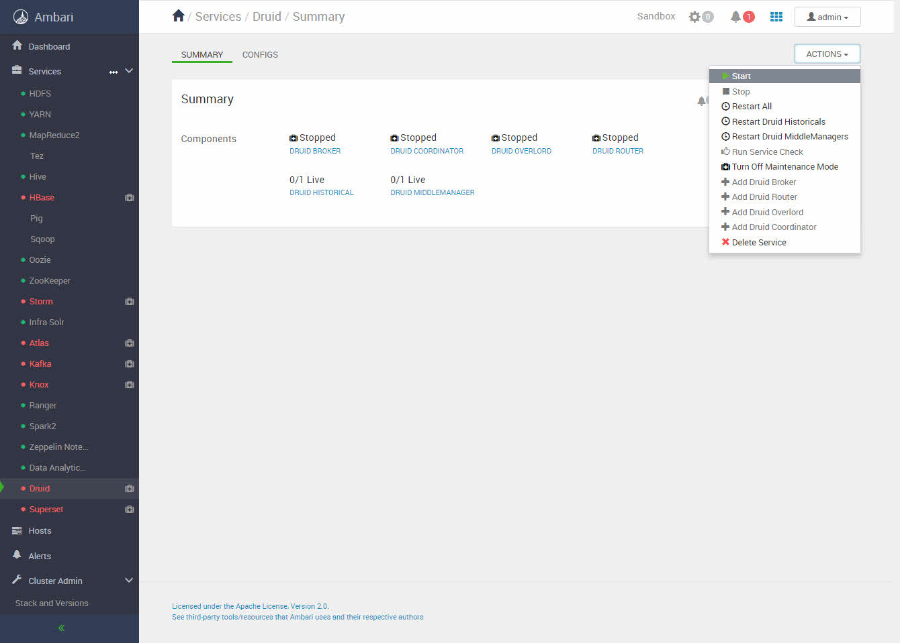
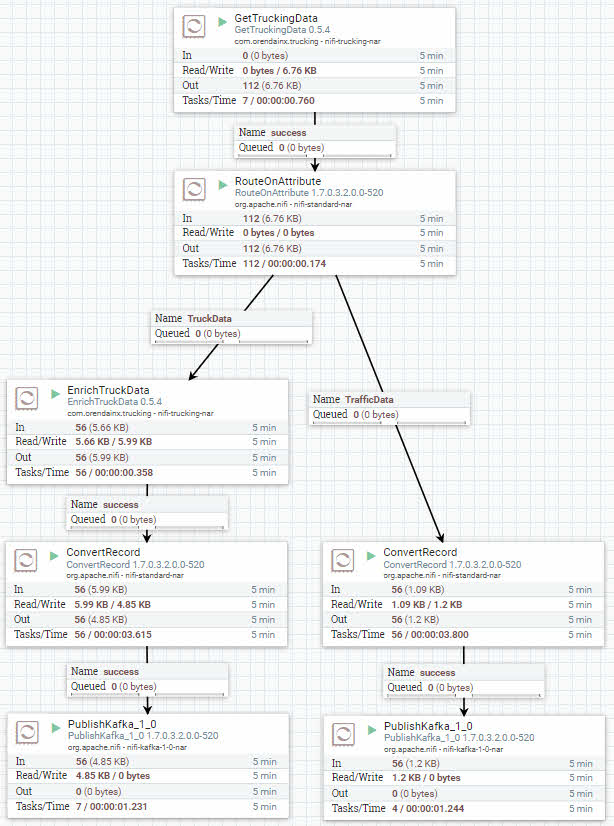
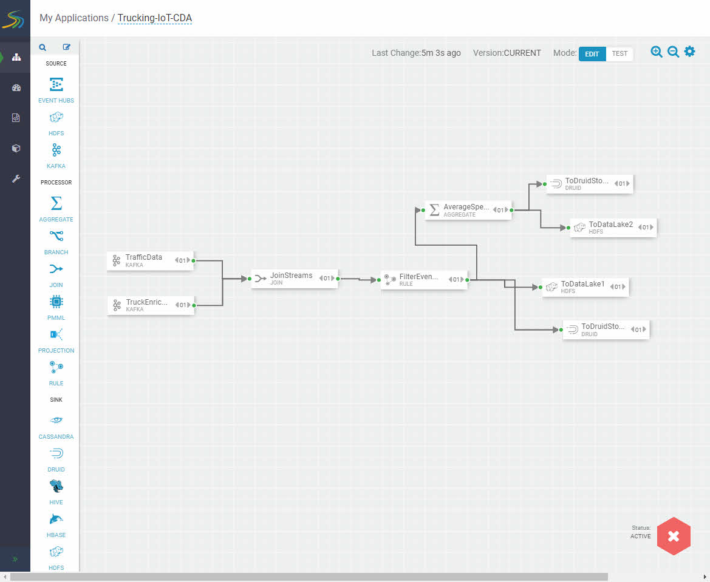

# Setting up the Development Environment

## Introduction

In this tutorial, you will verify your sandbox IP is mapped to your desired hostname, your admin password is setup and the services that need to be on are activated.

## Prerequisites

- **Map HDP Sandbox IP to hostname**, if you need help, reference **Learning the Ropes of the HDP Sandbox** tutorial section [ENVIRONMENT SETUP](https://hortonworks.com/tutorial/learning-the-ropes-of-the-hortonworks-sandbox/#environment-setup), go to Map Sandbox IP To Your Desired Hostname In The Hosts File in that tutorial

- **Map HDF Sandbox IP to hostname**, if you need help, reference **Learning the Ropes of the HDF Sandbox** tutorial section [ENVIRONMENT SETUP](https://hortonworks.com/tutorial/getting-started-with-hdf-sandbox/#environment-setup), go to Map Sandbox IP To Your Desired Hostname In The Hosts File in that tutorial

- **Set the Ambari admin password for HDP**, if you need help, reference **Learning the Ropes of the HDP Sandbox** tutorial section [Admin Password Reset](https://hortonworks.com/tutorial/learning-the-ropes-of-the-hdf-sandbox/#admin-password-reset)

- **Set the Ambari admin password for HDF**, if you need help, reference **Learning the Ropes of the HDF Sandbox** tutorial section [Learning the Ropes of HDF Sandbox](https://hortonworks.com/tutorial/getting-started-with-hdf-sandbox/#admin-password-reset)

- **Need to have data present in Druid**, refer to **[Real-Time Event Processing In NiFi, SAM, Schema Registry and SuperSet](https://hortonworks.com/tutorial/real-time-event-processing-in-nifi-sam-schema-registry-and-superset/)** tutorial to setup the SAM data pipeline to store data into Druid. All you need to do is step 1 through 3.

## Outline

- [Started up all required services for HDF and HDP](#started-up-all-required-services-for-hdf-and-hdp)
- [Setup Druid for Superset](#setup-druid-for-superset)
- [Summary](#summary)
- [Further Reading](#further-reading)

### Started up all required services for HDF and HDP

If unsure, login to Ambari **admin** Dashboard

- for HDF at http://sandbox-hdf.hortonworks.com:8080 and verify **Zookeeper**, **Storm**, **Kafka**,  **NiFi**, **Schema Registry**, **Streaming Analytics Manager** starts up, else start them with Maintenance Mode turned off.
- for HDP at http://sandbox-hdp.hortonworks.com:8080 and verify **HDFS**, **YARN**, **Druid** and **Superset** starts up, else start them with Maintenance Mode turned off.

For example, to start Druid, you would do the following.

After starting Druid and Superset, your Background Operations would look similar:

### Setup Druid for Superset

We include reference images of what needs to be started in the data
pipeline to get the data into Druid. You should have already done this step,
which was pointed out in the **prerequisites**.

1\. In the NiFi canvas http://sandbox-hdf.hortonworks.com:9090/nifi, start the
NiFi DataFlow by pressing the green start button in the operate panel.

2\. In the SAM canvas http://sandbox-hdf.hortonworks.com:7777/, start the SAM
topology by pressing the green start button at the bottom right of the canvas.

3\. In the Superset UI http://sandbox-hdp.hortonworks.com:9089, login
with credentials **admin/admin**, wait about **5 – 10 minutes** for Kafka data
to be consumed, then periodically, select the **Sources** dropdown and click on
**Refresh Druid Metadata**. Eventually, the two Druid data sources will appear.

## Summary

Congratulations! Data is now in Druid. We can see the datasources in Superset.
We are ready to start creating visualization representations of the data.

## Further Reading

- [An introduction to Druid](https://www.youtube.com/watch?v=JEhmHsN8jZI)
- [How Superset and Druid Power Real-Time Analytics at Airbnb | DataEngConf SF '17](https://www.youtube.com/watch?v=W_Sp4jo1ACg)
