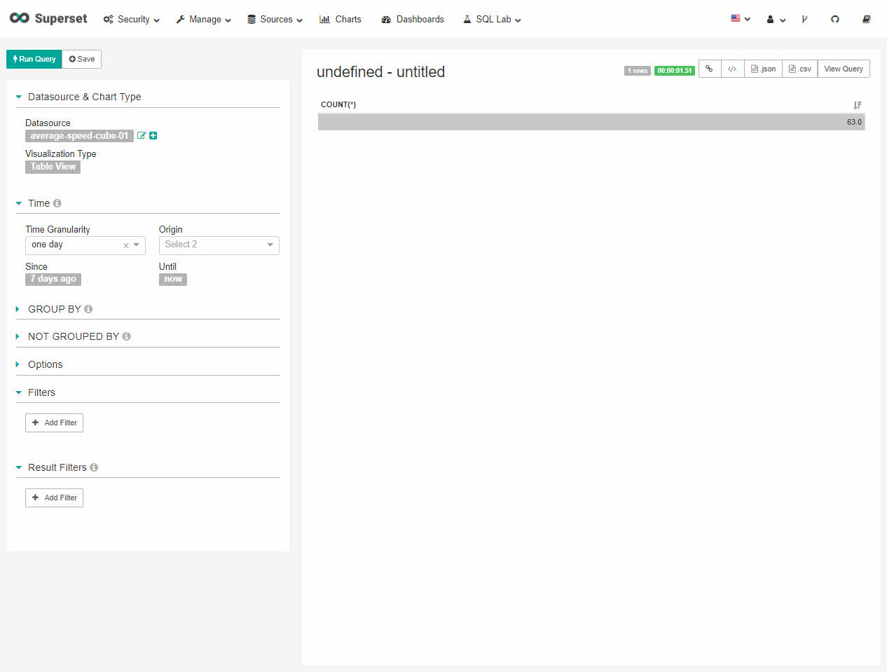
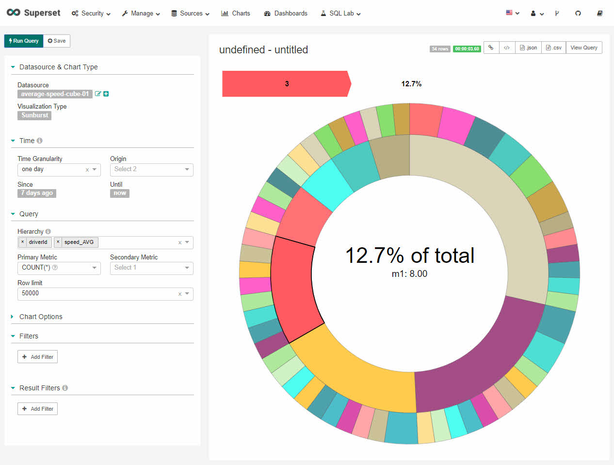
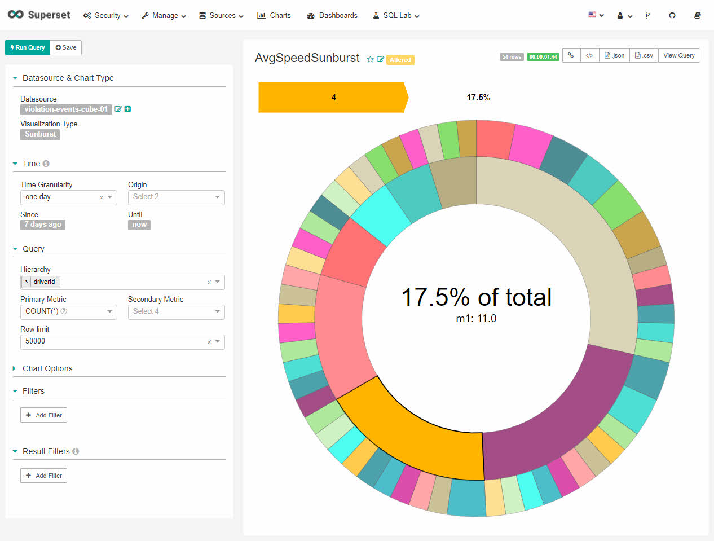
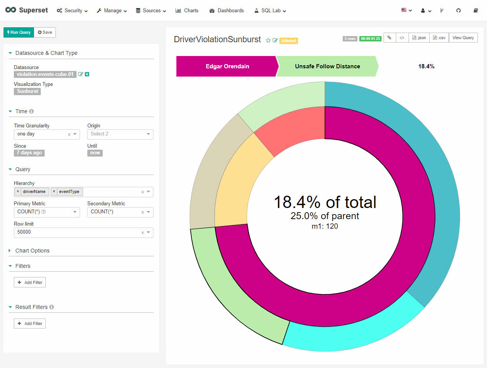

# Visualizing Trucking Data

## Introduction

We know the role data visualization plays in data science applications. Let's use Superset to create some visual representations of the data from the Trucking IoT dataset.

## Prerequisites

- Setting up the Development Environment

## Outline

- [Create Visualization Slices](#create-visualization-slices)
- [Summary](#summary)
- [Further Reading](#further-reading)

## Create Visualization Slices

Superset is being used to visualize the Druid data sources. From the characteristics of an effective visual display from the concepts section, we will apply them now to effectively visualize the **average-speed-cube-01** and **violation-events-cube-01** datasets.

### Average Speed Cube Table to Sunburst Visualization

Click the **average-speed-cube-01** data source. The visualization slice window will appear:

From the above visualization, we get data about the total number of rows for our data source.
Let's modify the query configuration to a sunburst visualization that clearly illustrates the
data:

**Datasource & Chart Type**:

- specifies the type of visualization that will be used for the chosen data source
- Datasource: average-speed-cube-01
- Visualization Type: Table View is the default option, but let's change it to **Sunburst**

**Query**:

- Hierarchy: add **driverId**, **speed_AVG**
- Primary Metric: `COUNT(*)`
- Secondary Metric (optional): none selected (default)
- Row limit: 50000

From the above visualization, when we hover over the sections of the chart, we will see the driverId and their average speed.
For example, the driverId is 3 and their average speed is 8. The percentage of average speed they contribute to the overall average speed is 12.7%.

### Save the Slice

Click the save button. Name the slice **AvgSpeedSunburst**.

Add the slice to the new dashboard **Trucking-IoT-Demo**.

Then click **Save**.

### Switch Datasource to Violation Events Cube

Click Datasource under **Datasource & Chart Type**, a window will appear. Select
**violation-events-cube-01**.

The following visualization now represents the violation events cube data source
and not the average speed cube.

Something to notice is that violation events Query doesn't have **speed_AVG**
field because it isn't in this data source.

Let's improve our visualization, so our client knows this Sunburst represents
a different data source.

Click on the title **AvgSpeedSunburst**, lets change it to
**DriverViolationSunburst**.

Below **Query**:

- For **Hierarchy**, remove **driverId**, add **driverName** and **eventType**
- For **Secondary Metric**, add `COUNT(*)`

Click **Run Query**.

The first layer of the Sunburst shows us **DriverName** and the percentage
they contribute to **violation events**.

The second layer shows the percentage of the violation event type that the driver
is likely to contribute on the road.

### Save the Slice

Click the Save button to save the violation events Sunburst slice. **Save as** name **DriverViolationSunburst**.
**Add to existing dashboard**:

## Summary

Congratulations! You just learned to create visualization slices using Superset. You started with a count for the number of rows in the average speed data source, but then changed the visualization to another representation, the Sunburst to show the client another way to look at the data that would help them interpret and understand it better. You learned to save the visualization slice for that data source. Since your other task was to create a visual slice for the violation events data source, you learned how to switch the data source while still in the visual slice. Then you adjusted the query configurations to allow the client to make sense out of the violation events data source's Sunburst visualization. You also learned to add slices to a common dashboard. Feel free to experiment with Superset's other visualization capabilities, such as trying to generate the charts from the concepts section.

## Further Reading

- [Apache Superset](https://superset.incubator.apache.org/)
