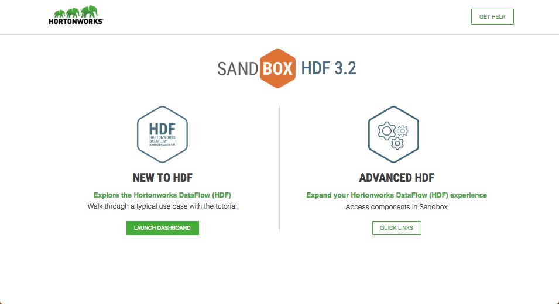
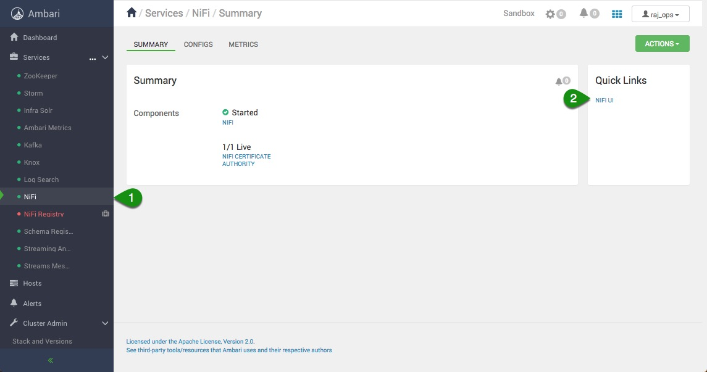
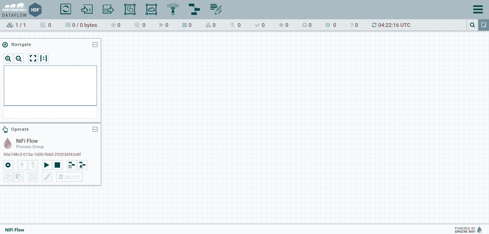
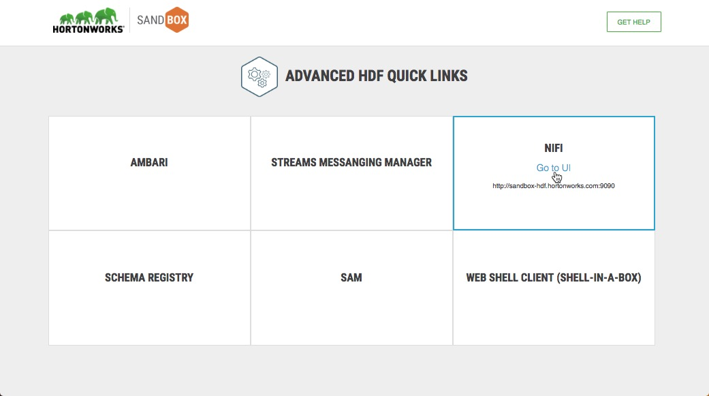

# Launch NiFi HTML UI

## Introduction

With the Hortonworks DataFlow (HDF) Sandbox, Apache NiFi comes pre-installed in the Ambari Stack and pre-configured out of the box to utilize many of its features. In the tutorial, it shows you how to access the NiFi HTML UI in one of two ways: use the HDF Splash Screen Page "Advanced Quick Links" or Ambari UI "Quick Links".

## Prerequisites

- Completed the prior tutorials within this tutorial series
- Downloaded and deployed the [Hortonworks DataFlow (HDF)](https://www.cloudera.com/downloads/hortonworks-sandbox/hdf.html?utm_source=mktg-tutorial) Sandbox
- Added HDF Sandbox Hostname to Your Hosts File, refer to [Learning the Ropes of the HDF sandbox](https://hortonworks.com/tutorial/getting-started-with-hdf-sandbox/)

## Outline

- [Step 1: Open HDF Splash Page](#step-1-open-hdf-splash-page)
- [Approach 1: Access NiFi HTML UI via Ambari Dashboard](#approach-1-access-nifi-html-ui-via-ambari-dashboard)
- [Approach 2: Launch NiFi HTML UI from HDF Splash Quick Links](#approach-2-launch-nifi-html-ui-from-hdf-splash-quick-links)
- [Summary](#summary)

> Note: For VMware users, you will need to add the auto generated IP address on startup of your virtual machine followed by HDF Sandbox hostname to your hosts file, example `192.168.17.129 sandbox-hdf.hortonworks.com`. On MAC, open `/private/etc/hosts`; LINUX, open `/etc/hosts`; WINDOWS 10, open `C:\Windows\System32\drivers\etc\hosts` as an administrator.

### Step 1: Open HDF Splash Page

1\. Open `sandbox-hdf.hortonworks.com:1080` with your favorite web browser:

Choose either approach to access NiFi UI.

### Approach 1: Access NiFi HTML UI via Ambari Dashboard

1\. Select the **LAUNCH DASHBOARD** button

2\. Type `raj_ops/raj_ops` to login to Ambari.

3\. Select the **NiFi Service**, and click on **NiFi UI**:

4\. The NiFi UI comes with a default Trucking-IoT NiFiFlow as seen on the image below. To delete the default NiFiFlow and work with a new canvas select the NiFiFlow (cltr+A) then right click and select delete.

Sample of a clean NiFi Canvas:

### Approach 2: Launch NiFi HTML UI from HDF Splash Quick Links

1\. Select the **QUICK LINKS** button

2\. Hover over the **NiFi** box and select **Go to UI**

3\. The NiFi UI comes with a default Trucking-IoT NiFiFlow as seen on the image below. To delete the default NiFiFlow and work with a new canvas select the NiFiFlow (cltr+A for Mac) then right click and select delete.

Sample of a clean NiFi Canvas:

## Summary

Congratulations! You explored two approaches for launching NiFi UI. You opened the HDF Splash Page: Approach 1 was launching the Ambari Dashboard from the "New To HDF path" while Approach 2 was using the NiFi Quick Link from the "Advanced HDF path". Now you are ready to explore the next tutorial to began building our simple dataflow.
