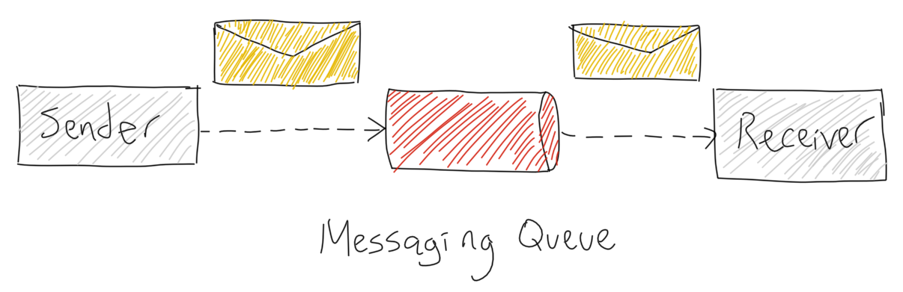
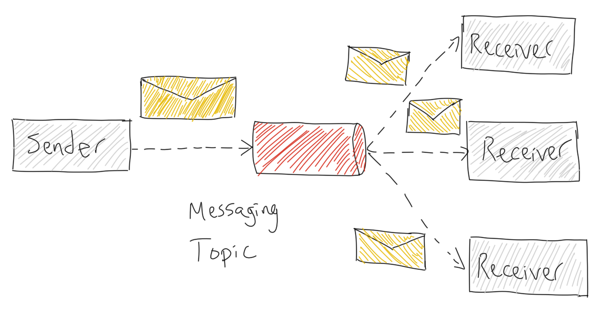
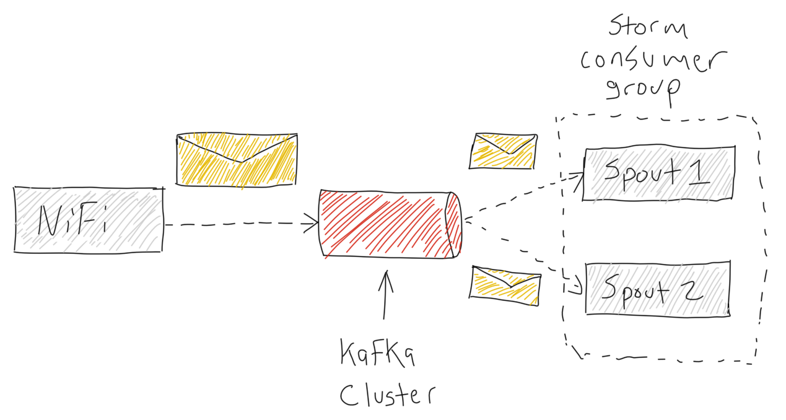

# Kafka Messaging System Fundamentals

## Objective

To understand the concepts behind **messaging systems** in **distributed systems**, and how to use them to pass on information between the **producer** (publisher, sender) to the **consumer** (subscriber, receiver). In this example, you will learn about **Kafka**.

## Outline

- [What is a Messaging System?](#what-is-a-messaging-system?)
- [Point to Point System](#point-to-point-system)
- [Publish-Subscribe System](#publish-subscribe-system)
- [What is Kafka](#what-is-kafka)
- [Architectural Overview](#architectural-overview)
- [Benefits of Kafka](#benefits-of-kafka)
- [Next: Kafka in Action](#next-kafka-in-action)

## What is a Messaging System?

Messaging systems transfer data between client applications. One application produces the data, such as reading from sensors embedded on vehicles and the other application receives the data, processes it to be ready to be visualized to show the characteristics about the drivers driving behavior who drive those vehicles. As you can see each application developer can focus on writing code to analyze the data and not worry about how to share the data. There are two messaging systems used in this scenario, **point to point** and **publish subscribe**. The system most often used is _publish subscribe_, but we will look at both.

## Point to Point System

**Point to Point** are messages transmitted into a queue

Key Characteristics of generic figure above:

- producer sends messages into the queue, each message is read by only one consumer
- once the message is consumed, it vanishes
- multiple consumers can read messages from the queue

## Publish-Subscribe System

**Publish-Subscribe** are messages transmitted into a topic

- message producers are known as publishers
- message consumers are known as subscribers

How does the **Pub-Sub** messaging system work?

- publisher sends messages into 1 or more topics
- subscribers can arrange to receive 1 or more topics, then consume all the messages

## What is Kafka

Apache Kafka is an open source publish-subscribe based messaging system responsible for transferring data from one application to another.

## Architectural Overview

At a high level, our data pipeline looks as follows:

**NiFi Producer**

Produces a continuous real-time data feed from truck sensors and traffic information that are separately published into two Kafka topics using a NiFi Processor implemented as a Kafka Producer.

To learn more about the Kafka Producer API Sample Code, visit [Developing Kafka Producers](https://docs.hortonworks.com/HDPDocuments/HDP2/HDP-2.6.0/bk_kafka-component-guide/content/ch_kafka-development.html)

**Kafka Cluster**

Has 1 or more topics for supporting 1 or multiple categories of messages that are managed by Kafka brokers, which create replicas of each topic (category queue) for durability.

**Storm Consumer**

Reads messages from Kafka Cluster and emits them into the Apache Storm Topology to be processed.

To learn more about the Kafka Consumer API Sample Code, visit [Developing Kafka Consumers](https://docs.hortonworks.com/HDPDocuments/HDP2/HDP-2.6.0/bk_kafka-component-guide/content/ch_kafka-development.html)

## Benefits of Kafka

**Reliability**

- Distributed, partitioned, replicated and fault tolerant

**Scalability**

- Messaging system scales easily without down time

**Durability**

- "Distributed commit log" which allows messages to continue to exist on disk even after the processes that created that data have ended

**Performance**

- High throughput for publishing and subscribing messages
- Maintains stable performance for many terabytes stored

## Next: Kafka in Action

Now that we've become familiar with how Kafka will be used in our use case, let's move onto seeing Kafka in action when running the demo application.
