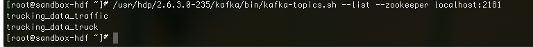

## Explore Kafka in the Demo

## Introduction

While the demo application runs, you will gain an understanding of how Kafka receives data from a producer at its particular topics.

## Outline

- [Environment Pre-setup](#environment-pre-setup)
- [Persist Data Into Kafka Topics](#persist-data-into-kafka-topics)
- [List Kafka Topics](#list-kafka-topics)
- [View Data in Kafka Topics](#view-data-in-kafka-topics)
- [Next: Learn Basic Operations of Kafka](#next-learn-basic-operations-of-kafka)

## Environment Setup

If you have the latest HDF Sandbox installed, then the demo comes preinstalled. If not or you do not already have it setup, then refer to [Setup Demo on existing HDF/HDP](https://github.com/orendain/trucking-iot/tree/hadoop-summit-2017#setup-on-existing-hdf-hdp).

Open a terminal on your local machine and access the sandbox through the shell-in-a-box method. Please visit [Learning the Ropes of the Hortonworks Sandbox](https://hortonworks.com/tutorial/learning-the-ropes-of-the-hortonworks-sandbox/#environment-setup) to review this method.

Turn Kafka component on if it's not already on through Ambari. 

## Persist Data Into Kafka Topics

A NiFi simulator generates data of two types: TruckData and TrafficData as a CSV string. There is some preprocessing that happens on the data to prepare it to be split and sent by NiFi's Kafka producers to two separate Kafka Topics: **trucking_data_truck** and **trucking_data_traffic**.

## List Kafka Topics

From the terminal, we can see the two Kafka Topics that have been created:

~~~
/usr/hdp/2.6.3.0-235/kafka/bin/kafka-topics.sh --list --zookeeper localhost:2181
~~~

## View Data in Kafka Topics

As messages are persisted into the Kafka Topics from the producer, you can see them appear in each topic by writing the following commands:

View Data for Kafka Topic: **trucking_data_truck**:

~~~
/usr/hdp/2.6.3.0-235/kafka/bin/kafka-console-consumer.sh --zookeeper localhost:2181 --topic trucking_data_truck --from-beginning
~~~

View Data for Kafka Topic: **trucking_data_traffic**:

~~~
/usr/hdp/2.6.3.0-235/kafka/bin/kafka-console-consumer.sh --zookeeper localhost:2181 --topic trucking_data_traffic --from-beginning
~~~

As you can see Kafka acts as a robust queue that receives data and allows for it to be transmitted to other systems.

## Next: [Learn Basic Operations of Kafka](https://hortonworks.com/tutorial/kafka-in-trucking-iot-on-hdf/section/3/)

You have already become familiar with some Kafka operations through the command line, so let's explore basic operations to see how those topics were created, how they can be deleted and how we can use tools to monitor Kafka.
