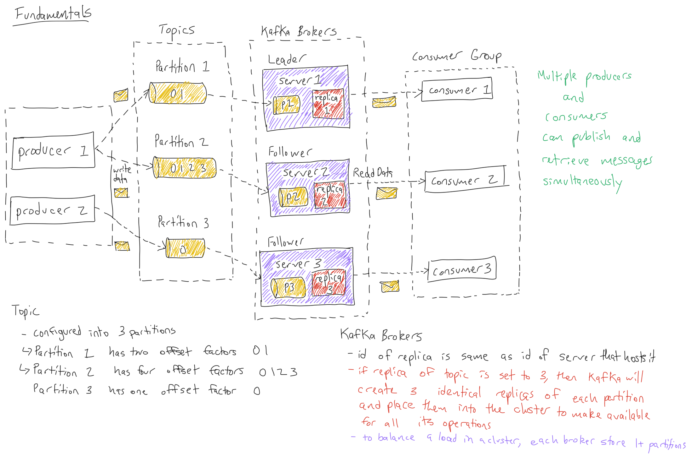

## Learn Basic Operations of Kafka

## Introduction

We now know the role that Kafka plays in this Trucking IoT system. Let's take a step back and see how the Kafka Topics were created.

## Outline

- [Kafka Components](#kafka-components)
- [Creating Two Kafka Topics](#creating-two-kafka-topics)
- [Starting the Producer to Send Messages](#starting-the-producer-to-send-messages)
- [Starting the Consumer to Receive Messages](#starting-the-consumer-to-receive-messages)
- [Summary](#summary)
- [Further Reading](#further-reading)
- [Appendix: Kafka Extra Operations](#appendix-kafka-extra-operations)

## Kafka Components

Now that we have an idea of Kafka's capabilities, let's explore its different components, our building blocks when defining a Kafka process and why they're used.

- **Producer**: A publisher of messages to 1 or more topics. Sends data to brokers.

- **Topics**: A stream of messages belonging to a category, which are split into partitions. A topic must have at least one partition.

- **Partition**: Has messages in an immutable sequence and are implemented as segment files of equal sizes. They can also handle an arbitrary amount of data.

- **Partition Offset**: A unique sequence ID from partition message.

- **Replicas of Partition**: A "Backup" of a partition. They never read or write data and they prevent data loss.

- **Kafka Brokers**: Responsibility is to maintain published data.

- **Lead Broker**: Node responsible for all Read or Write performed on a given partition.

- **Follower Broker**: Node that follows the leaders instructions. It will take the place of the leader if the leader fails. Also pulls in messages like a consumer and updates its data store.

- **Kafka Cluster**: Kafka is considered a Kafka Cluster when more than one broker exist. The main reason for having multiple brokers is to manage persistance and replication of message data and expand without downtown.

- **Consumer Group**: Consumers that come from the same group ID.

- **Consumers**: Read data from brokers by pulling in the data. They subscribe to 1 ore more topics.

## Creating Two Kafka Topics

Initially when building this demo, we verified Zookeeper was running because Kafka uses Zookeeper. If Zookeeper was off, we ran the command or turned on it from Ambari:

~~~bash
/usr/hdf/current/kafka-broker/bin/zookeeper-server-start.sh config/zookeeper.properties
~~~

We then started the Kafka Broker via Ambari or command:

~~~bash
/usr/hdf/current/kafka-broker/bin/kafka-server-start.sh config/server.properties
~~~

If you wanted to see the daemons that were running, type `jps`

~~~bash
Example of Output:

2306 drpc
932 AmbariServer
2469 core
2726 logviewer
3848 NiFiRegistry
5201 StreamlineApplication
3602 NiFi
3026 TlsToolkitMain
18194 Jps
1684 Kafka
3829 RunNiFiRegistry
2649 Supervisor
1530 RegistryApplication
4762 LogSearch
4987 LogFeeder
3581 RunNiFi
4383 jar
1375 QuorumPeerMain
~~~

We created two Kafka Topics: **trucking_data_truck_enriched** and **trucking_data_traffic** using the following commands:

~~~
/usr/hdf/current/kafka-broker/bin/kafka-topics.sh --create --zookeeper sandbox-hdf.hortonworks.com:2181 --replication-factor 1 --partitions 10 --topic trucking_data_truck_enriched
~~~

~~~
/usr/hdf/current/kafka-broker/bin/kafka-topics.sh --create --zookeeper sandbox-hdf.hortonworks.com:2181 --replication-factor 1 --partitions 10 --topic trucking_data_traffic
~~~

Two Kafka Topics were created with ten partitions and a single partition each. When topics are created, the Kafka broker terminal sends a notification and it can be found in the log for the created topic: "/tmp/kafka-logs/"

## Starting the Producer to Send Messages

In our demo, we utilize a dataflow framework known as Apache NiFi to generate our sensor truck data and online traffic data, process it and integrate Kafka's Producer API, so NiFi can transform the content of its flowfiles into messages that can be sent to Kafka.

Start all the processors in the NiFi flow including the Kafka one and data will be persisted into the two Kafka Topics.

Learn more about NiFi Kafka Producer Integration at [Integrating Apache NiFi and Apache Kafka](https://bryanbende.com/development/2016/09/15/apache-nifi-and-apache-kafka)

## Starting the Consumer to Receive Messages

In our demo, we utilize a stream processing framework known as Apache Storm to consume the messages from Kafka. Storm integrates Kafka's Consumer API to pull in messages from the Kafka brokers and then perform complex processing and send the data to destinations to be stored or visualized.

Submit the Storm topology and messages from the Kafka Topics will be pulled into Storm.

Learn more about Storm Kafka Consumer Integration at [Storm Kafka Integration](http://storm.apache.org/releases/2.0.0-SNAPSHOT/storm-kafka.html)

## Summary

Congratulations! You now know about the role Kafka plays in the demo application, how to create Kafka Topics and transfer data between topics using Kafka's Producer API and Kafka's Consumer API. In our demo, we showed you that NiFi wraps Kafka's Producer API into its framework and Storm does the same for Kafka's Consumer API.

## Further Reading

- To Learn more about Apache Kafka, visit the [Kafka Documentation](https://kafka.apache.org/documentation/)
- To learn more about NiFi Kafka Integration, visit [Integrating Apache NiFi and Apache Kafka](https://bryanbende.com/development/2016/09/15/apache-nifi-and-apache-kafka)
- To learn more about Storm Kafka Integration, visit [Storm Kafka Integration](http://storm.apache.org/releases/2.0.0-SNAPSHOT/storm-kafka.html)

## Appendix: Kafka Extra Operations

**Modify Kafka Topic**

If you need to modify a Kafka Topic, then run the following command:

~~~bash
/usr/hdf/current/kafka-broker/bin/kafka-topics.sh --zookeeper localhost:2181 --alter --topic topic-name --partitions X
~~~

Account for your topic-name will be different and the amount of partitions you want to add.

- X represents number of partitions that you want to change the topic to have

If you need to delete a Kafka Topic, run the following command:

~~~bash
/usr/hdf/current/kafka-broker/bin/kafka-topics.sh --zookeeper localhost:2181 --delete --topic topic_name
~~~
