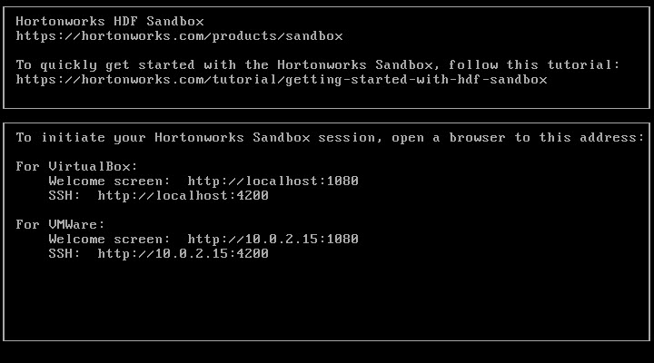
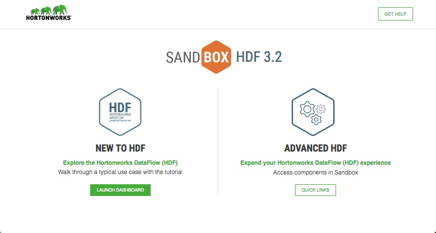
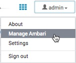
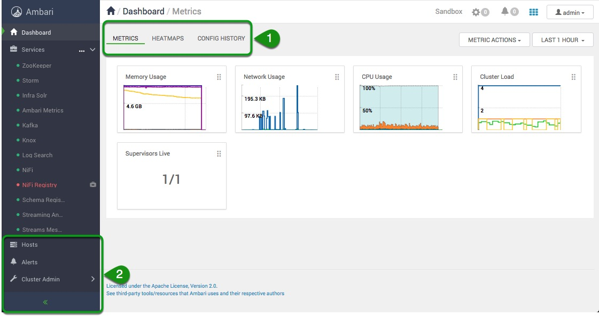
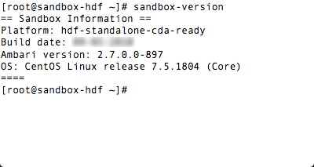
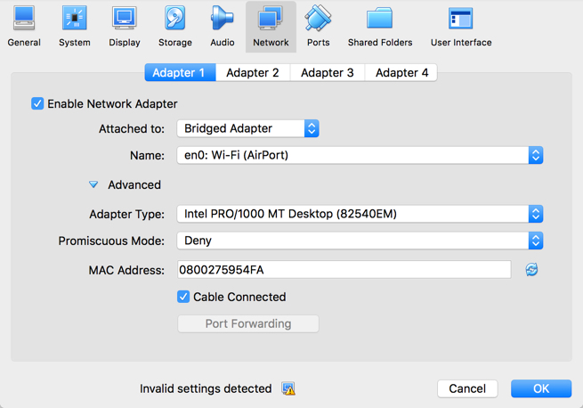
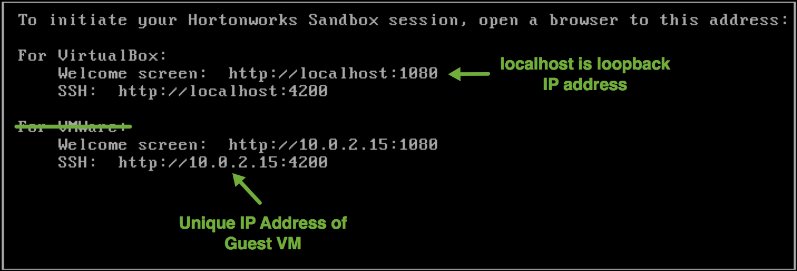

# Learning the Ropes of the HDF Sandbox

## Introduction

Building Internet of Things (IOT) related applications is faster and simpler by using the open source data-in-motion framework known as Hortonworks DataFlow (HDF). Learn how to build IOT applications in a virtual test environment that keeps your home computing environment safe. HDF can be learned through an HDF sandbox. Tutorials have been developed and tested against the sandbox to make getting started with Big Data and IOT a smoother process.

By the end of this tutorial, you will be familiar with the data-in-motion tools from the HDF platform that can be used to build your applications.

## Prerequisites

- Downloaded and deployed the [Hortonworks DataFlow (HDF)](https://www.cloudera.com/downloads/hortonworks-sandbox/hdf.html?utm_source=mktg-tutorial) Sandbox

## Outline

- [Concepts](#concepts)
- [Environment Setup](#environment-setup)
- [Terminal Access](#terminal-access)
- [Welcome Page](#welcome-page)
- [Explore Ambari](#explore-ambari)
- [Further Reading](#further-reading)
- [Appendix A: Reference Sheet](#appendix-a-reference-sheet)
  - [Login Credentials](#login-credentials)
  - [Sandbox Version](#sandbox-version)
  - [Admin Password Reset](#admin-password-reset)
- [Appendix B: Troubleshoot](#appendix-b-troubleshoot)
- [Appendix C: Determine Network Adapter of Your VirtualBox Sandbox](#appendix-c-determine-network-adpater-of-your-virtualbox-sandbox)

## Concepts

### What is a Sandbox?

The Sandbox is a straightforward, pre-configured, learning environment that contains the latest developments from Apache Big Data related tools, specifically these tools were assembled together into Hortonworks DataFlow (HDF). The Sandbox comes packaged in a virtual environment that can run in the cloud or on your personal machine. The sandbox allows you to learn to build streaming applications. Supplemental tutorials tested against the latest sandbox environment are provided at [HDF Tutorial Track](https://hortonworks.com/tutorials/?tab=product-hdf).

### HDF Standalone Sandbox

The HDF Standalone Sandbox Architecture comes with the following Big Data Tools:
Zookeeper, Storm, Kafka, NiFi, NiFi Registry, Schema Registry, Streams Messaging Manager (SMM), and Stream Analytics Manager (SAM).

## Environment setup

This is the administrative section to get started with the Hortonworks Sandbox environment. Generally, this will only be done once.

### Determine Network Adapter of Your Sandbox

Once the Sandbox VirtualBox VM is installed, it attaches to a virtual network. There are 8 different network modes, but the default network your sandbox will attach to is NAT. We will cover relevant networks for our tutorial use cases: NAT and Bridged Adapter.

### Determine IP Address of Your Sandbox

Once the Sandbox VM or container is installed, it settles to the host of your environment, the IP address varies depending on your Virtual Machine (VMware, VirtualBox) or container (Docker). Once the sandbox is running, it will tell you the IP address. An example of typical IP addresses for each supported environment:

**Docker**: IP Address = **127.0.0.1**

**VirtualBox**: IP Address = **127.0.0.1**

**VMWare**: IP Address = **192.168.x.x**



### Map Sandbox IP to Your Desired Hostname in the Hosts File

Mac, Linux and Windows all have a hosts file. This file once configured enables the IP address of the sandbox to be mapped to a hostname that is easier to remember than a number.

**Mac users**:

```bash
echo '{IP-Address} sandbox-hdp.hortonworks.com sandbox-hdf.hortonworks.com' | sudo tee -a /private/etc/hosts
```

**Linux users**:

```bash
echo '{IP-Address} sandbox-hdp.hortonworks.com sandbox-hdf.hortonworks.com' | sudo tee -a /etc/hosts
```

**Windows users**:

- Run Notepad as **administrator**.
- Open **hosts** file located in: ```c:\Windows\System32\drivers\etc\hosts```
- Add:

 ```bash
 {IP-Address}   localhost sandbox-hdp.hortonworks.com   sandbox-hdf.hortonworks.com
 ```

- Save the file

> IMPORTANT: Replace **{IP-Address}** with [Sandbox IP Address](#determine-ip-address-of-your-sandbox)

## Terminal Access

 Refer to [Login Credentials](#login-credentials) for list of users and passwords. You can also login using **root**, using password **hadoop**, which may require you to change the password - remember the password you set!

 If you login using credentials other than **root**, you may be required to use **sudo** before the command. For example: ```sudo ambari-server status```.

**Secure Shell Method:**

Open your terminal (mac/linux) or Git Bash (Windows). Type the following command to access the Sandbox through **ssh user@hostname -p port**. For example: ```ssh root@sandbox-hdf.hortonworks.com -p 2202```


**Shell Web Client Method:**

The **_shell web client_** is also known as **_shell-in-a-box_**. It's an easy way to issue shell commands without needing to install additional software. It uses **port 4200**, for example:  [sandbox-hdf.hortonworks.com:4200](http://sandbox-hdf.hortonworks.com:4200)

**Send Data Between Sandbox and Local Machine**

Using the terminal of your choice, you can transfer files to/from sandbox and local machine.

- Transfer file from local machine to sandbox:

```bash
scp -P 2202 <local_directory_file> root@sandbox-hdf.hortonworks.com:<sandbox_directory_file>
```

- Transfer file from sandbox to local machine:

```bash
scp -P 2202 root@sandbox-hdf.hortonworks.com:<sandbox_directory_file> <local_directory_file>
```

Do you notice the difference between the two commands?

To send data from local machine to sandbox, the local machine directory path comes before sandbox directory. To transfer data from sandbox to local machine, the command arguments are reversed.

## Welcome Page

The Sandbox Welcome Page is also known as the **Splash Page**. It runs on port number **:1080**. To open it, use your host address and append the port number. For example: [http://sandbox-hdf.hortonworks.com:1080/](http://sandbox-hdf.hortonworks.com:1080/)

It looks like this:



**Launch Dashboard** opens two browser windows - Ambari interface and beginner tutorial. You should login to Ambari using the username and password based on the tutorial requirements. Most of the tutorials use **admin**. Refer to [Login Credentials](#login-credentials) for list of users and passwords.

**Advanced HDF Quick Links** provide quick access to Ambari Services such as NiFi, SAM, Schema Registry, Shell-in-a-box and others.

## Explore Ambari

-   Ambari Dashboard runs on port **:8080**. For example, [http://sandbox-hdf.hortonworks.com:8080](http://sandbox-hdf.hortonworks.com:8080)
-   Login to as **admin**, refer to [Admin Password Reset](#admin-password-reset)
-   Select **Manage Ambari**



The following screen will be displayed:


1. “**Ambari Dashboard**” will take you to the Ambari Dashboard which is the primary UI for Hadoop Operators
2. “**Cluster Management**” is where you will find _Cluster Information_, _Versions_, and _Remote Clusters_
   - **Cluster Information** allows you to review your cluster name as well as inspect and export the cluster blueprint
   - **Versions** shows the version of HDF you are using as well as the version of every component available in the cluster
   - **Remote Clusters** allows you to connect to remote clusters given that you have the appropriate URL and username, password
3. “**Users**” is where you can add, remove or modify users
4. “**Views**” list the set of Ambari Users views that are part of the cluster

- Click on **Dashboard** and you should see a similar screen:



Explorer by click on:

1\.  **Metrics**, **Heatmaps** and **Config History**

and then on:

2\.  **Hosts**, **Alerts**, **Admin**
## Summary

Congratulations! Now you know about the different features available in the HDF sandbox. You can use these HDF components to begin building your own applications to solve data-in-motion problems. If you want to learn more about HDF, check out the documentation in the Further Reading section below. If you want to explore more in depth how you can use the HDF tools to build applications, visit the Hortonworks HDF Sandbox tutorials.

## Further Reading

- [HDF Documentation](https://docs.hortonworks.com/HDPDocuments/HDF3/HDF-3.2.0/index.html)
- [HDF Tutorial Track](https://hortonworks.com/tutorials/?tab=product-hdf)

## Appendix A: Sandbox Reference Sheet

The HDF sandbox cheat sheet is a reference of common knowledge and tasks often done in the sandbox.

### Login Credentials:

| User | Password |
|:------:|----------:|
| admin | refer to [Admin Password Reset](#admin-password-reset) |
| raj_ops | raj_ops |

### Sandbox Version

When you run into an issue, one of the first things someone will ask is "_what sandbox version are you using_"? To get this information:

Login using [Web-Shell-Client](http://sandbox-hdf.hortonworks.com:4200) and execute: ```sandbox-version```. The output should look something like:



> Note: refer to [Login Credentials](#login-credentials)

### Admin Password Reset

Due to possibility of passwords being vulnerable to being hacked, we recommend
you change your Ambari admin password to be unique.

1. Open [Web-Shell-Client](http://sandbox-hdf.hortonworks.com:4200) (aka shell-in-a-box):

2. The login using credentials: **root** / **hadoop**

3. Type the following commands:

```bash
ambari-admin-password-reset
```

> IMPORTANT: The first time you login as **root**, you may be required to change the password - remember it!

## Appendix B: Troubleshoot

- [Hortonworks Community Connection](https://hortonworks.com/community/forums/) (HCC) is a good resource to find answers to problems you may encounter during your Hadoop journey.

## Appendix C: Determine Network Adapter of Your VirtualBox Sandbox

By default, the VirtualBox VM attaches to Network Address Translation (NAT) network mode. The guest's IP address by default translates over to the host's IP address. NAT allows for the guest system to connect to external devices on external networks, but external devices cannot access the guest system. Alternatively, VirtualBox can make selected services on the guest reachable to the outside world by port forwarding. VirtualBox listens to certain ports on the host, then re-sends packets that arrive at those ports to the guest on the same port or different port.

We are forwarding all incoming traffic from a specific host interface to the guest in our sandbox is by specifying an IP of that host like the following:

~~~bash
VBoxManage modifyvm "Hortonworks Sandbox HDF 3.2.0 Standalone" --natpf1 "Sandbox Splash Page,tcp,127.0.0.1,1080,,1080"
.
.
.
VBoxManage modifyvm "Hortonworks Sandbox HDF 3.2.0 Standalone" --natpf1 "Sandbox Host SSH,tcp,127.0.0.1,2122,,22"
~~~

You can find the set network by opening the VM **settings** and then select the **network** tab.

**Bridged Networking**

In this mode, the guest receives direct access to the network, which the host has been connected. The router assigns an IP address to the guest. On that network, instead of there being just the host IP address visible, now the guest IP address is visible too. Thus, external devices, such as MiNiFi running on a Raspberry Pi, are able to connect to the guest via it's IP address.

When would you need this mode? It is needed for Connected Data Architecture. To configure this mode, first power down your guest vm, click settings, switch to the network tab and change the **attach to** network to be **Bridged Adapter**.



> WARNING: first make sure your computer is connected to a router, else this feature will not work cause there is no router to assign an IP address to the guest vm.

If you're using **VirtualBox** or **VMWare**, you can confirm the IP address by waiting for the installation to complete and confirmation screen will tell you the IP address your sandbox resolves to. For example:

Guest VM Welcome Window for NAT Sandbox



Guest VM Welcome Window for BRIDGED Sandbox


> **Note:** If you're using Azure, your IP address is located on the dashboard, refer to [**Set a Static IP**](https://hortonworks.com/tutorial/sandbox-deployment-and-install-guide/section/4/#set-a-static-ip)
