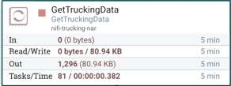

# Creating a NiFi DataFlow

## Introduction

We are aware of the role NiFi plays in this Trucking IoT application. Let's analyze the NiFi DataFlow to learn how it was built. Let's dive into the process behind configuring controller services and configuring processors to learn how to build this NiFi DataFlow.

## Outline

- [NiFi Components](#nifi-components)
- [Starting to Build a NiFi DataFlow](#starting-to-build-a-nifi-dataflow)
- [Setting up Schema Registry Controller Service](#setting-up-schema-registry-controller-service)
- [Building GetTruckingData](#building-gettruckingdata)
- [Configuring RouteOnAttribute](#configuring-routeonattribute)
- [Building EnrichTruckData](#building-enrichtruckdata)
- [Configuring ConvertRecord: TruckData](#configuring-convertrecord-truckdata)
- [Configuring ConvertRecord: TrafficData](#configuring-convertrecord-trafficdata)
- [Configuring PublishKafka_1_0: TruckData](#configuring-publishkafka_1_0-truckdata)
- [Configuring PublishKafka_1_0: TrafficData](#configuring-publishkafka_1_0-trafficdata)
- [Summary](#summary)

## NiFi Components

Check out the [Core Concepts of NiFi](https://hortonworks.com/tutorial/analyze-transit-patterns-with-apache-nifi/section/1/#the-core-concepts-of-nifi) to learn more about the NiFi Components used in creating a NiFi DataFlow.

## Starting to Build a NiFi DataFlow

Before we begin building our NiFi DataFlow, let's make sure we start with a clean canvas.

- Press **CTRL-A** or **COMMAND-A** to select entire canvas
- On the **Operate Palette**, click **DELETE**

~~~text
Note: You may need to empty queues before deleting DataFlow. Do this by **right-clicking** non-empty queue, then select **Empty queue**.
~~~

## Setting up Schema Registry Controller Service

As the first step in building the DataFlow, we needed to setup NiFi Controller Service called **HortonworksSchemaRegistry**. Go to the **Operate Palette**, click on the gear icon, then select **Controller Services** tab. To add a new controller service, you would press on the **" + "** icon in the top right of the table. However, since the service has already been created, we will reference it to see how a user would connect NiFi with Schema Registry.

**HortonworksSchemaRegistry** 

_Properties Tab of this Controller Service_

| Property     | Value    |
| :------------- | :------------- |
| **Schema Registry URL** | **http://sandbox-hdf.hortonworks.com:7788/api/v1** |
| **Cache Size** | **1000** |
| **Cache Expiration** | **1 hour** |

A schema is used for categorizing the data into separate categories: TruckData and TrafficData will be applied on the data during the use of the **ConvertRecord** processor.

From the configuration in the table above, we can see the **URL** that allows NiFi to interact with Schema Registry, the amount of **cache** that can be sized from the schemas and the amount of time required until the schema **cache expires** and NiFi has to communicate with Schema Registry again.

## Building GetTruckingData

**NiFi Data Simulator** - Generates data of two types: TruckData and TrafficData as a CSV string.

Keep Configurations across **Setting Tab, Scheduling Tab, Properties Tab** as Default.

## Configuring RouteOnAttribute

**RouteOnAttribute** - Filters TruckData and TrafficData types into two separate flows from _GetTruckingData_.

Right click on the processor, press **configure** option to see the different configuration tabs and their parameters. In each tab, you will see the following configurations:

**Setting Tab**

| Setting | Value     |
| :------------- | :------------- |
| Automatically Terminate Relationships | unmatched |

The rest should be kept as default.

**Scheduling Tab**

Keep the default configurations.

**Properties Tab**

| Property | Value     |
| :------------- | :------------- |
| Routing Strategy       | Route to Property name       |
| TrafficData       | ${dataType:equals('TrafficData')}      |
| TruckData       | ${dataType:equals('TruckData')}      |

## Building EnrichTruckData

**EnrichTruckData** - Adds weather data _(fog, wind, rain)_ to the content of each flowfile incoming from RouteOnAttribute's _TruckData_ queue.

Learn more about building the GetTruckingData processor in the **Coming Soon: "Custom NiFi Processor - Trucking IoT"** tutorial.

## Configuring ConvertRecord: TruckData

**ConvertRecord** - Uses Controller Service to read in incoming CSV TruckData FlowFiles from the _EnrichTruckData_ processor and uses another Controller Service to transform CSV to Avro TruckData FlowFiles.

Right click on the processor, press **configure** option to see the different configuration tabs and their parameters. In each tab, you will see the following configurations:

**Setting Tab**

| Setting | Value     |
| :------------- | :------------- |
| Automatically Terminate Relationships | failure |

**Scheduling Tab**

Keep the default configurations.

**Properties Tab**

| Property | Value     |
| :------------- | :------------- |
| Record Reader      | CSVReader - Enriched Truck Data      |
| Record Writer      | AvroRecordWriter - Enriched Truck Data      |

In the operate panel, you can find more information on the controller services used with this processor:

**CSVReader - Enriched Truck Data**

_Properties Tab of this Controller Service_

| Property | Value     |
| :------------- | :------------- |
| Schema Access Strategy | Use 'Schema Name' Property |
| Schema Registry | HortonworksSchemaRegistry |
| Schema Name | trucking_data_truck_enriched |
| Schema Text | ${avro.schema} |
| Date Format | No value set |
| Time Format | No value set |
| Timestamp Format | No value set |
| CSV Format | Custom Format |
| Value Separator | `\|` |
| Treat First Line as Header | false |
| Quote Character | " |
| Escape Character | `\` |
| Comment Marker | No value set |
| Null String | No value set |
| Trim Fields | true |

**AvroRecordWriter - Enriched Truck Data**

| Property | Value     |
| :------------- | :------------- |
| Schema Write Strategy | HWX Content-Encoded Schema Reference |
| Schema Access Strategy | Use 'Schema Name' Property |
| Schema Registry | HortonworksSchemaRegistry |
| Schema Name | trucking_data_truck_enriched |
| Schema Text | ${avro.schema} |

## Configuring ConvertRecord: TrafficData

**ConvertRecord** - Uses Controller Service to read in incoming CSV _TrafficData_ FlowFiles from RouteOnAttribute's _TrafficData_ queue and uses another Controller Service to write Avro _TrafficData_ FlowFiles.

Right click on the processor, press **configure** option to see the different configuration tabs and their parameters. In each tab, you will see the following configurations:

**Setting Tab**

| Setting | Value     |
| :------------- | :------------- |
| Automatically Terminate Relationships | failure |

**Scheduling Tab**

Keep the default configurations.

**Properties Tab**

| Property | Value     |
| :------------- | :------------- |
| Record Reader      | CSVReader - Traffic Data      |
| Record Writer      | AvroRecordWriter - Traffic Data      |

In the operate panel, you can find more information on the controller services used with this processor:

**CSVReader - Traffic Data**

_Properties Tab of this Controller Service_

| Property | Value     |
| :------------- | :------------- |
| Schema Access Strategy | Use 'Schema Name' Property |
| Schema Registry | HortonworksSchemaRegistry |
| Schema Name | trucking_data_traffic |
| Schema Text | ${avro.schema} |
| Date Format | No value set |
| Time Format | No value set |
| Timestamp Format | No value set |
| CSV Format | Custom Format |
| Value Separator | `\|` |
|Treat First Line as Header | false |
| Quote Character | " |
| Escape Character | `\` |
| Comment Marker | No value set |
| Null String | No value set |
| Trim Fields | true |

**AvroRecordWriter - Traffic Data**

| Property | Value |
| :------------- | :------------- |
| Schema Write Strategy | HWX Content-Encoded Schema Reference |
| Schema Access Strategy | Use 'Schema Name' Property |
| Schema Registry | HortonworksSchemaRegistry |
| Schema Name | trucking_data_truck |
| Schema Text | ${avro.schema} |

## Configuring PublishKafka_1_0: TruckData

**PublishKafka_1_0** - Receives flowfiles from _ConvertRecord - TruckData_ processor and sends each flowfile's content as a message to Kafka Topic: _trucking_data_truck_ using the Kafka Producer API.

Right click on the processor, press **configure** option to see the different configuration tabs and their parameters. In each tab, you will see the following configurations:

**Setting Tab**

| Setting | Value     |
| :------------- | :------------- |
| Automatically Terminate Relationships | failure, success |

**Scheduling Tab**

Keep the default configurations.

**Properties Tab**

| Property | Value     |
| :------------- | :------------- |
| **Kafka Brokers**      | **sandbox-hdf.hortonworks.com:6667**   |
| **Security Protocol**      | **PLAINTEXT**      |
| **Topic Name**      | **trucking_data_truck_enriched**      |
| **Delivery Guarantee**      | **Best Effort**      |
| **Key Attribute Encoding**      | **UTF-8 Encoded**      |
| **Max Request Size**      | **1 MB**      |
| **Acknowledgment Wait Time**      | **5 secs**      |
| **Max Metadata Wait Time**      | **30 sec**      |
| Partitioner class      | DefaultPartitioner      |
| **Compression Type**      | **none**      |

## Configuring PublishKafka_1_0: TrafficData

**PublishKafka_1_0** - Receives flowfiles from _ConvertRecord - TrafficData_ processor and sends FlowFile content as a message using the Kafka Producer API to Kafka Topic: _trucking_data_traffic_.

Right click on the processor, press **configure** option to see the different configuration tabs and their parameters. In each tab, you will see the following configurations:

**Setting Tab**

| Setting | Value     |
| :------------- | :------------- |
| Automatically Terminate Relationships | failure, success |

**Scheduling Tab**

Keep the default configurations.

**Properties Tab**

| Property | Value     |
| :------------- | :------------- |
| **Kafka Brokers**      | **sandbox-hdf.hortonworks.com:6667**   |
| **Security Protocol**      | **PLAINTEXT**      |
| **Topic Name**      | **trucking_data_traffic**      |
| **Delivery Guarantee**      | **Best Effort**      |
| **Key Attribute Encoding**      | **UTF-8 Encoded**      |
| **Max Request Size**      | **1 MB**      |
| **Acknowledgment Wait Time**      | **5 secs**      |
| **Max Metadata Wait Time**      | **5 sec**      |
| Partitioner class      | DefaultPartitioner      |
| **Compression Type**      | **none**      |

## Summary

Congratulations!  You now know about the role that NiFi plays in a data pipeline of the Trucking - IoT demo application and how to create and run a dataflow.
