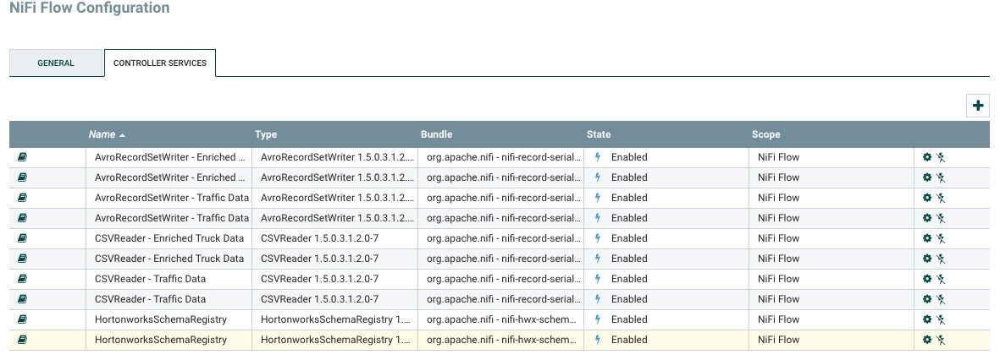
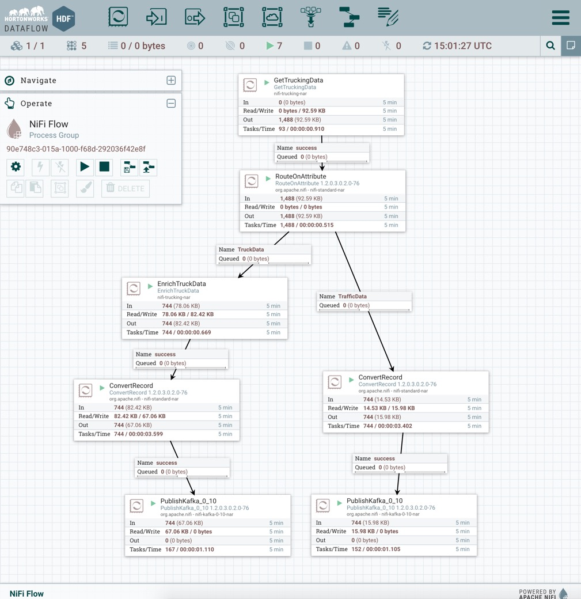
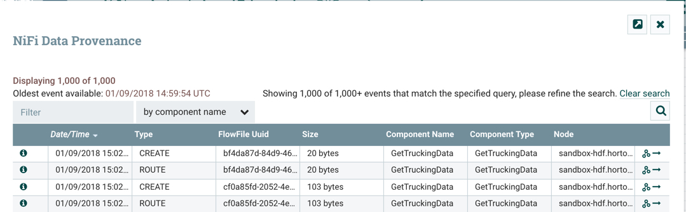
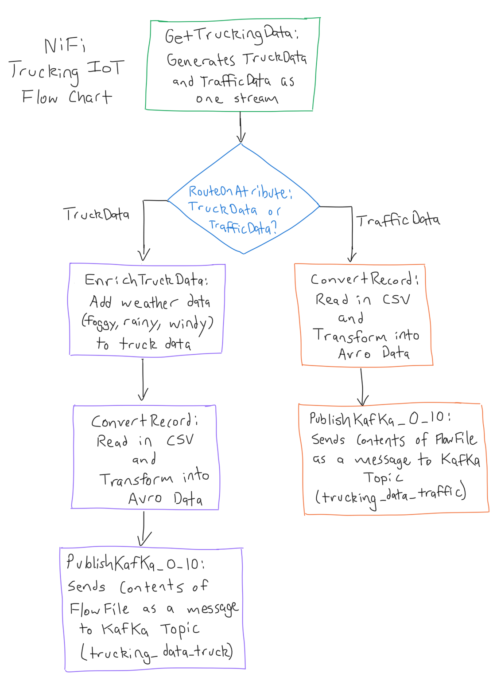

# Run NiFi in the Demo

## Introduction

Let's walk through NiFi's place in the demo.

## Outline

- [Environment Setup](#environment-setup)
- [Deploy the NiFi DataFlow](#deploy-the-nifi-dataflow)
- [Next: Building a NiFi DataFlow](#next-building-a-nifi-dataflow)

## Environment Setup

We will be working in the `trucking-IoT` project. If you have the latest Hortonworks DataFlow (HDF) Sandbox installed, then the demo comes preinstalled. If not or you do not already have it setup, then refer to [Setup Demo on existing HDF/HDP](https://github.com/orendain/trucking-iot/tree/hadoop-summit-2017#setup-on-existing-hdf-hdp).

Your HDF Sandbox should be powered on using your favorite platform.

## Deploy the NiFi DataFlow

Let's activate the NiFi dataflow, so it will process the simulated data and push the data into Kafka Topics. Open NiFi at `sandbox-hdf.hortonworks.com:9090/nifi`.

In the **Operate Pallete**, click on the gear icon then click on Controller Services. Let's verify our Controller Services are all enabled as shown in the picture:

> Note: If any of your services are disabled, you can enable them by clicking on the lightning bolt symbol on the far right of the table. Controller Services are required to be enabled to successfully run the dataflow.

Let's select the entire dataflow. Hover your mouse onto one of the corners of the dataflow of components. Hold **shift**, then **click on your mouse** and **drag** it to the other corner **to select the entire dataflow**. In the **Operate Pallete,** click on the start button  and let it run for 1 minute. The red stop symbols  at the corner of each component in the dataflow will turn to a green play symbol . You should see the numbers in the connection queues change from 0 to a higher number indicating that the data is being processed.

You should see a picture similar to below:

Let's analyze what actions the processors taking on the data via NiFi's Data Provenance:

Unselect the entire dataflow then right click on `GetTruckingData`: Generates data of two types: _TruckData_ and _TrafficData_. Click **Data Provenance**.

A table with provenance events will appear. An event illustrates what type of action the processor took against the data. For `GetTruckingData`, it is creating sensor data in two categories as one stream. Choose an event with **20 bytes** to see `TrafficData` or greater than or equal to **98 bytes** to see `TruckData`.

- `TruckData`: Data simulated by sensors onboard each truck.

- `TrafficData`: Data simulated from traffic congestion on a particular trucking route.

You can check the data provenance at each processor to get a more in-depth look at the steps NiFi is performing to process and transform the two types of simulated data. Here is a flow chart to show the steps:

## Next: Building a NiFi DataFlow

Now that we know how NiFi fits into the data pipeline of the demo and what kind of transformations on the data is performing, let's dive into configuring processors to see how the dataflow is constructed.
