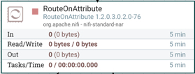
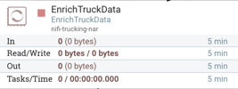
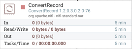
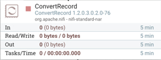
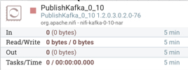
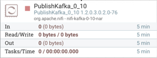

# Building a NiFi DataFlow

## Introduction

We are aware of the role NiFi plays in this Trucking IoT application. Let's dive into building processors and configuring processors to learn how to build this NiFi DataFlow.

## Outline

- [NiFi Components](#nifi-components)
- [Environment Setup](#environment-setup)
- [Starting to Build a NiFi DataFlow](#starting-to-build-a-nifi-dataFlow)
- [Building GetTruckingData](#building-gettruckingdata)
- [Configuring RouteOnAttribute](#configuring-routeonattribute)
- [Building EnrichTruckData](#building-enrichtruckdata)
- [Configuring ConvertRecord: TruckData](#configuring-convertrecord-truckdata)
- [Configuring ConvertRecord: TrafficData](#configuring-convertrecord-rrafficdata)
- [Configuring PublishKafka_0_10: TruckData](#configuring-publishkafka_0_10-TruckData)
- [Configuring PublishKafka_0_10: TrafficData](#configuring-publishkafka_0_10-trafficdata)
- [Summary](#summary)

## NiFi Components

Now we have a general sense of the power of NiFi. Check out the [Core Concepts of NiFi](https://hortonworks.com/tutorial/analyze-transit-patterns-with-apache-nifi/section/1/#the-core-concepts-of-nifi) to learn more about the NiFi Components used in creating a NiFi DataFlow.

## Environment Setup

We will be working in the `trucking-iot` project. If you have the latest HDF Sandbox installed, then the demo comes preinstalled. If not or you do not already have it setup, then refer to [Setup Demo on existing HDF/HDP](https://github.com/orendain/trucking-iot/tree/hadoop-summit-2017#setup-on-existing-hdf-hdp).

## Starting to Build a NiFi DataFlow

Open the NiFi UI at `sandbox-hdf.hortonworks.com:9090/nifi`. The web browser will load the NiFi Canvas where NiFi DataFlows are built. NiFi is a visual command and control platform that allows users or developers to create dataflow applications quickly with little need to write code. We are using NiFi to bridge the gap between data generating from sensor data and our stream application. In the real world scenario, we have MiNiFi agents attached to live truck vehicles that ingest the raw sensor data and send that data to our NiFi application. In NiFi, we will use our GetTruckingData processor to ingest the data that our MiNiFi agents our sending to us.

If you want to go more in-depth on building a NiFi DataFlow for a similar application use case, such as connecting processors, setting configuration parameters, etc, visit [Analyze Transit Patterns with Apache NiFi](https://hortonworks.com/tutorial/analyze-transit-patterns-with-apache-nifi/).

Before we build the dataflow, lets see what the configuration for a schema for our dataflow would look like. Since the schema has already been created, go to the **Operate Pallete**, click on the gear icon, then select **Controller Services** tab.

**HortonworksSchemaRegistry**

_Properties Tab of this Controller Service_

| Property     | Value    |
| :------------- | :------------- |
| **Schema Registry URL** | **http://sandbox-hdf.hortonworks.com:7788/api/v1** |
| **Cache Size** | **1000** |
| **Cache Expiration** | **1 hour** |

A schema is used for categorizing the data into separate categories: TruckData and TrafficData will be applied on the data during the use of the **ConvertRecord** processor.

## Building GetTruckingData

**NiFi Data Simulator** - Generates data of two types: TruckData and TrafficData as a CSV string.

Keep Configurations across **Setting Tab, Scheduling Tab, Properties Tab** as Default.

Learn more about building the GetTruckingData processor in the **Coming Soon: "Custom NiFi Processor - Trucking IoT"** tutorial.

## Configuring RouteOnAttribute

**RouteOnAttribute** - Filters TruckData and TrafficData types into two separate flows from _GetTruckingData_.

Right click on the processor, press **configure** option to see the different configuration tabs and their parameters. In each tab, you will see the following configurations:

**Setting Tab**

| Setting | Value     |
| :------------- | :------------- |
| Automatically Terminate Relationships | unmatched |

Everything other setting is kept as default.

**Scheduling Tab**

Kept as default configuration.

**Properties Tab**

| Property | Value     |
| :------------- | :------------- |
| Routing Strategy       | Route to Property name       |
| TrafficData       | ${dataType:equals('TrafficData')}      |
| TruckData       | ${dataType:equals('TruckData')}      |

## Building EnrichTruckData

**EnrichTruckData** - Adds weather data _(fog, wind, rain)_ to the content of each flowfile incoming from RouteOnAttribute's _TruckData_ queue.

Learn more about building the GetTruckingData processor in the **Coming Soon: "Custom NiFi Processor - Trucking IoT"** tutorial.

## Configuring ConvertRecord: TruckData

**ConvertRecord** - Uses Controller Service to read in incoming CSV TruckData FlowFiles from the _EnrichTruckData_ processor and uses another Controller Service to transform CSV to Avro TruckData FlowFiles.

Right click on the processor, press **configure** option to see the different configuration tabs and their parameters. In each tab, you will see the following configurations:

**Setting Tab**

| Setting | Value     |
| :------------- | :------------- |
| Automatically Terminate Relationships | failure |

**Scheduling Tab**

Keep as Default.

**Properties Tab**

| Property | Value     |
| :------------- | :------------- |
| Record Reader      | CSVReader - Truck Data      |
| Record Writer      | AvroRecordWriter - Truck Data      |

In the operate panel, you can find more information on the controller services used with this processor:

**CSVReader - Truck Data**

_Properties Tab of this Controller Service_

| Property | Value     |
| :------------- | :------------- |
| Schema Access Strategy | Use 'Schema Name' Property |
| Schema Registry | HortonworksSchemaRegistry |
| Schema Name | trucking_data_truck |
| Schema Text | ${avro.schema} |
| Date Format | No value set |
| Time Format | No value set |
| Timestamp Format | No value set |
| CSV Format | Custom Format |
| Value Separator | `|` |
| Skip Header Line | false |
| Quote Character | " |
| Escape Character | `\` |
| Comment Marker | No value set |
| Null String | No value set |
| Trim Fields | true |

**AvroRecordWriter - Truck Data**

| Property | Value     |
| :------------- | :------------- |
| Schema Write Strategy | HWX Content-Encoded Schema Reference |
| Schema Access Strategy | Use 'Schema Name' Property |
| Schema Registry | HortonworksSchemaRegistry |
| Schema Name | trucking_data_truck |
| Schema Text | ${avro.schema} |

## Configuring ConvertRecord: TrafficData

**ConvertRecord** - Uses Controller Service to read in incoming CSV _TrafficData_ FlowFiles from RouteOnAttribute's _TrafficData_ queue and uses another Controller Service to write Avro _TrafficData_ FlowFiles.

Right click on the processor, press **configure** option to see the different configuration tabs and their parameters. In each tab, you will see the following configurations:

**Setting Tab**

| Setting | Value     |
| :------------- | :------------- |
| Automatically Terminate Relationships | failure |

**Scheduling Tab**

Keep as Default.

**Properties Tab**

| Property | Value     |
| :------------- | :------------- |
| Record Reader      | CSVReader - Traffic Data      |
| Record Writer      | AvroRecordWriter - Traffic Data      |

In the operate panel, you can find more information on the controller services used with this processor:

**CSVReader - Traffic Data**

_Properties Tab of this Controller Service_

| Property | Value     |
| :------------- | :------------- |
| Schema Access Strategy | Use 'Schema Name' Property |
| Schema Registry | HortonworksSchemaRegistry |
| Schema Name | trucking_data_traffic |
| Schema Text | ${avro.schema} |
| Date Format | No value set |
| Time Format | No value set |
| Timestamp Format | No value set |
| CSV Format | Custom Format |
| Value Separator | `|` |
| Skip Header Line | false |
| Quote Character | " |
| Escape Character | `\` |
| Comment Marker | No value set |
| Null String | No value set |
| Trim Fields | true |

**AvroRecordWriter - Traffic Data**

| Property | Value     |
| :------------- | :------------- |
| Schema Write Strategy | HWX Content-Encoded Schema Reference |
| Schema Access Strategy | Use 'Schema Name' Property |
| Schema Registry | HortonworksSchemaRegistry |
| Schema Name | trucking_data_truck |
| Schema Text | ${avro.schema} |

## Configuring PublishKafka_0_10: TruckData

**PublishKafka_0_10** - Receives flowfiles from _ConvertRecord - TruckData_ processor and sends each flowfile's content as a message to Kafka Topic: _trucking_data_truck_ using the Kafka Producer API.

Right click on the processor, press **configure** option to see the different configuration tabs and their parameters. In each tab, you will see the following configurations:

**Setting Tab**

| Setting | Value     |
| :------------- | :------------- |
| Automatically Terminate Relationships | failure, success |

**Scheduling Tab**

Keep as Default.

**Properties Tab**

| Property | Value     |
| :------------- | :------------- |
| **Kafka Brokers**      | **sandbox-hdf.hortonworks.com:6667**   |
| **Security Protocol**      | **PLAINTEXT**      |
| **Topic Name**      | **trucking_data_truck**      |
| **Delivery Guarantee**      | **Best Effort**      |
| **Key Attribute Encoding**      | **UTF-8 Encoded**      |
| **Max Request Size**      | **1 MB**      |
| **Acknowledgment Wait Time**      | **5 secs**      |
| **Max Metadata Wait Time**      | **30 sec**      |
| Partitioner class      | DefaultPartitioner      |
| **Compression Type**      | **none**      |

## Configuring PublishKafka_0_10: TrafficData

**PublishKafka_0_10** - Receives flowfiles from _ConvertRecord - TrafficData_ processor and sends FlowFile content as a message using the Kafka Producer API to Kafka Topic: _trucking_data_traffic_.

Right click on the processor, press **configure** option to see the different configuration tabs and their parameters. In each tab, you will see the following configurations:

**Setting Tab**

| Setting | Value     |
| :------------- | :------------- |
| Automatically Terminate Relationships | failure, success |

**Scheduling Tab**

Keep as Default.

**Properties Tab**

| Property | Value     |
| :------------- | :------------- |
| **Kafka Brokers**      | **sandbox-hdf.hortonworks.com:6667**   |
| **Security Protocol**      | **PLAINTEXT**      |
| **Topic Name**      | **trucking_data_traffic**      |
| **Delivery Guarantee**      | **Best Effort**      |
| **Key Attribute Encoding**      | **UTF-8 Encoded**      |
| **Max Request Size**      | **1 MB**      |
| **Acknowledgment Wait Time**      | **5 secs**      |
| **Max Metadata Wait Time**      | **30 sec**      |
| Partitioner class      | DefaultPartitioner      |
| **Compression Type**      | **none**      |

## Summary

Congratulations!  You now know about the role that NiFi plays in a data pipeline of the Trucking - IoT demo application and how to create and run a dataflow.
