# Real-Time Event Processing In NiFi, SAM, Schema Registry and Superset

## Introduction

In this tutorial, you will learn how to deploy a modern real-time streaming application. This application serves as a reference framework for developing a big data pipeline, complete with a broad range of use cases and powerful reusable core components. You will explore the NiFi Dataflow application, Kafka topics, schemas, SAM topology and the visualization slices from Superset.

## Prerequisites

- [Downloaded HDF Sandbox](https://hortonworks.com/downloads/#sandbox)
- [Installed HDF Sandbox](https://hortonworks.com/tutorial/sandbox-deployment-and-install-guide/)

## Outline

- [Concepts](#concepts)
- [Overview of Trucking IoT Ref App](#overview-of-trucking-iot-ref-app)
- [Step 1: Explore Dataflow Application](#step-1-explore-dataflow-application)
- [Step 2: View Schema Registry](#step-2-view-schema-registry)
- [Step 3: Analyze Stream Analytics Application](#step-3-analyze-stream-analytics-application)
- [Step 4: View the Storm Engine that Powers SAM](#step-4-view-the-storm-engine-that-powers-sam)
- [Step 5: Visualize Trucking Data Via Superset](#step-5-visualize-trucking-data-via-superset)
- [Summary](#summary)
- [Further Reading](#further-reading)
- [Appendix A: Trucking IoT Github Repo](#appendix-a-trucking-iot-github-repo)

## Concepts

### SuperSet

SuperSet is a visual, intuitive and interactive data exploration platform. This platform offers a fast way to create and share dashboards with friends and business clients of your visualized datasets. Various visualization options are available to analyze the data and interpret it. The Semantic Layer allows users to control how the data stores are displayed in the UI. The model is secure and allows users to intricate rules in which only certain features are accessible by select individuals. SuperSet can be integrated with Druid or other data stores (SQLAlchemy, Python ORM, etc) of the user's choice offering flexibility to be compatible with multiple systems.

### Druid

Druid is an open source analytics database developed for business intelligence queries on data. Druid provides low-latency live data ingestion, flexible data exploration and aggregation. Deployments often reach out to trillions of event in relation to numerous petabytes of data.

### Stream Analytics Manager (SAM)

Stream Analytics Manager is a drag and drop program that enables stream processing developers to build data topologies within minutes compared to traditional practice of writing several lines of code. A topology is a **directed acyclic graph (DAG)** of processors. Now users can configure and optimize how they want each component or processor to perform computations on the data. They can perform windowing, joining multiple streams together and other data manipulation. SAM currently supports the stream processing engine known as Apache Storm, but it will later support other engines such as Spark and Flink. At that time, it will be the users choice on which stream processing engine they want to choose.

### Apache Storm

Apache Storm is the current backend computational processing engine for Stream Analytics Manager. After the user builds their SAM topology, all the actually processing of data happens in a Storm topology, which is also a **DAG**, but is comprised of spouts and bolts with streams of tuples representing the edges.

A **spout** ingests the data usually from a Kafka Topic into the topology while **bolts** do all the processing. Thus, all the same components from the SAM topology are represented in the Storm topology, but as appropriate spouts and bolts.

Storm is the Open Source distributed, reliable, fault-tolerant system that handles real time analytics, scoring machine learning models, continuous static computations and enforcing Extract, Transform and Load (ETL) paradigms.

### Schema Registry

Schema Registry (SR) stores and retrieves Avro Schemas via RESTful interface. SR stores a version history containing all schemas. Serializers are provided to plug into Kafka clients that are responsible for schema storage and retrieve Kafka messages sent in Avro format.

### Overview of Trucking IoT Ref App

The Trucking IoT Reference Application is built using Hortonworks DataFlow platform.

The Trucking IoT data comes from a truck events simulator that is ingested by Apache NiFi, NiFi sends the data to Kafka topics which are then ingested by Stream Analytics Manager (SAM) to be stored into Druid. Superset is used to create a visual representation of the Druid data sources. A more in depth explanation of the pipeline will be explained as you explore the NiFi Dataflow application, Schema Registry, SAM, Druid and Superset.

### Step 1: Explore Dataflow Application

1\. Open the NiFi UI `http://sandbox-hdf.hortonworks.com:9090/nifi/`

2\. Drag the NiFi template icon onto the canvas, .

3\. Choose the Template: `Trucking IoT Demo`. The NiFi Dataflow application will appear on the canvas. Deselect the Dataflow.

4\. Select NiFi configuration icon . Click on the Controller Services tab:

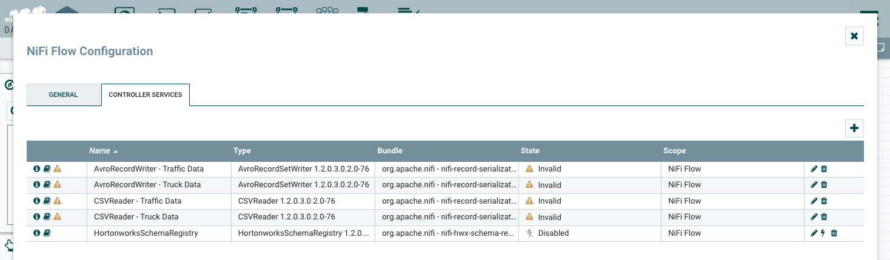

5\. Enable the **HortonworksSchemaRegistry** by selecting the lightning bolt symbol.

6\. In the "Enable Controller Service" window, under "Scope", select "Service and referencing components". Then click ENABLE.

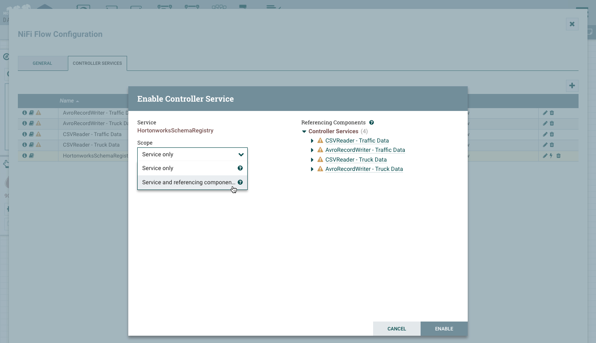

All controller services referencing **HortonworksSchemaRegistry** will also be enabled. Head back to the NiFi Dataflow.

7\. Press `command+A` or `control+A` to select all the processors in the NiFi Dataflow and click on the start button .

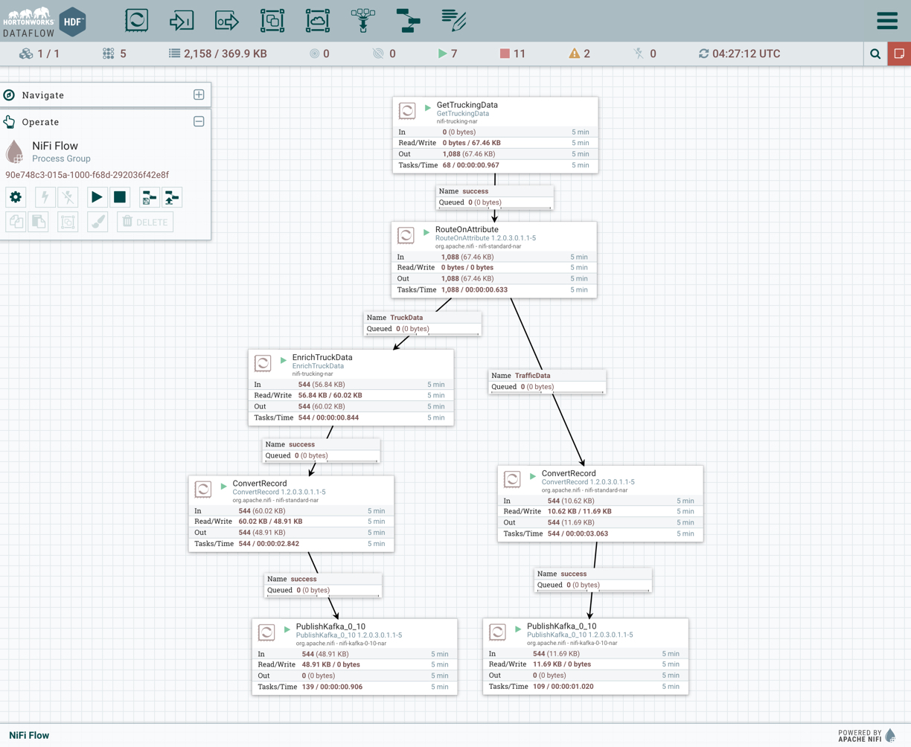

8\. To reduce resource consumption and footprint, when the **PublishKafka_0_10** processors reach about 500 input records, click on the stop button . This will take approximately 1 - 2 minutes.

9\. Stop **NiFi** service and make sure to turn ON maintenance mode.

Overview of the **7 processors** in the NiFi Flow:

- **GetTruckingData** - Simulator generates TruckData and TrafficData in bar-delimited CSV

- **RouteOnAttribute** - filters the _TrafficData_ and _TruckData_ into separate
data feeds

| Data Name | Data Fields    |
| :------------- | :------------- |
| TruckData       | eventTime, truckId, driverId, driverName, routeId, routeName, latitude, longitude, speed, eventType       |
| TrafficData       | eventTime, routeId, congestionLevel       |

_TruckData side of Flow_

- **EnrichTruckData** - tags on three fields to the end of _TruckData_: "foggy",
"rainy", "windy"

- **ConvertRecord** - reads incoming data with "CSVReader" and writes out avro data with "AvroRecordSetWriter" embedding a "trucking_data_truck" schema onto each flowfile.

- **PublishKafka_0_10** - stores avro data into Kafka Topic
"trucking_data_truck"

_TrafficData side of Flow_

- **ConvertRecord** - converts CSV data into avro data embedding a "trucking_data_traffic" schema onto each flowfile

- **PublishKafka_0_10** - stores avro data into Kafka Topic "trucking_data_traffic"

Overview of **5 controller services** used in the NiFi Flow:

- **AvroRecordSetWriter** - writes contents of RecordSet in Binary
Avro Format (trucking_data_truck schema)

- **AvroRecordSetWriter - Traffic** - writes contents of RecordSet in Binary
Avro Format (trucking_data_traffic schema)

- **CSVReader** - returns each row in csv file as a separate record (trucking_data_truck schema)

- **CSVReader - Traffic** - returns each row in csv file as a separate record
(trucking_data_traffic schema)

- **HortonworksSchemaRegistry** - provides schema registry service for
interaction with Hortonworks Schema Registry

### Step 2: View Schema Registry

1\. Open the Schema Registry UI at `http://sandbox-hdf.hortonworks.com:7788/`

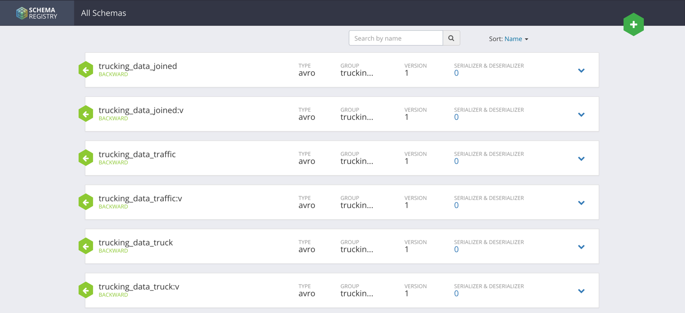

Overview of the essential **schemas** in the Schema Registry:

- **trucking_data_joined** - model for truck event originating from a truck's onboard computer (EnrichedTruckAndTrafficData)

- **trucking_data_traffic** model for eventTime, routeId, congestionLevel (TrafficData)

- **trucking_data_truck** - model for truck event originating from a truck's onboard computer (EnrichedTruckData)

### Step 3: Analyze Stream Analytics Application

1\. Open Stream Analytics Manager (SAM) at `http://sandbox-hdf.hortonworks.com:7777/`

2\. Click on the **Trucking-IoT-Demo** SAM topology square:

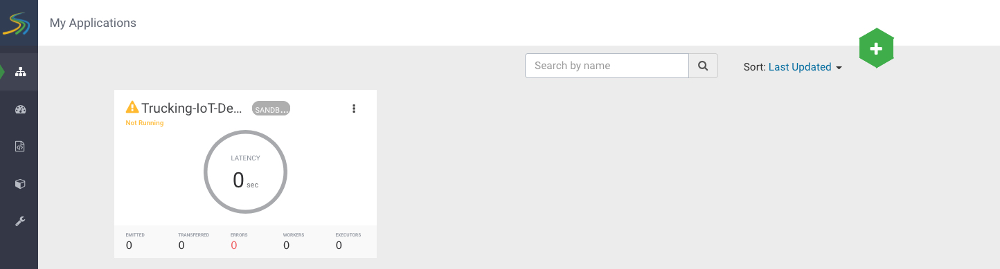

3\. Click on the EDIT button:

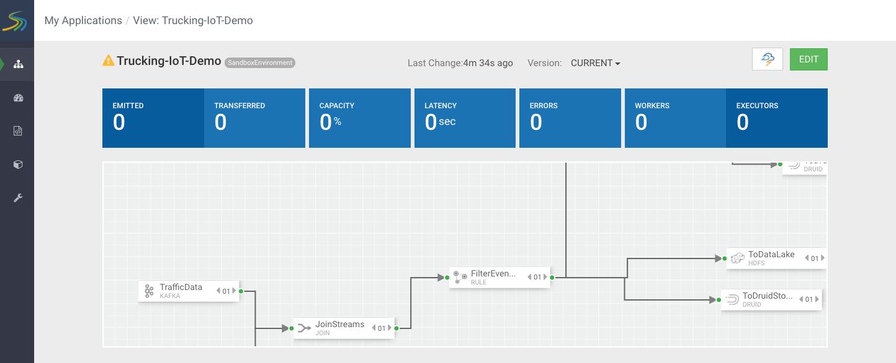

4\. Click on the start button to deploy the topology:

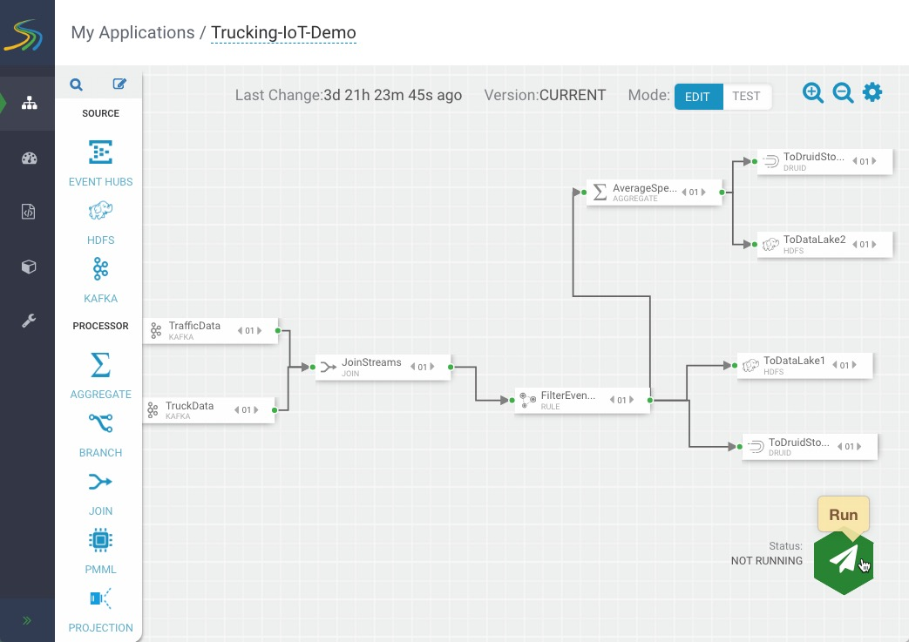.

A window will appear asking if you want to continue deployment, choose Ok.

5\. You will receive a notification that the SAM topology application deployed successfully and your topology will show Active Status in the bottom right corner.

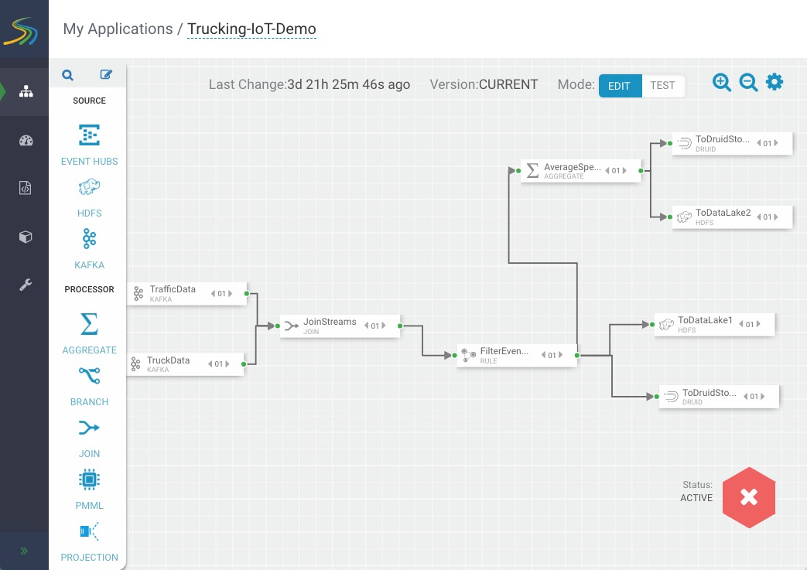

**Overview of the SAM Canvas:**

- My Applications: Different Topology Projects
- 1st Left Sidebar: My Applications, Dashboard, Schema Registry, Model Registry, Configuration
- 2nd Left Sidebar: Different stream components (source, processor, sink)
- Gear Icon: configure topology settings
- Status Icon: Start or Stop Topology

**Overview of SAM topology:**

- **TruckingDataTraffic** source data of "trucking_data_traffic" kafka topic

- **TruckingDataTruck** source data of "trucking_data_truck" kafka topic

- **JOIN** stream TruckingDataTruck and TruckingDataTraffic by "routeId"

- **IsViolation** checks if not "Normal" eventType, then will emit them

- **HDFS** storage for joined TruckingDataTruck and TruckingDataTraffic data

- **Violation-Events-Cube** stores violation events into Druid

- **Data-Lake-HDFS** store violation events into HDFS

### Step 4: View the Storm Engine that Powers SAM

1\. From Ambari, go to the **views 9 selector** icon and select **Storm View**.

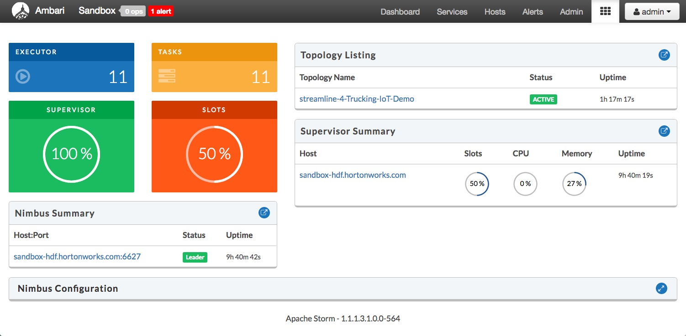

2\. Click on Topology Name: **streamline-1-Trucking-IoT-Demo**.

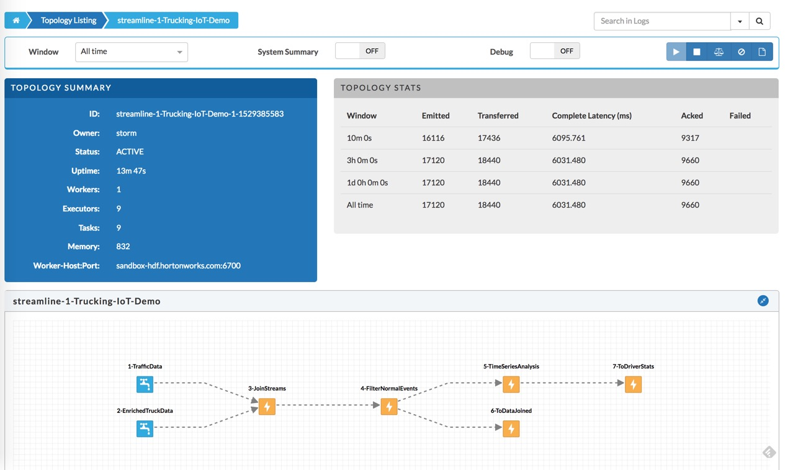

**Overview of the Storm View**

You can see the total number of **Emitted** `(2081)` and **Transferred** `(3719)` tuples after `10m 0s` under **TOPOLOGY STATS** for the entire topology. You can also see individual emitted and transferred tuples for each individual Spout and Bolt in the topology increase. If we hover over one of the spouts or bolts on the graph, we can see how much data they process and their latency.

- Topology Summary
- Topology Stats
- Topology Static Visualization
- Spout
- Bolts
- Topology Configuration

### Step 5: Visualize Trucking Data Via Superset

1\. Open Ambari at `http://sandbox-hdf.hortonworks.com:8080/`. User credentials are `username/password = admin/admin`

2\. Turn on the HDFS, YARN, Druid and Superset services and make sure to turn off maintenance mode.

For example, to turn on **HDFS**, click on the service name in Ambari, click on the **Service Actions** dropdown and click **Start**. In the window, you will be asked if you want to start, confirm and also click on the checkbox to turn off maintenance mode.

3\. Open Superset at `http://sandbox-hdf.hortonworks.com:9089/`

4\. Wait about 5 - 10 minutes for Kafka data to be consumed, then periodically, select the **Sources** dropdown and click on **Refresh Druid Metadata**. Eventually, the two Druid data sources will appear.

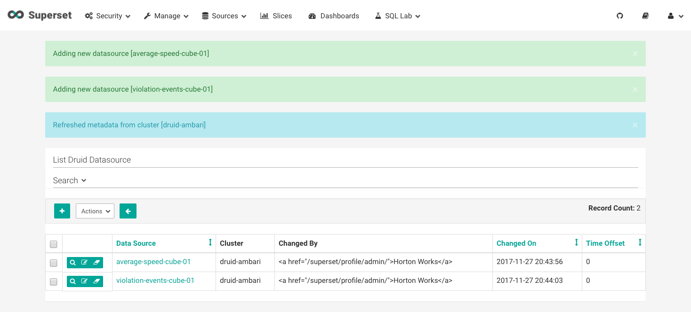

5\. Select **average-speed-cube-01** druid data source.

6\. You will be taken to the Superset visualization slice where you can visualize that druid data source.

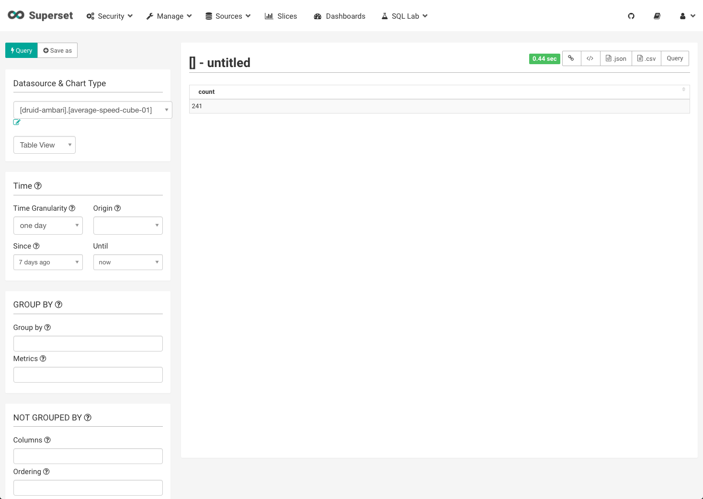

7\. Under **Datasource & Chart Type**, select Visualization Type: **Sunburst**.

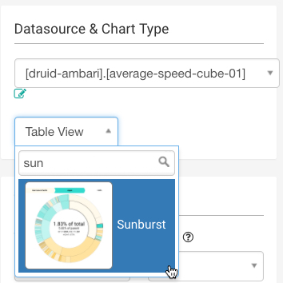

8\. Under Hierarchy, add **driverId**, **speed_AVG**.

9\. Press on **Query** to visualize the data into a Sunburst representation.

10\. Select **Save as** and name the slice: `AvgSpeedSunburst`. Create a new dashboard and call it: `Trucking-IoT-Demo`. Click **Save**.

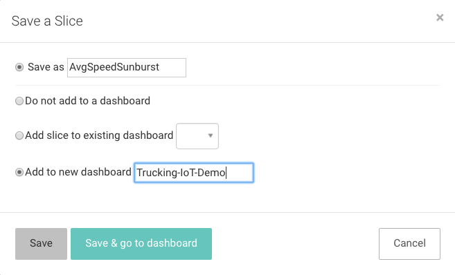

The following visualization slice is a "Sunburst" of **average-speed-cube-01** data source.

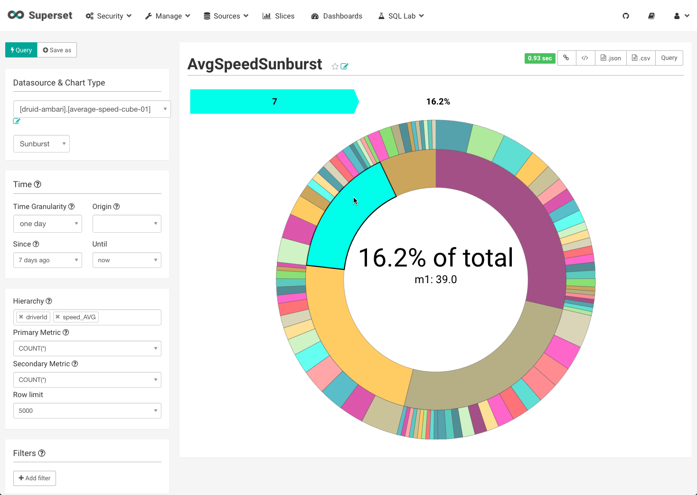

The following visualization slice is a "Sunburst" of **volation-events-cube-01** data source:

All created visualization slices will be sent to the dashboard you assign them to, in the two above examples, both slices are apart of the `Trucking-IoT-Demo` dashboard.

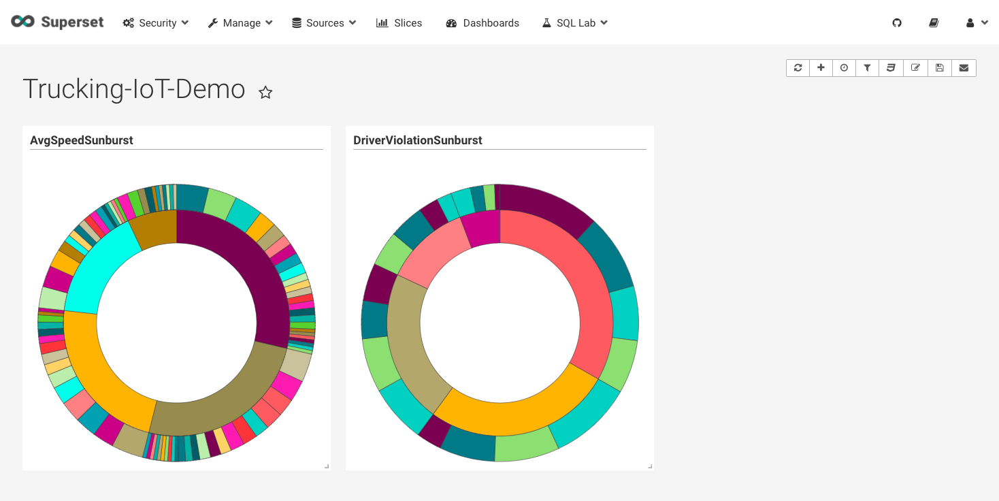

## Summary

Congratulations! You deployed the Trucking IoT demo that processes truck event data by using the NiFi data flow application to separate the data into two flows: _TruckData_ and _TrafficData_, that are transmitted into two Kafka robust queues tagged with Schema Registry schemas: _trucking_data_traffic_ and _trucking_data_truck_. Stream Analytics Manager's (SAM) topology pulls in this data to join the two streams (or flows) by _routId_ and filter non-normal events to Druid's datasource: _violation-events-cube2_. Superset visualizes the datasources into _Sunburst_ and various other visualization slices to add more insights to our Trucking IoT demo.

## Further Reading

- [Apache NiFi User Guide](https://nifi.apache.org/docs.html)
- [Kafka Documentation](https://kafka.apache.org/documentation/)
- [Schema Registry](https://docs.confluent.io/current/schema-registry/docs/index.html)
- [Stream Analytics Manager User Guide](https://docs.hortonworks.com/HDPDocuments/HDF3/HDF-3.0.2/bk_streaming-analytics-manager-user-guide/content/ch_sam-manage.html)
- [Superset](https://superset.incubator.apache.org/)

## Appendix A: Trucking IoT Github Repo

For more information on the the Trucking IoT Reference Application, visit the documentation and source code at:

~~~
https://github.com/orendain/trucking-iot/tree/hadoop-summit-2017
~~~
