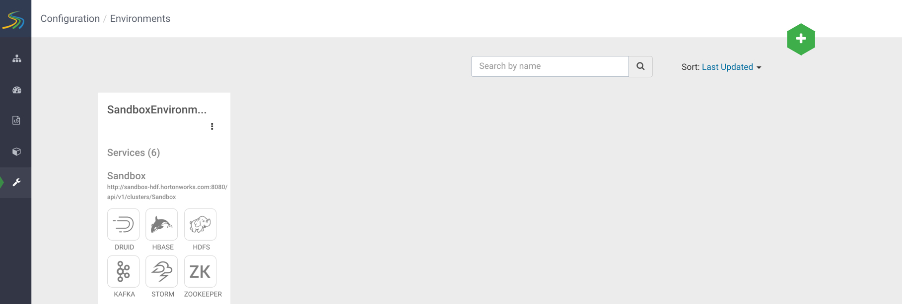

# Lesson - Stream Processing & SAM

## Objective

## Outline

- [Introduction to Stream Processing](#introduction-to-stream-processing)
- [Streaming Analytics Manager](#streaming-analytics-manager)

## Introduction to Stream Processing

> Note: Info will come soon

## Streaming Analytics Manager

A part of developing the SAM topology requires setting up your **service pool** and **environment**, so you can add a stream **application**. Once you have these three components established, you will be able to start building your SAM topology.

## Service Pool

A service pool is the set of services related to your Ambari Managed Cluster on HDF. A **service** is an entity in which an Application Developer uses to build stream topologies. Examples include:

- a Storm Cluster for Stream Application deployment
- a Kafka Cluster in which the stream application uses to create streams
- a Druid Data Store to which the stream application writes

The list of managed service pools is located in **Configuration**  tab. For our case, we have one service pool preloaded into our HDF Sandbox shown in **Figure 1**, but in larger projects, you will probably have more.

**Figure 1: Sandbox Service Pool**

## Environment

An environment is a named entity which represents a set of services chosen from different service pools. When a new stream application is created, they are assigned an environment by the developer. Thus, the stream application can only use services associated with your chosen environment

The list of managed environments is located in the **Configuration** tab. For our case, we have one environment preloaded into our HDF Sandbox shown in **Figure 2**

**Figure 2: Sandbox Environment**

## Application

An application is the stream analytics manager topology. For example the application you will create is shown in **Figure 3**.

**Figure 3: Trucking-IoT-Demo**

Once the above three components are created, a SAM Developer, can start building their topology.

## SAM Topology Components

SAM's topology visual editor allows you to drag and drop components into the canvas, so you can add the first processor to your topology or connect new processors to your existing topology.

**Source**

Source is a component that allows developers to ingest data from a messaging system or distributed file system, such as Kafka or HDFS, into their topology.

**Processor**

Processor is a component performs the transforms, computation, joining and filtering on data as it moves through the stream.

**Sink**

Sink is a component that stores data into a datastore or distributed file system, such as Druid, HBase, HDFS, JDBC, etc.
