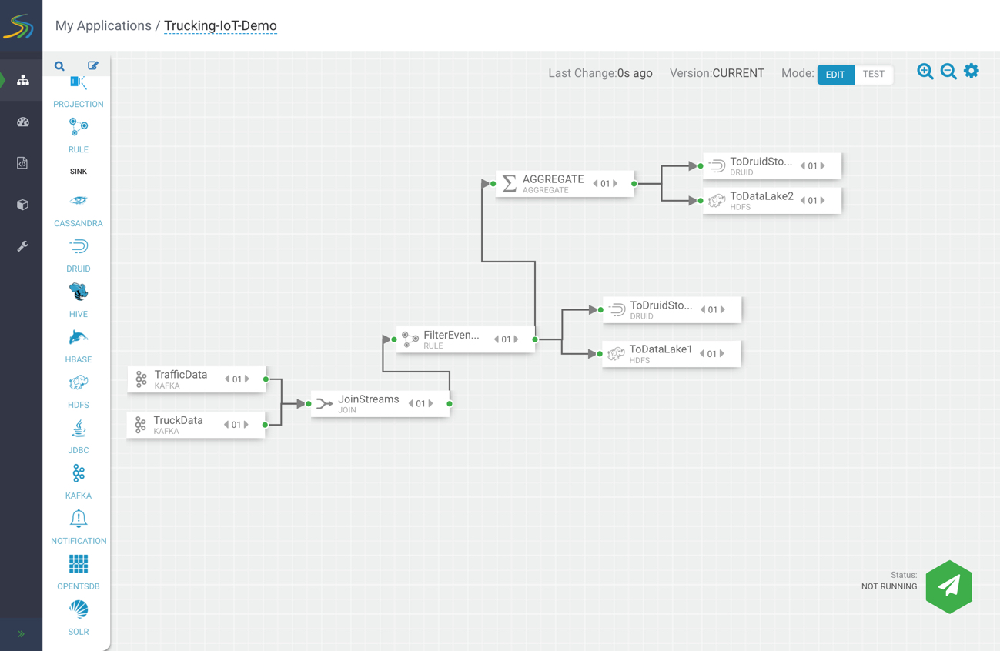

# Create a SAM Topology

## Objective

We are now familiar with the role stream processing plays in data science/engineering applications. Let's use Streaming Analytics Manager (SAM) to create stream topology.

Skills you will gain:
- Create a Service Pool, an Environment, and an Application
- Build, deploy and export a SAM topology

## Outline

- [Environment Setup](#environment-setup)
- [Create a SAM topology](#create-a-sam-topology)
- [Approach 1: New Application](#approach-1-new-application)
- [Building the SAM Topology](#building-the-sam-topology)
- [Approach 2: Import Application](#approach-2-import-application)
- [Summary](#summary)
- [Further Reading](#further-reading)
- [Appendix A: HDF and HDP Sandbox Communication](#appendix-a-hdf-and-hdp-sandbox-communication)
- [Appendix B: Create Schemas in Schema Registry](#appendix-b-create-schemas-in-schema-registry)

## Environment Setup

Start your HDF Sandbox via Docker, VMware or VirtualBox.

1\. Head to Ambari at `sandbox-hdf.hortonworks.com:8080`.
Login credentials `username/password = admin/admin`.

2\. Wait for SAM to start indicated by the green check mark.

> Note: If any other services are powered off, make sure to turn them on by clicking on the **service name**->**service actions**->**start**

3\. Click on the service, then on the Summary page, click Quick Links, then SAM UI. This web link will generate `http://sandbox-hdf.hortonworks.com:7777/`

## Create a SAM topology

There are two ways to create a SAM Application: the first approach involves building a new application from scratch and the second approach involves importing an application. We will first go through the first approach.

## Approach 1: New Application

### Setup SAM

We need to setup SAM by creating a **service pool** and **environment** for our application. Since we are using the HDF Sandbox, it comes preloaded with an already created service pool and environment, so we will show you how you would create these two components if you had deployed a fresh HDF Platform that had no reference applications.

> Note: this section is less hands on because we already have the required components setup. If you want to skip this part, then you can head to **Add an Application** section.

Both components are accessible from the **Components** tab.

### Create a Service Pool

1\. Open Service Pool

2\. Insert your Ambari Cluster URL in the field next to AUTO ADD. The definition of what you need to insert and here is an example after replacing ambari_host, port and CLUSTER_NAME with the required information.

~~~
Definition:

http://ambari_host:port/api/v1/clusters/CLUSTER_NAME

Example:
http://sandbox-hdf.hortonworks.com:8080/api/v1/clusters/Sandbox
~~~

> Note: CLUSTER_NAME can be found in Ambari UI under admin(user)->Manage Ambari->Versions->Cluster

3\. Click AUTO ADD, you'll be prompted for Ambari login credentials: `user/password` = `admin/admin`

The result after adding the Ambari Cluster URL will be that SAM retrieves all Ambari Services and creates a new service pool.

> Note: To view the existing service pool: click the three squares near the service pool name, then press Edit.

### Create an Environment

1\. Open Environment

2\. Click the Add symbol in the top right of the page.

3\. Name the Environment. In our case, we chose the name:

~~~
SandboxEnvironment
~~~

4\. Provide a description. In our case, we wrote:

~~~
SandboxEnvironment
~~~

5\. Select Services. We selected all services:

~~~
Kafka, Storm, Ambari Infra, Zookeeper
~~~

> Note: To view the existing environment: click the three squares near the environment name, then press Edit.

### Add an Application

1\. Click on the SAM Logo in the top right corner, you will routed to My Applications page.

2\. Click on the Add Symbol in the top right of the page, you will prompted to select **New Application** or **Import Application**. For **Approach 1**, select new application.

Add Application window will appear, enter the following information:

~~~
Name: Trucking-IoT-Demo

Environment: SandboxEnvironment
~~~

Then press OK.

SAM will load the canvas, so you can start building your application.

## Building the SAM Topology

> Note: Assumption, we are making is that both Kafka topics are already created and any dependencies that are already addressed outside of SAM, so we can focus on building the SAM topology.

**SOURCE**

1\. Add 2 KAFKA source components onto the canvas as shown in **Figure 1**.

**Figure 1: Kafka Source Components**

2\. Configure both components. Double click on one of the components, their configuration window will appear. When you are done, click OK.

Enter the following properties for the first Kafka Source you opened:

| Kafka Source 1    | Properties     |
| :------------- | :------------- |
| Name       | TrafficData       |
| **Tab**       | **REQUIRED**       |
| Cluster Name       | Sandbox      |
| Security Protocol       | PLAINTEXT       |
| Bootstrap Servers       | sandbox-hdf.hortonworks.com:6667       |
| Kafka Topic       | trucking_data_traffic       |
| Reader Schema Version | 1 |
| Consumed Group ID | trucking_data_traffic1 |
| **Tab**       | **OPTIONAL**       |
| First Poll Offset Strategy | EARLIEST |

| Kafka Source 2    | Properties     |
| :------------- | :------------- |
| Name       | TruckData       |
| **Tab**       | **REQUIRED**       |
| Cluster Name       | Sandbox      |
| Security Protocol       | PLAINTEXT       |
| Bootstrap Servers       | sandbox-hdf.hortonworks.com:6667       |
| Kafka Topic       | trucking_data_truck       |
| Reader Schema Version | 1 |
| Consumed Group ID | trucking_data_truck1 |
| **Tab**       | **OPTIONAL**       |
| First Poll Offset Strategy | EARLIEST |

> Note: If you are not able to choose a Kafka Topic, it could be that Kafka is powered off or that the Kafka Topics do not exist. Refer to **[Learn Basic Operations of Kafka](https://hortonworks.com/tutorial/kafka-in-trucking-iot-on-hdf/section/3/)** to create the two Kafka topics needed.

**PROCESSOR**

3\. Add 3 processor components: JOIN, RULE and AGGREGATE onto the canvas.

4\. The two Kafka sources have green bubbles on their rightside edge, click, hold and drag to connect to the JOIN processor's grey bubble located on its leftside edge.

5\. Configure all three components. Double click on each component, enter the following properties for the appropriate processor:

| JOIN    | Properties     |
| :------------- | :------------- |
| Name       | JoinStreams       |
| **Tab**       | **CONFIGURATION**       |
| Input | kafka_stream_1 |
| SELECT STREAM | kafka_stream_2 |
| SELECT FIELD WITH | routeId |
| JOIN TYPE | INNER |  
| SELECT STREAM | kafka_stream_1 |
| SELECT FIELD | routeId |
| WITH STREAM | kafka_stream_2 |
| WINDOW TYPE | Processing Time |
| WINDOW INTERVAL | 1 |
| WINDOW INTERVAL | Seconds |
| SLIDING INTERVAL | 1 |
| SLIDING INTERVAL | Seconds |
| OUTPUT FIELDS | eventTime as `eventTime`, truckId as `truckId` |
| OUTPUT FIELDS | driverId as `driverId`, truckId as `truckId` |
| OUTPUT FIELDS | routeId as `routeId`, routeName as `routeName` |
| OUTPUT FIELDS | latitude as `latitude`, longitude as `longitude` |
| OUTPUT FIELDS | speed as `speed`, eventType as `eventType` |
| OUTPUT FIELDS | foggy as `foggy`, rainy as `rainy` |
| OUTPUT FIELDS | windy as `windy`, congestionanLevel as `congestionLevel` |

Once you click OK for the JOIN processor configuration, its bubbles change to green. Now connect JOIN processor to the RULE processor. Enter the following properties:

| RULE    | Properties     |
| :------------- | :------------- |
| Name       | FilterEvents       |
| **Tab**       | **CONFIGURATION**       |
| Add New Rule `Rule Name`       | IsViolation       |
| Add New Rule `Description`       | IsViolation       |
| Add New Rule `Create Query`       | Select field name `eventType`       |
| Add New Rule `Create Query`       | Select operations `NOT_EQUAL`       |
| Add New Rule `Create Query`       | Select field name - Type `Normal`       |

~~~
Query Preview:

eventType <> 'Normal'
~~~

Once you click OK, the new rule will appear in the table of rules for the RULE processor. Click OK again to save your configuration. Now connect RULE processor to the AGGREGATE processor. FilterEvents-AGGREGATE window will appear, select OK. Enter the following properties:

| AGGREGATE    | Properties     |
| :------------- | :------------- |
| Name       | AverageSpeed       |
| **Tab**       | **CONFIGURATION**       |
| SELECT KEYS | driverId, routeId, speed |
| SELECT KEYS | foggy, rainy, windy |
| WINDOW INTERVAL TYPE | Time |
| WINDOW INTERVAL | 10 |
| WINDOW INTERVAL | Seconds |
| SLIDING INTERVAL | 10 |
| SLIDING INTERVAL | Seconds |
| TIMESTAMP FIELD | eventTime |
| LAG IN SECONDS | 1 |
| **BOX** | **Output Fields** |
| INPUT | speed |
| AGGREGATE FUNCTION | AVG |
| OUTPUT | speed_AVG |

Once you click OK, the configuration has been confirmed.

**Slow SINK Approach:** HDF to HDP SINK: For this section, it requires we have two separate laptops running, two separate virtual machines running or two separate Docker containers running with one having HDF and the other having HDP, then we configure each machine to be able to communicat and then we will be able to push data from SAM to Druid or HDFS. The following configuration tables hold the information you would add for Druid and HDFS sink components.

If you go with the Slow SINK Approach route, visit the Appendix to learn how to make the appropriate configurations so HDF Sandbox instance can communicate with an HDP Sandbox instance.

**Fast SINK Approach:** Kafka SINK: since HDF already comes with Kafka, we can use it to push data from one cluster to another Kafka cluster. We just need to create two extra Kafka topics.

**Slow SINK Approach:**

**HDF to HDP SINK**

6\. Add 4 sink components: DRUID, HDFS, HDFS and DRUID onto the canvas.

7\. Connect the AGGREGATE processor to the DRUID sink, then connect it to the HDFS sink. Enter the following configurations for each SINK component:

AGGREGATE connection to DRUID SINK, DRUID sink configuration

| DRUID SINK 1   | Properties     |
| :------------- | :------------- |
| **Tab** | **REQUIRED** |
| Name       | ToDruidStore2       |
| NAME OF THE INDEXING SERVICE | druid/overlord |
| SERVICE DISCOVERY PATH | /druid/discovery |
| DATASOURCE NAME | average-speed-cube-01 |
| ZOOKEEPER CONNECT STRING | sandbox-hdp.hortonworks.com:2181 |
| DIMENSIONS | driverId, speed, rainy |
| DIMENSIONS | windy, foggy, routeId, speed_AVG |
| TIMESTAMP FIELD NAME | processingTime |
| WINDOW PERIOD | PT3M |
| INDEX RETRY PERIOD | PT3M |
| SEGMENT GRANULARITY| MINUTE |
| QUERY GRANULARITY | MINUTE |
| **Tab** | **OPTIONAL** |
| BATCH SIZE | 50 |
| LINGER MILLIS | 100 |
| **BOX** | **Aggregator Info** (Click the Add Symbol) |
| AGGREGATOR INFO | Count Aggregator |
| NAME | cnt |

AGGREGATE connection to HDFS SINK, HDFS sink configuration

| HDFS SINK 1   | Properties     |
| :------------- | :------------- |
| **Tab** | **REQUIRED** |
| Name       | ToDataLake2      |
| HDFS URL | hdfs://sandbox-hdp.hortonworks.com:8020 |
| PATH | /apps/trucking/average-speed |
| FLUSH COUNT | 1000 |
| ROTATION POLICY | File Size Based Rotation |
| ROTATION SIZE MULTIPLIER | 500 |
| ROTATION SIZE UNIT | KB |
| OUTPUT FIELDS | driverId, routeId, speed |
| OUTPUT FIELDS | foggy, rainy, speed_AVG, windy |

8\. Connect the RULE processor to the second DRUID SINK, then connect it to the second HDFS SINK. A FilterEvents-DRUID/HDFS-1 will appear, click OK. Enter the following configurations for each SINK component:

RULE connection to DRUID SINK, DRUID sink configuration

| DRUID SINK 2   | Properties     |
| :------------- | :------------- |
| **Tab** | **REQUIRED** |
| Name       | ToDruidStore1       |
| NAME OF THE INDEXING SERVICE | druid/overlord |
| SERVICE DISCOVERY PATH | /druid/discovery |
| DATASOURCE NAME | violation-events-cube-01 |
| ZOOKEEPER CONNECT STRING | sandbox-hdp.hortonworks.com:2181 |
| DIMENSIONS | eventTime, routeId, congestionLevel |
| DIMENSIONS | truckId, driverId, driverName |
| DIMENSIONS | routeName, latitude, longitude, speed |
| DIMENSIONS | eventType, foggy, rainy, windy |
| TIMESTAMP FIELD NAME | processingTime |
| WINDOW PERIOD | PT3M |
| INDEX RETRY PERIOD | PT3M |
| SEGMENT GRANULARITY| MINUTE |
| QUERY GRANULARITY | MINUTE |
| **Tab** | **OPTIONAL** |
| BATCH SIZE | 50 |
| LINGER MILLIS | 100 |
| **BOX** | **Aggregator Info** (Click the Add Symbol) |
| AGGREGATOR INFO | Count Aggregator |
| NAME | cnt |

RULE connection to HDFS SINK, HDFS sink configuration

| HDFS SINK 2   | Properties     |
| :------------- | :------------- |
| **Tab** | **REQUIRED** |
| Name       | ToDataLake1      |
| HDFS URL | hdfs://sandbox-hdp.hortonworks.com:8020 |
| PATH | /apps/trucking/violation-events |
| FLUSH COUNT | 1000 |
| ROTATION POLICY | File Size Based Rotation |
| ROTATION SIZE MULTIPLIER | 500 |
| ROTATION SIZE UNIT | KB |
| OUTPUT FIELDS | eventTime, routeId, congestionLevel |
| OUTPUT FIELDS | truckId, speed, eventType, windy |
| OUTPUT FIELDS | rainy, foggy, longitude, latitude |
| OUTPUT FIELDS | routeName, driverId, driverName |

Once all the components have been configured and connected, your topology will look similar as **Figure 2**:

**Figure 2: SAM Topology**

**Fast SINK Approach:**

There are few initial steps you must do to store data into two new Kafka topics, create the new topics: `average_speed` and `violation_events`, then go into Schema Registry and create two new schemas that associate with these two new topics. To learn how to create Kafka topics, refer to our **[Learn Basic Operations of Kafka](https://hortonworks.com/tutorial/kafka-in-trucking-iot-on-hdf/section/3/)**. To learn how to create Schemas in Schema Registry, refer to Appendix.

6\. Add 2 KAFKA SINK components onto the canvas.

| KAFKA SINK 1   | Properties     |
| :------------- | :------------- |
| **Tab** | **REQUIRED** |
| Name       | ToAvgSpeedTopic     |
| CLUSTER NAME | Sandbox |
| Kafka Topic | average_speed |

| KAFKA SINK 2  | Properties     |
| :------------- | :------------- |
| **Tab** | **REQUIRED** |
| Name       | ToViolationEventsTopic     |
| CLUSTER NAME | Sandbox |
| Kafka Topic | violation_events |

## Summary

Congratulations you just built a SAM topology. You learned how to pull in data from the source that supplies it, such as Kafka, using Kafka source component. You used Join, Rule and Aggregate processors to do processing on the data. You also used Kafka Sink components to store data into Kafka topics. In the next tutorial you will connect HDF and HDP Sandboxes via SAM, Druid and HDFS.

## Further Reading

## Appendix A: HDF and HDP Sandbox Communication

## Appendix B: Create Schemas in Schema Registry

To store data into Kafka, we need Schemas in Schema Registry that associate with our Kafka topics. So, we must create a schema per Kafka Topic.

1\. Open Schema Registry at `http://sandbox-hdf.hortonworks.com:7788/`

2\. Add a new schema, click the Add button top right. Enter the following information for each new schema according to the appropriate table:

| Add New Schema  | Properties     |
| :------------- | :------------- |
| NAME | trucking_violations:v |

| Add New Schema  | Properties     |
| :------------- | :------------- |
| NAME | trucking_avg_speed:v |
