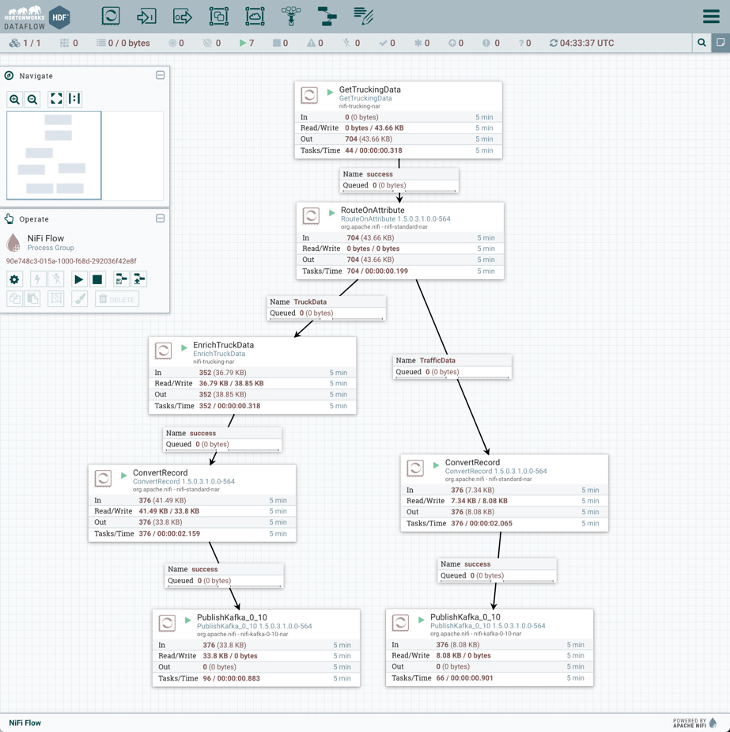
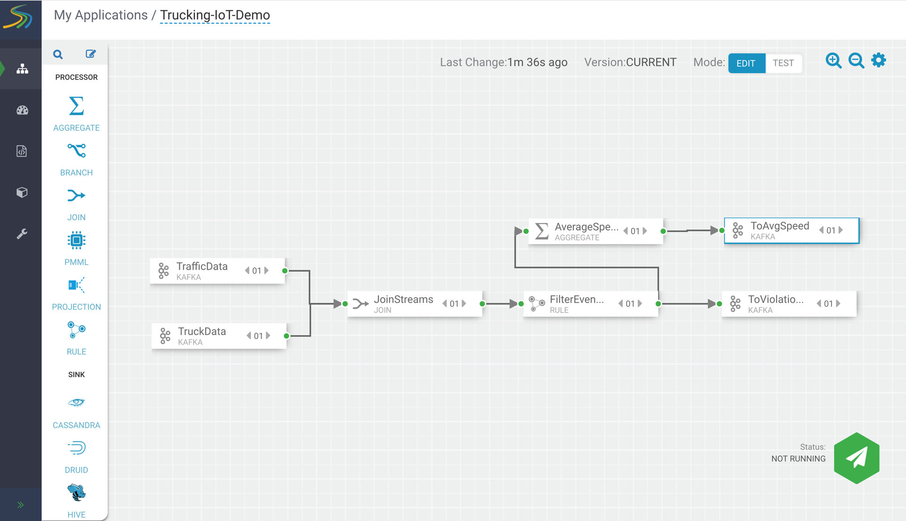

# Create a SAM Topology

## Objective

We are now familiar with the role stream processing plays in data science/engineering applications. Let's use Streaming Analytics Manager (SAM) to create stream topology.

Skills you will gain:
- Create a Service Pool, an Environment, and a SAM Application
- Create Schemas in Schema Registry needed for SAM Application
- Build, deploy and export a SAM topology
- Deploy NiFi DataFlow to source data into Kafka Topics that the SAM Application pulls data from
- Verify SAM stores data into Kafka Sink Queues using Kafka Commands
- Learn how to integrate NiFi, Kafka, Schema Registry with SAM

## Outline

- [Environment Setup](#environment-setup)
- [Create a SAM topology](#create-a-sam-topology)
- [Building the SAM Topology](#building-the-sam-topology)
- [Summary](#summary)
- [Further Reading](#further-reading)
- [Appendix A: HDF and HDP Sandbox Communication](#appendix-a-hdf-and-hdp-sandbox-communication)
- [Appendix B: Create Schemas in Schema Registry](#appendix-b-create-schemas-in-schema-registry)

## Environment Setup

Start your HDF Sandbox via Docker, VMware or VirtualBox.

1\. Head to Ambari at `sandbox-hdf.hortonworks.com:8080`.
Login credentials `username/password = admin/admin`.

2\. Wait for SAM to start indicated by the green check mark.

> Note: If any other services are powered off, make sure to turn them on by clicking on the **service name**->**service actions**->**start**

**Deploy NiFi Producer**

Before we can create the SAM topology, we need to start the producer to store data into the queues that SAM will pull data from.

4\. Open NiFi at `http://sandbox-hdf.hortonworks.com:9090/nifi/`

5\. Drag the template icon to the left of the pencil onto the canvas. Choose the default option.

6\. In the Operate panel, select the gear icon. Click on the lighting symbol, for Scope, select Service and referencing components, then Enable and close.

7\. Press control (command) and A to select entire nifi flow and in the Operate panel, press start.

> Note: If you want to learn more about how to build the NiFi Flow, refer to [NiFi in Trucking IoT](https://hortonworks.com/tutorial/nifi-in-trucking-iot-on-hdf/) tutorial.

## Create a SAM topology

Now we have a data source for SAM to pull in data, we will build the Trucking IoT SAM topology.

1\. Click on the service, then on the Summary page, click Quick Links, then SAM UI. You will be directed to this web address: `http://sandbox-hdf.hortonworks.com:7777/`

### Setup SAM

We need to setup SAM by creating a **service pool** and **environment** for our application. Since we are using the HDF Sandbox, it comes preloaded with an already created service pool and environment, so we will show you how you would create these two components if you had deployed a fresh HDF Platform that had no reference applications.

> Note: this section is less hands on because we already have the required components setup. If you want to skip this part, then you can head to **Add an Application** section.

Both components are accessible from the **Components** tab.

### Create a Service Pool

1\. Open Service Pool

2\. In the AUTO ADD field is where you insert your Ambari Cluster URL. The information you must include is as follows, you would take the definition and overwrite it to be your Ambari URL:

~~~
Definition:

http://ambari_host:port/api/v1/clusters/CLUSTER_NAME

Example:
http://sandbox-hdf.hortonworks.com:8080/api/v1/clusters/Sandbox
~~~

> Note: CLUSTER_NAME can be found in Ambari UI under admin(user)->Manage Ambari->Versions->Cluster

3\. Click AUTO ADD, you'll be prompted for Ambari login credentials: `user/password` = `admin/admin`

The result after adding the Ambari Cluster URL will be that SAM retrieves all Ambari Services and creates a new service pool.

> Note: To view the existing service pool: click the three squares near the service pool name, then press Edit.

### Create an Environment

1\. Open Environment

2\. On the top right of the page, you would click the plus button to add a new environment. When adding the enviroment for Trucking IoT application, we performed the following actions.

3\. Named the Environment. In our case, we chose the name:

~~~
SandboxEnvironment
~~~

4\. Provide a description. In our case, we wrote:

~~~
SandboxEnvironment
~~~

5\. Select Services. We selected all services:

~~~
Kafka, Storm, Ambari Infra, Zookeeper
~~~

6\. Then we clicked OK to add the new environment.

> Note: To view the existing environment: click the three squares near the environment name, then press Edit.

### Add an Application

A quick recap, we just explored the pre-exising service pool and environment for the Trucking IoT SAM application we will build. The topology, you will build from scratch. Let's become SAM Developers.

1\. Click on the SAM Logo in the top right corner to enter the My Applications page.

2\. Click on the Add Symbol in the top right of the page, select **New Application**.

The Add Application window will appear, enter the following information:

~~~
Name: Trucking-IoT-Demo

Environment: SandboxEnvironment
~~~

Then press OK.

SAM will load the canvas, so you can start building your application.

## Building the SAM Topology

Before we start adding components to the canvas, lets verify our Kafka topics and schemas are already created that we need to pull in data and store data using SAM.

**Kafka Topics Dependency Verification**

1\. Open the sandbox web shell client: `http://sandbox-hdf.hortonworks.com:4200`

2\. Login is `root/hadoop`. Run the following command to list kafka topics:

~~~bash
/usr/hdf/current/kafka-broker/bin/kafka-topics.sh --list --zookeeper localhost:2181
~~~

Output you should see:

~~~bash
trucking_avg_speed
trucking_data_traffic
trucking_data_truck
trucking_violations
~~~

If you don't see the topics listed above, then create them:

~~~bash
# trucking_data_truck
/usr/hdf/current/kafka-broker/bin/kafka-topics.sh --create --zookeeper localhost:2181 --replication-factor 1 --partitions 10 --topic trucking_data_truck

# trucking_data_traffic
/usr/hdf/current/kafka-broker/bin/kafka-topics.sh --create --zookeeper localhost:2181 --replication-factor 1 --partitions 10 --topic trucking_data_traffic

# trucking_violations
/usr/hdf/current/kafka-broker/bin/kafka-topics.sh --create --zookeeper localhost:2181 --replication-factor 1 --partitions 10 --topic trucking_violations

# trucking_avg_speed
/usr/hdf/current/kafka-broker/bin/kafka-topics.sh --create --zookeeper localhost:2181 --replication-factor 1 --partitions 10 --topic trucking_avg_speed
~~~

**Schemas Dependency Verification**

The HDF Sandbox comes with most of the trucking IoT schemas needded for the SAM topology, but we will need to create two schemas in order for the application to just be dependent on HDF.

3\. Create two new schemas for `trucking_violations` and `trucking_avg_speed` in Hortonworks' Schema Registry UI: `http://sandbox-hdf.hortonworks.com:7788/`.

4\. Click the " + " button. Add the following information into the "Add New Schema" window:

**Trucking Violations Schema**

~~~bash
Name: trucking_violations

Description: data illustrates trucking violations

Type: Avro schema provider

Schema Group: Kafka

Compatibility: Backward

Evolve: Checkmark

Schema Text: 

{
    "type" : "record",
    "namespace" : "com.orendainx.hortonworks.trucking",
    "name" : "TruckViolations",
    "fields" : [
        { "name" : "eventTime" , "type" : "long" },
        { "name" : "routeId" , "type" : "int" },
        { "name" : "congestionLevel" , "type" : "int" },
        { "name" : "truckId" , "type" : "int" },
        { "name" : "speed" , "type" : "int" },
        { "name" : "eventType" , "type" : "string" },
        { "name" : "windy" , "type" : "boolean" },
        { "name" : "rainy" , "type" : "boolean" },
        { "name" : "foggy" , "type" : "boolean" },
        { "name" : "longitude" , "type" : "double" }, 
        { "name" : "latitude" , "type" : "double" },
        { "name" : "routeName" , "type" : "string" },
        { "name" : "driverId" , "type" : "int" },
        { "name" : "driverName" , "type" : "string" }                             
    ]
}

~~~

When you verify the information is entered, confirm adding the new schema and click OK.

**Trucking Average Speed Schema**

~~~bash
Name: trucking_avg_speed

Description: data illustrates drivers average speed

Type: Avro schema provider

Schema Group: Kafka

Compatibility: Backward

Evolve: Checkmark

Schema Text: 

{
    "type" : "record",
    "namespace" : "com.orendainx.hortonworks.trucking",
    "name" : "TruckingAvgSpeed",
    "fields" : [
        { "name" : "driverId" , "type" : "int" },
        { "name" : "routeId" , "type" : "int" },
        { "name" : "speed" , "type" : "int" },
        { "name" : "foggy" , "type" : "boolean" },
        { "name" : "rainy" , "type" : "boolean" },
        { "name" : "speed_AVG" , "type" : "double" },
        { "name" : "windy" , "type" : "boolean" }
    ]
}

~~~

With these two new schemas, we can transport data between kafka queues.

When you verify the information is entered, confirm adding the new schema and click OK.

> Note: for more information on how Schemas being registered into Schema Registry and the architecture works, visit [Schema Registry in Trucking IoT on HDF](https://hortonworks.com/tutorial/schema-registry-in-trucking-iot-on-hdf/)

You may be wondering, why do we need Kafka topics and schemas? When we use Kafka Source components, we need a Kafka topic (queue) to pull in data from. The same idea can be applied for Kafka Sinks, but instead we store data into the queue. The schemas are needed to complement Kafka to provide data verification.

Let's began designing and creating our topology!

**SOURCE**

1\. Add 2 KAFKA source components onto the canvas as shown in **Figure 1**.

**Figure 1: Kafka Source Components**

2\. Configure both components. Double click on one of the components, their configuration window will appear.

Enter the following properties for the first Kafka Source you opened:

| Kafka Source 1    | Properties     |
| :------------- | :------------- |
| Name       | TrafficData       |
| **Tab**       | **REQUIRED**       |
| Cluster Name       | Sandbox      |
| Security Protocol       | PLAINTEXT       |
| Bootstrap Servers       | sandbox-hdf.hortonworks.com:6667       |
| Kafka Topic       | trucking_data_traffic       |
| Reader Schema Version | 1 |
| Consumed Group ID | trucking_data_traffic1 |
| **Tab**       | **OPTIONAL**       |
| First Poll Offset Strategy | EARLIEST |

When you are done, click OK.

| Kafka Source 2    | Properties     |
| :------------- | :------------- |
| Name       | TruckData       |
| **Tab**       | **REQUIRED**       |
| Cluster Name       | Sandbox      |
| Security Protocol       | PLAINTEXT       |
| Bootstrap Servers       | sandbox-hdf.hortonworks.com:6667       |
| Kafka Topic       | trucking_data_truck       |
| Reader Schema Version | 1 |
| Consumed Group ID | trucking_data_truck1 |
| **Tab**       | **OPTIONAL**       |
| First Poll Offset Strategy | EARLIEST |

> Note: If you are not able to choose a Kafka Topic, it could be that Kafka is powered off. Verify that the service is on, you can do so by checking the service in the Ambari Dashboard.

When you are done, click OK. 

**PROCESSOR**

3\. Add 3 processor components: JOIN, RULE and AGGREGATE onto the canvas.

4\. The two Kafka sources have green bubbles on their rightside edge, click, hold and drag to connect to the JOIN processor's grey bubble located on its leftside edge.

5\. Configure all three components. Double click on each component, enter the following properties for the appropriate processor:

| JOIN    | Properties     |
| :------------- | :------------- |
| Name       | JoinStreams       |
| **Tab**       | **CONFIGURATION**       |
| Input | kafka_stream_1 |
| SELECT STREAM | kafka_stream_2 |
| SELECT FIELD WITH | routeId |
| JOIN TYPE | INNER |  
| SELECT STREAM | kafka_stream_1 |
| SELECT FIELD | routeId |
| WITH STREAM | kafka_stream_2 |
| WINDOW TYPE | Processing Time |
| WINDOW INTERVAL | 1 |
| WINDOW INTERVAL | Seconds |
| SLIDING INTERVAL | 1 |
| SLIDING INTERVAL | Seconds |
| OUTPUT FIELDS | eventTime as `eventTime`, truckId as `truckId` |
| OUTPUT FIELDS | driverId as `driverId`, truckId as `driverName` |
| OUTPUT FIELDS | routeId as `routeId`, routeName as `routeName` |
| OUTPUT FIELDS | latitude as `latitude`, longitude as `longitude` |
| OUTPUT FIELDS | speed as `speed`, eventType as `eventType` |
| OUTPUT FIELDS | foggy as `foggy`, rainy as `rainy` |
| OUTPUT FIELDS | windy as `windy`, congestionanLevel as `congestionLevel` |

6\. Once you click OK for the JOIN processor configuration, its bubbles change to green. Now connect JOIN processor to the RULE processor. 

Enter the following properties:

| RULE    | Properties     |
| :------------- | :------------- |
| Name       | FilterEvents       |
| **Tab**       | **CONFIGURATION**       |
| Add New Rule `Rule Name`       | IsViolation       |
| Add New Rule `Description`       | IsViolation       |
| Add New Rule `Create Query`       | Select field name `eventType`       |
| Add New Rule `Create Query`       | Select operations `NOT_EQUAL`       |
| Add New Rule `Create Query`       | Select field name - Type `Normal`       |

~~~
Query Preview:

eventType <> 'Normal'
~~~

7\. Once you click OK, the new rule will appear in the table of rules for the RULE processor. Click OK again to save your configuration. Now connect RULE processor to the AGGREGATE processor. 

FilterEvents-AGGREGATE window will appear, select OK. Enter the following properties for the AGGREGATE processor:

| AGGREGATE    | Properties     |
| :------------- | :------------- |
| Name       | AverageSpeed       |
| **Tab**       | **CONFIGURATION**       |
| SELECT KEYS | driverId, routeId, speed |
| SELECT KEYS | foggy, rainy, windy |
| WINDOW INTERVAL TYPE | Time |
| WINDOW INTERVAL | 10 |
| WINDOW INTERVAL | Seconds |
| SLIDING INTERVAL | 10 |
| SLIDING INTERVAL | Seconds |
| TIMESTAMP FIELD | eventTime |
| LAG IN SECONDS | 1 |
| **BOX** | **Output Fields** |
| INPUT | speed |
| AGGREGATE FUNCTION | AVG |
| OUTPUT | speed_AVG |

Once you click OK, the configuration has been confirmed.

8\. Add 2 KAFKA SINK components onto the canvas.

Connect AverageSpeed processor to Kafka Sink 1 (ToAvgSpeed). Configure the processor with the following property values:

| KAFKA SINK 1   | Properties     |
| :------------- | :------------- |
| **Tab** | **REQUIRED** |
| Name       | ToAvgSpeed     |
| CLUSTER NAME | Sandbox |
| Kafka Topic | trucking_avg_speed |
| Writer Schema Version | 1 |
| Security Protocol | PLAINTEXT |
| Bootstrap Servers | sandbox-hdf.hortonworks.com:6667 |

Click OK to confirm configuration.

Connect ViolationEvents processor to Kafka Sink 2 (ToViolationEvents). Configure the processor with the following property values:

| KAFKA SINK 2  | Properties     |
| :------------- | :------------- |
| **Tab** | **REQUIRED** |
| Name       | ToViolationEvents     |
| CLUSTER NAME | Sandbox |
| Kafka Topic | trucking_violations |
| Writer Schema Version | 1 |
| Security Protocol | PLAINTEXT |
| Bootstrap Servers | sandbox-hdf.hortonworks.com:6667 |

Click OK to confirm configuration.

After building the SAM topology, you can deploy it by pressing the green arrow:

You will see the status shows not running, once you run it the following window "Are you sure want to continue with this configuration?" will appear, make sure to configure it with the following properties:

| Application Configuration  |    |
| :------------- | :------------- |
| **General** | **Values** |
| NUMBER OF WORKERS       | 1     |
| NUMBER OF ACKERS | 1 |
| TOPOLOGY MESSAGE TIMEOUT (SECONDS) | 30 |
| TOPOLOGY WORKER JVM OPTIONS | -Xmx1000m |
| NUMBER OF EVENT SAMPLING TASKS | 1 |

Click OK to confirm configuration.

You just deployed your SAM topology.

Lets open web shell client: `http://sandbox-hdf.hortonworks.com:4200`

Lets check the data in our Kafka Sink topics:

~~~bash
# trucking_violations
/usr/hdf/current/kafka-broker/bin/kafka-console-consumer.sh --zookeeper localhost:2181 --topic trucking_violations --from-beginning

# trucking_avg_speed
/usr/hdf/current/kafka-broker/bin/kafka-console-consumer.sh --zookeeper localhost:2181 --topic trucking_avg_speed --from-beginning
~~~

> Note: press control + D to exit from the kafka view messages.

## Summary

Congratulations you just built a SAM topology. You learned how to pull in data from the source that supplies it, such as Kafka, using Kafka source component. You used Join, Rule and Aggregate processors to do processing on the data. You also used Kafka Sink components to store data into Kafka topics. In the next tutorial you will connect HDF and HDP Sandboxes via SAM, Druid and HDFS.

## Further Reading

- [Streaming Analytics Manager Overview](https://hortonworks.com/open-source/streaming-analytics-manager/)
- [Streaming Analytics Manager Documentation](https://docs.hortonworks.com/HDPDocuments/HDF3/HDF-3.1.1/index.html)