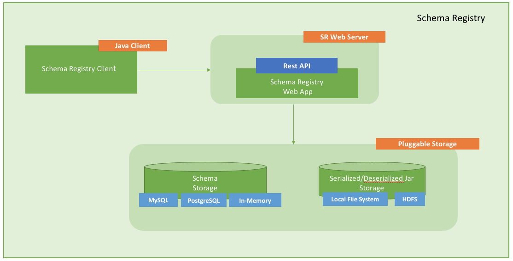
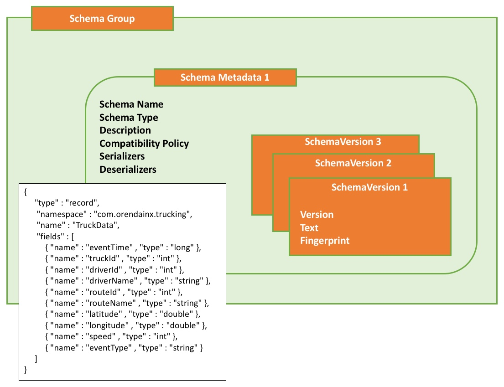

# Schema Registry in Trucking IoT on HDF

## Schema Registry Architecture

## Introduction

We should now have some understanding of the benefits that Schema Registry provides a modern data architecture.  Let's take a closer look at the main components that make up the registry.

## Outline

- [Main Components](#main-components)
- [Schema Entities](#schema-entities)
- [Integration with HDF](#integration-with-hdf)
- [Next: Using the Web Interface](#next-using-the-web-interface)

## Main Components

Schema Registry has the following main components:

Component | Description
--- | ---
Registry Web Server | Web Application exposing the REST endpoints you can use to manage schema entities. You can use a web proxy and load balancer with multiple Web Servers to provide HA and scalability.
Schema Metadata Storage | Relational store that holds the metadata for the schema entities. In-memory storage and mySQL databases are supported.
Serdes Storage | File storage for the serializer and deserializer jars. Local file system and HDFS storage are supported.
Schema Registry Client | A java client that HDF components can use to interact with the RESTful services.

Below is a graphic outlining how the different components come into play when sending and receiving messages affected by a schema.

## Schema Entities

Schema Registry can be seen as being made up of different type of metadata entities.

Entity | Description | Example
--- | --- | ---
Schema Group | A logical grouping of similar schemas. A Schema Group can be based on any criteria you have for managing schemas.  Schema Groups can have multiple Schema Metadata definitions. | The group name **trucking_data_truck** or **trucking_data_traffic**
Schema Metadata	| Metadata associated with a named schema. A metadata definition is applied to all the schema versions that are assigned to it. | Key metadata elements include: Schema Name, Schema Type, Description, Compatibility Policy, Serializers/Deserializers
Schema Version | The versioned schema (the actual schema text) associated with a schema metadata definition. | (Schema text example in following sections)

## Integration with HDF

When Schema Registry is paired with other services available as part of the Hortonworks DataFlow (HDF), integration with Schema Registry is baked in.

Component | Schema Registry Integration
--- | ---
NiFi | New processors and controller services in NiFi interact with Schema Registry.  This allows creating flows using drag-and-drop processors that grant the benefits mentioned in the previous section without writing any code.
Kafka | A Kafka serializer and deserializer that uses Schema Registry is included with Kafka, allowing events to be marshalled and unmarshalled automatically.
Streaming Analytics Manager (SAM) | Using a drag-and-drop paradigm to create processing jobs, SAM will automatically infer schema from data sources and sinks, ensuring that data expected by connected services are compatible with one another.

## Next: Using the Web Interface

Now that we have some understanding of what Schema Registry looks like under the hood, let's take it for a ride and poke around its web interface.  The interface makes it easy to create and modify schemas for any application running on our cluster.
