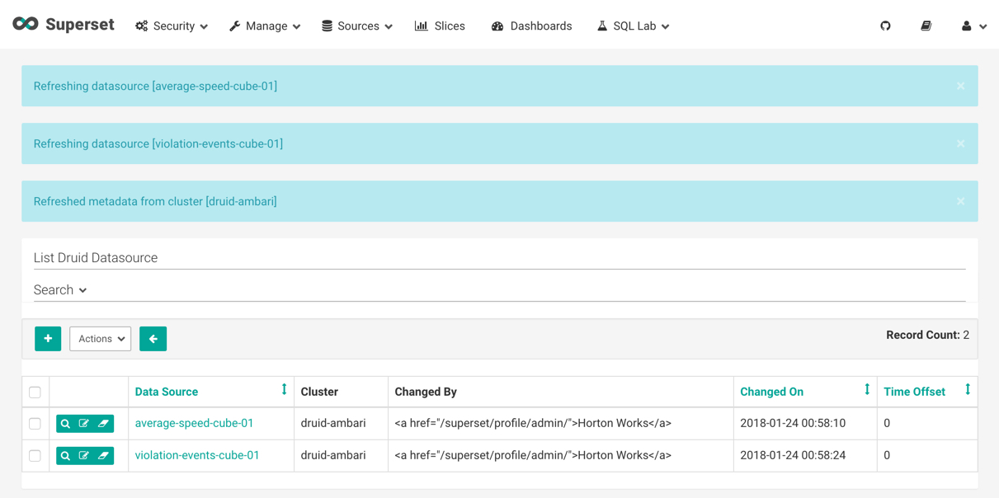

# Visualize Trucking Data

## Introduction

We know the role data visualization plays in data science applications. Let's use Superset to create various visual representations of the data from the Trucking IoT dataset.

## Outline

- [Superset Components](#superset-components)
- [Environment Setup](#environment-setup)
- [Create Visualization Slices](#create-visualization-slices)
- [Summary](#summary)
- [Further Reading](#further-reading)

## Superset Components

## Environment Setup

We will be working in the `trucking-iot` project. If you have the latest HDF Sandbox installed, then the demo comes preinstalled. If not or you do not already have it setup, then refer to [Setup Demo on existing HDF/HDP](https://github.com/orendain/trucking-iot/tree/hadoop-summit-2017#setup-on-existing-hdf-hdp).

Visit [Real-Time Event Processing In NiFi, SAM, Schema Registry and SuperSet](https://hortonworks.com/tutorial/real-time-event-processing-in-nifi-sam-schema-registry-and-superset/#step-5-visualize-trucking-data-via-superset), follow Steps 1 - 4. Skip Step 5 from the tutorial in the link because we will go more in depth on creating Superset Visualization slices in this tutorial.

**Setup Superset**

1\. Access Ambari at `http://sandbox-hdf.hortonworks.com:8080/` with user credentials `username/password = admin/admin`

2\. From the HDFS Service located in the left hand side bar, follow the steps to turn on HDFS. Click on **HDFS** -> **Service Actions** -> **Start** -> **Turn off Maintenance Mode** -> **Confirm Start**.

3\. Also turn on YARN, Druid and Superset with maintenance mode turned off. If Kafka is off, turn it on too.

4\. Open Superset at `http://sandbox-hdf.hortonworks.com:9089/`

5\. Wait about **5 – 10 minutes** for Kafka data to be consumed, then periodically, select the **Sources** dropdown and click on **Refresh Druid Metadata**. Eventually, the two Druid data sources will appear.

## Create Visualization Slices

Superset is being used to visualize the Druid data sources. From the characteristics of an effective visual display from the concepts section, we will apply them now to effectively visualize the **average-speed-cube-01** and **violation-events-cube-01** datasets.

## Summary

## Further Reading
