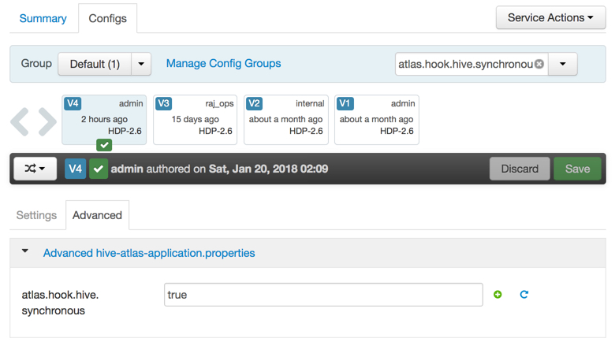
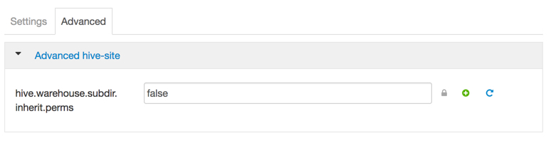

# Cross Component Lineage with Apache Atlas across Apache Sqoop, Hive, Kafka & Storm

## Introduction

Hortonworks introduced [Apache Atlas](https://hortonworks.com/blog/apache-atlas-project-proposed-for-hadoop-governance/) as part of the [Data Governance Initiative](https://hortonworks.com/press-releases/hortonworks-establishes-data-governance-initiative/), and has continued to deliver on the vision for open source solution for centralized metadata store, data classification, data lifecycle management and centralized security.
Atlas is now offering, as a tech preview, cross component lineage functionality, delivering a complete view of data movement across a number of analytic engines such as Apache Storm, Kafka, Falcon and Hive.
This tutorial walks through the steps for creating data in Apache Hive through Apache Sqoop and using Apache Kafka with Apache Storm.

## Prerequisites

- Downloaded and deployed the [Hortonworks Data Platform (HDP)](https://hortonworks.com/downloads/#sandbox) Sandbox
- [Learning the Ropes of the HDP Sandbox tutorial,](https://hortonworks.com/hadoop-tutorial/learning-the-ropes-of-the-hortonworks-sandbox/) you will need it for logging into Ambari
- 12 GB of RAM

## Outline

- [Configure Hive to work with Atlas](#configure-hive-to-work-with-atlas)
- [Start Kafka, Storm, HBase, Infra Solr and Atlas](#start-kafka-storm-hbase-infra-solr-and-atlas)
- [Sqoop-Hive Lineage](#sqoop-hive-lineage)
- [Kafka – Storm Lineage](#kafka-storm-lineage)
- [Summary](#summary)
- [Further Reading](#further-reading)

## Configure Hive to work with Atlas

Started by logging into Ambari as **raj_ops** user. User name - **raj_ops** and password - **raj_ops**.

### View the Services Page

From the Dashboard page of Ambari, click on `Hive` from the list of installed services.
Then click on `Configs` tab and search `atlas.hook.hive.synchronous` in the filter text box.

This property takes a boolean value and specifies whether to run the Atlas-Hive hook synchronously or not. By default, it is false, change it to `true` so that you can capture the lineage for hive operations.

Next search `hive.warehouse.subdir.inherit.perms` in the filter text box. This property takes a boolean value too. By default it is set to `true`, change it to `false` to avoid **AccessControlException** since HDP 2.5 and up comes with a patch for [BUG-55664](https://hortonworks.jira.com/browse/BUG-55664) that adds HIVE_WAREHOUSE_INHERIT_PERMS, which was not part of HDP 2.4. Thus, the hive table directories permissions will be derived from dfs umask.

Click `Save` after you make the change. Write **Atlas-hive hook enabled** in the prompt and then proceed with saving the change. You have to Restart Hive now. Click on `Restart` and then `Restart All Affected`.

## Start Kafka, Storm, HBase, Infra Solr and Atlas

From the Dashboard page of Ambari, click on `Kafka` from the list of installed services.

### Start Kafka Service

From the Kafka page, click on `Service Actions -> Start`

Check the `Maintenance Mode` box and click on `Confirm Start`:

Wait for Kafka to start (It may take a few minutes to turn green)

In the same way you started Kafka above, start other required services (in order):

1. Storm
2. HBase
3. Infra Solr
4. Atlas

### Stop Unneeded Services

Stop some services like **Spark, Oozie, Flume and Zeppelin** which are not required in this tutorial. Turn On the **Maintenance mode** also.
Your Ambari dashboard page should look like this:

### Log into the Sandbox.

First access the Sandbox Web Shell Client at `sandbox-hdp.hortonworks.com:4200`. The first time password for root user is `hadoop`.

Alternatively, you could "ssh" into the sandbox from your terminal or Windows Ubuntu Shell. `ssh root@localhost -p 2222`.

Text you should see on your screen looks similar:

~~~bash
sandbox login: root
root@sandbox.hortonworks.com's password:
Last login: Fri Jan  5 06:05:29 2018 from 10.0.2.2
[root@sandbox-hdp ~]#
~~~

### Download & extract the demo script

Run the following command to get to the scripts for the tutorial.

~~~bash
mkdir crosscomponent_demo
cd crosscomponent_demo
wget https://github.com/hortonworks/data-tutorials/raw/master/tutorials/hdp/cross-component-lineage-with-apache-atlas-across-apache-sqoop-hive-kafka-storm/assets/crosscomponent_scripts.zip
unzip crosscomponent_scripts.zip
~~~

## Sqoop-Hive Lineage 

We need a script for creating a MySQL table, then importing the table using Sqoop into Hive.

cd crosscomponent_scripts/sqoop-demo

### Create a mysql table

Run the below command in your terminal to login into mysql shell, create a table called **test_table_sqoop1** and then insert two records:

~~~bash
cat 001-setup-mysql.sql | mysql -u root -p
~~~

> NOTE: default password for mysql root user is hadoop. Enter it then press enter when prompted for password

### Run the SQOOP Job

Before we run the sqoop job, let's **configure the Atlas Sqoop Hook** via commands:

~~~
cp /etc/atlas/conf/atlas-application.properties /etc/sqoop/conf
ln -s /usr/hdp/2.6.4.0-91/atlas/hook/sqoop/*.jar /usr/hdp/2.6.4.0-91/sqoop/lib/
~~~

- cp copies atlas configuration properties to sqoop configuration directory
- ln links atlas sqoop-hook library to sqoop library folder

If you want to read up on Sqoop Hook from the documentation, visit [Sqoop Atlas Bridge](http://atlas.apache.org/Bridge-Sqoop.html).

Run the below command in your terminal. It is a **sqoop import** command to transfer the data from mysql table **test_table_sqoop1** to the hive table **test_hive_table1**. The hive table do not have to be pre-created, it would be created on fly.

~~~
sh 002-run-sqoop-import.sh
~~~

> NOTE: default password for mysql root user is hadoop. Enter it then press enter when prompted for password

Here is the screenshot of results you would see in the screen when you run the above script.

It will run the map-reduce job and at the end, you can see your new Hive table created:

### 3.5: Create CTAS sql command

CTAS stands for **create table as select**. We would create one more table in Hive from the table imported by the sqoop job above. The second table name is **cur_hive_table1** and we will create the table using beeline shell:
Run the below command in your terminal

~~~
cat 003-ctas-hive.sql | beeline -u "jdbc:hive2://localhost:10000/default" -n hive -p hive -d org.apache.hive.jdbc.HiveDriver
~~~

### 3.6: View ATLAS UI for the lineage

Click on http://sandbox-hdp.hortonworks.com:21000. Credentials are:

User name - **holger_gov**
Password - **holger_gov**

Click on `Search by Text` and type **cur_hive_table1**

You will see the lineage like given below. You can hover at each one of them to see the operations performed:

## Kafka – Storm Lineage 

The following steps will show the lineage of data between Kafka topic **my-topic-01** to Storm topology **storm-demo-topology-01**, which stores the output in the HDFS folder (`/user/storm/storm-hdfs-test`).

### Create a Kafka topic to be used in the demo

Run the following commands to create a new Kafka topic **my-topic-01**

~~~bash
cd ~/crosscomponent_demo/crosscomponent_scripts/storm-demo/
sh 001-create_topic.sh
~~~

### Create a HDFS folder for output

Run the following command to create a new HDFS directory under /user/storm

~~~bash
sh 002-create-hdfs-outdir.sh
~~~

> Note: If you would like to find the source code for the Job we are about to run in can be found by executing the following command:

~~~bash
sh 003-download-storm-sample.sh
~~~

### Kafka Storm Lineage

The Storm Job you are about to execute is in JAR format, the original source code can be found on [yhemanth's github repository](https://github.com/yhemanth/storm-samples/tree/master/src/main/java/com/dsinpractice/storm/samples).

In this example Atlas is leveraged to track the lineage of the Storm job with Kafka. This is a snippet of the code we are using, note that this is a simple word count algorithm; however, what we are interested in is the resultant lineage:

~~~java
public static class WordCount extends BaseBasicBolt {
        Map<String, Integer> counts = new HashMap<String, Integer>();

        @Override
        public void execute(Tuple tuple, BasicOutputCollector collector) {
            String word = tuple.getString(0);
            Integer count = counts.get(word);
            if (count == null)
                count = 0;
            count++;
            counts.put(word, count);
            collector.emit(new Values(word, count));
        }

        @Override
        public void declareOutputFields(OutputFieldsDeclarer declarer) {
            declarer.declare(new Fields("word", "count"));
        }

        ...
}
~~~

To run this job execute the following command:

~~~bash
sh 004-run-storm-job.sh
~~~

### View ATLAS UI for the lineage

Go to the Atlas UI http://localhost:21000/. Search for: **kafka_topic** this time and Click on: `my-topic-01`

Scroll down and you will see a lineage of all the operations from Kafka to Storm.

## Summary

**Apache Atlas** is the only governance solution for Hadoop that has native hooks within multiple Hadoop components and delivers lineage across these components. With the new preview release, Atlas now supports lineage across data movement in Apache Sqoop, Hive, Kafka, Storm and in Falcon.

## Further Reading

Please go through following Hortonworks Community articles to know more about Apache Atlas:

1. [Understanding Taxonomy in Apache Atlas](https://community.hortonworks.com/articles/58932/understanding-taxonomy-in-apache-atlas.html)
2. [Hive Data Lineage using Apache Atlas](https://community.hortonworks.com/content/kbentry/58885/hive-data-lineage-using-apache-atlas.html)
