# Cross Component Lineage with Apache Atlas across Apache Sqoop, Hive, Kafka & Storm

## Introduction

Hortonworks introduced [Apache Atlas](https://hortonworks.com/blog/apache-atlas-project-proposed-for-hadoop-governance/) as part of the [Data Governance Initiative](https://hortonworks.com/press-releases/hortonworks-establishes-data-governance-initiative/), and has continued to deliver on the vision for open source solution for centralized metadata store, data classification, data lifecycle management and centralized security.
Atlas is now offering, as a tech preview, cross component lineage functionality, delivering a complete view of data movement across a number of analytic engines such as Apache Storm, Kafka, and Hive.
This tutorial walks through the steps for creating data in Apache Hive through Apache Sqoop and using Apache Kafka with Apache Storm.

## Prerequisites

- Downloaded and deployed the [Hortonworks Data Platform (HDP)](https://www.cloudera.com/downloads/hortonworks-sandbox/hdp.html?utm_source=mktg-tutorial) Sandbox
- [Learning the Ropes of the HDP Sandbox tutorial](https://hortonworks.com/hadoop-tutorial/learning-the-ropes-of-the-hortonworks-sandbox/)
- 12 GB of RAM

## Outline

- [Configure Hive to work with Atlas](#configure-hive-to-work-with-atlas)
- [Start Kafka, Storm, HBase, Infra Solr and Atlas](#start-kafka-storm-hbase-infra-solr-and-atlas)
- [Sqoop and Hive Lineage](#sqoop-and-hive-lineage)
- [Kafka and Storm Lineage](#kafka-and-storm-lineage)
- [Summary](#summary)
- [Further Reading](#further-reading)

## Configure Hive to work with Atlas

Started by logging into Ambari as **raj_ops** user. User name - **raj_ops** and password - **raj_ops**.

### Services

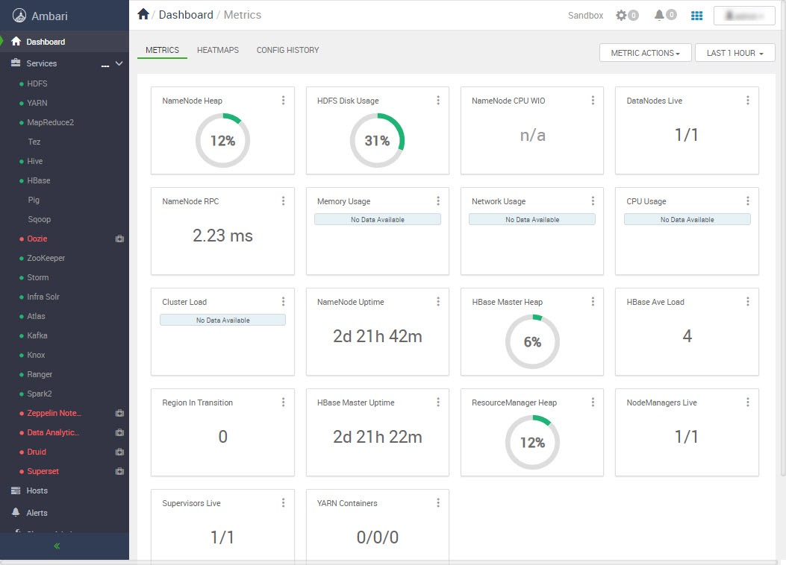

From the Dashboard page of Ambari, click on **Hive** from the list of installed services.
Then click on **Configs** tab and search **atlas.hook.hive.synchronous** in the filter text box.

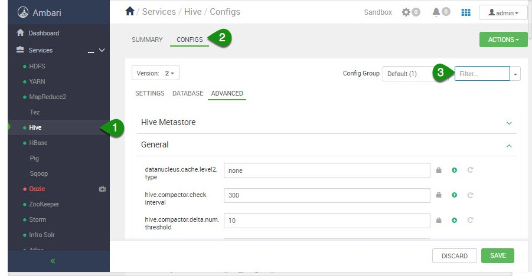

This property takes a boolean value and specifies whether to run the Atlas-Hive hook synchronously or not. By default, it is false, change it to **true** so that you can capture the lineage for hive operations.

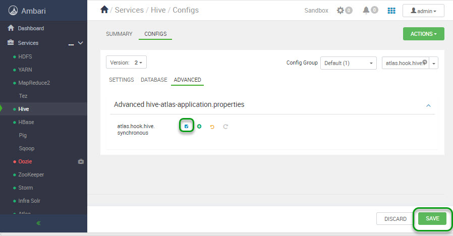

Click **Save** after you make the change. Write **Atlas-hive hook enabled** in the prompt and then proceed with saving the change. Now we must Restart Hive, click on **Restart** and then **Restart All Affected**.

## Start Kafka, Storm, HBase, Infra Solr and Atlas

From the Dashboard page of Ambari, click on **Kafka** from the list of installed services.

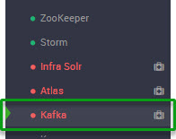

### Start Kafka Service

From the Kafka page, click on **Service Actions -> Start**

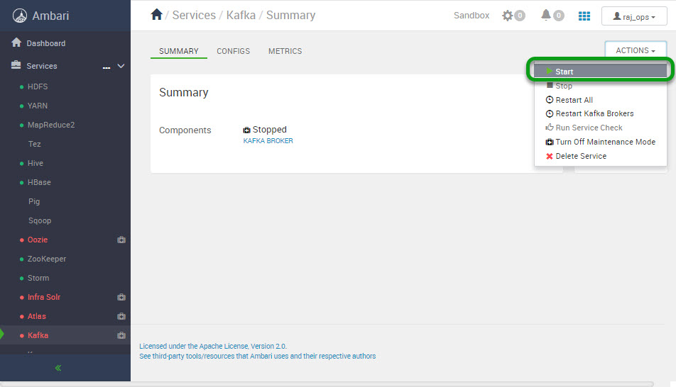

Check the **Maintenance Mode** box and click on **Confirm Start**:

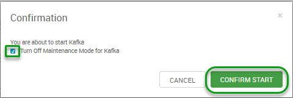

Wait for Kafka to start (It may take a few minutes to turn green)

In the same way you started Kafka above, start other required services (in order):

1. Storm
2. HBase
3. Infra Solr
4. Atlas

### Stop Unneeded Services

Stop some services like **Spark, Oozie, Flume and Zeppelin** which are not required in this tutorial and also turn on **Maintenance mode**.
Your Ambari dashboard page should look like this:

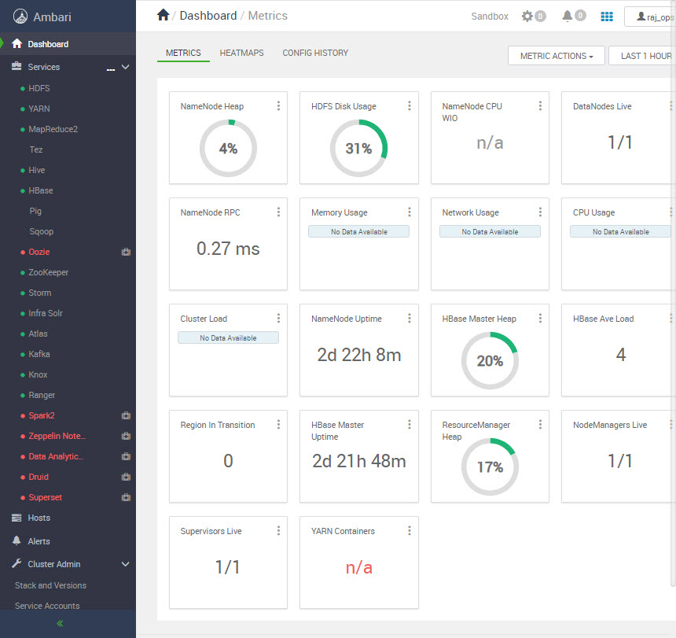

### Log into the Sandbox.

First access the Sandbox Web Shell Client at `sandbox-hdp.hortonworks.com:4200`. The first time password for root user is `hadoop`.

Alternatively, you could "ssh" into the sandbox from your terminal or Windows Ubuntu Shell. `ssh root@sandbox-hdp.hortonworks.com -p 2222`

Text you should see on your screen looks similar:

~~~bash
sandbox login: root
root@sandbox.hortonworks.com's password:
Last login: DDD MMM  D HH:MM:SS YYYY from x.x.x.x
[root@sandbox-hdp ~]#
~~~

### Download & extract the demo script

Run the following command to get to the scripts for the tutorial.

~~~bash
cd /tmp/sandbox/
mkdir crosscomponent_demo
cd crosscomponent_demo
wget https://github.com/hortonworks/data-tutorials/raw/master/tutorials/hdp/cross-component-lineage-with-apache-atlas-across-apache-sqoop-hive-kafka-storm/assets/crosscomponent_scripts.zip
unzip crosscomponent_scripts.zip
chmod -R 777 /tmp/sandbox/crosscomponent_demo/
~~~

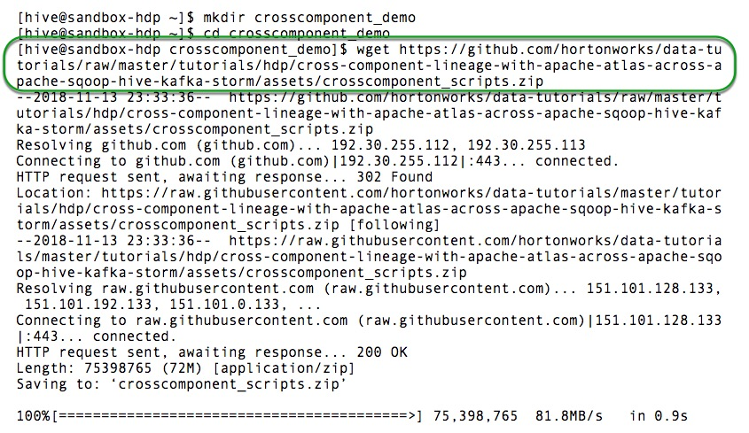

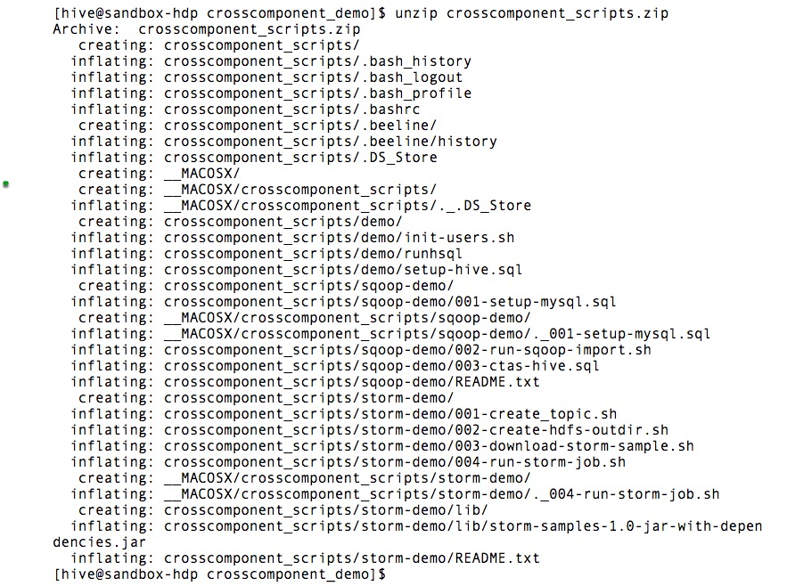

## Sqoop and Hive Lineage

### Create a mysql table

Let's first switch user to hive as this is the only user with access to hive managed tables:

~~~bash
su hive
cd /tmp/sandbox/crosscomponent_demo/crosscomponent_scripts/sqoop-demo/
~~~

In the sqoop-demo directory we will find three files which we will leverage to work across Hadoop components and track their lineage.

The first script **001-setup-mysql.sql** is in charge of creating a new MySQL database and table and populate the table with data to execute enter the following command:

~~~bash
cat 001-setup-mysql.sql | mysql -u root -p
~~~

The contents of the script are shown below:

~~~sql
CREATE DATABASE IF NOT EXISTS test;
USE test;
CREATE TABLE IF NOT EXISTS test_table_sqoop1 ( name char(25), location char(64) );
INSERT INTO test_table_sqoop1 VALUES ( 'George Rueda de Leon', 'Monterey,CA');
INSERT INTO test_table_sqoop1 VALUES ( 'Christian Lopez', 'Santa Cruz,CA');
INSERT INTO test_table_sqoop1 VALUES ( 'James Medel', 'San Francisco,CA');
INSERT INTO test_table_sqoop1 VALUES ( 'Ana Castro', 'Santa Ana,CA');
INSERT INTO test_table_sqoop1 VALUES ( 'Rafael Coss', 'San Jose,CA');
INSERT INTO test_table_sqoop1 VALUES ( 'Edgar Orendain', 'Mountain View,CA');
~~~

> NOTE: default password for mysql root user is **hortonworks1**. Enter it then press enter when prompted for password

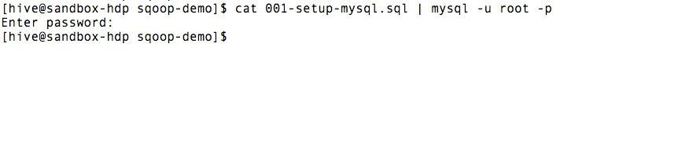

### Run the SQOOP Job

The script below is a **sqoop import** command to transfer the data from mysql table **test_table_sqoop1** to the hive table **test_hive_table1**. The hive table do not have to be pre-created, it would be created on fly.
to execute the script above issue the following command:

~~~bash
sh 002-run-sqoop-import.sh
~~~

These are the contents of **002-run-sqoop-import.sh**

~~~bash
#!/bin/bash
sqoop import --connect jdbc:mysql://sandbox-hdp.hortonworks.com/test --table test_table_sqoop1 --hive-import --hive-table test_hive_table1 --username root -P -m 1 --fetch-size 1
~~~

> NOTE: default password for mysql root user is **hortonworks1**. Enter it then press enter when prompted for password

Here is the screenshot of results you would see in the screen when you run the above script.

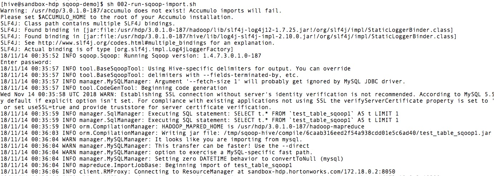

It will run the map-reduce job and at the end, you can see your new Hive table created:

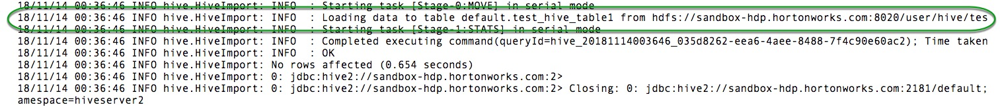

### Create CTAS sql command

CTAS stands for **create table as select**. We would create one more table in Hive from the table imported by the sqoop job above. The second table name is **cur_hive_table1** and we will create the table using beeline shell:

Run the below command in your terminal

~~~bash
cat 003-ctas-hive.sql | beeline -u "jdbc:hive2://sandbox-hdp.hortonworks.com:10000/default" -n hive -p hive -d org.apache.hive.jdbc.HiveDriver
~~~

these are the contents of the script:

~~~sql
CREATE TABLE IF NOT EXISTS cur_hive_table1
AS SELECT * FROM test_hive_table1;
~~~

### View ATLAS UI for the lineage

Navigate to http://sandbox-hdp.hortonworks.com:21000 Credentials are:

User name - **admin**
Password - **hortonworks1**

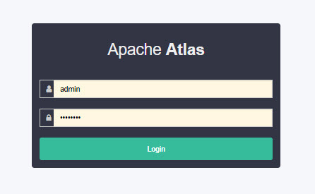

Click on **Search by Text** and type `cur_hive_table1`

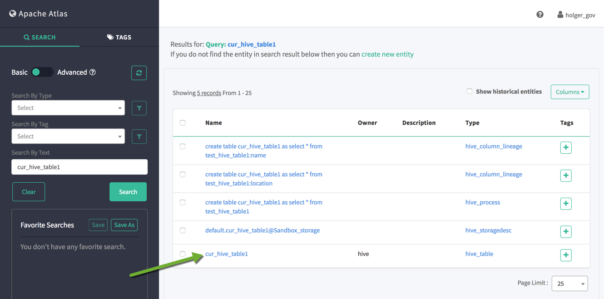

You will see the lineage like given below. You can hover at each one of them to see the operations performed:

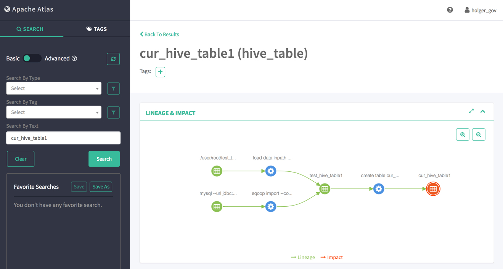

## Kafka and Storm Lineage

The following steps will show the lineage of data between Kafka topic **my-topic-01** to Storm topology **storm-demo-topology-01**, which stores the output in the HDFS folder (`/user/storm/storm-hdfs-test`).

### Create a Kafka topic to be used in the demo

Now let's switch users to continue

~~~bash
su root
~~~

and chage directory to the storm demo directory

~~~bash
cd /tmp/sandbox/crosscomponent_demo/crosscomponent_scripts/storm-demo/
~~~

The following script creates a new Kafka topic **my-topic-01**
execute the script:

~~~bash
sh 001-create_topic.sh
~~~

Below are the contents of the script:

~~~bash
#!/bin/bash
/usr/hdp/current/kafka-broker/bin/kafka-topics.sh --create --topic my-topic-01 --zookeeper sandbox-hdp.hortonworks.com:2181 --partitions 1 --replication-factor 1
~~~

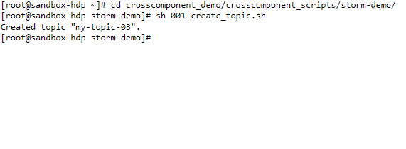

### Create a HDFS folder for output

Run the following command to create a new HDFS directory under /user/storm

~~~bash
sh 002-create-hdfs-outdir.sh
~~~

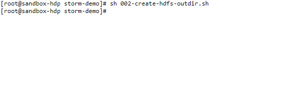

> Note: If you would like to find the source code for the Job we are about to run in can be found by executing the following command:

~~~bash
sh 003-download-storm-sample.sh
~~~

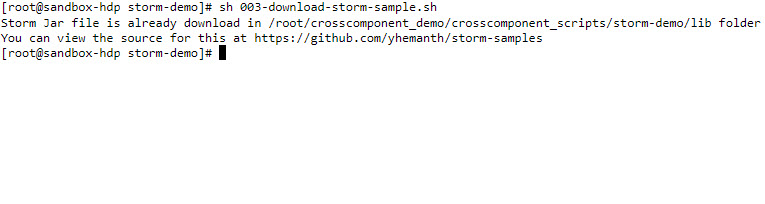

### Kafka Storm Lineage in Atlas

The Storm Job you are about to execute is in JAR format, the original source code can be found on [yhemanth's github repository](https://github.com/yhemanth/storm-samples/tree/master/src/main/java/com/dsinpractice/storm/samples).

In this example Atlas is used to track the lineage of the Storm job with Kafka. This is a snippet of the code we are using, note that this is a simple word count algorithm; however, what we are interested in is the resultant lineage:

~~~java
public static class WordCount extends BaseBasicBolt {
        Map<String, Integer> counts = new HashMap<String, Integer>();

        @Override
        public void execute(Tuple tuple, BasicOutputCollector collector) {
            String word = tuple.getString(0);
            Integer count = counts.get(word);
            if (count == null)
                count = 0;
            count++;
            counts.put(word, count);
            collector.emit(new Values(word, count));
        }

        @Override
        public void declareOutputFields(OutputFieldsDeclarer declarer) {
            declarer.declare(new Fields("word", "count"));
        }

        ...
}
~~~

To run this job execute the following command:

~~~bash
sh 004-run-storm-job.sh
~~~

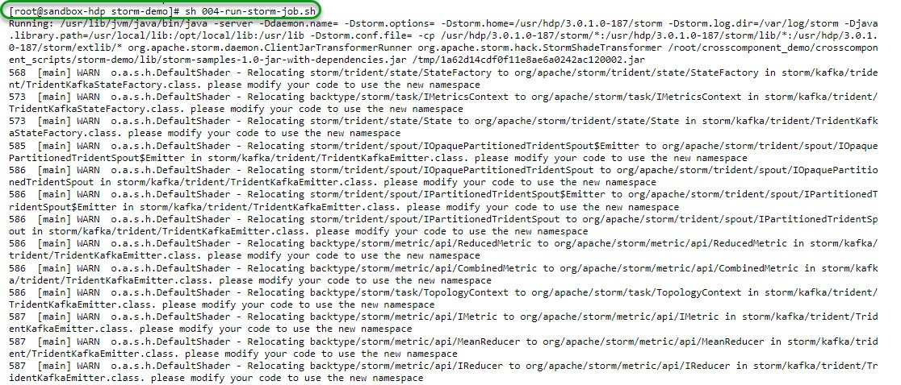

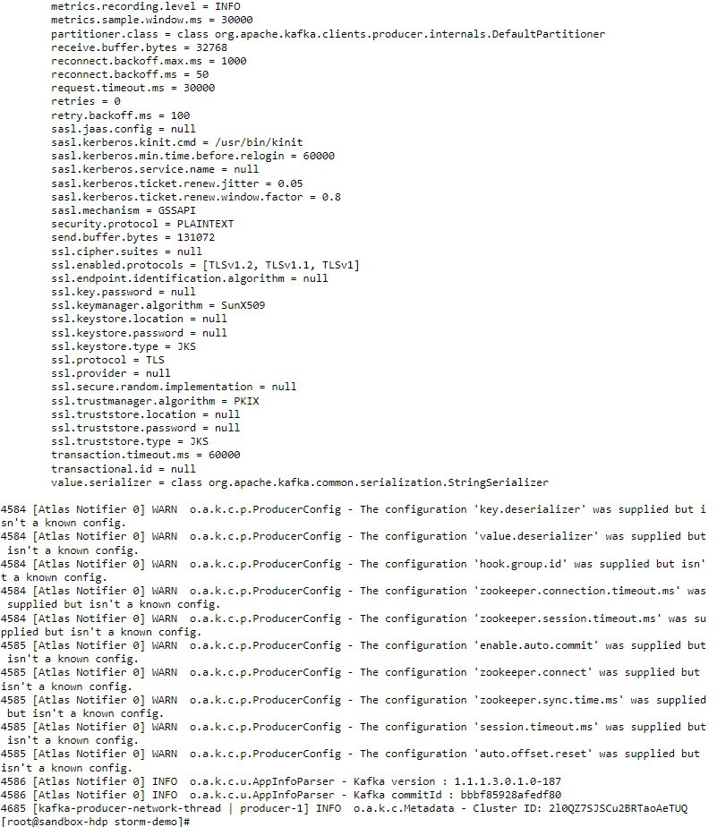

### View ATLAS UI for the lineage

Navigate to the Atlas UI [http://sandbox-hdp.hortonworks.com:21000/](http://sandbox-hdp.hortonworks.com:21000/)

Usename and password for Atlas: **admin/admin123**

 Search for: **kafka_topic** this time and Click on: `my-topic-01`

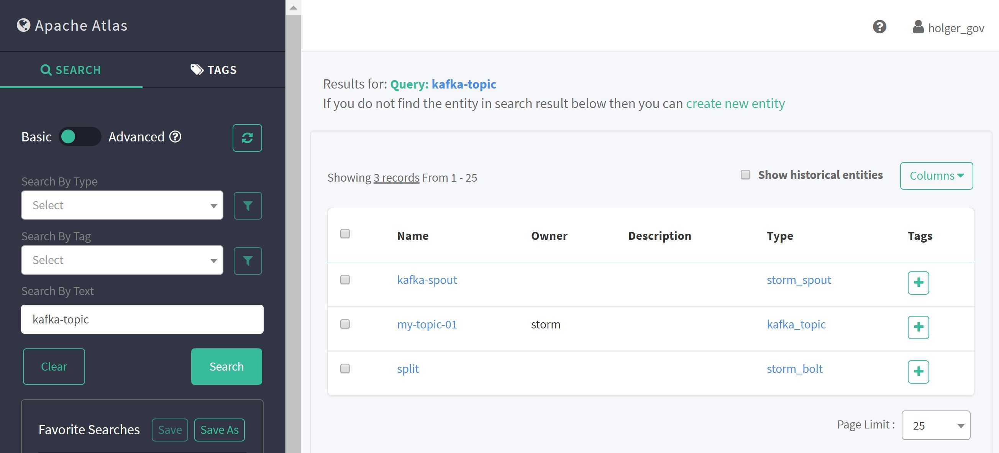

Scroll down and you will see a lineage of all the operations from Kafka to Storm.

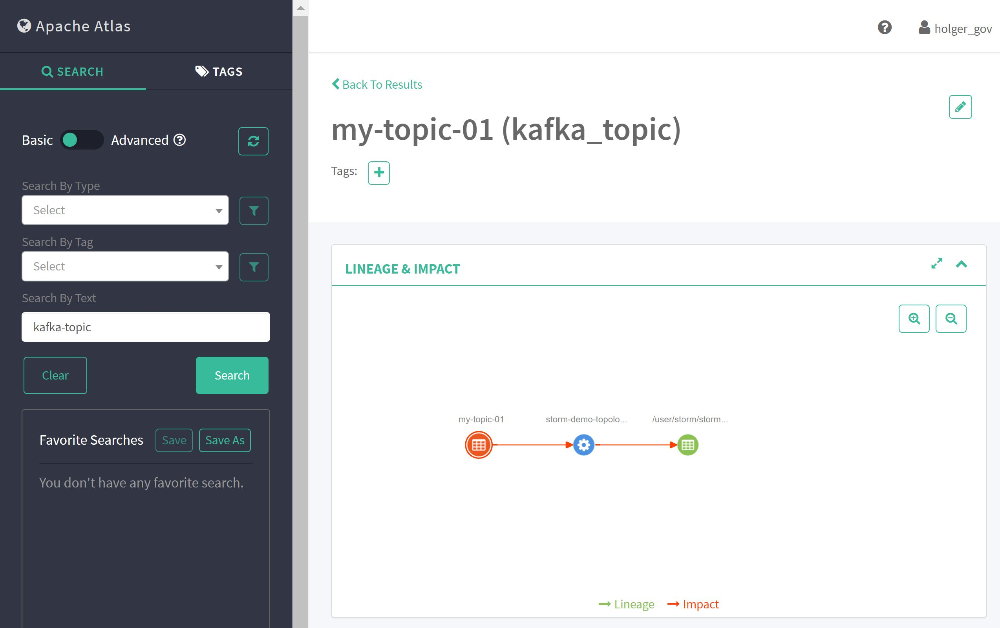

Note that the lineage will be tracked for every cross component operation, here is an example of running the Storm Job multiple times:

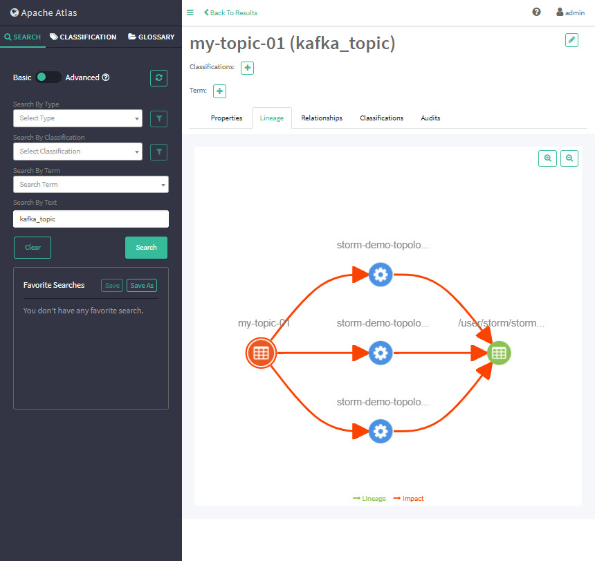

## Summary

**Apache Atlas** is the only governance solution for Hadoop that has native hooks within multiple Hadoop components and delivers lineage across these components. With the new preview release, Atlas now supports lineage across data movement in Apache Sqoop, Hive, Kafka, and Storm.

## Further Reading

Please go through following Hortonworks Community articles to know more about Apache Atlas:

1. [Understanding Taxonomy in Apache Atlas](https://community.hortonworks.com/articles/58932/understanding-taxonomy-in-apache-atlas.html)
2. [Hive Data Lineage using Apache Atlas](https://community.hortonworks.com/content/kbentry/58885/hive-data-lineage-using-apache-atlas.html)
