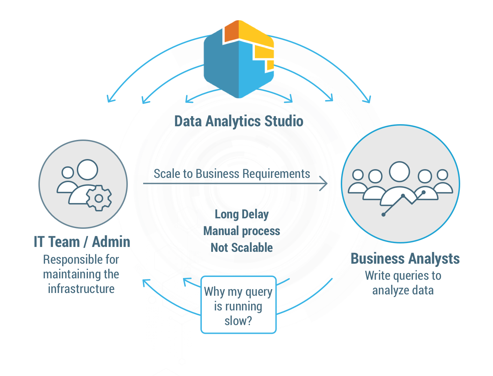
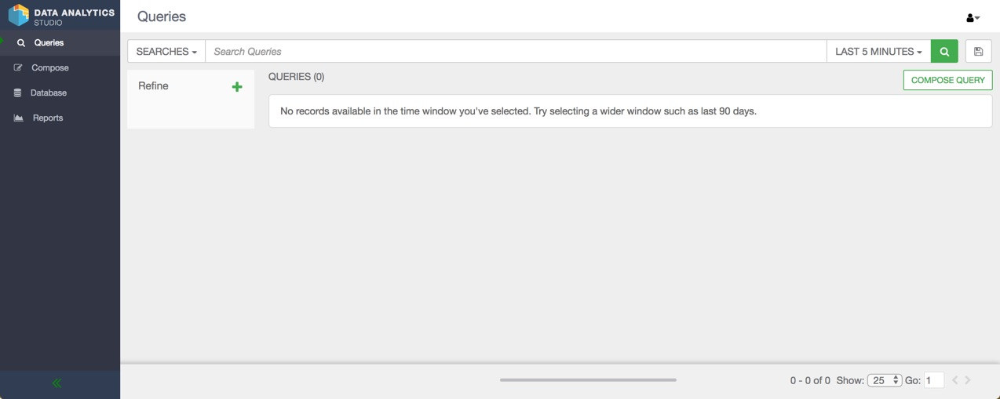

# Getting Started With DAS

## Introduction

Data Analytics Studio or DAS forms part of Hortonworks Data Plane

Intro Intro

## Prerequisites

- Downloaded and deployed the [Hortonworks Data Platform (HDP)](https://hortonworks.com/downloads/#sandbox) Sandbox
- Ensure Spark version 2.x or later is installed

## Outline

## Concepts

## Summary

## Further Reading
