# Querying Data from Druid

## Introduction

You will learn to write Druid JSON-based queries. We will use Zeppelin to write
the Druid queries and run them against our **wikipedia** datasource.

## Prerequisites

- Setup the Development Environment
- Loading Batch Data into Druid

## Outline

- [Query Data with JSON-based Queries](#query-data-with-json-based-queries)
- [Step 1: Run TopN Query to find Most-edited Articles](#step-1-run-topn-query-to-find-most-edited-articles)
- [Step 2: Analyze TopN Query](#step-2-analyze-topn-query)
- [Summary](#summary)
- [Further Reading](#further-reading)
- [Appendix A: Use Druid's other Query Types](#appendix-a-use-druids-other-query-types)
- [Appendix B: Further Reading](#appendix-b-further-reading)

## Query Data with JSON-based Queries

In general, the steps you would take for querying data within Druid include:

1\. Choose one of [Druid's available queries](http://druid.io/docs/latest/querying/querying.html) for your use case:
    - Aggregation Queries, Metadata Queries, Search Queries

2\. Construct your JSON-based Query

3\. Send a POST Request to Druid Coordinator to execute your Query Request

## Step 1: Run TopN Query to find Most-edited Articles

1\. Open Zeppelin UI at http://sandbox-hdp.hortonworks.com:9995.

2\. Create a new notebook, call it `Druid-JSON-based-Queries`

Select **sh** for **Default Interpreter**. Then click **Create**.

3\. We will create the directory in which our Druid queries will be stored.

~~~md
%md
## Create Directory to Store Druid Queries
~~~

Press **shift + enter** to execute the code:

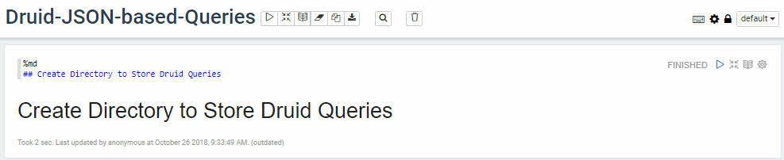

Copy and paste the following shell code:

~~~bash
%sh
mkdir -p /tmp/sandbox/tutorial-files/900/druid/query
~~~

Output from executed code:

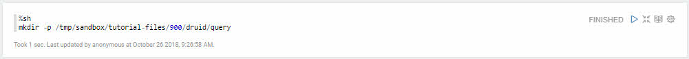

4\. We will construct a JSON-based TopN Query to find the most-edited articles.

~~~md
%md
## Create TopN Query to find Most-edited Articles
~~~

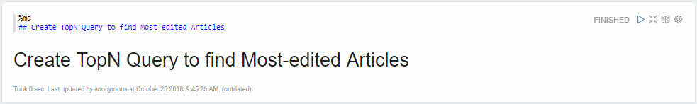

Copy and paste the following shell code to create the JSON-based query:

~~~bash
%sh
PATH_TO_FILE="/tmp/sandbox/tutorial-files/900/druid/query/wiki-top-pages.json"
tee -a $PATH_TO_FILE << EOF
{
  "queryType" : "topN",
  "dataSource" : "wikipedia",
  "intervals" : ["2015-09-12/2015-09-13"],
  "granularity" : "all",
  "dimension" : "page",
  "metric" : "edits",
  "threshold" : 25,
  "aggregations" : [
    {
      "type" : "longSum",
      "name" : "edits",
      "fieldName" : "count"
    }
  ]
}
EOF
~~~

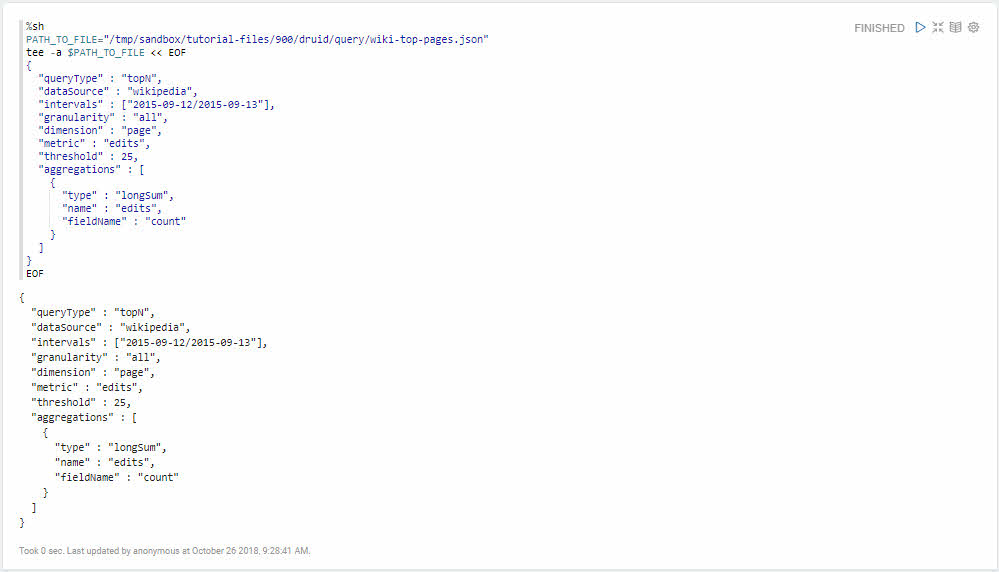

3\. We will submit query to Druid Coordinator to be executed against wikipedia
datasource:

~~~md
%md
## Submit Query to Druid Coordinator for Execution on DataSource
~~~

Copy and paste the following shell code to submit query to Druid Coordinator:

~~~bash
%sh
# Submit JSON Query to Druid Coordinator
PATH_TO_FILE="/tmp/sandbox/tutorial-files/900/druid/query/wiki-top-pages.json"
curl -L -H 'Content-Type: application/json' -X POST --data-binary @$PATH_TO_FILE http://sandbox-hdp.hortonworks.com:8082/druid/v2/?pretty
~~~

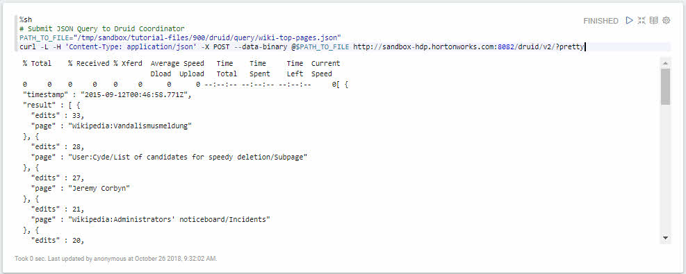

In the above query results at **timestamp** **2015-09-12T00:46:58.771Z**: we can see various Wikipedia pages in ascending order for their number of page edits.

If we look at the first entry returned,
we see that Wikipedia page **Wikipedia:Vandalismusmeldung** has 33 edits.

Similarly if we move to the 25th entry, we can see that **User:Valmir144/sandbox** has 10 edits.

Let's reflect and analyze the query we just ran against the wikipedia
datasource.

### Step 2: Analyze TopN Query

Let's breakdown this JSON query to understand what is happening.

### queryType: topN

The "query type" we selected to query Druid is the aggregation query:

~~~json
{
  "queryType" : "topN",
  ...
}
~~~

- **queryType** - Druid looks at this parameter to understand how to interpret the query

- **topN** - each node will rank their top K result and return only the top K results to the [Druid-broker component](http://sandbox-hdp.hortonworks.com:8080/#/main/services/DRUID/summary) (you can see it from Ambari Druid Service). We will see more of what this means as we construct more of the query.

### dataSource: wikipedia

~~~json
{
  "queryType" : "topN",
  "dataSource" : "wikipedia",
  ...
}
~~~

- **dataSource** - the name of the "data source" (similar to table in relational databases) you want to query

### intervals: ["2015-09-12/2015-09-13"]

~~~json
{
  "queryType" : "topN",
  "dataSource" : "wikipedia",
  "intervals" : ["2015-09-12/2015-09-13"],
  ...
}
~~~

- **intervals** - specifies the time ranges to run the query over. In our case, we are running the query over a span of one whole day from 2015-09-12 to 2015-09-13.

### granularity: "all"

~~~json
{
  "queryType" : "topN",
  "dataSource" : "wikipedia",
  "intervals" : ["2015-09-12/2015-09-13"],
  "granularity" : "all",
  ...
}
~~~

- **granularity** - defines the how data gets bucked across the time dimension. In our case, we selected **all**, so we will get all the results combined into one bucket.

### dimension: "page"

~~~json
{
  "queryType" : "topN",
  "dataSource" : "wikipedia",
  "intervals" : ["2015-09-12/2015-09-13"],
  "granularity" : "all",
  "dimension" : "page",
  ...
}
~~~

- **dimension** - specifies the String or JSON object we are going to query the dataSources for. In our case, we are querying "page" column.

In the next part of the query, we will see what metric we are querying the "page" for.

### metric: "edits"

~~~json
{
  "queryType" : "topN",
  "dataSource" : "wikipedia",
  "intervals" : ["2015-09-12/2015-09-13"],
  "granularity" : "all",
  "dimension" : "page",
  "metric" : "edits",
  ...
}
~~~

- **metric** - specifies the String or JSON Object to sort by for the top list. In our cas, we are sorting by the JSON object "edits" to find the top list of page "edits". If you look in the dataSource, you will see it appears Druid is collecting everytime the String "edits" appear in the JSON Object "comment" found in each row and pairing it with the appropriate page that was edited.

### threshold: 25

~~~json
{
  "queryType" : "topN",
  "dataSource" : "wikipedia",
  "intervals" : ["2015-09-12/2015-09-13"],
  "granularity" : "all",
  "dimension" : "page",
  "metric" : "edits",
  "threshold" : 25,
  ...
}
~~~

- **threshold** - an integer that defines the maximum number of items **N** to return after topN list is computed.

### aggregations

~~~json
{
  "queryType" : "topN",
  "dataSource" : "wikipedia",
  "intervals" : ["2015-09-12/2015-09-13"],
  "granularity" : "all",
  "dimension" : "page",
  "metric" : "edits",
  "threshold" : 25,
  "aggregations" : [
    {
      "type" : "longSum",
      "name" : "edits",
      "fieldName" : "count"
    }
  ]
}
~~~

- **aggregations** - specifies the type of aggregators or mathematical computations to perform on specific JSON objects or count the number of rows for the entire dataSource

- **longSum Aggregator** - specified we want to compute the longSum or the sum of all page "edits" and store the result into output JSON Object "count".

Thus, for every page, there will be a result for the number of edits for that page. The query will return the top 25 pages with the most page edits from the "wikipedia" dataSource.

## Summary

Congratulations! You just learned to write a JSON-based TopN query to search for the top Wikipedia page edits in our **wikipedia** dataSource.

Feel free to check out the appendix for more examples on how to query the dataSource using other Aggregation Queries, Metadata Queries and Search Queries.

## Further Reading

- [Druid Quickstart: Direct Druid queries](http://druid.io/docs/latest/tutorials/quickstart.html)
- [Druid Querying](http://druid.io/docs/latest/querying/querying.html)
- [TopN queries](http://druid.io/docs/latest/querying/topnquery.html)
- [Aggregation Granularity](http://druid.io/docs/latest/querying/granularities.html)

## Appendix A: Use Druid's other Query Types

Earlier, we learned how to write a JSON-based **TopN** aggregation query to retrieve most edited Wikipedia pages from our **wikipedia** dataSource.

In case you may need to use Druid's other query types: Select, Aggregation, Metadata and Search, we put together a summarization of what the query does, an example that can query the **wikipedia** dataSource and the results from after the query is executed.

In the Zeppelin note, add the following title for the extra druid queries we
will run:

~~~md
%md
## Appendix: Use Druid's Other Query Options
~~~

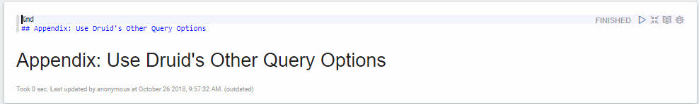

### Wikiticker JSON Dataset

~~~json
{
    "time":"2015-09-12T00:47:05.474Z",
    "channel":"#en.wikipedia",
    "cityName":"Auburn",
    "comment":"/* Status of peremptory norms under international law */ fixed spelling of 'Wimbledon'",
    "countryIsoCode":"AU",
    "countryName":"Australia",
    "isAnonymous":true,
    "isMinor":false,
    "isNew":false,
    "isRobot":false,
    "isUnpatrolled":false,
    "metroCode":null,
    "namespace":"Main",
    "page":"Peremptory norm",
    "regionIsoCode":"NSW",
    "regionName":"New South Wales",
    "user":"60.225.66.142",
    "delta":0,
    "added":0,
    "deleted":0
}
~~~

### Select Query

In the Zeppelin note, add the following title for the extra druid queries we
will run:

~~~md
%md
## Select Query
~~~

### Select

1\. Create the wiki-select query to select 2 rows of data from the dataSource.

~~~bash
%sh
PATH_TO_FILE="/tmp/sandbox/tutorial-files/900/druid/query/wiki-select.json"
tee -a $PATH_TO_FILE << EOF
{
  "queryType": "select",
  "dataSource": "wikipedia",
  "dimensions": [],
  "metrics": [],
  "intervals": [
    "2015-09-12/2015-09-13"
  ],
  "granularity": "all",
  "pagingSpec": {
    "pagingIdentifiers": {},
    "threshold": 2
  }
}
EOF
~~~

Execute the above shell code in the Zeppelin note.

2\. Send the JSON-based Query to the Druid Coordinator over HTTP POST request:

~~~bash
%sh
curl -L -H 'Content-Type: application/json' -X POST --data-binary @/tmp/sandbox/tutorial-files/900/druid/query/wiki-select.json http://sandbox-hdp.hortonworks.com:8082/druid/v2/?pretty
~~~

Output from the select query:

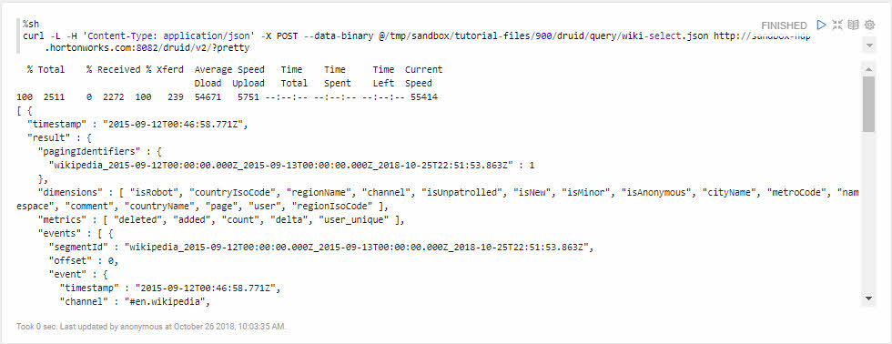

### Aggregation Queries

In the Zeppelin note, add the following title for the extra druid queries we
will run:

~~~md
%md
## Aggregation Queries: Timeseries, GroupBy
~~~

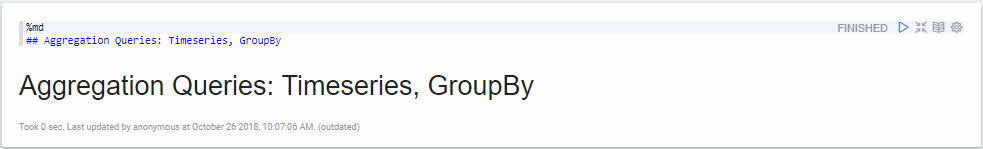

### Timeseries

- **timeseries query** measures how things change over time in which **time** is the primary axis.

**What does the time-series query track?**

It tracks changes to the JSON Object or String as inserts. So if we use time-series query to track page edits, now we can measure how it changes in the past, monitor how it is changing in the present and predict how it may change in the future.

**Timeseries Query Question to be Answered**

- What is the total number of Wikipedia page edits per hour?

1\. Create the wiki-timeseries query, which in the span of 24 hour interval will count the total page edits per hour and store the result into variable "edits."

~~~json
%sh
PATH_TO_FILE="/tmp/sandbox/tutorial-files/900/druid/query/wiki-timeseries.json"
tee -a $PATH_TO_FILE << EOF
{
  "queryType": "timeseries",
  "dataSource": "wikipedia",
  "descending": "true",
  "granularity": "hour",
  "aggregations": [
    {
      "type": "longSum",
      "name": "edits",
      "fieldName": "count"
    }
  ],
  "intervals": [
    "2015-09-12/2015-09-13"
  ]
}
EOF
~~~

2\. Send the JSON-based Query to the Druid Coordinator over HTTP POST request:

~~~bash
%sh
curl -L -H 'Content-Type: application/json' -X POST --data-binary @/tmp/sandbox/tutorial-files/900/druid/query/wiki-timeseries.json http://sandbox-hdp.hortonworks.com:8082/druid/v2/?pretty
~~~

Output from the timeseries query:

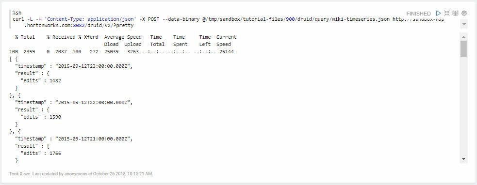

From the result, we see for every hour within the interval specified in our query, a count for all page edits is taken and the sum is stored into the field name "edits" for each hour.

In a relational database scenario, the database would need to scan over all rows and then count them at query time. However with Druid, at indexing time, we already specified our count aggregation, so when Druid performs a query that needs this aggregation, Druid just returns the count.

### Enrich Query with Selector Filter

In the Zeppelin note, add the following title for the timeseries query
enrichment:

~~~
%md
## Enrich Timeseries with Selector Filter

Retrieve information on how page edits happened for Wiki pages in Australia
~~~

Now coming back to the previous result, what if we wanted to get insight about how page edits happened for Wiki pages in Australia?

1\. We would create the wiki-enrich-timeseries.json query to retrieve the
answer in our question:

~~~bash
%sh
PATH_TO_FILE="/tmp/sandbox/tutorial-files/900/druid/query/wiki-enrich-timeseries.json"
tee -a $PATH_TO_FILE << EOF
{
  "queryType": "timeseries",
  "dataSource": "wikipedia",
  "descending": "true",
  "filter": {
    "type": "selector",
    "dimension": "countryName",
    "value": "Australia"
  },
  "granularity": "hour",
  "aggregations": [
    {
      "type": "longSum",
      "name": "edits",
      "fieldName": "count"
    }
  ],
  "intervals": [
    "2015-09-12/2015-09-13"
  ]
}
EOF
~~~

2\. Send the JSON-based Query to the Druid Coordinator over HTTP POST request:

~~~bash
%sh
curl -L -H 'Content-Type: application/json' -X POST --data-binary @/tmp/sandbox/tutorial-files/900/druid/query/wiki-enrich-timeseries.json http://sandbox-hdp.hortonworks.com:8082/druid/v2/?pretty
~~~

Output from the enriched timeseries query:

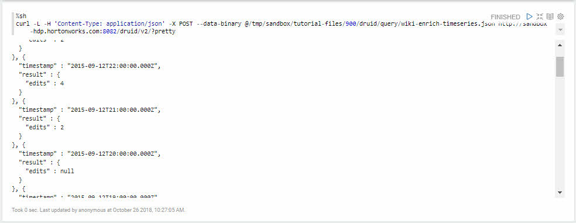

You will probably notice some page edits per hour show up as null, which occurs since Wiki page edits related to Australia were not edited.

### GroupBy

- **GroupBy query** - used when you want to group multiple dimensions (JSON Objects or Strings) from the dataSource together to answer a question(s)

**GroupBy Query Question to be Answered**

In Australia, who were the "users", which "pages" did they edit and how many "edits" did they make?

1\. We would create the wiki-grouby.json query to retrieve the
answer in our question:

~~~python
%spark2.pyspark
import json

data="""{
  "queryType": "groupBy",
  "dataSource": "wikipedia",
  "granularity": "hour",
  "dimensions": [
    "page", "user"
  ],
  "filter": {
    "type": "selector",
    "dimension": "countryName",
    "value": "Australia"
  },  
  "aggregations": [
    {
      "type": "longSum",
      "name": "edits",
      "fieldName": "count"
    }
  ],
  "intervals": [
    "2015-09-12/2015-09-13"
  ]
}"""

with open('/tmp/sandbox/tutorial-files/900/druid/query/wiki-grouby.json', 'w') as outfile:
  outfile.write(data)

with open('/tmp/sandbox/tutorial-files/900/druid/query/wiki-grouby.json', 'r') as infile:
  data = infile.read()

print(data)
~~~

- **"queryType": "groupBy"** - specifies you want Druid to run the groupBy query type
- **"dataSource": "wikipedia"** - specifies the **wikiticker** set of data will be queried (like a table in relational database)
- **"granularity": "hour"** - specifies the data will be queried in hour intervals
- **"dimensions": [ "page", "user" ]** - specifies the groupBy action will be performed on **page and user** dimensions
- **filter** - specifies a filter to use only certain fields in the query
  - **"type": "selector"** - matches a specific dimension with a expected value, Equivalent Ex: `WHERE <dimension_string> = '<expected_dimension_value>`
  - **"dimension": "countryName"** - specifies the JSON Object or String from the dataSource you want to select
  - **"value": "Australia"** - specifies the specific dimension value you want to match with your dimension
- **"aggregations"** - specifies a particular computation to perform on a metric (JSON Object with numeric value) of your dataSource
    - **"type": "longSum"** - specifies you want to compute sum of a particular field's value within the dataSource
    - **"name": "edits"** - states the result from the computed sum will be stored in a JSON Object called "edits"
    - **"fieldName": "count"** - specifies the metric variable "count" value will be computed for the sum
- **"intervals"** - defines the time ranges to run the query over
    - **"2015-09-12/2015-09-13"** - a JSON Object represented across a 1 day time period (ISO-8601)

2\. Send the JSON-based Query to the Druid Coordinator over HTTP POST request
either use approach 1 Python or approach 2 Shell:

Approach 1 Python:

~~~python
%spark2.pyspark
import urllib2

coordinator_url = "http://sandbox-hdp.hortonworks.com:8082/druid/v2/?pretty"
file_in_path = "/tmp/sandbox/tutorial-files/900/druid/query/wiki-grouby.json"

with open(file_in_path, 'r') as infile:
  json_query_data = infile.read()

# Send the JSON query via HTTP POST Request to Druid Coordinator URL
req = urllib2.Request(coordinator_url, json_query_data)
# Specify in the request, the incoming data is JSON
req.add_header('Content-Type', 'application/json')

# Store the file object returned from HTTP POST Response
response = urllib2.urlopen(req)
# Read the data in the file object to see the response's output
print(response.read())
~~~

Approach 2 Shell:

~~~bash
curl -L -H 'Content-Type: application/json' -X POST --data-binary @/tmp/sandbox/tutorial-files/900/druid/query/wiki-groupby.json http://sandbox-hdp.hortonworks.com:8082/druid/v2/?pretty
~~~

Output from the enriched timeseries query:

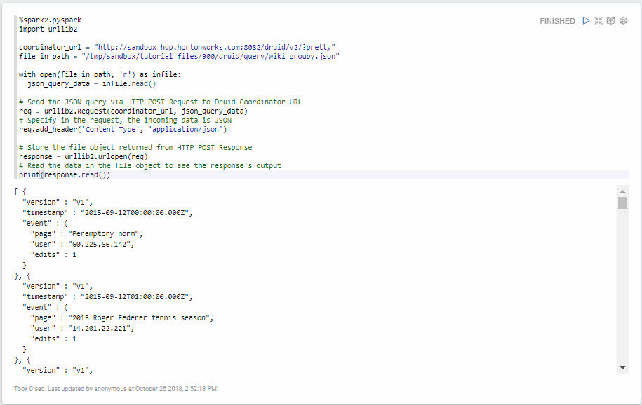

Notice how we extracted **page** and **user** into our JSON output using the GroupBy query. We just brought more insight to which page was edited, who did it and how many times they changed something.

### Metadata Queries

In the Zeppelin note, add the following title for the metadata queries:

~~~
%md
## Metadata Queries
~~~

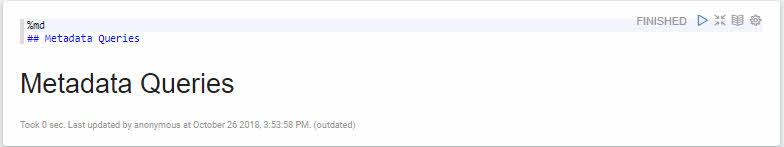

### Time Boundary

- **time boundary query** - used when you want to return the earliest and latest data points of a data source

1\. Create the wiki-timeboundary:

~~~python
%spark2.pyspark
druid_timeboundary_query = """
{
  "queryType": "timeBoundary",
  "dataSource": "wikipedia"
}
"""
with open('/tmp/sandbox/tutorial-files/900/druid/query/wiki-timeboundary.json', 'w') as outfile:
  outfile.write(druid_timeboundary_query)

with open('/tmp/sandbox/tutorial-files/900/druid/query/wiki-timeboundary.json', 'r') as infile:
  verify_query = infile.read()

print(verify_query)
~~~

- **"queryType": "timeBoundary"** - specifies you want Druid to run the timeBoundary query type

2\. Send the JSON-based Query to the Druid Coordinator over HTTP POST request
either use approach 1 Python or approach 2 Shell to execute the query:

Approach 1 Python:

~~~python
%spark2.pyspark
import urllib2

coordinator_url = "http://sandbox-hdp.hortonworks.com:8082/druid/v2/?pretty"
file_in_path = "/tmp/sandbox/tutorial-files/900/druid/query/wiki-timeboundary.json"

with open(file_in_path, 'r') as infile:
  json_query_data = infile.read()

# Send the JSON query via HTTP POST Request to Druid Coordinator URL
req = urllib2.Request(coordinator_url, json_query_data)
# Specify in the request, the incoming data is JSON
req.add_header('Content-Type', 'application/json')

# Store the file object returned from HTTP POST Response
response = urllib2.urlopen(req)
# Read the data in the file object to see the response's output
print(response.read())
~~~

Approach 2 Shell:

~~~bash
curl -L -H 'Content-Type: application/json' -X POST --data-binary @/tmp/sandbox/tutorial-files/900/druid/query/wiki-timeboundary.json http://sandbox-hdp.hortonworks.com:8082/druid/v2/?pretty
~~~

Output from the timeboundary query:

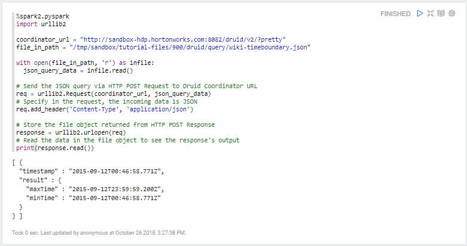

As you can see the query returns the earliest and latest changes that were made in the data set.

### Segment Metadata

- **segment metadata queries** - returns per-segment information. Some data one may find is the uniqueness of data values in all columns in the segment, min/max values of string type columns, number of rows stored in the segment, segment id, etc.

1\. Create the wiki-segment:

~~~python
%spark2.pyspark
file_in_path = "/tmp/sandbox/tutorial-files/900/druid/query/wiki-segment.json"
druid_segment_query = """
{
  "queryType": "segmentMetadata",
  "dataSource": "wikipedia",
  "intervals": [ "2015-09-12/2015-09-13" ]
}
"""
with open(file_in_path, 'w') as outfile:
  outfile.write(druid_segment_query)

with open(file_in_path, 'r') as infile:
  verify_query = infile.read()

print(verify_query)
~~~

Analysis of the above query:

- **"queryType": "segmentMetadata"** - specifies you want Druid to run the segmentMetadata query type
- **"dataSource": "wikipedia"** - specifies the **wikiticker** set of data will be queried
- **"intervals": [ "2015-09-12/2015-09-13" ]** - defines a 1 day time range to run the query over

2\. Send the JSON-based Query to the Druid Coordinator over HTTP POST request
either use approach 1 Python or approach 2 Shell to execute the query:

Approach 1 Python:

~~~python
%spark2.pyspark
import urllib2

coordinator_url = "http://sandbox-hdp.hortonworks.com:8082/druid/v2/?pretty"
file_in_path = "/tmp/sandbox/tutorial-files/900/druid/query/wiki-segment.json"

with open(file_in_path, 'r') as infile:
  json_query_data = infile.read()

# Send the JSON query via HTTP POST Request to Druid Coordinator URL
req = urllib2.Request(coordinator_url, json_query_data)
# Specify in the request, the incoming data is JSON
req.add_header('Content-Type', 'application/json')

# Store the file object returned from HTTP POST Response
response = urllib2.urlopen(req)
# Read the data in the file object to see the response's output
print(response.read())
~~~

Approach 2 Shell:

~~~bash
curl -L -H 'Content-Type: application/json' -X POST --data-binary @/tmp/sandbox/tutorial-files/900/druid/query/wiki-segment.json http://sandbox-hdp.hortonworks.com:8082/druid/v2/?pretty
~~~

You should see similar output:

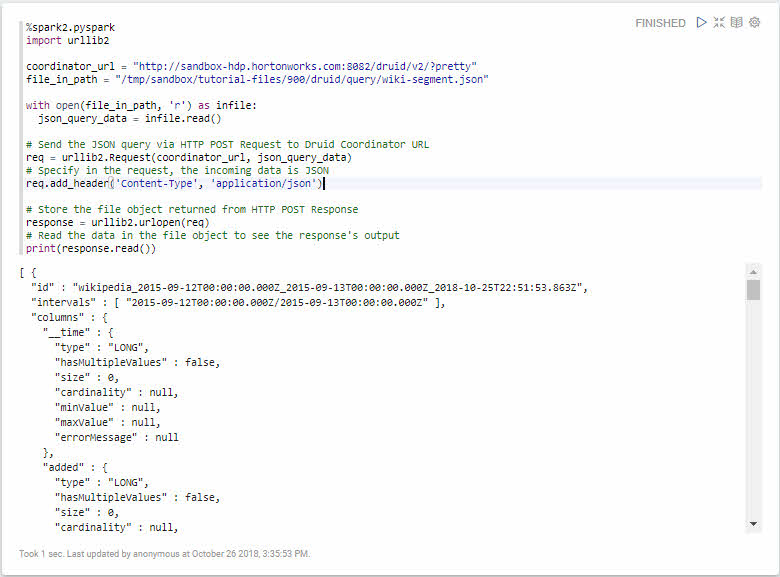

In your console output, notice how all the metadata regarding each column is output onto the screen.

### Datasource Metadata

- **datasource metadata query** - returns metadata of the data source

1\. Create the wiki-ds-metadata.json query:

~~~python
%spark2.pyspark
file_in_path = "/tmp/sandbox/tutorial-files/900/druid/query/wiki-ds-metadata.json"
druid_ds_metadata_query = """
{
  "queryType": "dataSourceMetadata",
  "dataSource": "wikipedia"
}
"""
with open(file_in_path, 'w') as outfile:
  outfile.write(druid_ds_metadata_query)

with open(file_in_path, 'r') as infile:
  verify_query = infile.read()

print(verify_query)
~~~

2\. Send the JSON-based Query to the Druid Coordinator over HTTP POST request
either use approach 1 Python or approach 2 Shell to execute the query:

Approach 1 Python:

~~~python
%spark2.pyspark
import urllib2

coordinator_url = "http://sandbox-hdp.hortonworks.com:8082/druid/v2/?pretty"
file_in_path = "/tmp/sandbox/tutorial-files/900/druid/query/wiki-ds-metadata.json"

with open(file_in_path, 'r') as infile:
  json_query_data = infile.read()

# Send the JSON query via HTTP POST Request to Druid Coordinator URL
req = urllib2.Request(coordinator_url, json_query_data)
# Specify in the request, the incoming data is JSON
req.add_header('Content-Type', 'application/json')

# Store the file object returned from HTTP POST Response
response = urllib2.urlopen(req)
# Read the data in the file object to see the response's output
print(response.read())
~~~

Approach 2 Shell:

~~~bash
curl -L -H 'Content-Type: application/json' -X POST --data-binary @/tmp/sandbox/tutorial-files/900/druid/query/wiki-ds-metadata.json http://sandbox-hdp.hortonworks.com:8082/druid/v2/?pretty
~~~

Output from dataSource metadata:

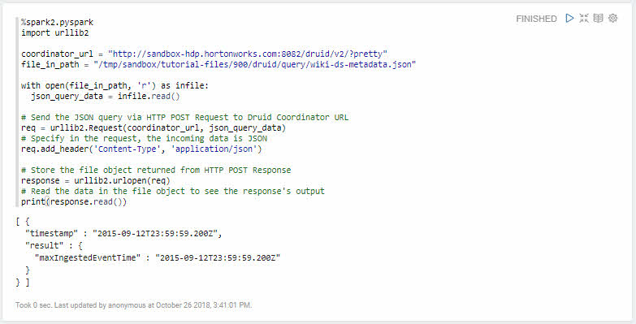

**What kind of information does this query return?**

We can see a **timestamp** of the latest ingested event for the data source.

NOTE: this ingested event does not take consideration of roll-up.

### Search Queries

In the Zeppelin note, add the following title for the search query:

~~~
%md
## Search Query
~~~

### Search

- **search** - returns the dimension values that match the search parameters

1\. Create the wiki-search.json query:

~~~python
%spark2.pyspark
file_in_path = "/tmp/sandbox/tutorial-files/900/druid/query/wiki-search.json"
druid_search_query = """
{
  "queryType": "search",
  "dataSource": "wikipedia",
  "granularity": "hour",
  "searchDimensions": [
    "page",
    "user"
  ],
  "query": {
    "type": "insensitive_contains",
    "value": "truck"
  },
  "sort": {
    "type": "lexicographic"
  },
  "intervals": [
    "2015-09-12/2015-09-13"
  ]
}
"""
with open(file_in_path, 'w') as outfile:
  outfile.write(druid_search_query)

with open(file_in_path, 'r') as infile:
  verify_query = infile.read()

print(verify_query)
~~~

**"query" -> "type": "insensitive_contains"** - a "match" will occur if any part of the dimension value contains the value noted in the query specification.

**"sort" -> "type": "lexicographic"** - sorts values by converting their Strings to UTF-8 byte array equivalents and comparing byte by byte.

2\. Send the JSON-based Query to the Druid Coordinator over HTTP POST request
either use approach 1 Python or approach 2 Shell to execute the query:

Approach 1 Python:

~~~python
%spark2.pyspark
import urllib2

coordinator_url = "http://sandbox-hdp.hortonworks.com:8082/druid/v2/?pretty"
file_in_path = "/tmp/sandbox/tutorial-files/900/druid/query/wiki-search.json"

with open(file_in_path, 'r') as infile:
  json_query_data = infile.read()

# Send the JSON query via HTTP POST Request to Druid Coordinator URL
req = urllib2.Request(coordinator_url, json_query_data)
# Specify in the request, the incoming data is JSON
req.add_header('Content-Type', 'application/json')

# Store the file object returned from HTTP POST Response
response = urllib2.urlopen(req)
# Read the data in the file object to see the response's output
print(response.read())
~~~

Approach 2 Shell:

~~~bash
curl -L -H 'Content-Type: application/json' -X POST --data-binary @/tmp/sandbox/tutorial-files/900/druid/query/wiki-search.json http://sandbox-hdp.hortonworks.com:8082/druid/v2/?pretty
~~~

Output from dataSource metadata:

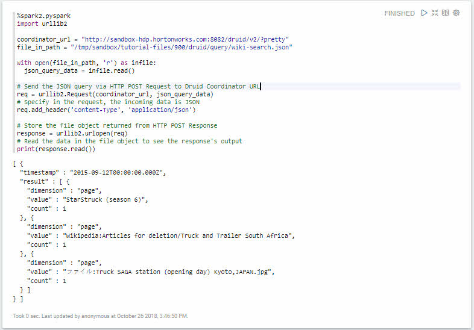

As you can see we searched for "user" or "page" dimensions which contain the value "truck". You will see "truck" is not case sensitive "StarStruck", "Truck", etc.

## Appendix B: Further Reading

**Aggregation Query Reference**

- [Druid Timeseries Queries](http://druid.io/docs/latest/querying/timeseriesquery.html)
- [Druid GroupBy Queries](http://druid.io/docs/latest/querying/groupbyquery.html)

**Metadata Query Reference**

- [Druid Time Boundary Queries](http://druid.io/docs/latest/querying/timeboundaryquery.html)
- [Druid Segment Metadata Queries](http://druid.io/docs/latest/querying/segmentmetadataquery.html)
- [Druid Datasource Metadata Queries](http://druid.io/docs/latest/querying/datasourcemetadataquery.html)

**Search Query Reference**

- [Druid Search Queries](http://druid.io/docs/latest/querying/searchquery.html)

**Query Extra Features Reference**

- [Druid Query Filters](http://druid.io/docs/latest/querying/filters.html)
- [Druid Filtering with Extraction Functions](http://druid.io/docs/latest/querying/filters.html#filtering-with-extraction-functions)
- [What is time-series data?](https://blog.timescale.com/what-the-heck-is-time-series-data-and-why-do-i-need-a-time-series-database-dcf3b1b18563)
