# Hadoop Tutorial – Getting Started with HDP

## Hive - Data ETL

## Introduction

In this section, you will be introduced to Apache Hive. In the earlier section, we covered how to load data into HDFS. So now you have **geolocation** and **trucks** files stored in HDFS as csv files. In order to use this data in Hive, we will guide you on how to create a table and how to move data into a Hive warehouse, from where it can be queried. We will analyze this data using SQL queries in Hive User Views and store it as ORC. We will also walk through Apache Tez and how a DAG is created when you specify Tez as execution engine for Hive. Let's begin...

## Prerequisites

The tutorial is a part of a series of hands on tutorials to get you started on HDP using the Hortonworks sandbox. Please ensure you complete the prerequisites before proceeding with this tutorial.

- Downloaded and deployed the [Hortonworks Data Platform (HDP)](https://www.cloudera.com/downloads/hortonworks-sandbox/hdp.html?utm_source=mktg-tutorial) Sandbox
- [Learning the Ropes of the HDP Sandbox](https://hortonworks.com/tutorial/learning-the-ropes-of-the-hortonworks-sandbox/)
- [Sensor Data loaded into HDFS](https://hortonworks.com/tutorial/hadoop-tutorial-getting-started-with-hdp/section/2/#step-2---load-the-sensor-data-into-hdfs-)

## Outline

- [Apache Hive Basics](#apache-hive-basics)
- [Become Familiar with Data Analytics Studio](#become-familiar-with-data-analytics-studio)
- [Create Hive Tables](#create-hive-tables)
- [Explore Hive Settings on Ambari Dashboard](#explore-hive-settings-on-ambari-dashboard)
- [Analyze the Trucks Data](#analyze-the-trucks-data)
- [Summary](#summary)
- [Further Reading](#further-reading)

## Apache Hive Basics

Apache Hive provides  SQL interface to query data stored in various databases and files systems that integrate with Hadoop.  Hive enables analysts familiar with SQL to run queries on large volumes of data.  Hive has three main functions: data summarization, query and analysis. Hive provides tools that enable easy data extraction, transformation and loading (ETL).

## Become Familiar with Data Analytics Studio

Apache Hive presents a relational view of data in HDFS. Hive can represent data in a tabular format managed by Hive or just stored in HDFS irrespective in the file format the data is in.  Hive can query data from RCFile format, text files, ORC, JSON, parquet,  sequence files and many of other formats in a tabular view.   Through the use of SQL you can view your data as a table and create queries like you would in an RDBMS.

To make it easy to interact with Hive we use a tool in the Hortonworks Sandbox called Data Analytics Studio.   [DAS](https://docs.hortonworks.com/HDPDocuments/DAS/DAS-1.0.0/operations/content/das_overview.html) provides an interactive interface to Hive. We can create, edit, save and run queries, and have Hive evaluate them for us using a series of Tez jobs.

Let’s now open DAS and get introduced to the environment. From Ambari Dashboard Select **Data Analytics Studio** and click on `Data Analytics Studio UI`

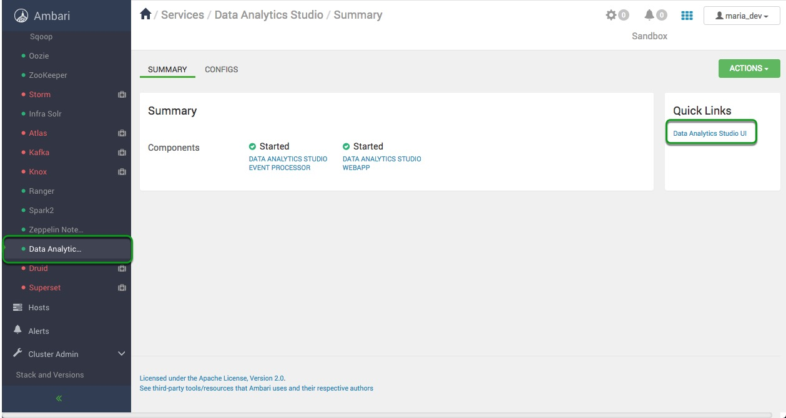

 Alternatively, use your favorite browser navigate to [http://sandbox-hdp.hortonworks.com:30800/](http://sandbox-hdp.hortonworks.com:30800/) while your sandbox is running.

Now let’s take a closer look at the SQL editing capabilities Data Analytics Studio:

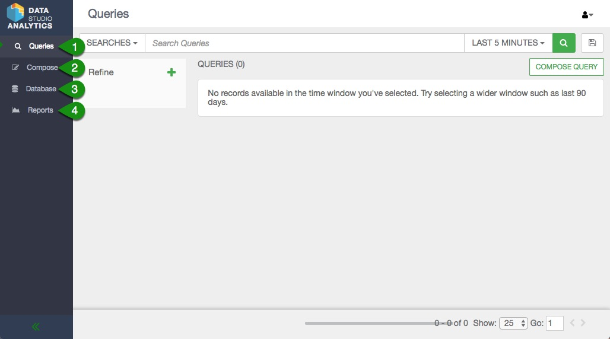

There are 4 tabs to interact with Data Analytics Studio:

1\. **Queries**: This view allows you to search previously executed SQL queries. You can also see commands each user issues.

2\. **Compose**: From this view you can execute SQL queries and observe their output. Additionally, visually inspect the results of your queries and download them as csv files.

3\. **Database**: Database allows you to add new Databases and Tables. Furthermore, this view grants you access to advanced information about your databases.

4\. **Reports**: This view allows you keep track of **Read and Write** operations, and shows you a **Join Report** of your tables.

Take a few minutes to explore the various DAS sub-features.

## Create Hive Tables

Now that you are familiar with DAS UI, let’s create and load tables for the geolocation and trucks data. We will create two tables: geolocation and trucks using DAS's Upload Table tab.

### Create and Load Trucks Table

Starting from DAS Main Menu:

1. Select **Database**

2. Select **`+`** next to **Tables** to add a new Table

3. Select **Upload Table**

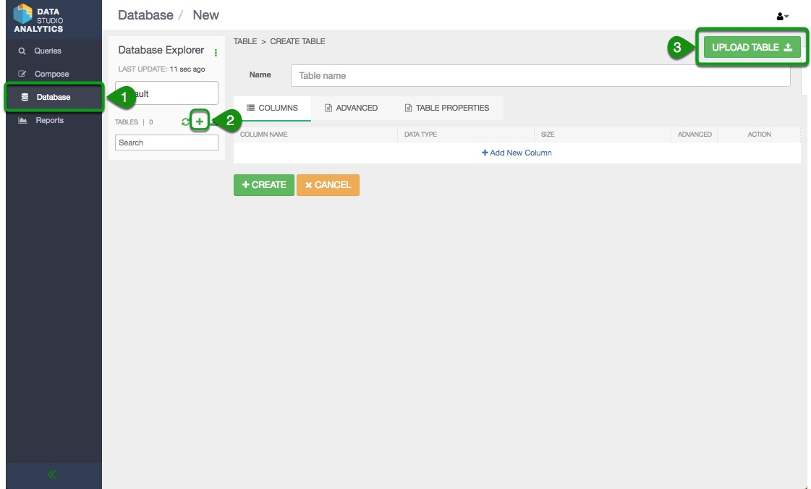

Complete form as follows:

- Select checkbox: **Is first row Header: True**
- Select **Upload from HDFS**
- Set **Enter HDFS Path** to `/tmp/data/geolocation.csv`
- Click **Preview**

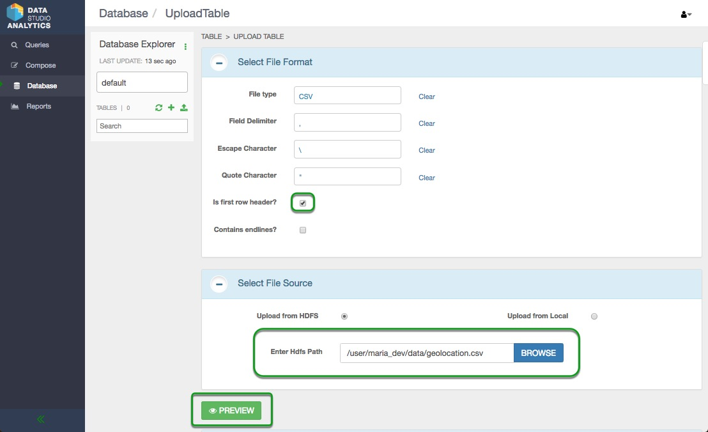

You should see a similar screen:

> Note: that the first row contains the names of the columns.

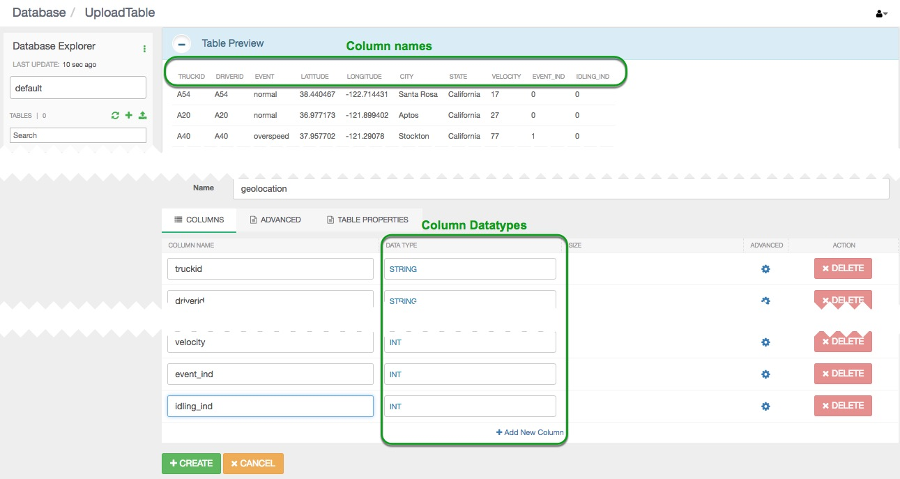

Click **Create** button to complete table creation.

### Create and Load Trucks Table

Repeat the steps above with the `trucks.csv` file to create and load the trucks table.

### Behind the Scenes

Before reviewing what happened behind the scenes during the Upload Table Process, let’s learn a little more about Hive file formats.

[Apache ORC](https://orc.apache.org/) is a fast columnar storage file format for Hadoop workloads.

The **O**ptimized **R**ow **C**olumnar ([Apache ORC project](https://hortonworks.com/blog/apache-orc-launches-as-a-top-level-project/)) file format provides a highly efficient way to store Hive data. It was designed to overcome limitations of the other Hive file formats. Using ORC files improves performance when Hive is reading, writing, and processing data.

To create a table using the ORC file format, use **STORED AS ORC** option. For example:

~~~sql
CREATE TABLE <tablename> ... STORED AS ORC ...
~~~

> NOTE: For details on these clauses consult the [Apache Hive Language Manual](https://cwiki.apache.org/confluence/display/Hive/LanguageManual+DDL).

Following is a visual representation of the Upload table creation process:

1. The target table is created using ORC file format (i.e. Geolocation)
2. A temporary table is created using TEXTFILE file format to store data from the CSV file
3. Data is copied from temporary table to the target (ORC) table
4. Finally, the temporary table is dropped

You can review the SQL statements issued by selecting the **Queries** tab and reviewing the four most recent jobs, which was a result of using the **Upload Table**.

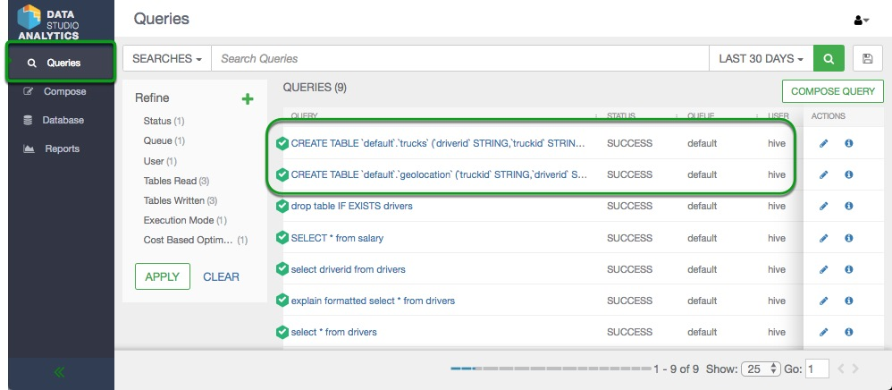

### Verify New Tables Exist

To verify the tables were defined successfully:

1. Click on the `Database` tab.
2. Click on the **refresh** icon in the `TABLES` explorer.
3. Select table you want to verify. Definition of columns will be displayed.

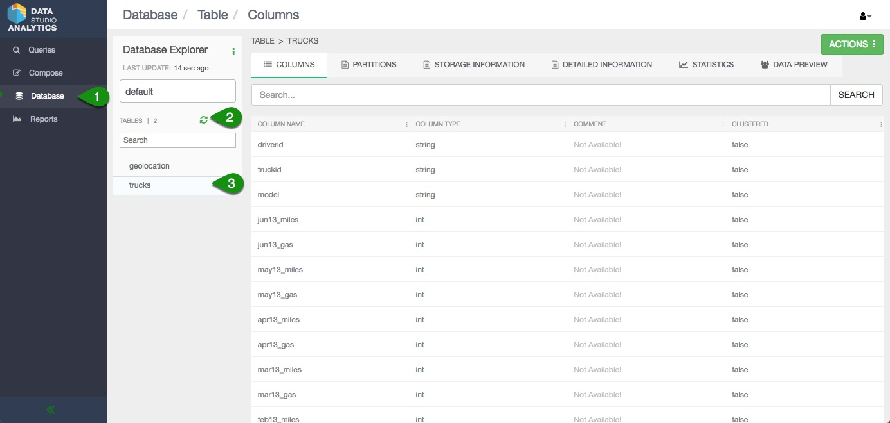

### Sample Data from the trucks table

Click on the `Compose` tab, type the following query into the query editor and click on `Execute`:

~~~sql
select * from trucks limit 10;
~~~

The results should look similar to:

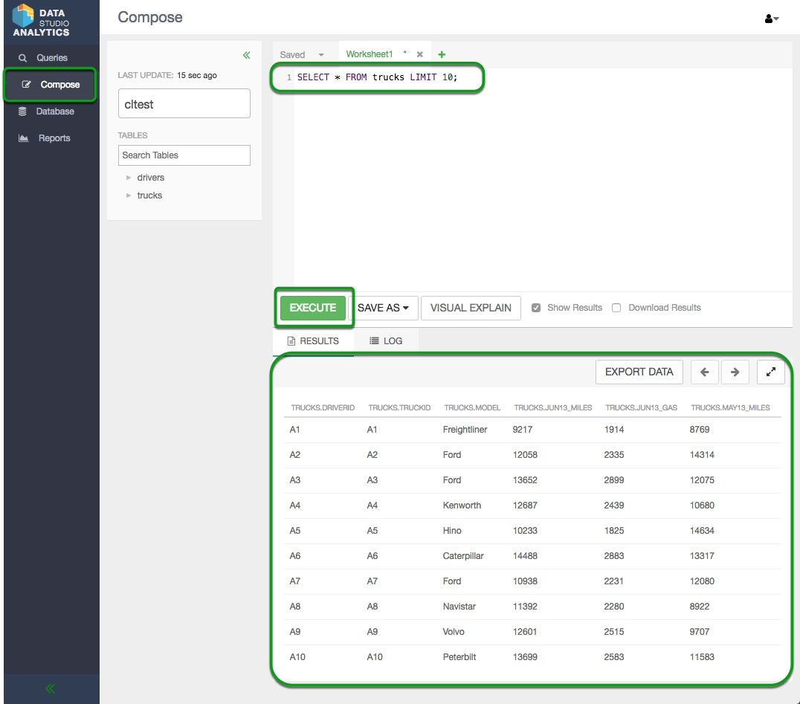

**A few additional commands to explore tables:**

- `show tables;` - List the tables created in the database by looking up the list of tables from the metadata stored in HCatalogdescribe

- `describe {table_name};` - Provides a list of columns for a particular table

~~~sql
describe geolocation;
~~~

- `show create table {table_name};` - Provides the DDL to recreate a table

~~~sql
   show create table geolocation;
~~~

- `describe formatted {table_name};` - Explore additional metadata about the table.  For example you can verify geolocation is an ORC Table, execute the following query:

~~~sql
   describe formatted geolocation;
~~~

By default, when you create a table in Hive, a directory with the same name gets created in the `/warehouse/tablespace/managed/hive` folder in HDFS.  Using the Ambari Files View, navigate to that folder. You should see both a `geolocation` and `trucks` directory:

> NOTE: The definition of a Hive table and its associated metadata (i.e., the directory the data is stored in, the file format, what Hive properties are set, etc.) are stored in the Hive metastore, which on the Sandbox is a MySQL database.

### Rename Query Editor Worksheet

Click on the **SAVE AS** button in the **Compose** section, enter the name of your query and save it.

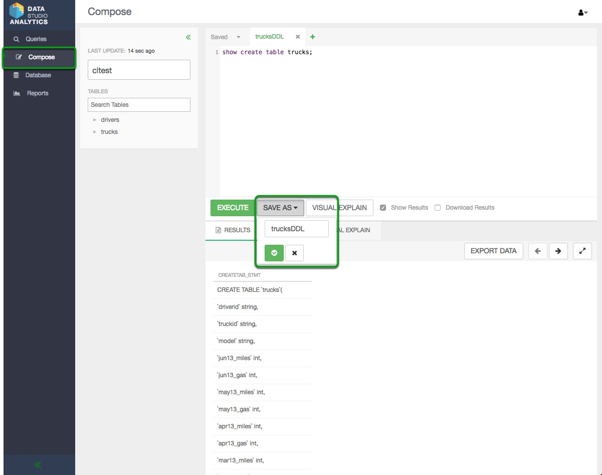

### Beeline - Command Shell

Try running commands using the command line interface - Beeline. Beeline uses a JDBC connection to connect to HiveServer2. Use the [built-in SSH Web Client](https://hortonworks.com/tutorial/learning-the-ropes-of-the-hortonworks-sandbox/#shell-web-client-method) (aka Shell-In-A-Box):

1\. Connect to Beeline **hive**.

~~~bash
beeline -u jdbc:hive2://sandbox-hdp.hortonworks.com:10000 -n hive
~~~

2\. Enter the beeline commands to grant all permission access for maria_dev user:

~~~sql
grant all on database foodmart to user maria_dev;
grant all on database default to user maria_dev;
!quit
~~~

3\. Connect to Beeline using **maria_dev**.

~~~bash
beeline -u jdbc:hive2://sandbox-hdp.hortonworks.com:10000 -n maria_dev
~~~

4\. Enter the beeline commands to view 10 rows from foodmart database customer
and account tables:

~~~sql
select * from foodmart.customer limit 10;
select * from foodmart.account limit 10;
select * from trucks;
show tables;
!help
!tables
!describe trucks
~~~

5\. Exit the Beeline shell:

~~~bash
!quit
~~~

What did you notice about performance after running hive queries from shell?

- Queries using the shell run faster because hive runs the query directory in hadoop whereas in DAS, the query must be accepted by a rest server before it can submitted to hadoop.
- You can get more information on the [Beeline from the Hive Wiki](https://cwiki.apache.org/confluence/display/Hive/HiveServer2+Clients#HiveServer2Clients-Beeline–CommandLineShell).
- Beeline is based on [SQLLine](http://sqlline.sourceforge.net/).

## Explore Hive Settings on Ambari Dashboard

### Open Ambari Dashboard in New Tab

Click on the Dashboard tab to start exploring the Ambari Dashboard.

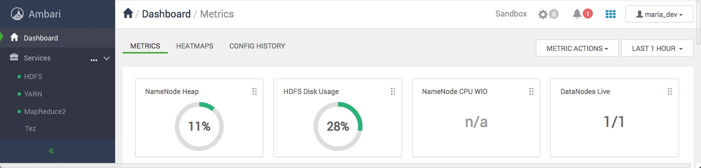

### Become Familiar with Hive Settings

Go to the **Hive page** then select the **Configs tab** then click on **Settings tab**:

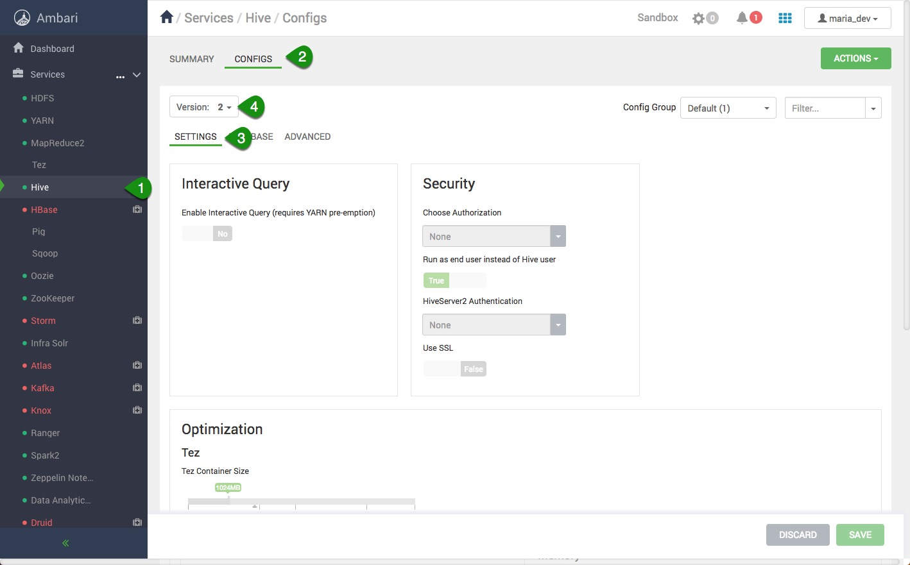

Once you click on the Hive page you should see a page similar to above:

1. **Hive** Page
2. Hive **Configs** Tab
3. Hive **Settings** Tab
4. Version **History** of Configuration

Scroll down to the **Optimization Settings**:

In the above screenshot we can see:

**Tez** is set as the optimization engine

This shows the **HDP Ambari Smart Configurations**, which simplifies setting configurations

- Hadoop is configured by a **collection of XML files**.
- In early versions of Hadoop, operators would need to do **XML editing** to **change settings**.  There was no default versioning.
- Early Ambari interfaces made it **easier to change values** by showing the settings page with **dialog boxes** for the various settings and allowing you to edit them.  However, you needed to know what needed to go into the field and understand the range of values.
- Now with Smart Configurations you can **toggle binary features** and use the slider bars with settings that have ranges.

By default the key configurations are displayed on the first page.  If the setting you are looking for is not on this page you can find additional settings in the **Advanced** tab:

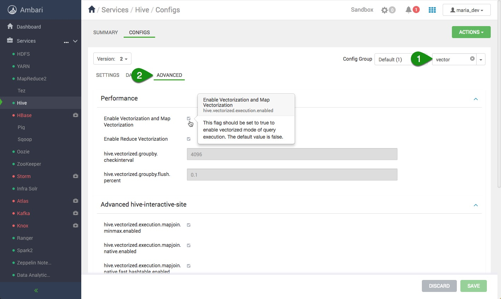

For example, if we wanted to **improve SQL performance**, we can use the new **Hive vectorization features**. These settings can be found and enabled by following these steps:

1. Click on the **Advanced** tab and scroll to find the **property**
2. Or, start typing in the property into the property search field and then this would filter the setting you scroll for.

As you can see from the green circle above, the `Enable Vectorization and Map Vectorization` is turned on already.

Some **key resources** to **learn more about vectorization** and some of the **key settings in Hive tuning:**

- Apache Hive docs on [Vectorized Query Execution](https://cwiki.apache.org/confluence/display/Hive/Vectorized+Query+Execution)
- [HDP Docs Vectorization docs](https://docs.hortonworks.com/HDPDocuments/HDP2/HDP-2.0.9.0/bk_dataintegration/content/ch_using-hive-1a.html)
- [Hive Blogs](https://hortonworks.com/blog/category/hive/)
- [5 Ways to Make Your Hive Queries Run Faster](https://hortonworks.com/blog/5-ways-make-hive-queries-run-faster/)
- [Evaluating Hive with Tez as a Fast Query Engine](https://hortonworks.com/blog/evaluating-hive-with-tez-as-a-fast-query-engine/)

## Analyze the Trucks Data

Next we will be using Hive, and Zeppelin to analyze derived data from the geolocation and trucks tables.  The business objective is to better understand the risk the company is under from fatigue of drivers, over-used trucks, and the impact of various trucking events on risk. In order to accomplish this, we will apply a series of transformations to the source data, mostly though SQL, and use Spark to calculate risk. In the last lab on Data Visualization, we will be using _Zeppelin_ to **generate a series of charts to better understand risk**.

Let’s get started with the first transformation. We want to **calculate the miles per gallon for each truck**. We will start with our _truck data table_.  We need to _sum up all the miles and gas columns on a per truck basis_. Hive has a series of functions that can be used to reformat a table. The keyword [LATERAL VIEW](https://cwiki.apache.org/confluence/display/Hive/LanguageManual+LateralView) is how we invoke things. The **stack function** allows us to _restructure the data into 3 columns_ labeled rdate, gas and mile (ex: 'june13', june13_miles, june13_gas) that make up a maximum of 54 rows. We pick truckid, driverid, rdate, miles, gas from our original table and add a calculated column for mpg (miles/gas).  And then we will **calculate average mileage**.

### Create Table truckmileage From Existing Trucking Data

Using DAS, execute the following query:

~~~sql
CREATE TABLE truckmileage STORED AS ORC AS SELECT truckid, driverid, rdate, miles, gas, miles / gas mpg FROM trucks LATERAL VIEW stack(54, 'jun13',jun13_miles,jun13_gas,'may13',may13_miles,may13_gas,'apr13',apr13_miles,apr13_gas,'mar13',mar13_miles,mar13_gas,'feb13',feb13_miles,feb13_gas,'jan13',jan13_miles,jan13_gas,'dec12',dec12_miles,dec12_gas,'nov12',nov12_miles,nov12_gas,'oct12',oct12_miles,oct12_gas,'sep12',sep12_miles,sep12_gas,'aug12',aug12_miles,aug12_gas,'jul12',jul12_miles,jul12_gas,'jun12',jun12_miles,jun12_gas,'may12',may12_miles,may12_gas,'apr12',apr12_miles,apr12_gas,'mar12',mar12_miles,mar12_gas,'feb12',feb12_miles,feb12_gas,'jan12',jan12_miles,jan12_gas,'dec11',dec11_miles,dec11_gas,'nov11',nov11_miles,nov11_gas,'oct11',oct11_miles,oct11_gas,'sep11',sep11_miles,sep11_gas,'aug11',aug11_miles,aug11_gas,'jul11',jul11_miles,jul11_gas,'jun11',jun11_miles,jun11_gas,'may11',may11_miles,may11_gas,'apr11',apr11_miles,apr11_gas,'mar11',mar11_miles,mar11_gas,'feb11',feb11_miles,feb11_gas,'jan11',jan11_miles,jan11_gas,'dec10',dec10_miles,dec10_gas,'nov10',nov10_miles,nov10_gas,'oct10',oct10_miles,oct10_gas,'sep10',sep10_miles,sep10_gas,'aug10',aug10_miles,aug10_gas,'jul10',jul10_miles,jul10_gas,'jun10',jun10_miles,jun10_gas,'may10',may10_miles,may10_gas,'apr10',apr10_miles,apr10_gas,'mar10',mar10_miles,mar10_gas,'feb10',feb10_miles,feb10_gas,'jan10',jan10_miles,jan10_gas,'dec09',dec09_miles,dec09_gas,'nov09',nov09_miles,nov09_gas,'oct09',oct09_miles,oct09_gas,'sep09',sep09_miles,sep09_gas,'aug09',aug09_miles,aug09_gas,'jul09',jul09_miles,jul09_gas,'jun09',jun09_miles,jun09_gas,'may09',may09_miles,may09_gas,'apr09',apr09_miles,apr09_gas,'mar09',mar09_miles,mar09_gas,'feb09',feb09_miles,feb09_gas,'jan09',jan09_miles,jan09_gas ) dummyalias AS rdate, miles, gas;
~~~

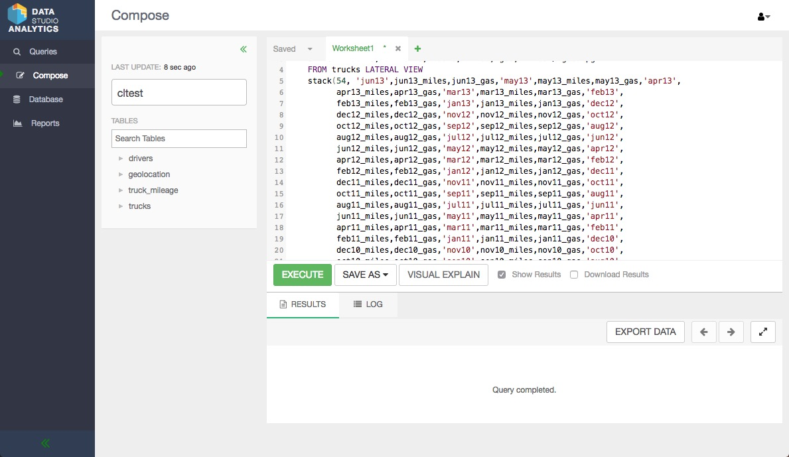

### Explore a sampling of the data in the truckmileage table

To view the data generated by the script, execute the following query in the query editor:

~~~sql
select * from truckmileage limit 100;
~~~

You should see a table that _lists each trip made by a truck and driver_:

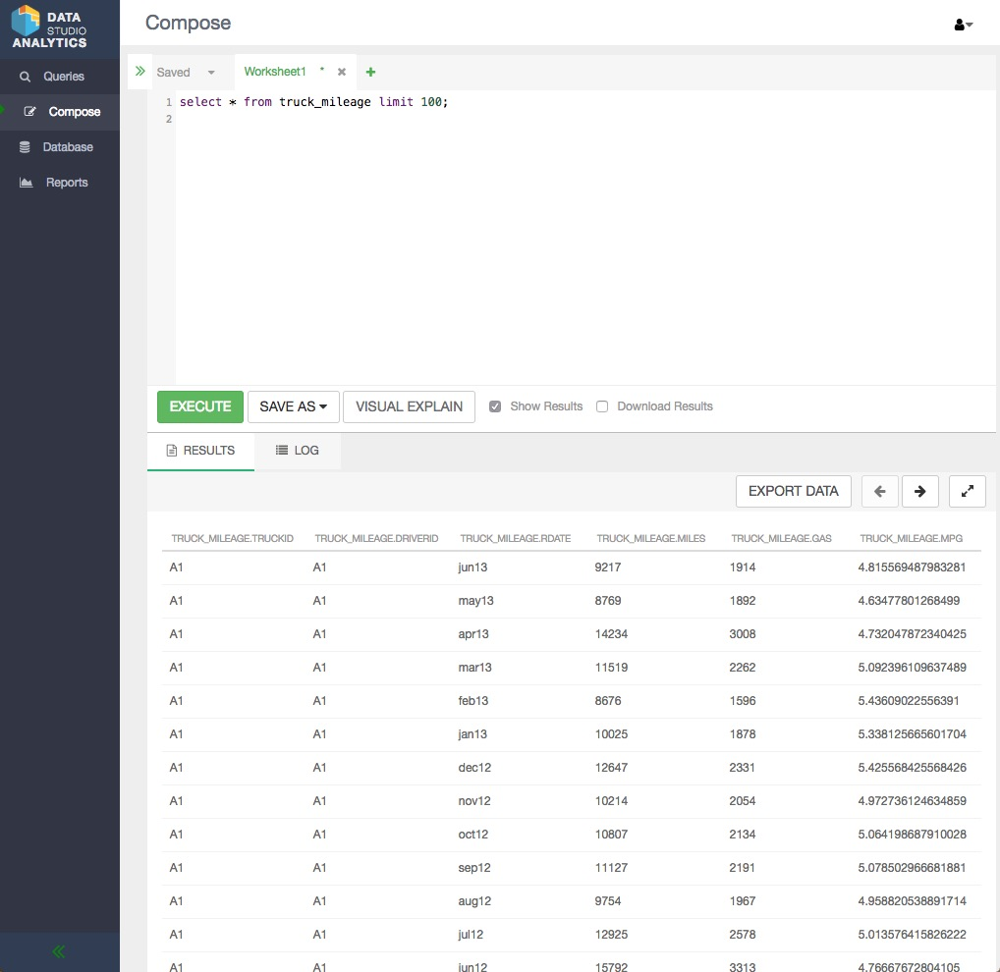

### Use the Content Assist to build a query

1\.  Create a new **SQL Worksheet**.

2\.  Start typing in the **SELECT SQL command**, but only enter the first two letters:

~~~sql
SE
~~~

3\.  Note that suggestions automatically begin to appear:

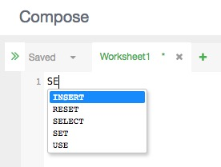

> NOTE: Notice content assist shows you some options that start with an “SE”. These shortcuts will be great for when you write a lot of custom query code.

4\. Type in the following query

~~~sql
SELECT truckid, avg(mpg) avgmpg FROM truckmileage GROUP BY truckid;
~~~

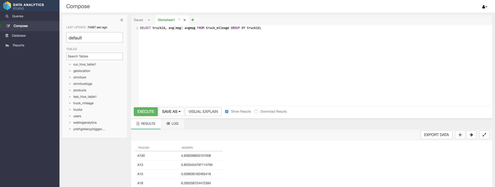

5\.  Click the “**Save As**” button to save the query as “**average-mpg**”:

6\.  Notice your query now shows up in the list of “**Saved Queries**”, which is one of the tabs at the top of the Hive User View.

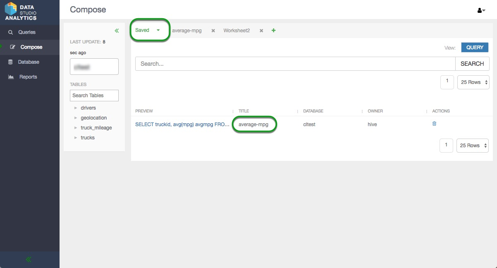

7\.  Execute the “**average-mpg**” query and view its results.

### Explore Explain Features of the Hive Query Editor

Let's explore the various explain features to better _understand the execution of a query_: Visual Explain, Text Explain, and Tez Explain. Click on the **Visual Explain** button:

This visual explain provides a visual summary of the query execution plan. You can see more detailed information by clicking on each plan phase.

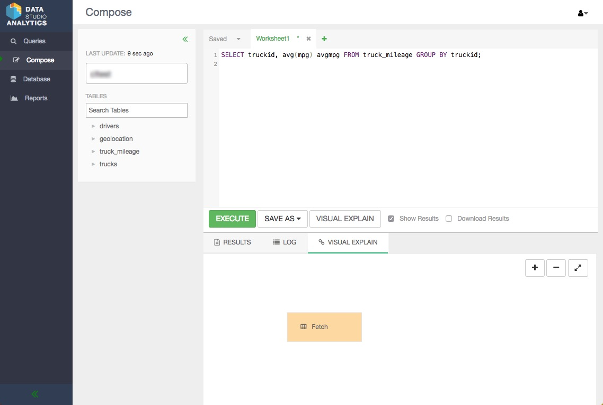

If you want to see the explain result in text, select `RESULTS`. You should see something like:

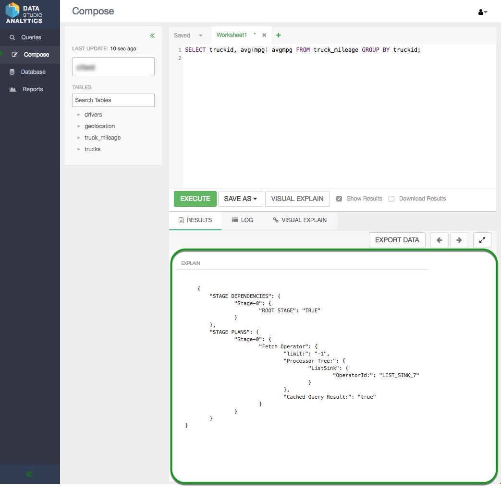

### Explore TEZ

Click on **Queries** and select the last **SELECT** query we issued:

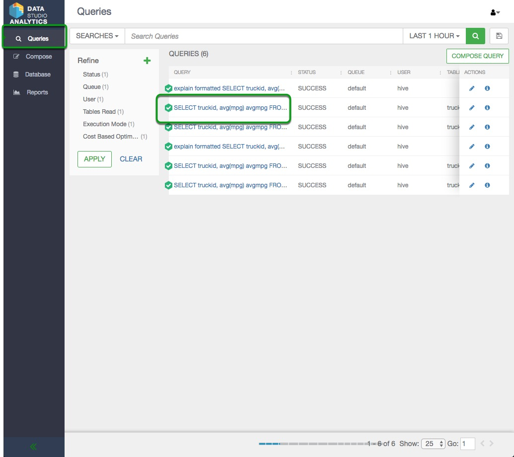

From this view you can observe critically important information, such as:

_USER_, _STATUS_, _DURATION_, _TABLES READ_, _TABLES WRITTEN_, _APPLICATION ID_, _DAG ID_

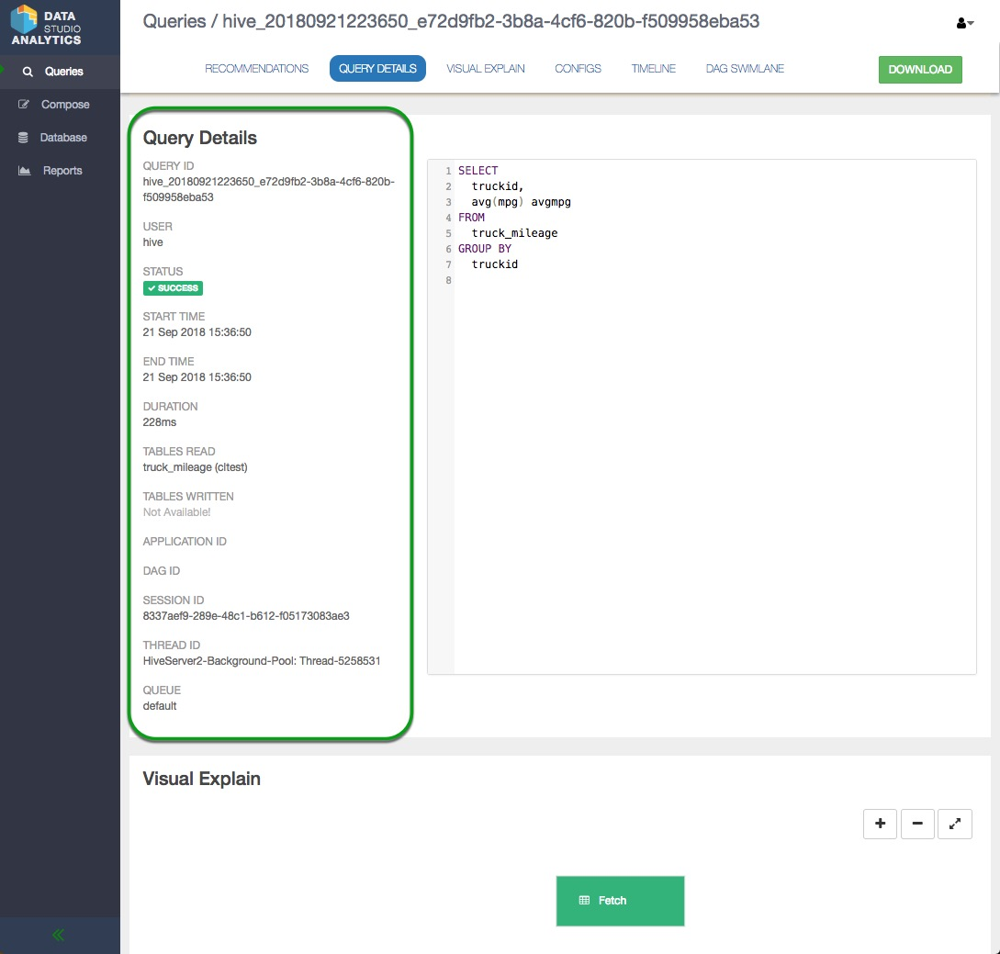

There are seven tabs at the top, please take a few minutes to explore the various tabs.

<!-- Add this section once we know if we can ge thtis view in DAS as of Sept 21 this is not working on DAS not even on the clustr version

 When you are done exploring, click on the **Graphical View** tab and hover over one of the nodes with your cursor to get more details on the processing in that node.

Click on the **Vertex Swimlane**. This feature helps with troubleshooting of TEZ jobs. As you will see in the image there is a graph for Map 1 and Reducer 2. These graphs are timelines for when events happened. Hover over red or blue line to view a event tooltip.

Basic Terminology:

- **Bubble** represents an event
- **Vertex** represents the solid line, timeline of events

For map1, the tooltip shows that the events vertex started and vertex initialize occur simultaneously:

For Reducer 2, the tooltip shows that the events vertex started and initialize share milliseconds difference on execution time.

Vertex Initialize

Vertex started

When you look at the tasks started for and finished (red thick line) for `Map 1` compared to `Reducer 2` (blue thick line) in the graph, what do you notice?

- `Map 1` starts and completes before `Reducer 2`.

-->

### Create Table avgmileage From Existing trucks_mileage Data

It is common to save results of query into a table so the result set becomes persistent. This is known as [Create Table As Select](https://cwiki.apache.org/confluence/display/Hive/LanguageManual+DDL#LanguageManualDDL-CreateTableAsSelect) (CTAS). Copy the following DDL into the query editor, then click **Execute**:

~~~sql
CREATE TABLE avgmileage
STORED AS ORC
AS
SELECT truckid, avg(mpg) avgmpg
FROM truckmileage
GROUP BY truckid;
~~~

### View Sample Data of avgmileage

To view the data generated by CTAS above, execute the following query:

~~~sql
SELECT * FROM avgmileage LIMIT 100;
~~~

Table `avgmileage` provides a list of average miles per gallon for each truck.

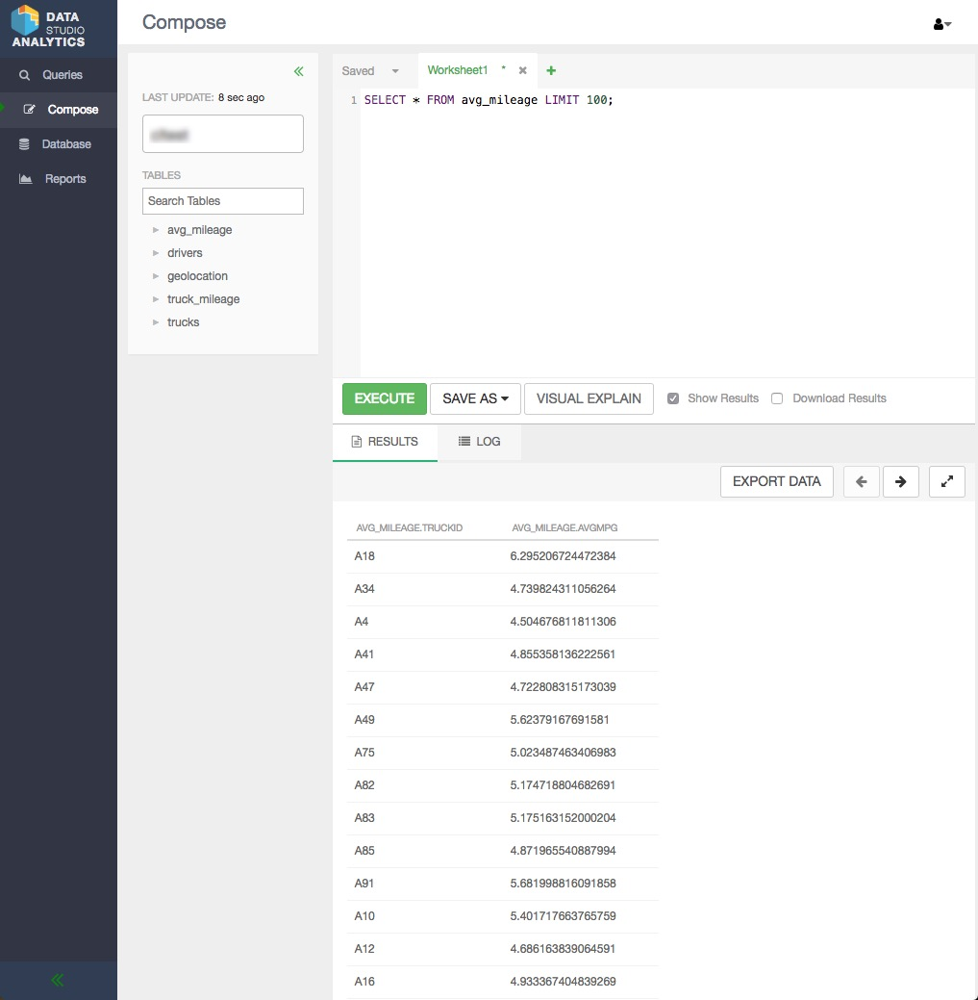

### Create Table DriverMileage from Existing truckmileage data

The following CTAS groups the records by driverid and sums of miles. Copy the following DDL into the query editor, then click **Execute**:

~~~sql
CREATE TABLE DriverMileage
STORED AS ORC
AS
SELECT driverid, sum(miles) totmiles
FROM truckmileage
GROUP BY driverid;
~~~

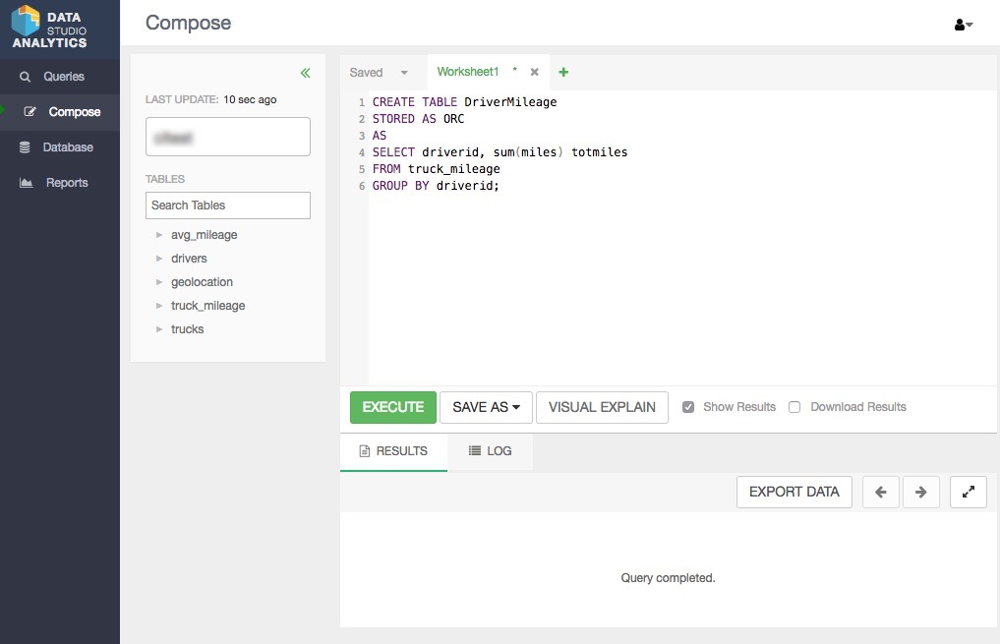

### View Data of DriverMileage

To view the data generated by CTAS above, execute the following query:

~~~sql
SELECT * FROM drivermileage;
~~~

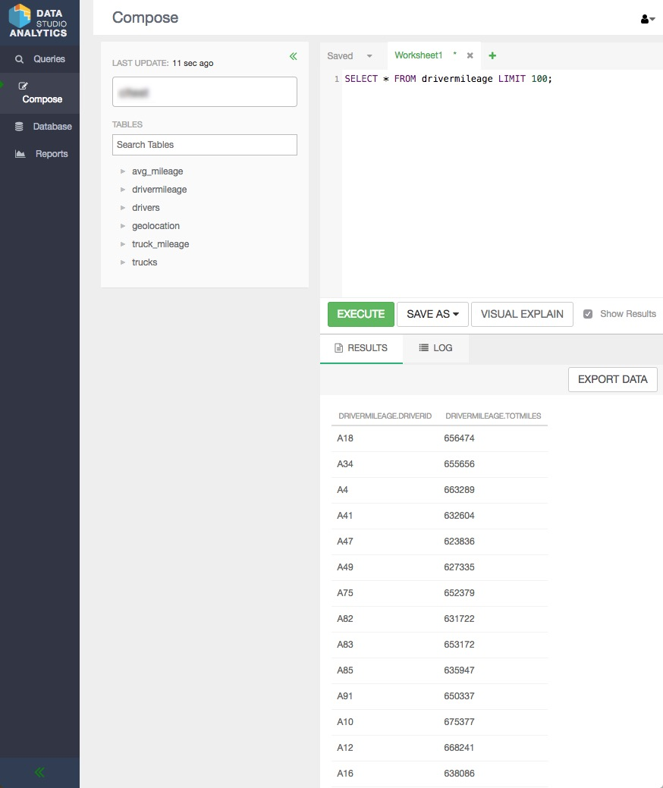

We will use these result to calculate all truck driver's risk factors in the next section, so lets store our results on to HDFS:

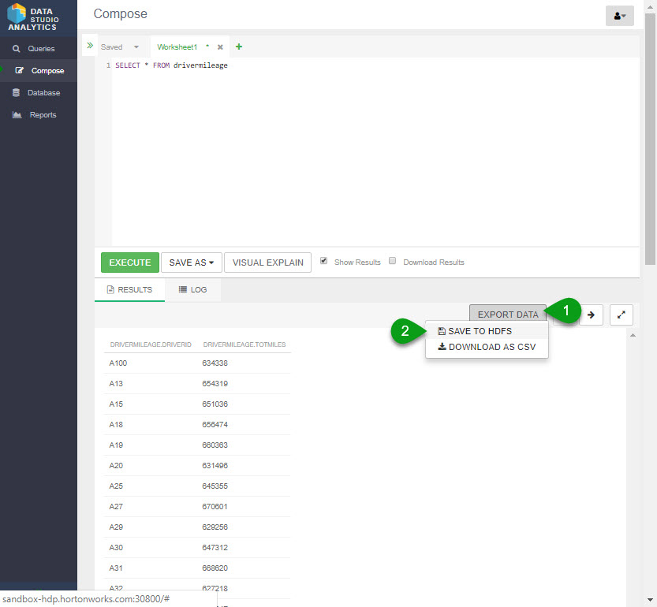

and store it at `/tmp/data/drivermileage`.

Then open your [web shell client](http://sandbox-hdp.hortonworks.com:4200/):

~~~bash
sudo -u hdfs hdfs dfs -chown maria_dev:hdfs /tmp/data/drivermileage.csv
~~~

Next, navigate to HDFS as **maria_dev** and give permission to other users to use this file:

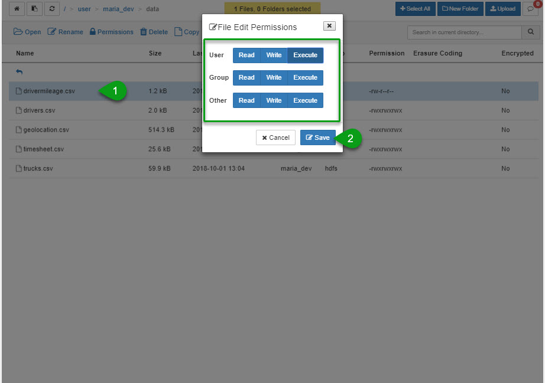

## Summary

Congratulations! Let’s summarize some Hive commands we learned to process, filter and manipulate the geolocation and trucks data.
We now can create Hive tables with `CREATE TABLE` and `UPLOAD TABLE`. We learned how to change the file format of the tables to ORC, so hive is more efficient at reading, writing and processing this data. We learned to retrieve data using `SELECT` statement and create a new filtered table (`CTAS`).

## Further Reading

Augment your hive foundation with the following resources:

- [Apache Hive](https://hortonworks.com/hadoop/hive/)
- [Hive LLAP enables sub second SQL on Hadoop](https://hortonworks.com/blog/llap-enables-sub-second-sql-hadoop/)
- [Programming Hive](http://www.amazon.com/Programming-Hive-Edward-Capriolo/dp/1449319335/ref=sr_1_3?ie=UTF8&qid=1456009871&sr=8-3&keywords=apache+hive)
- [Hive Language Manual](https://cwiki.apache.org/confluence/display/Hive/LanguageManual+DDL)
- [HDP DEVELOPER: APACHE PIG AND HIVE](https://hortonworks.com/training/class/hadoop-2-data-analysis-pig-hive/)
