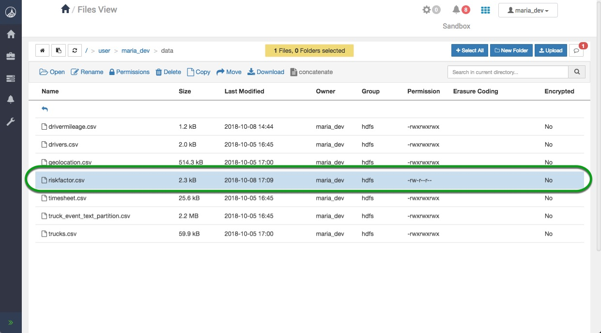
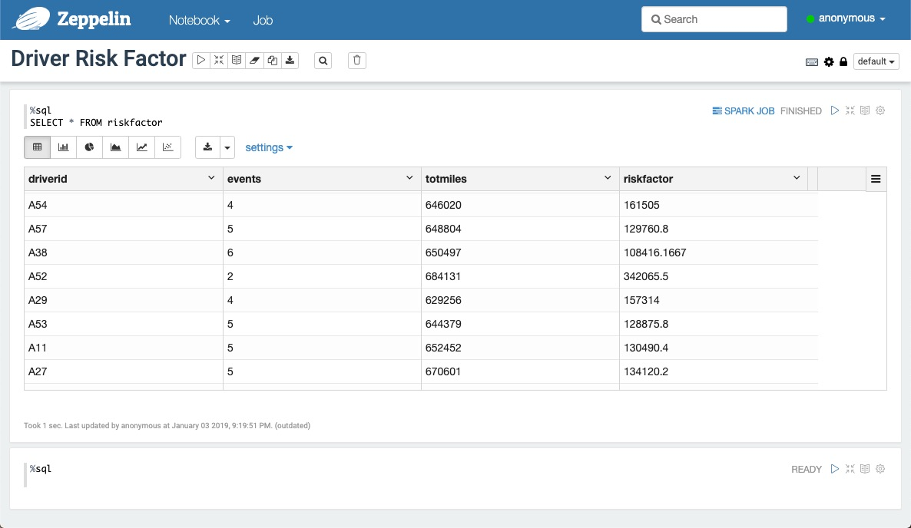
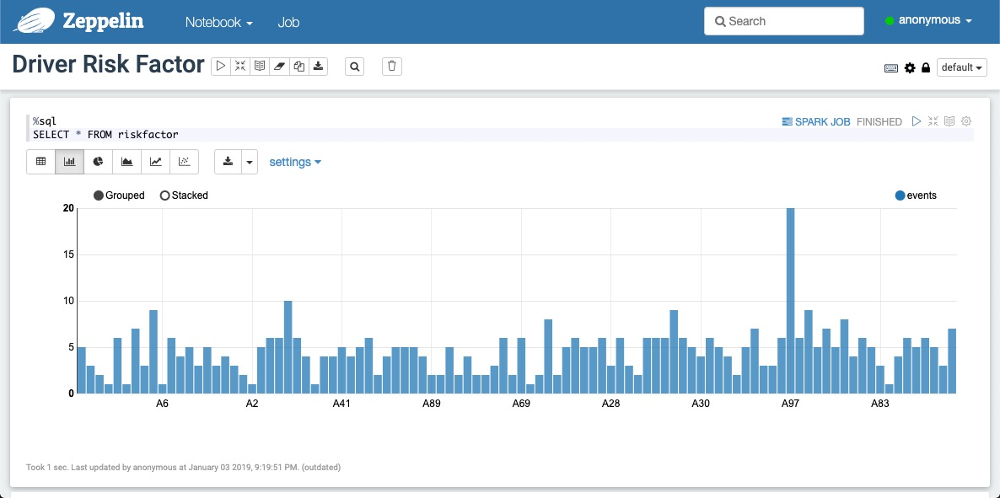
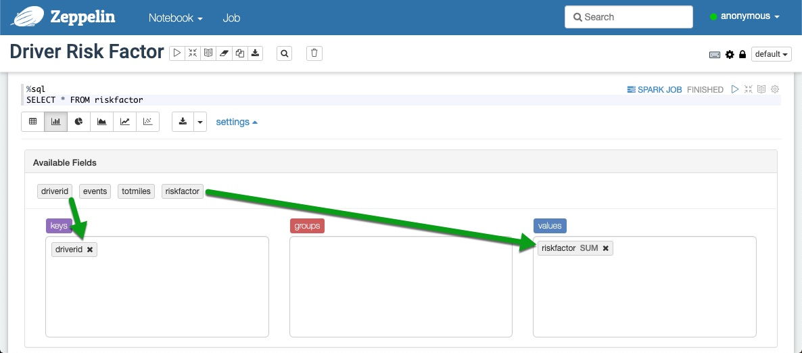
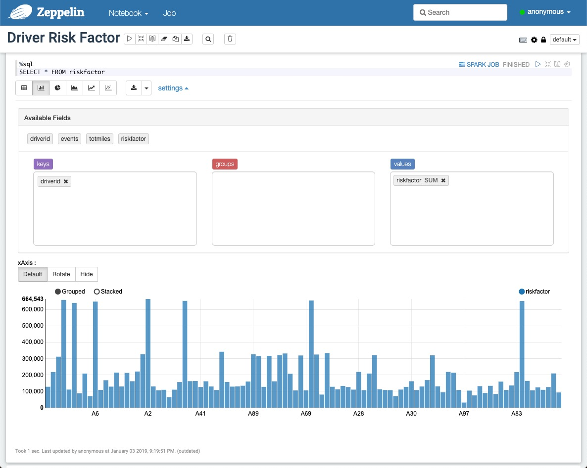
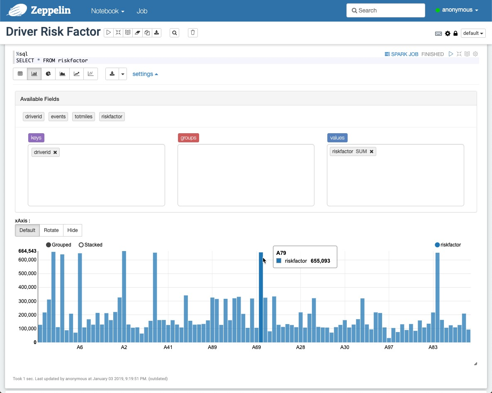
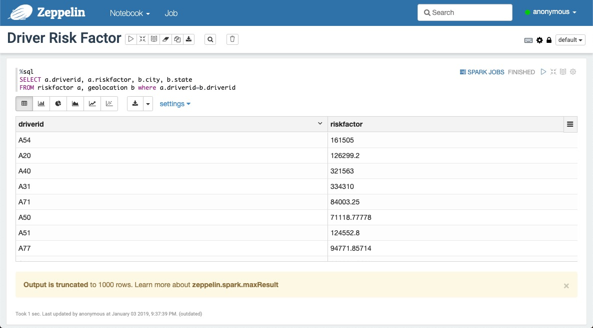
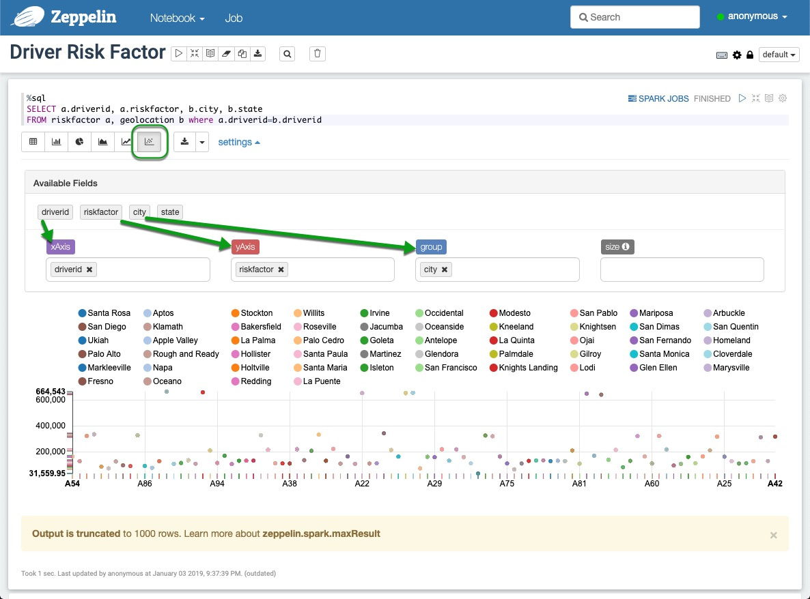

# Hadoop Tutorial – Getting Started with HDP

## Data Reporting With Zeppelin

## Introduction

In this tutorial you will be introduced to Apache Zeppelin and teach you to visualize data using Zeppelin.

## Prerequisites

The tutorial is a part of series of hands on tutorial to get you started on HDP using the Hortonworks sandbox. Please ensure you complete the prerequisites before proceeding with this tutorial.

- Downloaded and deployed the [Hortonworks Data Platform (HDP)](https://www.cloudera.com/downloads/hortonworks-sandbox/hdp.html?utm_source=mktg-tutorial) Sandbox
- [Learning the Ropes of the HDP Sandbox](https://hortonworks.com/tutorial/learning-the-ropes-of-the-hortonworks-sandbox/)
- [Loading Sensor Data into HDFS](https://hortonworks.com/tutorial/hadoop-tutorial-getting-started-with-hdp/section/2/)
- [Hive - Data ETL](https://hortonworks.com/tutorial/hadoop-tutorial-getting-started-with-hdp/section/3/)
- [Pig - Risk Factor](https://hortonworks.com/tutorial/hadoop-tutorial-getting-started-with-hdp/section/4/)
- [Spark - Risk Factor](https://hortonworks.com/tutorial/hadoop-tutorial-getting-started-with-hdp/section/5/)

## Outline

- [Apache Zeppelin](#apache-zeppelin)
- [Create a Zeppelin Notebook](#create-a-zeppelin-notebook)
- [Download the Data](#download-the-data)
- [Execute a Hive Query](#execute-a-hive-query)
- [Build Charts Using Zeppelin](#build-charts-using-zeppelin)
- [Summary](#summary)
- [Further Reading](#further-reading)

## Apache Zeppelin

Apache Zeppelin provides a powerful web-based notebook platform for data analysis and discovery.
Behind the scenes it supports Spark distributed contexts as well as other language bindings on top of Spark.

In this tutorial we will be using Apache Zeppelin to run SQL queries on our geolocation, trucks, and
riskfactor data that we've collected earlier and visualize the result through graphs and charts.

## Create a Zeppelin Notebook

### Navigate to Zeppelin Notebook

Open Zeppelin interface using browser URL:

~~~bash
http://sandbox-hdp.hortonworks.com:9995/
~~~

Click on a Notebook tab at the top left and select **Create new note**. Name your notebook `Driver Risk Factor`.

## Download the Data

If you had trouble completing the previous tutorial or lost the **risk factor** data click [here to download it](https://raw.githubusercontent.com/hortonworks/data-tutorials/master/tutorials/hdp/hadoop-tutorial-getting-started-with-hdp/assets/datasets/riskfactor.csv) and upload it to HDFS under `/tmp/data/`

>Note: if you completed the **Spark - Risk Factor** section successfully advance to [Execute a Hive Query](#execute-a-hive-query)

and enter the following command to create a spark temporary view

~~~scala
%spark2
val hiveContext = new org.apache.spark.sql.SparkSession.Builder().getOrCreate()
val riskFactorDataFrame = spark.read.format("csv").option("header", "true").load("hdfs:///tmp/data/riskfactor.csv")
riskFactorDataFrame.createOrReplaceTempView("riskfactor")
hiveContext.sql("SELECT * FROM riskfactor LIMIT 15").show()
~~~

## Execute a Hive Query

### Visualize final results Data in Tabular Format

In the previous Spark tutorial you already created a table `finalresults` or `riskfactor` which gives the risk factor associated with every driver. We will use the data we generated in this table to visualize which drivers have the highest risk factor. We will use the jdbc Hive interpreter to write queries in Zeppelin.

1\. Copy and paste the code below into your Zeppelin note.

~~~sql
%sql
SELECT * FROM riskfactor
~~~

2\. Click the play button next to "ready" or "finished" to run the query in the Zeppelin notebook.

Alternative way to run query is "shift+enter."

Initially, the query will produce the data in tabular format as shown in the screenshot.

## Build Charts using Zeppelin

### Visualize finalresults Data in Chart Format

1\. Iterate through each of the tabs that appear underneath the query.
Each one will display a different type of chart depending on the data that is returned in the query.

2\. After clicking on a chart, we can view extra advanced settings to tailor the view of the data we want.

3\. Click settings to open the advanced chart features.

4\. To make a chart with `riskfactor.driverid` and `riskfactor.riskfactor SUM`, drag the table relations into the boxes as shown in the image below.

5\. You should now see an image like the one below.

6\. If you hover on the peaks, each will give the driverid and riskfactor.

7\. Try experimenting with the different types of charts as well as dragging and
dropping the different table fields to see what kind of results you can obtain.

8\. Let' try a different query to find which cities and states contain the drivers with the highest risk factors.

~~~sql
%sql
SELECT a.driverid, a.riskfactor, b.city, b.state
FROM riskfactor a, geolocation b where a.driverid=b.driverid
~~~

9\. After changing a few of the settings we can figure out which of the cities have the high risk factors.
Try changing the chart settings by clicking the **scatterplot** icon. Then make sure that the keys a.driverid
is within the xAxis field, a.riskfactor is in the yAxis field, and b.city is in the group field.
The chart should look similar to the following.

You can hover over the highest point to determine which driver has the highest risk factor and in which cities.

## Summary

Great, now we know how to query and visualize data using Apache Zeppelin. We can leverage Zeppelin—along with our newly gained knowledge of Hive and Spark—to solve real world problems in new creative ways.

## Further Reading

- [Zeppelin on HDP](https://hortonworks.com/hadoop/zeppelin/)
- [Apache Zeppelin Docs](http://zeppelin.apache.org/docs/0.8.0/)
- [Zeppelin Homepage](http://zeppelin.apache.org/)
