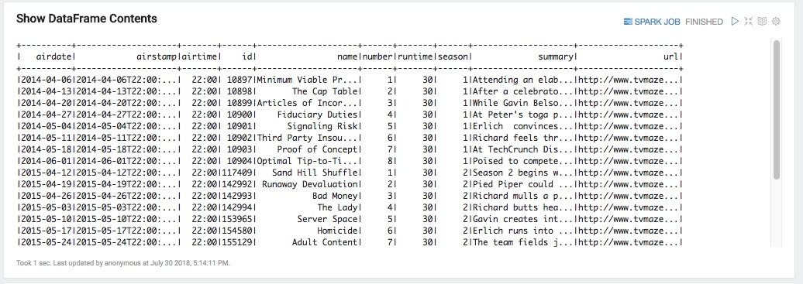
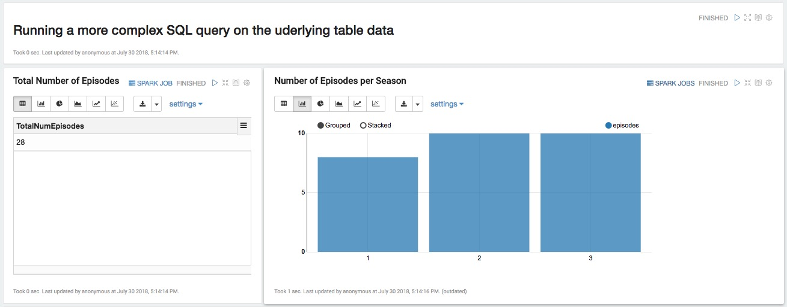
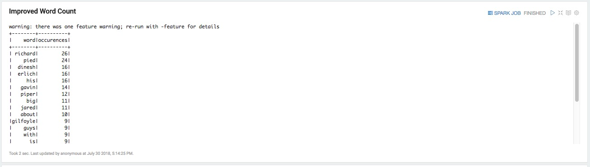

# Hands-On Tour of Apache Spark in 5 Minutes

## Introduction

In this tutorial, we will provide an overview of Apache Spark, it's relationship with Scala, Zeppelin notebooks, Interpreters, Datasets and DataFrames. Finally, we will showcase [Apache Zeppelin](https://zeppelin.apache.org/) notebook for our development environment to keep things simple and elegant.

Zeppelin will allow us to run in a pre-configured environment and execute code written for Spark in Scala and SQL, a few basic Shell commands, pre-written Markdown directions, and an HTML formatted table.

To make things fun and interesting, we will introduce a film series dataset from the [Silicon Valley Comedy TV show](https://www.imdb.com/title/tt2575988/) and perform some basic operations with Spark in Zeppelin.

## Prerequisites

- Downloaded and deployed the [Hortonworks Data Platform (HDP)](https://www.cloudera.com/downloads/hortonworks-sandbox/hdp.html?utm_source=mktg-tutorial) Sandbox
  - You will need **10GB** of memory dedicated for the virtual machine, meaning that you should have at least **16GB** of memory on your system.

- [Learning the Ropes of the HDP Sandbox](https://hortonworks.com/tutorial/learning-the-ropes-of-the-hortonworks-sandbox/)
- Basic [Scala syntax](http://www.dhgarrette.com/nlpclass/scala/basics.html)
- [Getting Started With Apache Zeppelin](https://hortonworks.com/tutorial/getting-started-with-apache-zeppelin/)
- Binded [Zeppelin's Shell Interpreter](https://hortonworks.com/tutorial/getting-started-with-apache-zeppelin/#binding-an-interpreter)

## Outline

- [Concepts](#concepts)
- [Apache Spark in 5 Minutes Notebook Overview](#apache-spark-in-5-minutes-notebook-overview)
- [Import the Apache Spark in 5 Minutes Notebook](#import-the-apache-spark-in-5-minutes-notebook)
- [Summary](#summary)
- [Further Reading](#further_reading)

## Concepts

### Apache Spark

Apache Spark is a fast, in-memory data processing engine with elegant and expressive development APIs in Scala, Java, Python, and R that allow developers to execute a variety of data intensive workloads.

Spark Datasets are strongly typed distributed collections of data created from a variety of sources: JSON and XML files, tables in Hive, external databases and more. Conceptually, they are equivalent to a table in a relational database or a DataFrame in R or Python.

### New to Scala?

Throughout this tutorial we will use basic Scala syntax.

Learn more about Scala, here’s an excellent [introductory tutorial](http://www.dhgarrette.com/nlpclass/scala/basics.html).

### New to Zeppelin?

If you haven’t already, checkout the Hortonworks [Apache Zeppelin](https://hortonworks.com/apache/zeppelin/) page as well as the [Getting Started with Apache Zeppelin](https://hortonworks.com/tutorial/getting-started-with-apache-zeppelin/) tutorial. You will find the official Apache Zeppelin page here.

### New to Spark?

Apache Spark is a fast, in-memory data processing engine with elegant and expressive development APIs to allow data workers to efficiently execute streaming, machine learning or SQL workloads that require fast iterative access to datasets.

If you would like to learn more about Apache Spark visit:

- [Official Apache Spark Page](http://spark.apache.org/)
- [Hortonworks Apache Spark Page](https://hortonworks.com/apache/spark/)
- [Hortonworks Apache Spark Docs](https://docs.hortonworks.com/HDPDocuments/HDP3/HDP-3.0.0/spark-overview/content/analyzing_data_with_apache_spark.html)

### What are Interpreters?

Zeppelin Notebooks supports various interpreters which allow you to perform many operations on your data. Below are just a few of operations you can do with Zeppelin interpreters:

- Ingestion
- Munging
- Wrangling
- Visualization
- Analysis
- Processing

 These are some of the interpreters that will be utilized throughout our various Spark tutorials.

| Interpreter | Description|
| :---| :--- |
| **%spark2** | Spark interpreter to run Spark 2.x code written in Scala |
| **%spark2.sql** |Spark SQL interpreter (to execute SQL queries against temporary tables in Spark)  |
| **%sh**| Shell interpreter to run shell commands like move files |
| **%angular** | Angular interpreter to run Angular and HTML code |
| **%md**  | Markdown for displaying formatted text, links, and images |

Note the **%** at the beginning of each interpreter. Each paragraph needs to start with **%** followed by the interpreter name.

[Learn more about Zeppelin interpreters](https://zeppelin.apache.org/docs/0.5.6-incubating/manual/interpreters.html).

### What are Datasets and DataFrames?

Datasets and DataFrames are distributed collections of data created from a variety of sources: JSON and XML files, tables in Hive, external databases and more. Conceptually, they are equivalent to a table in a relational database or a DataFrame in R or Python. Key difference between the Dataset and the DataFrame is that Datasets are strongly typed.

There are complex manipulations possible on Datasets and DataFrames, however they are beyond this quick guide.

[Learn more about Datasets and DataFrames](http://spark.apache.org/docs/2.0.0/sql-programming-guide.html#datasets-and-dataframes).

## Apache Spark in 5 Minutes Notebook Overview

We will download and ingest an external dataset about the Silicon Valley Show episodes into a Spark Dataset and perform basic analysis, filtering, and word count.

After a series of transformations, applied to the Datasets, we will define a temporary view (table) such as the one below.

You will be able to explore those tables via SQL queries likes the ones below.

 Once you have a handle on the data and perform a basic word count, we will add a few more steps for a more sophisticated word count analysis like the one below.

By the end of this tutorial, you should have a basic understanding of Spark and an appreciation for its powerful and expressive APIs with the added bonus of a developer friendly Zeppelin notebook environment.

## Import the Apache Spark in 5 Minutes Notebook

 Import the *Apache Spark in 5 Minutes* notebook into your Zeppelin environment. (If at any point you have any issues, make sure to checkout the [Getting Started with Apache Zeppelin](https://hortonworks.com/tutorial/getting-started-with-apache-zeppelin/) tutorial).

To import the notebook, go to the Zeppelin home screen.

1\. Click **Import note**

2\. Select **Add from URL**

3\. Copy and paste the following URL into the **Note URL**

~~~bash
# Getting Started ApacheSpark in 5 Minutes Notebook

https://raw.githubusercontent.com/hortonworks/data-tutorials/master/tutorials/hdp/hands-on-tour-of-apache-spark-in-5-minutes/assets/Getting%20Started%20_%20Apache%20Spark%20in%205%20Minutes.json

~~~

4\. Click on **Import Note**

Once your notebook is imported, you can open it from the Zeppelin home screen by:

5\. Clicking **Getting Started**

6\. Select **Apache Spark in 5 Minutes**

Once the **Apache Spark in 5 Minutes** notebook is up, follow all the directions within the notebook to complete the tutorial.

## Summary

We hope that you've been able to successfully run this short introductory notebook and we've got you interested and excited enough to further explore Spark with Zeppelin.

## Further Reading

- [Hortonworks Apache Spark Tutorials](https://hortonworks.com/tutorials/?filters=apache-spark) are your natural next step where you can explore Spark in more depth.
- [Hortonworks Community Connection (HCC)](https://community.hortonworks.com/spaces/85/data-science.html?type=question) is a great resource for questions and answers on Spark, Data Analytics/Science, and many more Big Data topics.
- [Hortonworks Apache Spark Docs](https://docs.hortonworks.com/HDPDocuments/HDP3/HDP-3.0.0/spark-overview/content/analyzing_data_with_apache_spark.html) - official Spark documentation.
- [Hortonworks Apache Zeppelin Docs](https://docs.hortonworks.com/HDPDocuments/HDP3/HDP-3.0.0/zeppelin-overview/content/overview.html) - official Zeppelin documentation.

<!--- All HDCloud References were commented out until further notice

## Environment Setup

 ### Option 1: Setup Hortonworks Data Cloud (HDCloud) on AWS

This option is ideal if you want to experience a production-ready multi-node cluster in a cloud.

See the [Getting Started with HDCloud](https://hortonworks.com/tutorial/getting-started-with-apache-spark-and-apache-zeppelin-on-hdcloud/) tutorial for details.

###Download and Setup Hortonworks Data Platform (HDP) Sandbox

You will need **8GB** of memory dedicated for the virtual machine, meaning that you should have at least **12GB** of memory on your system.

2a. Downloaded and deployed the [Hortonworks Data Platform (HDP)](https://www.cloudera.com/downloads/hortonworks-sandbox/hdp.html?utm_source=mktg-tutorial) Sandbox

2b. Review [Learning the Ropes of the HDP Sandbox](https://hortonworks.com/tutorial/learning-the-ropes-of-the-hortonworks-sandbox/)

#### Review Zeppelin Tutorial

If you are new to Zeppelin, review the following tutorial [Getting Started with Apache Zeppelin](https://hortonworks.com/tutorial/getting-started-with-apache-zeppelin/) -->
