# Interactive Query for Hadoop with Apache Hive on Apache Tez

## Introduction

In this tutorial, we’ll focus on taking advantage of the improvements to [Apache Hive](https://hortonworks.com/hadoop/hive) and [Apache Tez](https://hortonworks.com/hadoop/tez) through the work completed by the community as part of the [Stinger initiative](https://hortonworks.com/blog/100x-faster-hive/), some of the features which helped make Hive be over one hundred times faster are:

- Performance improvements of Hive on Tez
- Performance improvements of Vectorized Query
- Cost-based Optimization Plans
- Multi-tenancy with HiveServer2

## Prerequisites

- Downloaded and deployed the [Hortonworks Data Platform (HDP)](https://www.cloudera.com/downloads/hortonworks-sandbox/hdp.html?utm_source=mktg-tutorial) Sandbox
- [Learning the Ropes of the HDP Sandbox](https://hortonworks.com/tutorial/learning-the-ropes-of-the-hortonworks-sandbox/)

## Outline

- [Download Data](#download-data)
- [Create Hive Tables From CSV files on DAS](#create-hive-tables-from-csv-files-on-das)
- [Speed Improvements](#speed-improvements)
- [Configure MapReduce as Execution Engine in Hive view Settings Tab](#configure-mapreduce-as-execution-engine-in-hive-view-settings-tab)
- [Test Query on MapReduce Engine](#test-query-on-mapreduce-engine)
- [Configure Tez as Execution Engine in Hive view Settings Tab](#configure-tez-as-execution-engine-in-hive-settings-tab)
- [Test Query on Tez Engine](#test-query-on-tez-engine)
- [Execute Query as MapReduce Then Tez Engine](#execute-query-as-mapreduce-then-tez-engine)
- [Track Hive on Tez Jobs](#track-hive-on-tez-jobs)
- [Summary](#summary)
- [Further Reading](#further-reading)

## Download Data

Download the data from our repository:

~~~bash
wget https://github.com/hortonworks/data-tutorials/raw/master/tutorials/hdp/interactive-query-for-hadoop-with-apache-hive-on-apache-tez/assets/driver_data.zip
unzip driver_data.zip
~~~

Alternatively, [click here](assets/driver_data.zip) to download.

We will be uploading two csv files - **drivers.csv** and **timesheet.csv** on to DAS to create tables from them.

## Create Hive Tables from CSV files on DAS

DAS can be accessed by selecting the service from [Sandbox Splash Page](http://sandbox-hdp.hortonworks.com:1080/splash2.html)

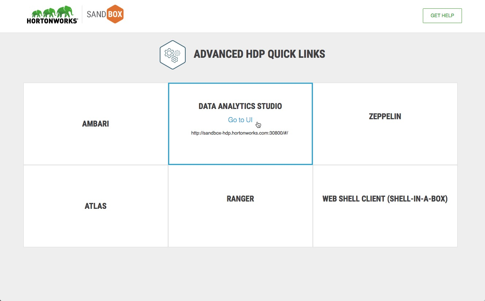

DAS is also accessible by navigating to [sandbox-hdp.hortonworks.com:30800](http://sandbox-hdp.hortonworks.com:30800/#/)

You will find the Data Analytics Studio UI:

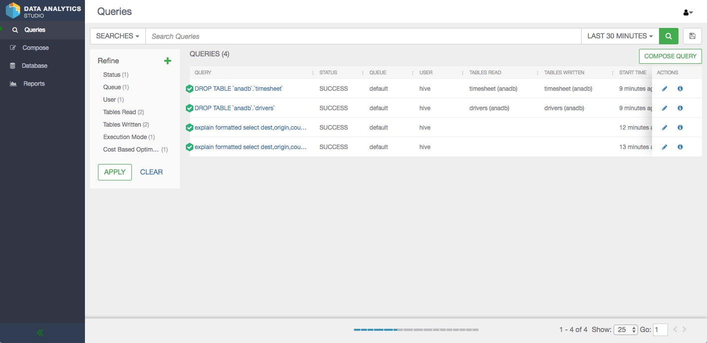

Next, we will create tables based on the csv files we downloaded earlier.

1\. Click on **Database**

2\. Select the `+` button to add a new table

3\. Click on **UPLOAD TABLE**

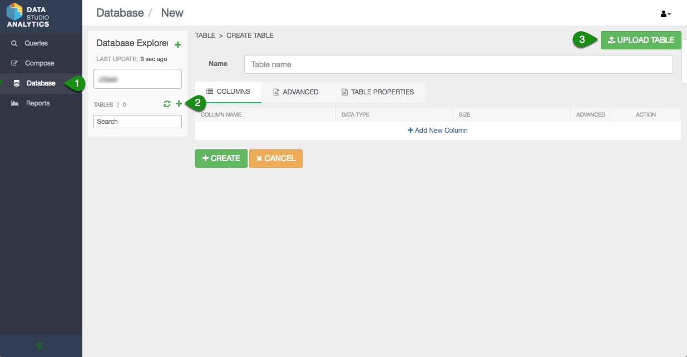

4\. Select the **_Is first row header?_** checkbox

5\. Select **_Upload from Local_**

6\. Drag and drop **drivers.csv** and **timesheet.csv** onto the browser or select the files from your local directory

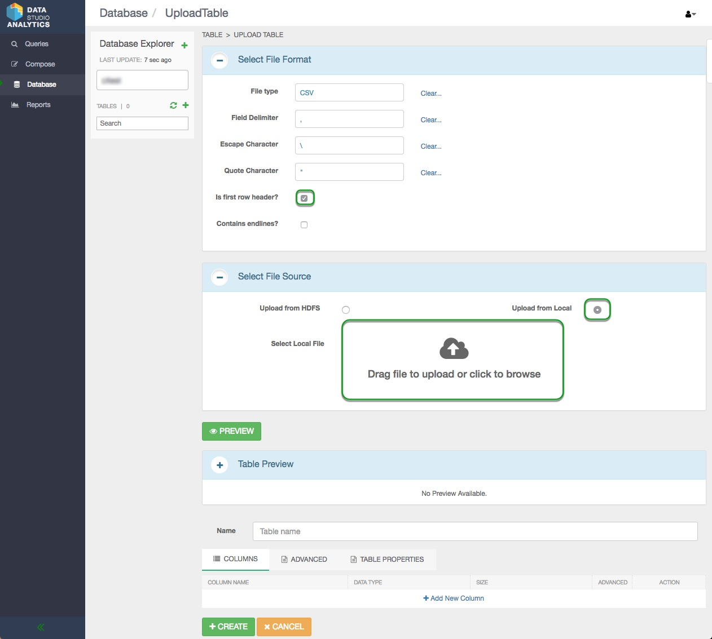

7\. Review the data and the DDL, once you are satisfied select **create**

Here is a table of the DDL for your reference:

**Driver Table**

| Item      | Data Type |
|-----------|-----------|
| driverId  | int       |
| name      | string    |
| ssn       | big int   |
| location  | string    |
| certified | string    |
| wageplan  | string    |

**Timesheet Table**

| driverId     | int |
|--------------|-----|
| week         | int |
| hoursLogged  | int |
| miles_logged | int |

## Speed Improvements

To experience the speed improvements of Hive on Tez, we will run some sample queries.

By default, the Hive view runs with Tez as it's execution engine. That's because Tez has great speed improvements over the original MapReduce execution engine. But by how much exactly are these improvements? Well let's find out!

### Configure MapReduce as Execution Engine in Hive view Settings Tab

Great, now that our tables are created and loaded with data we can begin experimenting with settings:

Navigate back to Ambari and sign in as **Username/Password: raj_ops/raj_ops**

Next select **Hive** and then `CONFIGS`

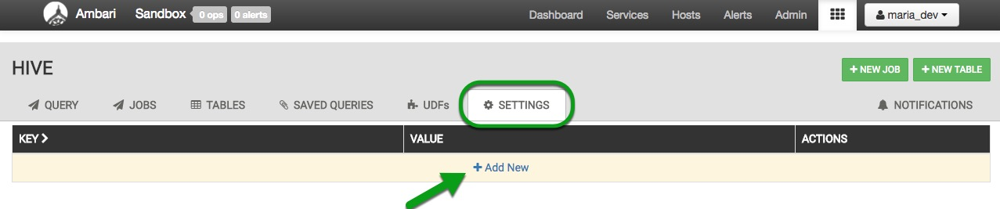

Finally, use the filter to find and modify these specific configurations:

|    **Configuration**   |**New Value**|
|:----------------------:|:---------:|
|`hive.execution.engine` | `mr`      |
|`hive.auto.convert.join`| `false` (unselect box)|

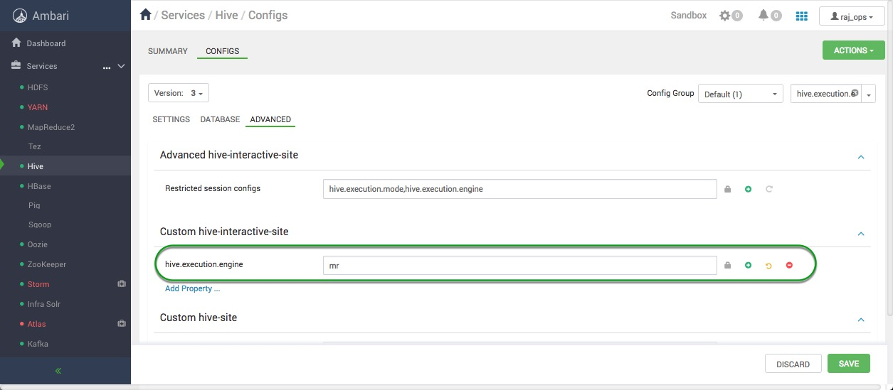

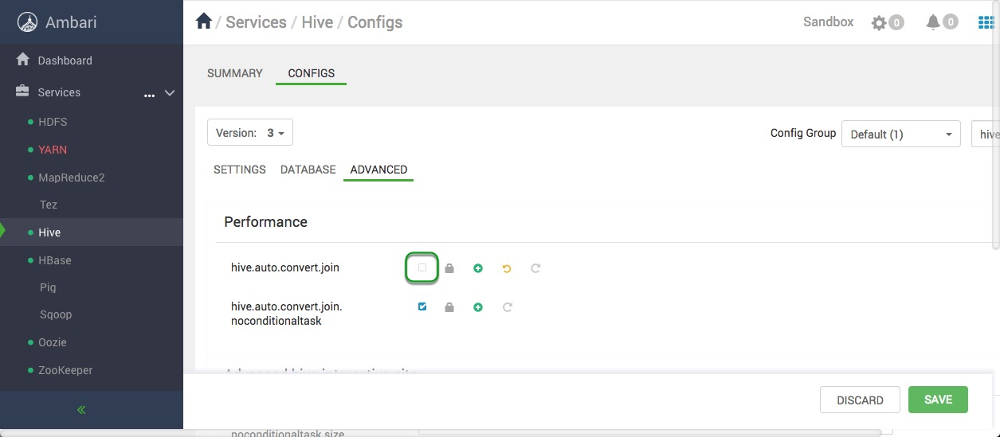

Save the changes and restart all services required.

## Test Query on MapReduce Engine

We are now going to test a query using MapReduce as our execution engine. [Head back to DAS](sandbox-hdp.hortonworks.com:30800/#/) then execute the following query and wait for the results.

~~~sql
select d.*, t.hoursLogged, t.milesLogged
from drivers d join timesheet t
on d.driverId = t.driverId;
~~~

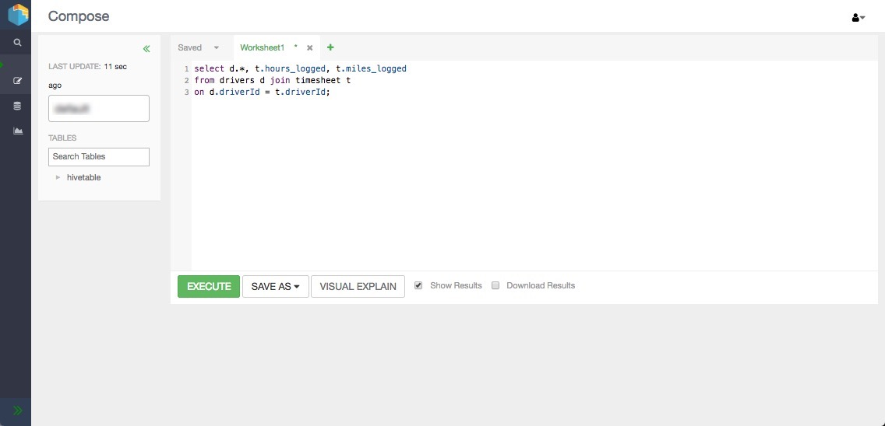

This query was run using the MapReduce framework.

## Configure Tez as Execution Engine in Hive Settings Tab

Now we can enable Hive on Tez execution and take advantage of Directed Acyclic Graph (DAG) execution representing the query instead of multiple stages of MapReduce program which involved a lot of synchronization, barriers and IO overheads. This is improved in Tez, by writing intermediate data set into memory instead of hard disk.

Great, now that our tables are created and loaded with data we can begin experimenting with settings:

Navigate back to Ambari and sign in as **Username/Password: raj_ops/raj_ops**

Next select **Hive** and then `CONFIGS`

Finally, use the filter to find and modify these specific configurations:

|    **Configuration**   |**New Value**|
|:----------------------:|:---------:|
|`hive.execution.engine` | `tez`      |
|`hive.auto.convert.join`| `true` (select box)   |

Save the changes and restart all services required.

## Test Query on Tez Engine

Run the same query as we had run earlier to see the speed improvements with Tez.

~~~sql
select d.*, t.hours_logged, t.miles_logged
from drivers d join timesheet t
on d.driverId = t.driverId;
~~~

Take a look at the `Visual Explain` to visually see the execution plan.

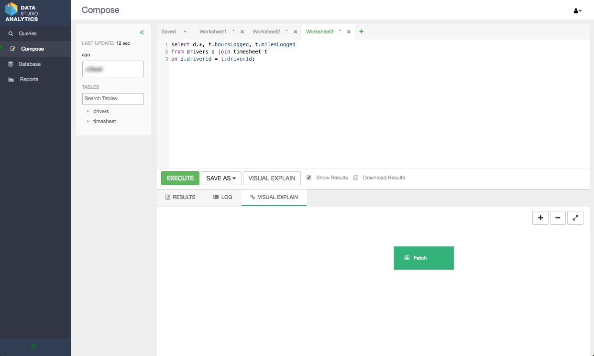

Notice that the results will have appeared much quicker while having the execution engine set to Tez. This is currently the default for all Hive queries.

Congratulations! You have successfully run your Hive on Tez Job.

## Execute Query as MapReduce Then Tez Engine

Now let’s try a new query to work with

~~~sql
SELECT d.driverId, d.name, t.total_hours, t.total_miles from drivers d
JOIN (SELECT driverId, sum(hoursLogged)total_hours, sum(milesLogged)total_miles FROM timesheet GROUP BY driverId ) t
ON (d.driverId = t.driverId);
~~~

Try executing the query first on MapReduce execution engine, then on Tez. You should notice a considerable gap in execution time.
Here is the result.

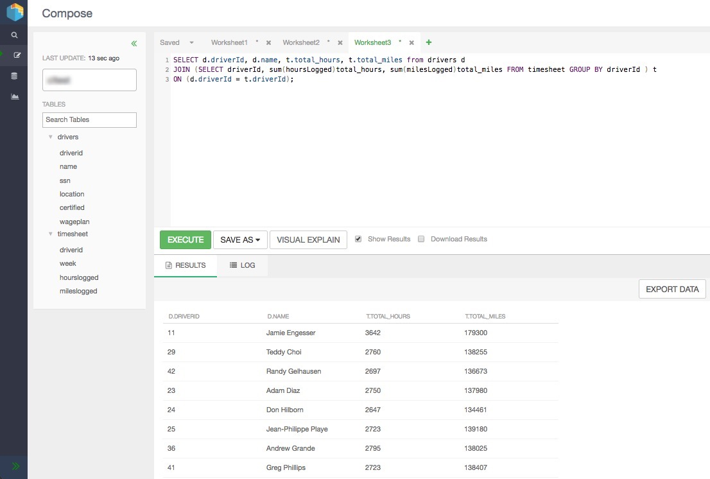

To experience this further, you could use your own dataset, upload to your HDP Sandbox using steps above and execute with and without Tez to compare the difference.

## Track Hive on Tez Jobs

You can track your Hive on Tez jobs in HDP Sandbox Web UI as well by navigating to  [http://sandbox-hdp.hortonworks.com:8088/ui2](http://sandbox-hdp.hortonworks.com:8088/ui2/#/cluster-overview), here you can observe the running state of the queries we just experimented with, as well as the engine used in the background.

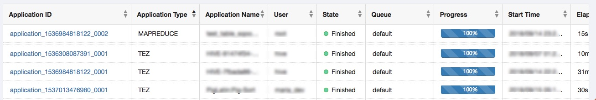

You can click on your job and see further details.

## Summary

You learned how to create Hive tables from `.csv` files using DAS. We also experimented with **MapReduce** and **Tez** to observe the speed improvements of Hive on Tez.

## Further Reading

- [Apache Hive](https://hortonworks.com/apache/hive/)
- [Apache Hive Documentation](https://docs.hortonworks.com/HDPDocuments/HDP3/HDP-3.0.0/hive-overview/content/hive-apache-hive-3-architecturural-overview.html)
- [Hive Language Manual](https://cwiki.apache.org/confluence/display/Hive/LanguageManual+DDL)
