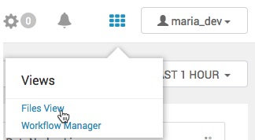
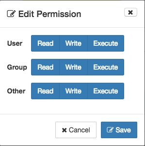
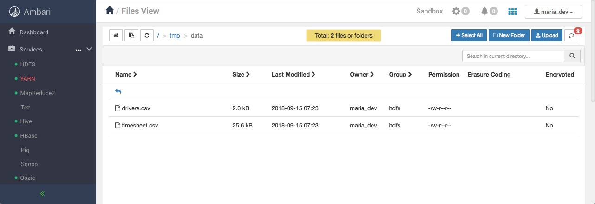
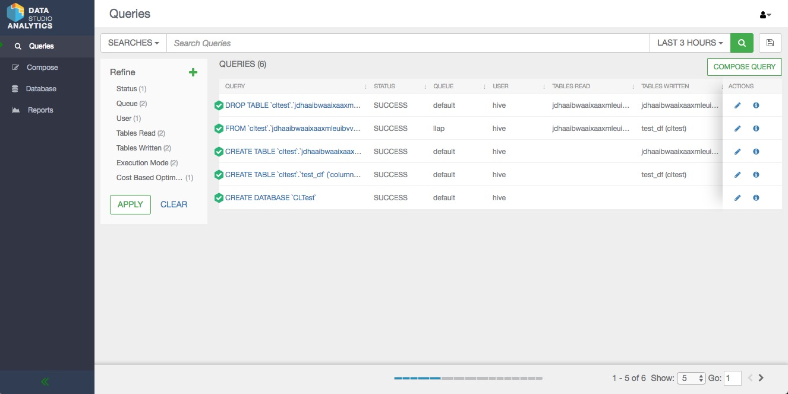
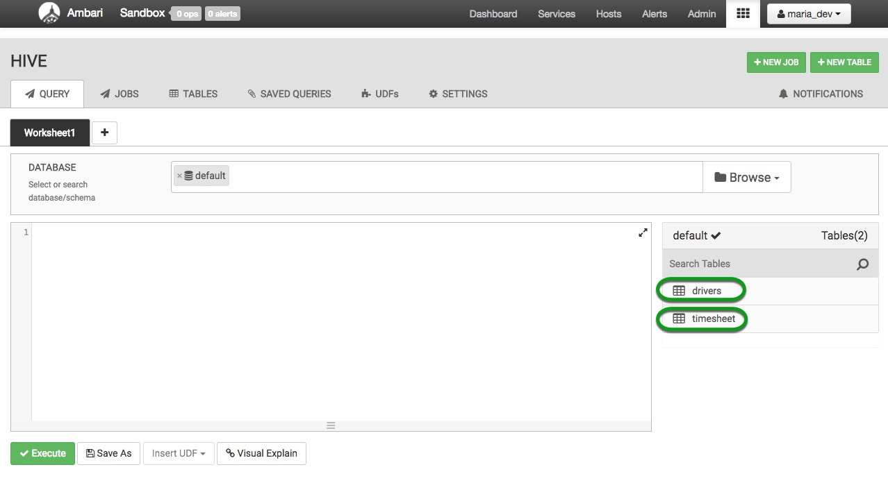
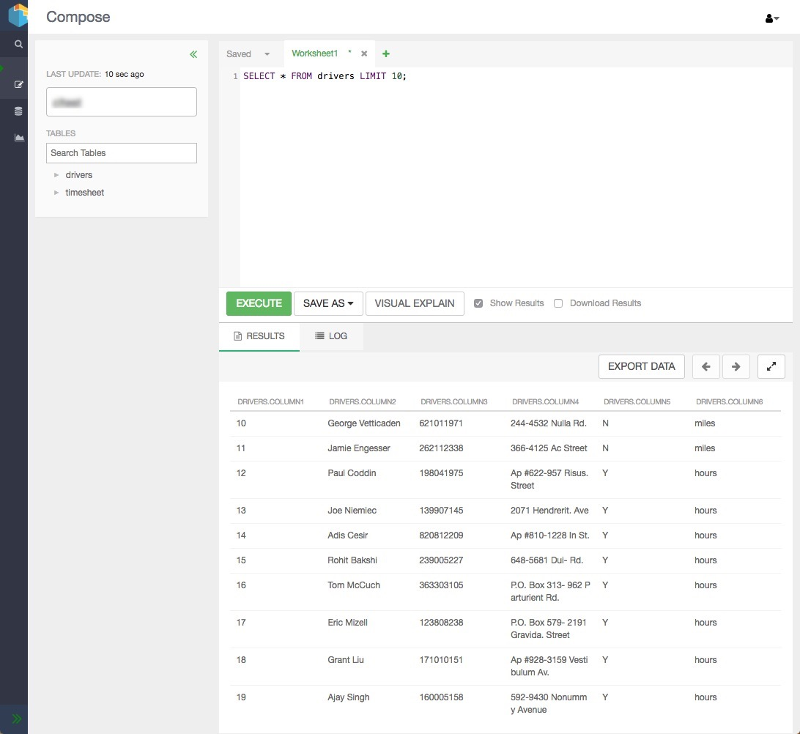

# Interactive Query for Hadoop with Apache Hive on Apache Tez

## Introduction

In this tutorial, we’ll focus on taking advantage of the improvements to [Apache Hive](https://hortonworks.com/hadoop/hive) and [Apache Tez](https://hortonworks.com/hadoop/tez) through the work completed by the community as part of the [Stinger initiative](https://hortonworks.com/blog/100x-faster-hive/). These features will be discussed in this tutorial:

- Performance improvements of Hive on Tez
- Performance improvements of Vectorized Query
- Cost-based Optimization Plans
- Multi-tenancy with HiveServer2
- SQL Compliance Improvements

## Prerequisites

- Downloaded and Installed latest [Hortonworks Sandbox](https://hortonworks.com/downloads/#sandbox)
- [Learning the Ropes of the HDP Sandbox](https://hortonworks.com/tutorial/learning-the-ropes-of-the-hortonworks-sandbox/)
- Allow yourself around one hour to complete this tutorial

## Outline

- [Download Data](#download-data)
- [Upload Data Using HDFS Files View](#upload-data-using-hdfs-files-view)
- [Create Hive Queries](#create-hive-queries)
- [Speed Improvements](#speed-improvements)
- [Configure MapReduce as Execution Engine in Hive view Settings Tab](#configure-mapreduce-as-execution-engine-in-hive-view-settings-tab)
- [Test Query on MapReduce Engine](#test-query-on-mapreduce-engine)
- [Configure Tez as Execution Engine in Hive view Settings Tab](#configure-tez-as-execution-engine-in-hive-settings-tab)
- [Test Query on Tez Engine](#test-query-on-tez-engine)
- [Execute Query as MapReduce Then Tez Engine](#execute-query-as-mapreduce-then-tez-engine)
- [Track Hive on Tez Jobs](#track-hive-on-tez-jobs)
- [Summary](#summary)
- [Further Reading](#further-reading)

## Download Data

Download the driver data file from [here](assets/driver_data.zip).

Once you have the file you will need to unzip the file into a directory. We will be uploading two csv files - drivers.csv and timesheet.csv.

## Upload Data Using HDFS Files View

Let’s use the above two csv files `(drivers.csv and timesheet.csv)` to create two new tables using the following step. Navigate to `http://sandbox-hdp.hortonworks.com:8080` using your browser. Click the HDFS `Files view` from the dropdown menu.

Go to the `/tmp` folder and if it is not already present, create a new directory called `data` using the controls toward the top of the screen. Click next to the folder and click `Permissions`. Make sure to check (blue) all of the permissions boxes.

Now, let’s upload the above data files into HDFS and create two hive tables using the following steps.
Upload the two files under `/tmp/data` using `Upload` at the top of the screen

## Create Hive Queries

Now head on over to [**Data Analytics Studio (DAS)**](sandbox-hdp.hortonworks.com:30800)

We will now use hive and create the two tables. They will be named per the csv file names : `drivers` and `timesheet`.
Use the following two queries to create the tables a then load the data

### Create Table drivers

~~~sql
create table drivers
(driverId int,
 name string,
 ssn bigint,
 location string,
 certified string,
 wageplan string)
ROW FORMAT DELIMITED
FIELDS TERMINATED BY ','
STORED AS TEXTFILE
TBLPROPERTIES("skip.header.line.count"="1");
~~~

### Create Table timesheet

~~~sql
create table timesheet
(driverId int,
 week int,
 hoursLogged int,
 milesLogged int)
ROW FORMAT DELIMITED
FIELDS TERMINATED BY ','
STORED AS TEXTFILE
TBLPROPERTIES("skip.header.line.count"="1");
~~~

Two newly created tables should appear in a few seconds:

### 3.3 Load Data into Query Tables

We’re are now going to load the data into the two tables using the `LOAD DATA INPATH` Hive command

~~~sql
LOAD DATA INPATH '/tmp/data/drivers.csv' OVERWRITE INTO TABLE drivers;
LOAD DATA INPATH '/tmp/data/timesheet.csv' OVERWRITE INTO TABLE timesheet;
~~~

You should now be able to obtain results when selecting small amounts of data from either table:

## Speed Improvements

To take a look at the speed improvements of Hive on Tez, we can run some sample queries.

By default, the Hive view runs with Tez as it's execution engine. That's because Tez has great speed improvements over the original MapReduce execution engine. But by how much exactly are these improvements? Well let's find out!

### Configure MapReduce as Execution Engine in Hive view Settings Tab

Great, now that our tables are created and loaded with data we can begin experimenting with settings:

Navigate back to Ambari and sign in as **Username/Password: raj_ops/raj_ops**

Next select **Hive** and then `CONFIGS`

Finally, use the filter to find and modify these specific configurations:

|    **Configuration**   |**New Value**|
|:----------------------:|:---------:|
|`hive.execution.engine` | `mr`      |
|`hive.auto.convert.join`| `false` (unselect box)|

Save the changes and restart all services required.

## Test Query on MapReduce Engine

We are now going to test a query using MapReduce as our execution engine. Execute the following query and wait for the results.

~~~sql
select d.*, t.hoursLogged, t.milesLogged
from drivers d join timesheet t
on d.driverId = t.driverId;
~~~

This query was run using the MapReduce framework.

## Configure Tez as Execution Engine in Hive Settings Tab

Now we can enable Hive on Tez execution and take advantage of Directed Acyclic Graph (DAG) execution representing the query instead of multiple stages of MapReduce program which involved a lot of synchronization, barriers and IO overheads. This is improved in Tez, by writing intermediate data set into memory instead of hard disk.

Great, now that our tables are created and loaded with data we can begin experimenting with settings:

Navigate back to Ambari and sign in as **Username/Password: raj_ops/raj_ops**

Next select **Hive** and then `CONFIGS`

Finally, use the filter to find and modify these specific configurations:

|    **Configuration**   |**New Value**|
|:----------------------:|:---------:|
|`hive.execution.engine` | `tez`      |
|`hive.auto.convert.join`| `true` (select box)   |

Save the changes and restart all services required.

## Test Query on Tez Engine

Run the same query as we had run earlier to see the speed improvements with Tez.

~~~sql
select d.*, t.hours_logged, t.miles_logged
from drivers d join timesheet t
on d.driverId = t.driverId;
~~~

Take a look at the `Visual Explain` to visually see the execution plan.

Notice that the results will have appeared much quicker while having the execution engine set to Tez. This is currently the default for all Hive queries.

Congratulations! You have successfully run your Hive on Tez Job.

## Execute Query as MapReduce Then Tez Engine

Now let’s try a new query to work with

~~~sql
SELECT d.driverId, d.name, t.total_hours, t.total_miles from drivers d
JOIN (SELECT driverId, sum(hoursLogged)total_hours, sum(milesLogged)total_miles FROM timesheet GROUP BY driverId ) t
ON (d.driverId = t.driverId);
~~~

Try executing the query first on MapReduce execution engine, then on Tez. You should notice a considerable gap in execution time.
Here is the result.

To experience this further, you could use your own dataset, upload to your HDP Sandbox using steps above and execute with and without Tez to compare the difference.

## Track Hive on Tez Jobs

You can track your Hive on Tez jobs in HDP Sandbox Web UI as well. Please go to : [http://sandbox-hdp.hortonworks.com:8088/ui2](http://sandbox-hdp.hortonworks.com:8088/ui2/#/cluster-overview) and track your jobs while running or post to see the details under the application tab.

You can click on your job and see further details.

## Summary

You learned to perform basic hive queries, compared Hive on MapReduce and Tez Engine.

## Further Reading

- [Apache Hive](https://hortonworks.com/apache/hive/)
- [Apache Hive Documentation](https://docs.hortonworks.com/HDPDocuments/HDP3/HDP-3.0.0/hive-overview/content/hive-apache-hive-3-architecturural-overview.html)
- [Hive Language Manual](https://cwiki.apache.org/confluence/display/Hive/LanguageManual+DDL)
