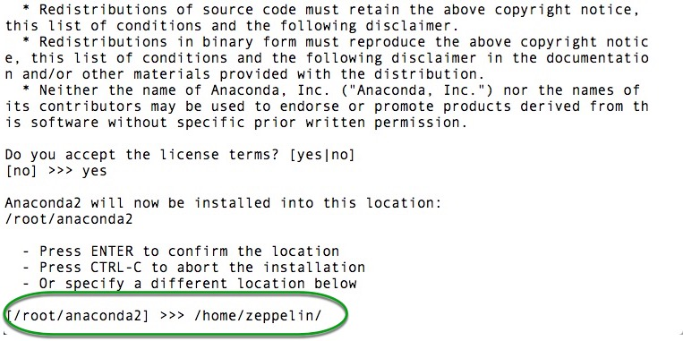
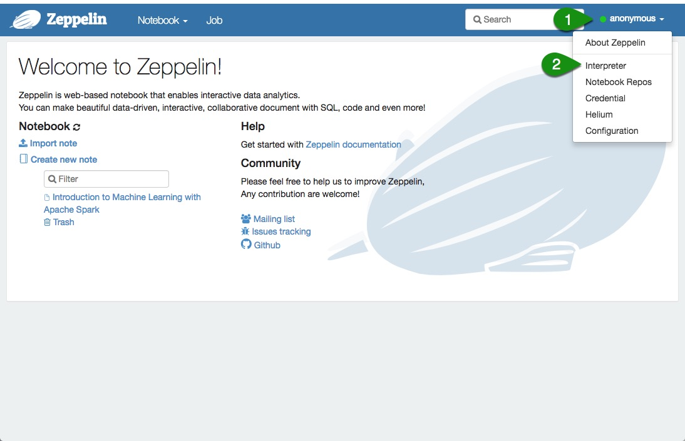
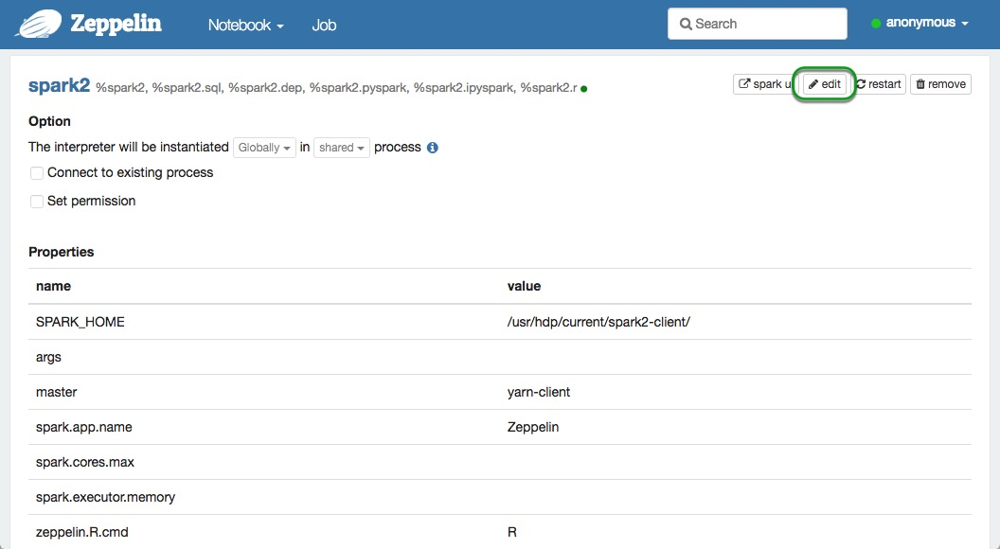
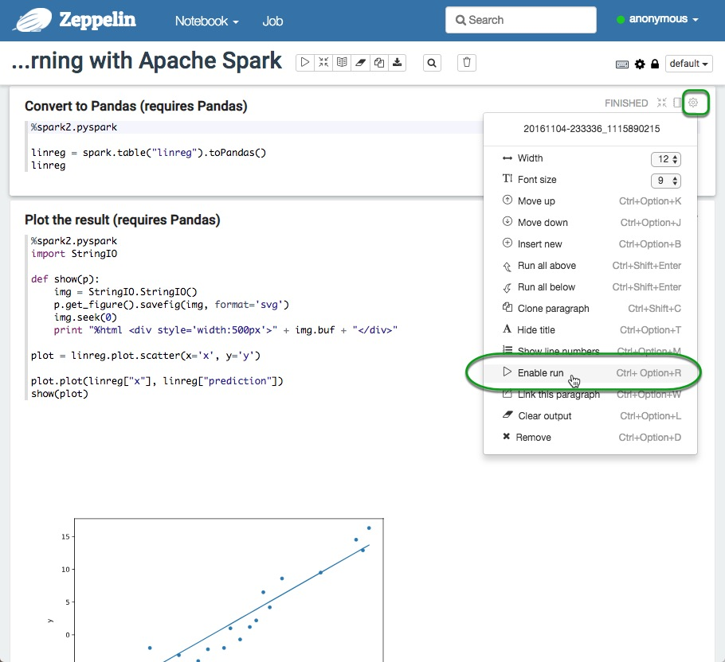
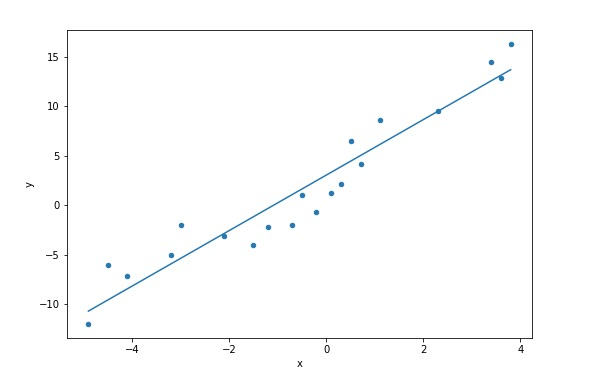

# Intro to Machine Learning with Apache Spark and Apache Zeppelin

## Introduction

In this tutorial, we will introduce you to Machine Learning with Apache Spark. The hands-on portion for this tutorial is an Apache Zeppelin notebook that has all the steps necessary to ingest and explore data, train, test, visualize, and save a model. We will cover a basic Linear Regression model that will allow us perform simple predictions on a sample data. This model can be further expanded and modified to fit your needs. Most importantly, by the end of this tutorial, you will understand how to create an end-to-end pipeline for setting up and training simple models in Spark.

## Prerequisites

- Downloaded and deployed the [Hortonworks Data Platform (HDP)](https://www.cloudera.com/downloads/hortonworks-sandbox/hdp.html?utm_source=mktg-tutorial) Sandbox
- [Getting Started with Apache Zeppelin](https://hortonworks.com/tutorial/getting-started-with-apache-zeppelin/)
- Having basic knowledge of [Scala](http://www.dhgarrette.com/nlpclass/scala/basics.html)

## Outline

- [Concepts](#concepts)
- [What is a Model?](#what-is-a-model)
- [Import the Zeppelin Notebook](#import-the-zeppelin-notebook)
- [Summary](#summary)
- [Further Reading](#further-reading)
- [Appendix A: Installing Anaconda on the Hortonworks Data Platform Sandbox](#appendix-a-installing-anaconda-on-the-hortonworks-data-platform-sandbox)

## Concepts

Machine Learning models can be applied to accomplish a variety of tasks from Classification, to Collaborative Filtering, Clustering, and Regression.

We start with Linear Regression as this is one of the most common approaches for estimating unknown parameters after training on a known dataset. In this tutorial, we are training on a 2D dataset, so our Linear Regression model can be intuitively thought as curve fitting. With more parameters, or features, we can make interesting predictions, for example, what should be a price listing range for a house with three bedrooms, two baths, 20 years old, and in a specific zip code area. Using Linear Regression for pricing houses given a set of input parameters works surprisingly well provided a large enough sample dataset. To cover edge cases, however, other Machine Learning methods might have to be used such as Random Forests or Gradient Boosted Trees, which we will cover in detail in future tutorials.

There are five major steps in this tutorial we will cover.

- First, the dataset will consist of pairs of inputs and expected outputs. You may think of this as (x, y) pairs, with x being the input and y being the output. We will have approximately twenty points in our small training dataset.

- Second, we will construct a Linear Regression pipeline by specifying the input and output columns, and the model we want to use (i.e. Linear Regression). Once the pipeline is created, we will use the **fit** function to fit the data to a model (i.e. train the model).

- Third, we will summarize the model results focusing on:

  - Root Mean Square Error (RMSE) as another measure of differences between predicted by model and observed values (taking in account all the differences or residuals) with lower value indicating a better fit.

  - R2 or R Squared, also called coefficient of determination or goodness of fit, with the higher values indicating better fit (on a 0 to 1 scale).

  - Residuals that indicate difference between the observed value and the estimated value of the quantify of interest. With these snapshot measures, a Data Scientist can quickly understand model fitness and compare different trained models to choose the best one.

- Fourth, with the trained model we will make predictions and see how individual predictions compare to original (expected) values.

- Fifth, we will graph the model as a straight line overlaid over the original training data points. This will give you a quick visual snapshot on the fitness of the model.

## What is a Model

A model is a mathematical formula with a number of parameters that need to be learned from the data. Fitting a model to the data is a process known as model training.

Take, for instance one feature/variable linear regression, where a goal is to fit a line (described by the well know equation `y = ax + b`) to a set of distributed data points.

For example, assume that once model training is complete we get a model equation `y = 2x + 5`. Then for a set of inputs `[1, 0, 7, 2, …]` we would get a set of outputs `[7, 5, 19, 9, …]`. That’s it!

In this notebook you will get a chance to learn a step-by-step process of training a one variable linear regression model with Spark.

### Why Linear Regression

We’re introducing Machine Learning with Linear Regression because it’s one of the more basic and commonly used predictive analytics method. It’s also easy to explain and grasp intuitively as you’ll make your way through the examples.

Note, that we will not cover the details of how the underlying Linear Regression algorithm works. We will merely focus on applying the algorithm and generating a model. If you would like to learn more about Linear Regression and other algorithms check out this excellent [Coursera Machine Learning Course](https://www.coursera.org/learn/machine-learning) taught by Andrew Ng.

To summarize, we will be

1\. Setting up a two dimensional dataset

2\. Creating a Linear Regression model pipeline

3\. Summarizing the model training

4\. Predicting output using the model

5\. By the end of the notebook you will be able to visualize the linear fitting prediction that your model generated:

## Import the Zeppelin Notebook

 Great! now you are familiar with how to train a Linear Regression Machine Learning model and you are ready to Import the _Introduction to Machine Learning using Linear Regression_ notebook into your Zeppelin environment. (If at any point you have any issues, make sure to checkout the [Getting Started with Apache Zeppelin](https://hortonworks.com/tutorial/getting-started-with-apache-zeppelin/) tutorial).

To import the notebook, go to the Zeppelin home screen.

1\. Click **Import note**

2\. Select **Add from URL**

3\. Copy and paste the following URL into the **Note URL**

~~~text
https://raw.githubusercontent.com/hortonworks/data-tutorials/master/tutorials/hdp/intro-to-machine-learning-with-apache-spark-and-apache-zeppelin/assets/Introduction%20to%20Machine%20Learning%20with%20Apache%20Spark.json
~~~

4\. Click on **Import Note**

Once your notebook is imported, you can open it from the Zeppelin home screen by:

5\. Clicking **Clicking on the Introduction to Machine Learning using Linear Regression**

Once the **Introduction to Machine Learning using Linear Regression** notebook is up, follow all the directions within the notebook to complete the tutorial.

## Summary

We hope that you've been able to successfully run this first tutorial introducing basic, yet very common, Machine Learning application. Through this tutorial we learned how to generate and explore data, train, test, visualize, and save a Linear Regression Machine Learning model.

Next, learn how to create machine learning models to process a sentiment analysis on a batch of tweets on the [Twitter sentiment analysis](https://hortonworks.com/tutorial/sentiment-analysis-with-apache-spark/); additionally, if you would like to learn more on how to deploy machine learning models in production, checkout this tutorial on [deploying machine learning models with structured streaming](https://hortonworks.com/tutorial/deploying-machine-learning-models-using-spark-structured-streaming/).

## Further Reading

- [Hortonworks Apache Spark Tutorials](https://hortonworks.com/tutorials/?filters=apache-spark) are a great resource to explore Spark in more depth
- [Hortonworks Community Connection (HCC)](https://community.hortonworks.com/spaces/85/data-science.html?type=question)
- [Hortonworks Apache Spark Docs](https://docs.hortonworks.com/HDPDocuments/HDP3/HDP-3.0.0/spark-overview/content/analyzing_data_with_apache_spark.html)
- [Hortonworks Apache Zeppelin Docs](https://docs.hortonworks.com/HDPDocuments/HDP3/HDP-3.0.0/zeppelin-overview/content/overview.html)

## Appendix A: Installing Anaconda on the Hortonworks Data Platform Sandbox

In this section you will learn to install Anaconda on your HDP sandbox. Anaconda is an open source distribution of Python and R which contains over 200 packages for Machine Learning and Data Science applications; additionally, Anaconda includes [Conda](https://conda.io/docs/), a platform agnostic package and environment management application. The Anaconda distribution contains [Pandas](https://pandas.pydata.org/) and all of its dependencies, Pandas is used on this tutorial to help visualize the output of the model you have trained.

### Appendix Prerequisites

- Successfully imported and completed the [Introduction to Machine Learning with Apache Spark](#import-the-zeppelin-notebook) Zeppelin Notebook for this tutorial

### Installing Pandas

1\. Navigate to sandbox-hdp.hortonworks.com:4200 to launch [Shell-in-a-Box](https://hortonworks.com/tutorial/learning-the-ropes-of-the-hortonworks-sandbox/#shell-web-client-method).

> NOTE: The default **username/password** is **root/hadoop**.

2\. Install bzip2:

~~~bash
yum install bzip2
~~~

3\. Download Anaconda:

~~~bash
wget https://repo.anaconda.com/archive/Anaconda2-5.2.0-Linux-x86_64.sh
~~~

> NOTE: This is Anaconda for Python 2.7, but if you would prefer a different version you can find it at [Anaconda's website](https://www.anaconda.com/download).

4\. Install Anaconda change install location

To begin the installation run the following command:

~~~bash
sh Anaconda2-5.2.0-Linux-x86_64.sh -u
~~~

and accept the terms:

Once you have accepted the terms and conditions of Anaconda you will be asked where you will like to install the application, choose the following location:

~~~bash
/home/zeppelin/
~~~

Once the installation process is underway you will be asked if you want to modify your _.bashrc_ and install VSCode, note that neither of these are necessary for our purposes, feel free to say no.

Great! now you are the proud owner of an HDP Sandbox with Anaconda, now let's link these awesome packages to Zeppelin.

5\. Using Pandas with Zeppelin

Open a browser and navigate to Zeppelin UI at [sandbox-hdp.hortonworks.com:9995](sandbox-hdp.hortonworks.com:9995)

Next, select the dropdown menu labeled **anonymous** and select interpreter settings:

Once you are in the interpreter settings menu scroll down and find the **spark2** interpreter then click on edit:

Next, locate the **_zeppelin.pyspark.python_** property and enter the path to the python binary that we intalled with anaconda and click Save:

~~~bash
/home/zeppelin/bin/python2.7
~~~

Now Zeppelin is linked to python with all of Anacondas packages at your disposal. Navigate back to Zeppelin Notebook UI and open your [_Introduction to Machine Learning with Apache Spark Notebook_](#import-the-zeppelin-notebook), then locate the paragraphs that require Pandas

Next, click on the gear icon on the upper right-hand side of the paragraph and select **_Enable run_**:

Now run your Notebook again from the beginning and this time feel free to run all of the paragraphs, you will see a beautiful visualization of the model you just trained.

