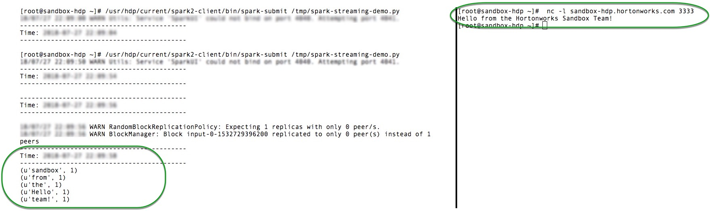

# Introduction to Spark Streaming

## Introduction

In this tutorial, we will introduce core concepts of Apache Spark Streaming and run a Word Count demo that computes an incoming list of words every two seconds.

## Prerequisites

This tutorial is a part of series of hands-on tutorials to get you started with HDP using Hortonworks Sandbox. Please ensure you complete the prerequisites before proceeding with this tutorial.

- Downloaded and deployed latest [Hortonworks Data Platform (HDP) Sandbox](https://hortonworks.com/products/hortonworks-sandbox/#install)
- [Learning the Ropes of the HDP Sandbox](https://hortonworks.com/tutorial/learning-the-ropes-of-the-hortonworks-sandbox/)
- [Mapped your Sandbox IP Address to sandbox-hdp.hortonworks.com](https://hortonworks.com/tutorial/learning-the-ropes-of-the-hortonworks-sandbox/#map-sandbox-ip-to-your-desired-hostname-in-the-hosts-file)

## Outline

- [Concepts](#concepts)
- [Download a Spark Streaming Demo to the Sandbox](#download-a-spark-streaming-demo-to-the-sandbox)
- [Submit a Spark Streaming Job](#submit-a-spark-streaming-job)
- [Suppressing INFO Messages](#suppressing-info-messages)
- [Summary](#summary)
- [Further Reading](#further-reading)

## Concepts

Spark Streaming is an extension of the core Spark API that enables scalable, high-throughput, fault-tolerant stream processing of live data streams. Data can be ingested from many sources like Kafka, Flume, Twitter, ZeroMQ, Kinesis, or TCP sockets, and can be processed using complex algorithms expressed with high-level functions like map, reduce, join and window. Finally, processed data can be pushed out to filesystems, databases, and live dashboards.

Internally, it works as follows. Spark Streaming receives live input data streams and divides the data into batches, which are then processed by the Spark engine to generate the final stream of results in batches.

### DStream

Discretized Stream or DStream is the basic abstraction provided by Spark Streaming. It represents a continuous stream of data, either the input data stream received from source, or the processed data stream generated by transforming the input stream. Internally, a DStream is represented by a continuous series of RDDs, which is Spark’s abstraction of an immutable, distributed dataset (see [Spark Programming Guide](http://spark.apache.org/docs/1.6.0/programming-guide.html#resilient-distributed-datasets-rdds) for more details).

## Download a Spark Streaming Demo to the Sandbox

1\. Start your Sandbox

>NOTE: If you need help mapping the sandbox IP to a different hostname you may follow this [tutorial](https://hortonworks.com/tutorial/learning-the-ropes-of-the-hortonworks-sandbox/#map-sandbox-ip-to-your-desired-hostname-in-the-hosts-file) to do so.

2\. Launch a "Shell in a Box"

[http://sandbox-hdp.hortonworks.com:4200](http://sandbox-hdp.hortonworks.com:4200)

Now let's download a Spark Streaming demo code to your sandbox from GitHub.

In your "Shell in a Box" execute the following two commands:

~~~bash
cd /tmp
~~~

and

~~~bash
wget https://raw.githubusercontent.com/hortonworks/data-tutorials/master/tutorials/hdp/introduction-to-spark-streaming/assets/spark-streaming-demo.py
~~~

<!--   are used here to prevent the text from becoming a broken link. Markdown thinks this is a webpage.-->
>NOTE: The second command downloads _*spark-streaming-demo.py*_ Spark Streaming code that computes a simple Word Count. Words (i.e. strings) will be coming in via a network socket connection from a simple Netcat tool introduced later.

Several things worth pointing out in the demo code you've just downloaded:

1\. We've set a 2 sec batch interval to make it easier to inspect results of each batch processed.

2\. We perform a simple word count for each batch and return the results back to the terminal screen with a `pprint()` function.

~~~python
from pyspark import SparkContext
from pyspark.streaming import StreamingContext

# Create a local StreamingContext with two working threads and a batch interval of 2 seconds
sc = SparkContext("local[2]", "NetworkWordCount")
ssc = StreamingContext(sc, 2)

# Create a DStream
lines = ssc.socketTextStream("sandbox-hdp.hortonworks.com", 3333)

# Split each line into words
words = lines.flatMap(lambda line: line.split(" "))

# Count each word in each batch
pairs = words.map(lambda word: (word, 1))
wordCounts = pairs.reduceByKey(lambda x, y: x + y)

# Print each batch
wordCounts.pprint()

ssc.start()             # Start the computation
ssc.awaitTermination()  # Wait for the computation to terminate
~~~

## Submit a Spark Streaming Job

Now you're ready to submit a Spark job. In your terminal window copy and paste the following and hit `Enter`:

~~~bash
/usr/hdp/current/spark2-client/bin/spark-submit /tmp/spark-streaming-demo.py
~~~

You should see lots of INFO interspersed with Timestamp corresponding to each batch that is updated every 2 seconds in the following format:

~~~text
===========================================
Time: YYYY-MM-DD HH:MM:SS
===========================================
~~~

## Run Netcat

Netcat (often abbreviated to nc) is a computer networking utility for reading from and writing to network connections using TCP or UDP.

In your browser, open a second tab or window, and open another "Shell in a Box" by navigating to [http://sandbox-hdp.hortonworks.com:4200](http://sandbox-hdp.hortonworks.com:4200).

Log on to your _shell_ and run the following command to launch Netcat:

~~~bash
nc -l sandbox-hdp.hortonworks.com 3333
~~~

At this point you should be connected and you may start typing or pasting any text.

For example, if we type the text **"Hello from the sandbox team!"** in the Netcat window, we can observe the following output in the running Spark Streaming job tab or window:

## Stopping Spark Streaming and Netcat

When you're done experimenting, press `Ctrl + C` in your  shell tab or window to stop your Spark Job and/or Netcat process.

## Suppressing INFO Messages

If you want to remove annoying INFO messages from the Spark streaming terminal window, do the following:

Open `conf/log4j.properties`, for example:

~~~bash
vi /usr/hdp/current/spark2-client/conf/log4j.properties
~~~

and Edit log4j.properties:

~~~bash
# Set everything to be logged to the console
log4j.rootCategory=INFO, console
log4j.appender.console=org.apache.log4j.ConsoleAppender
log4j.appender.console.target=System.err
log4j.appender.console.layout=org.apache.log4j.PatternLayout
log4j.appender.console.layout.ConversionPattern=%d{yy/MM/dd HH:mm:ss} %p %c{1}: %m%n

# Settings to quiet third party logs that are too verbose
log4j.logger.org.eclipse.jetty=WARN
log4j.logger.org.eclipse.jetty.util.component.AbstractLifeCycle=ERROR
log4j.logger.org.apache.spark.repl.SparkIMain$exprTyper=INFO
log4j.logger.org.apache.spark.repl.SparkILoop$SparkILoopInterpreter=INFO
~~~

Replace the first line:

~~~bash
log4j.rootCategory=INFO, console
~~~

  with

~~~bash
log4j.rootCategory=WARN, console
~~~

Save log4j.properties and restart your spark-submit job. Now you should see only **WARN** messages.

If you re-submit the Python script and Netcat you should see a much cleaner output.

## Summary

In this tutorial we have reviewed the process of ingesting data and using it as an input on _Discretized Streaming_ provided by Spark Streaming; furthermore, we learned how to capture the data and perform a simple word count to find repetitions on the oncoming data set. Understanding DStreaming and RDDs will enable you to construct complex streaming applications with Spark and Spark Streaming.

## Further Reading

- [PySpark Streaming Documentation](https://spark.apache.org/docs/latest/api/python/pyspark.streaming.html#pyspark.streaming.DStream)
- [Spark Streaming](https://spark.apache.org/streaming/)
- Once you've completed this tutorial, checkout other [Spark Tutorials](https://hortonworks.com/tutorials/?tab=product-hdp&filters=apache-spark).
