# Learning the Ropes of the HDP Sandbox

## Introduction

This tutorial is aimed for users who do not have much experience in using the Sandbox.

The Sandbox is a straightforward, pre-configured, learning environment that contains the latest developments from Apache Hadoop, specifically the Hortonworks Data Platform (HDP). The Sandbox comes packaged in a virtual environment that can run in the cloud or on your personal machine. The Sandbox allows you to learn and explore HDP on your own.

Let's begin our Hadoop journey...

## Prerequisites

- Downloaded and deployed [Hortonworks Data Platform (HDP)](https://hortonworks.com/tutorial/sandbox-deployment-and-install-guide/) Sandbox

## Outline

- [Environment Setup](#environment-setup)
- [Terminal Access](#terminal-access)
- [Welcome Page](#welcome-page)
- [Explore Ambari](#explore-ambari)
- [Further Reading](#further-reading)
- [Appendix A: Reference Sheet](#appendix-a-reference-sheet)
  - [Login Credentials](#login-credentials)
  - [Sandbox Version](#sandbox-version)
  - [Admin Password Reset](#admin-password-reset)
- [Appendix B: Troubleshoot](#appendix-b-troubleshoot)
- [Appendix C: Determine Network Adapter of Your VirtualBox Sandbox](#appendix-c-determine-network-adpater-of-your-virtualbox-sandbox)

<!--- [Explore Sandbox in Azure](#explore-sandbox-in-azure) 
Add the following link to the outline once Azure is available - [Explore Sandbox in Azure](#explore-sandbox-in-azure)--->

## Environment setup

This is the administrative section to get started with the Hortonworks Sandbox environment. Generally, this will only be done once.

### Determine IP Address of Your Sandbox

Once the Sandbox VM or container is installed, it settles to the host of your environment, the IP address varies depending on your Virtual Machine (VMware, VirtualBox) or container (Docker). Once the sandbox is running, it will tell you the IP address. An example of typical IP addresses for each supported environment:

**Docker**: IP Address = **127.0.0.1**

**VirtualBox**: IP Address = **127.0.0.1**

**VMWare**: IP Address = **192.168.x.x**

If you're using **VirtualBox** or **VMWare**, you can confirm the IP address by waiting for the installation to complete and confirmation screen will tell you the IP address your sandbox resolves to. For example:

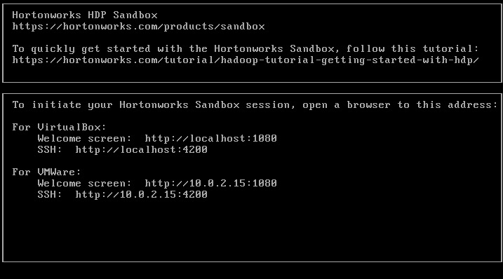

### Map Sandbox IP to Your Desired Hostname in the Hosts File

Mac, Linux and Windows all have a hosts file. This file once configured enables the IP address of the sandbox to be mapped to a hostname that is easier to remember than a number.

**Mac users**:

- ```echo '{IP-Address} sandbox-hdp.hortonworks.com sandbox-hdf.hortonworks.com' | sudo tee -a /private/etc/hosts```

**Linux users**:

- ```echo '{IP-Address} sandbox-hdp.hortonworks.com sandbox-hdf.hortonworks.com' | sudo tee -a /etc/hosts```

**Windows users**:

- Run Notepad as **administrator**.
- Open **hosts** file located in: ```c:\Windows\System32\drivers\etc\hosts```
- Add ```{IP-Address}   localhost  sandbox-hdp.hortonworks.com   sandbox-hdf.hortonworks.com```
- Save the file

> IMPORTANT: Replace **{IP-Address}** with [Sandbox IP Address](#determine-ip-address-of-your-sandbox)

## Terminal Access

 Refer to [Login Credentials](#login-credentials) for list of users and passwords. You can also login using **root**, using password **hadoop**, which may require you to change the password - remember it!

 If you login using credentials other than **root**, you will be required to use **sudo** before the command. For example: ```sudo ambari-server status```.

#### Secure Shell Method:

Open your terminal (mac/linux) or Git Bash (Windows). Type the following command to access the Sandbox through **ssh user@hostname -p port**. For example: ```ssh root@sandbox-hdp.hortonworks.com -p 2222```

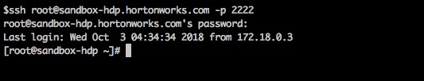

#### Shell Web Client Method:

The **shell web client** is also known as **Shell-in-a-Box**. It's an easy way to issue shell commands without needing to install additional software. It uses **port 4200**, for example:  [sandbox-hdp.hortonworks.com:4200](http://sandbox-hdp.hortonworks.com:4200)

#### Send Data Between Sandbox and Local Machine

Using the terminal of your choice, you can transfer files to/from sandbox and local machine.

- Transfer file from local machine to sandbox:
  - ```scp -P 2222 <local_directory_file> root@sandbox-hdp.hortonworks.com:<sandbox_directory_file>```

- Transfer file from sandbox to local machine:
  - ```scp -P 2222 root@sandbox-hdp.hortonworks.com:<sandbox_directory_file> <local_directory_file> ```

Do you notice the difference between the two commands?

To send data from local machine to sandbox, the local machine directory path comes before sandbox directory. To transfer data from sandbox to local machine, the command arguments are reversed.

## Welcome Page

The Sandbox Welcome Page is also known as the **Splash Page**. It runs on port number **:1080**. To open it, use your host address and append the port number. For example: [http://sandbox-hdp.hortonworks.com:1080/](http://sandbox-hdp.hortonworks.com:1080/splash.html)

It looks like this:

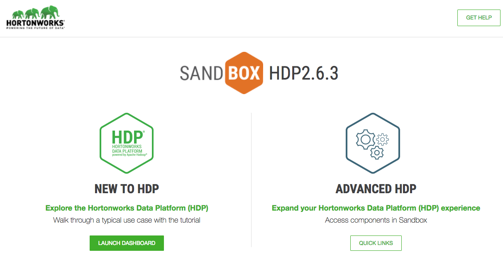

**Launch Dashboard** opens two browser windows - Ambari interface and beginner tutorial. You should login to Ambari using the username and password based on the tutorial requirements. Most of the tutorials use **raj_ops** or **maria_dev**. Refer to [Login Credentials](#login-credentials) for list of users and passwords.

**Advanced HDP Quick Links** provide quick access to Ambari Services such as Zeppelin, Atlas, Ranger, Shell-in-a-box and others.

## Explore Ambari

- Ambari Dashboard runs on port **:8080**. For example, [http://sandbox-hdp.hortonworks.com:8080](http://sandbox-hdp.hortonworks.com:8080)
- Login to as **admin**, refer to [Admin Password Reset](#admin-password-reset)
- Select **Manage Ambari**

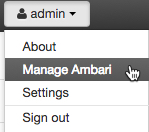

The following screen will be displayed:

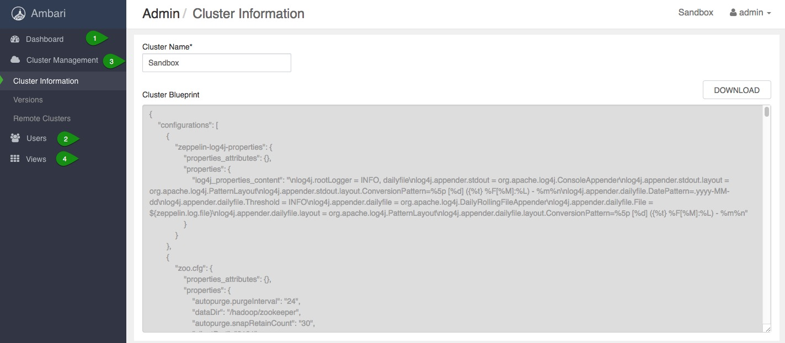

1. “**Dashboard**” will take you to the Ambari Dashboard which is the primary UI for Hadoop Operators
2. “**Cluster Management**” allows you to grant permission to Ambari users and groups
3. “**Administration of Users**” allows you to add & remove Ambari users and groups
4. “**Ambari User Views**” list the set of Ambari Users views that are part of the cluster

- Click on **Go to Dashboard** and you should see a similar screen:

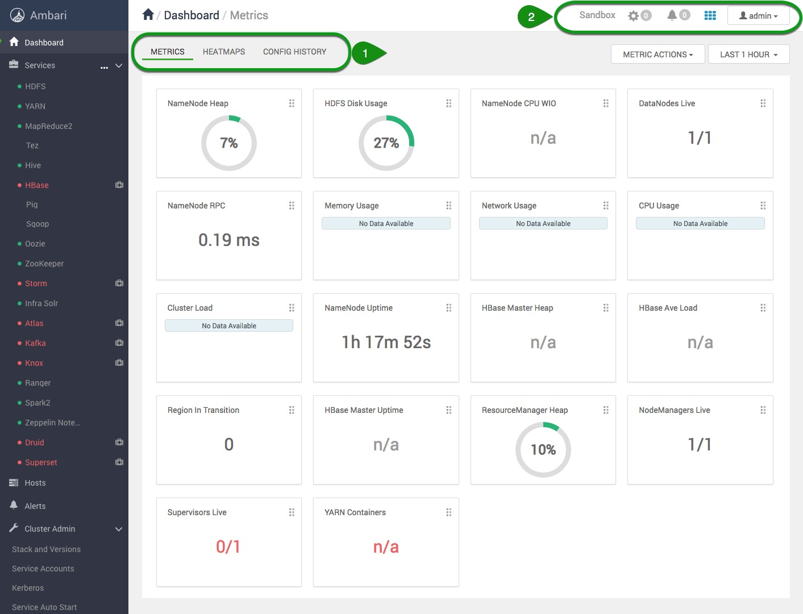

Explorer by click on:

1\.  **Metrics**, **Heatmaps** and **Config History**

and then on:

2\.  **Background Operations**,**Alerts**, **Admin** and User **Views**, icon (represented by 3×3 matrix ) to become familiar with the Ambari resources available to you.

<!--- ## Explore Sandbox in Azure

Similar to the [Welcome Page](#welcome-page), we will append port number **:8888** to the host address on Azure. The public IP address is generated when you deployed the HDP Sandbox in Azure. Take note of this IP address. In this example, the IP address is 23.99.9.232. Your machine will have a different IP address.

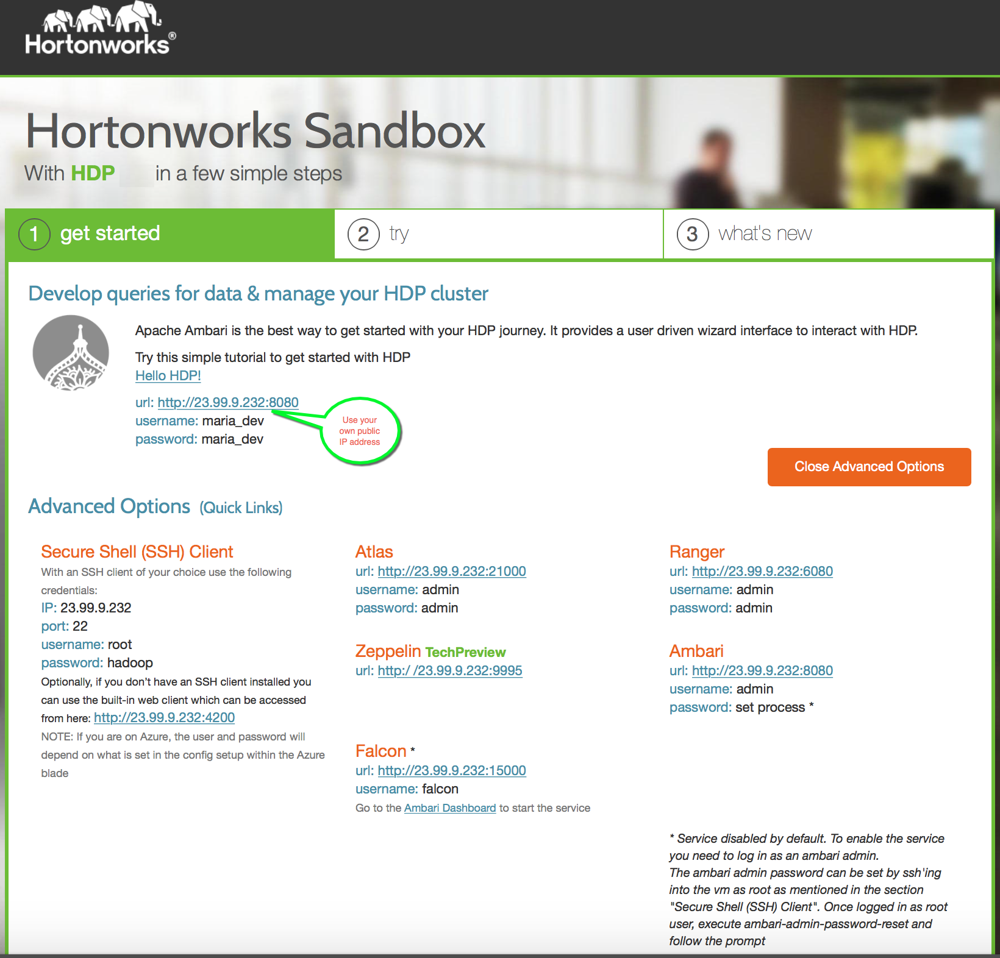

### Multiple Ways to Execute Terminal Commands

#### Secure Shell (SSH) Method:

Open your terminal (mac and linux) or putty (windows). Here again, `host` is the public IP address provided by Azure. Give the username and password that you provided while deploying the sandbox on Azure. Use the following command to access the Sandbox through SSH:

~~~bash
# Usage:
  ssh <username>@<host> -p 22;
~~~


> Mac OS Terminal. When you type the password, the entry doesn't echo on the screen, it hides the user input. Carefully type correct password.

#### Shell Web Client Method:

Open your web browser. Replace the following text by your `host` into your browser to access the Sandbox through the shell. Provide the same username and password that you gave while deploying the sandbox on Azure.

~~~bash
# Usage:
  #  _host_:4200
~~~


### Setup Ambari admin Password Manually

1\.  Open a terminal (mac or linux) or putty (windows)

2\.  SSH into the sandbox using your username and password that you provided at the time of creating the sandbox on Azure. Your `host` is a public IP address given by Azure and sudo password is a Sandbox password.

~~~
# Usage:
  ssh <username>@<host> -p 22;
~~~

3\. Type the following commands:

~~~
# Updates password
sudo ambari-admin-password-reset
# If Ambari doesn't restart automatically, restart ambari service
ambari-agent restart
~~~

> **Note:** Now you can login to ambari as an admin user to perform operations, such as starting and stopping services.

--->

## Further Reading

- [Hadoop Tutorial - Getting Started with HDP](https://hortonworks.com/tutorial/hadoop-tutorial-getting-started-with-hdp/)
- [HDP Documentation](https://docs.hortonworks.com/HDPDocuments/HDP3/HDP-3.0.1/index.html)
- [Hortonworks Documentation](http://docs.hortonworks.com/)

## Appendix A: Reference Sheet

### Login Credentials:

| User | Password |
|:------:|----------:|
| admin | refer to [Admin Password Reset](#admin-password-reset) |
| maria_dev | maria_dev |
| raj_ops | raj_ops |
| holger_gov | holger_gov |
| amy_ds | amy_ds |

1\. **admin** - System Administrator

2\. **maria_dev** -  Responsible for preparing and getting insight from data. She loves to explore different HDP components like Hive, Pig, HBase.

3\. **raj_ops** - Responsible for infrastructure build, research and development activities like design, install, configure and administration. He serves as a technical expert in the area of system administration for complex operating systems.

4\. **holger_gov** - Primarily for the management of data elements, both the content and metadata. He has a specialist role that incorporates processes, policies, guidelines and responsibilities for administering organizations' entire data in compliance with policy and/or regulatory obligations.

5\. **amy_ds** - A data scientist who uses Hive, Spark and Zeppelin to do exploratory data analysis, data cleanup and transformation as preparation for analysis.

Some notable differences between these users in the Sandbox are mentioned below:

| Name id(s) | Role | Services |
|:----:|:----:|:--------:|
| Sam Admin | Ambari Admin | Ambari |
| Raj (raj_ops) | Hadoop Warehouse Operator | Hive/Tez, Ranger, Falcon, Knox, Sqoop, Oozie, Flume, Zookeeper |
| Maria (maria_dev) | Spark and SQL Developer | Hive, Zeppelin, MapReduce/Tez/Spark, Pig, Solr, HBase/Phoenix, Sqoop, NiFi, Storm, Kafka, Flume |
| Amy (amy_ds) | Data Scientist | Spark, Hive, R, Python, Scala
| Holger (holger_gov) | Data Steward | Atlas |

**OS Level Authorization**

| Name id(s) | HDFS Authorization | Ambari Authorization | Ranger Authorization |
|:----------:|:------------------:|:--------------------:|:--------------------:|
| Sam Admin | Max Ops | Ambari Admin | Admin access |
| Raj (raj_ops) | Access to Hive, Hbase, Atlas, Falcon, Knox, Sqoop, Oozie, Flume, Operations | Cluster Administrator | Admin Access |
| Maria (maria_dev) | Access to Hive, Hbase, Falcon, Oozie and Spark | Service Operator | Normal User Access |
| Amy (amy_ds) | Access to Hive, Spark and Zeppelin | Service Operator | Normal User Access |
| Holger (holger_gov) | Access to Atlas | Service Administrator | Normal User Access |

**Other Differences**

| Name id(s) | Sandbox Role | View Configurations | Start/Stop/Restart Service | Modify Configurations | Add/delete services | Install Components | Manage Users/Groups | Manage Ambari Views | Atlas UI Access | [Sample Ranger Policy Access](https://hortonworks.com/tutorial/tag-based-policies-with-apache-ranger-and-apache-atlas/#sample-ranger-policy) |
|:----------:|:------------:|:-------------------:|:--------------------------:|:---------------------:|:-------------------:|:------------------:|:-------------------:|:-------------------:|:---------------:|:--------------------:|
| Sam Admin | Ambari Admin | Yes | Yes | Yes | Yes | Yes | Yes | Yes | Yes | NA |
| Raj (raj_ops) | Cluster Administrator | Yes | Yes | Yes | Yes | Yes | No | No | No | ALL |
| Maria (maria_dev) | Service Operator | Yes | Yes | No | No | No | No | No | No | SELECT |
| Amy (amy_ds) | Service Operator | Yes | Yes | No | No | No | No | No | No | SELECT |
| Holger (holger_gov) | Service Administrator | Yes | Yes | Yes | No | No | No | No | Yes | SELECT, CREATE, DROP |

### Open a port for custom use

Refer to the [Sandbox Guide](https://github.com/hortonworks/data-tutorials/blob/master/tutorials/hdp/hortonworks-sandbox-guide/tutorial-3.md) for ports available for custom use.

In this example we will use the fictional port **1234**, note that this port is not available for custom use.

**SSH onto the Sandbox Host**

If you are running the  VirtualBox VM:

~~~bash
# SSH on to VirtualBox Virtual Machine
ssh root@sandbox-hdp.hortonworks.com -p 2200
~~~

Or if you are using VMWare:

~~~bash
# SSH on to VMWare Virtual Machine
ssh root@sandbox-hdp.hortonworks.com -p 22
~~~

> Note: The default password is **hadoop**.

Change directories to `/sandbox/deploy-scripts/assets/`

~~~bash
cd /sandbox/deploy-scripts/assets/
~~~

> NOTE: On the docker version of the Sandbox the script is found on `deploy-scripts/assets/generate-proxy-deploy-script.sh`

Under the assets directory you will find a file named `generate-proxy-deploy-script.sh`, edit it:

~~~bash
vi generate-proxy-deploy-script.sh
~~~

search for the `tcpPortsHDP` array and enter the port that you would like to forward:

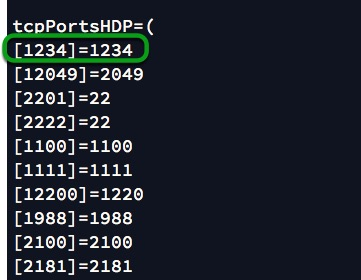

to save and exit press **esc** and enter `:x`

to execute your changes re-run the script:

~~~bash
cd /sandbox/deploy-scripts
assets/generate-proxy-deploy-script.sh
~~~

and deploy the reverse proxy with your changes:

~~~bash
/sandbox/proxy/proxy-deploy.sh
~~~

Finally, add the port forward on your virtual environment

Settings -> Network -> Advanced -> Port Forwarding -> Add New

Now restart the virtual machine and enjoy your new port.

### Sandbox Version

When you run into an issue, one of the first things someone will ask is "_what sandbox version are you using_"? To get this information:

Login using [shell web client](http://sandbox-hdp.hortonworks.com:4200) and execute: ```sandbox-version```. The output should look something like:

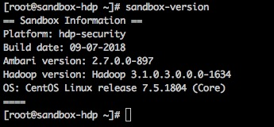

> Note: refer to [Login Credentials](#login-credentials)

### Admin Password Reset

Due to possibility of passwords being vulnerable to being hacked, we recommend
you change your Ambari admin password to be unique.

1. Open [Shell Web Client](http://sandbox-hdp.hortonworks.com:4200) (aka Shell-in-a-Box):

2. The login using credentials: **root** / **hadoop**

3. Type the following commands: ```ambari-admin-password-reset```

> IMPORTANT: The first time you login as **root**, you may be required to change the password - remember it!

## Appendix B: Troubleshoot

- [Hortonworks Community Connection](https://hortonworks.com/community/forums/) (HCC) is a good resource to find answers to problems you may encounter during your Hadoop journey.

- **hangs** / **Long running processes**

At times you may encounter a job, query or request that just seems to run forever and does not complete. It may be because it's in the **ACCEPTED** state. A good place to begin looking is in the [ResourceManager](http://sandbox-hdp.hortonworks.com:8088/). If you know a job has completed, but the Resource Manager still thinks it's running - kill it!

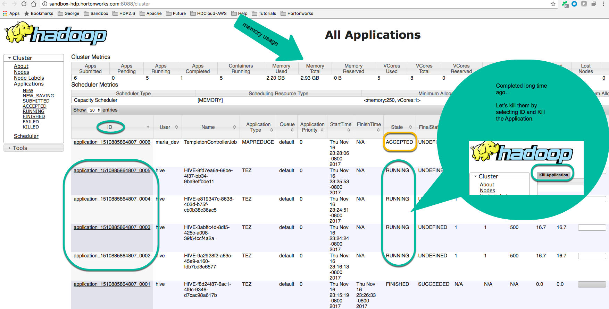

## Appendix C: Determine Network Adapter of Your VirtualBox Sandbox

Once the Sandbox VM is installed, it attaches to a virtual network. There are 8 different network modes, but the default network your sandbox will attach to is NAT. We will cover relevant networks for our tutorial use cases: NAT and Bridged Adapter.

**Network Address Translation (NAT)**

By default, the VM attaches to Network Address Translation (NAT) network mode. The guest's IP address by default translates over to the host's IP address. NAT allows for the guest system to connect to external devices on external networks, but external devices cannot access the guest system. Alternatively, VirtualBox can make selected services on the guest reachable to the outside world by port forwarding. VirtualBox listens to certain ports on the host, then re-sends packets that arrive at those ports to the guest on the same port or different port.

How we are forwarding all incoming traffic from a specific host interface to the guest in our sandbox is by specifying an IP of that host like the following:

~~~bash
VBoxManage modifyvm "Hortonworks Sandbox HDP 3.0.1" --natpf1 "Sandbox Splash Page,tcp,127.0.0.1,1080,,1080"
.
.
.
VBoxManage modifyvm "Hortonworks Sandbox HDP 3.0.1" --natpf1 "Sandbox Host SSH,tcp,127.0.0.1,2122,,22"
~~~

You can find the set network by opening the VM **settings** and then select the **network** tab.

**Bridged Networking**

In this mode, the guest receives direct access to the network, which the host has been connected. The router assigns an IP address to the guest. On that network, instead of there being just the host IP address visible, now the guest IP address is visible too. Thus, external devices, such as MiNiFi running on a Raspberry Pi, are able to connect to the guest via it's IP address.

When would you need this mode? It is needed for Connected Data Architecture(CDA). To configure this mode, first power down your guest vm, click settings, switch to the network tab and change the **attach to** network to be **Bridged Adapter**.

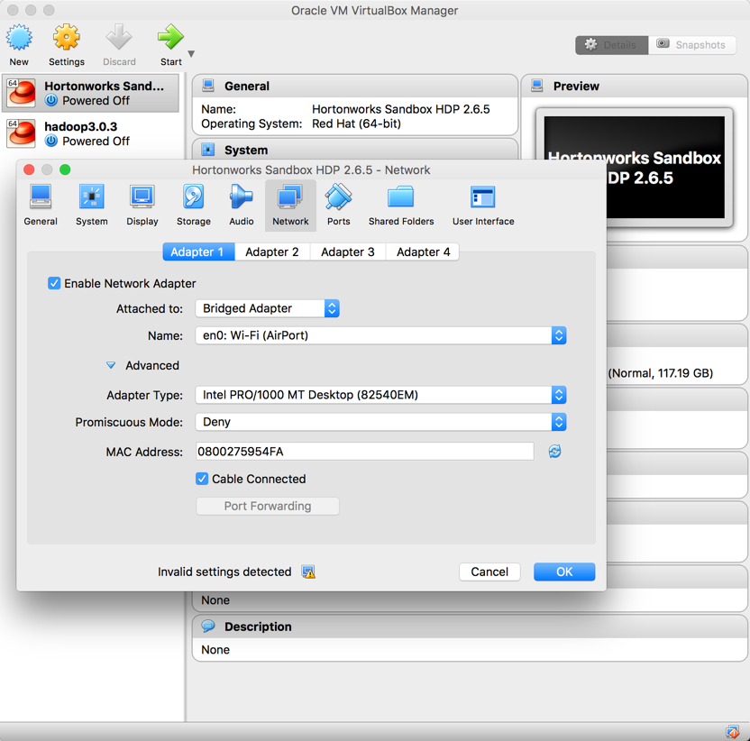

> WARNING: First make sure your computer is connected to a router, else this feature will not work cause there is no router to assign an IP address to the guest vm.

If you're using **VirtualBox** or **VMWare**, you can confirm the IP address by waiting for the installation to complete and confirmation screen will tell you the IP address your sandbox resolves to. For example:

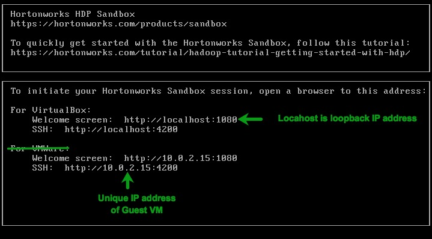

 >> **Note:** Guest VM Welcome Window for NAT Sandbox --->

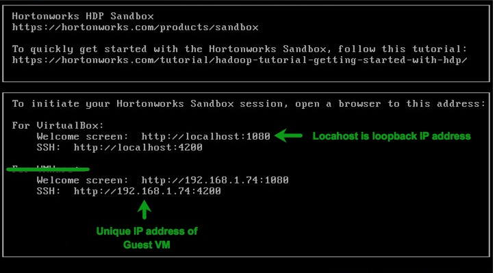

 >> **Note:** Guest VM Welcome Window for BRIDGED Sandbox --->
