# Loading and Querying Data with Hadoop

## Introduction

The HDP Sandbox includes the core Hadoop components, as well as all the tools needed for data ingestion and processing.  You are able to access and analyze data in the sandbox using any number of Business Intelligence (BI) applications.

In this tutorial, we will go over how to load and query data for a fictitious web retail store in what has become an established use case for Hadoop: deriving insights from large data sources such as web logs. By combining web logs with more traditional customer data, we can better understand customers and understand how to optimize future promotions and advertising.

We will describe how to ingest data into HDFS, to create tables and perform queries on those tables with Data Analytics Studio (DAS) which leverages Hive under the hood to analyze the web logs from that data. By the end of the tutorial, we will have a better understanding of how to perform web log analysis on clickstream data, so we can better understand the habits of our customers.

## Prerequisites

- Downloaded and deployed the [Hortonworks Data Platform (HDP)](https://www.cloudera.com/downloads/hortonworks-sandbox/hdp.html?utm_source=mktg-tutorial) Sandbox
- [Learning the Ropes of the HDP Sandbox](https://hortonworks.com/tutorial/learning-the-ropes-of-the-hortonworks-sandbox/) tutorial

## Outline

- [Download Sample Data](#download-sample-data)
- [Create Hive Tables with Data Analytics Studio](#create-hive-tables-with-data-analytics-studio)
- [Load Data Into a Table](#load-data-into-a-table)
- [Save and Execute a Query](#save-and-execute-a-query)
- [Join Data From Multiple Tables](#join-data-from-multiple-tables)
- [Summary](#summary)
- [Further Reading](#further-reading)

## Download Sample Data

Download the sample data for this tutorial: [retail-store-logs-sample-data.zip](assets/retail-store-logs-sample-data.zip)

Extract the archive anywhere you'd like - we will upload the contents into our sandbox in the following step.  You should see the following files after the archive is extracted:

```text
omniture-logs.tsv
products.tsv
users.tsv
```

## Create Hive Tables with Data Analytics Studio

Logon to Ambari user/password: **maria_dev/maria_dev**.

1\. Select the **Data Analytics Studio** (DAS) service.

2\. Navigate to the **Data Analytics Studio UI** located on the right hand side of the Ambari page.

- Alternatively, you can access the DAS UI directly by using port 30800:[sandbox.hdp.hortonworks.com:30800](http://sandbox-hdp.hortonworks.com:30800/)

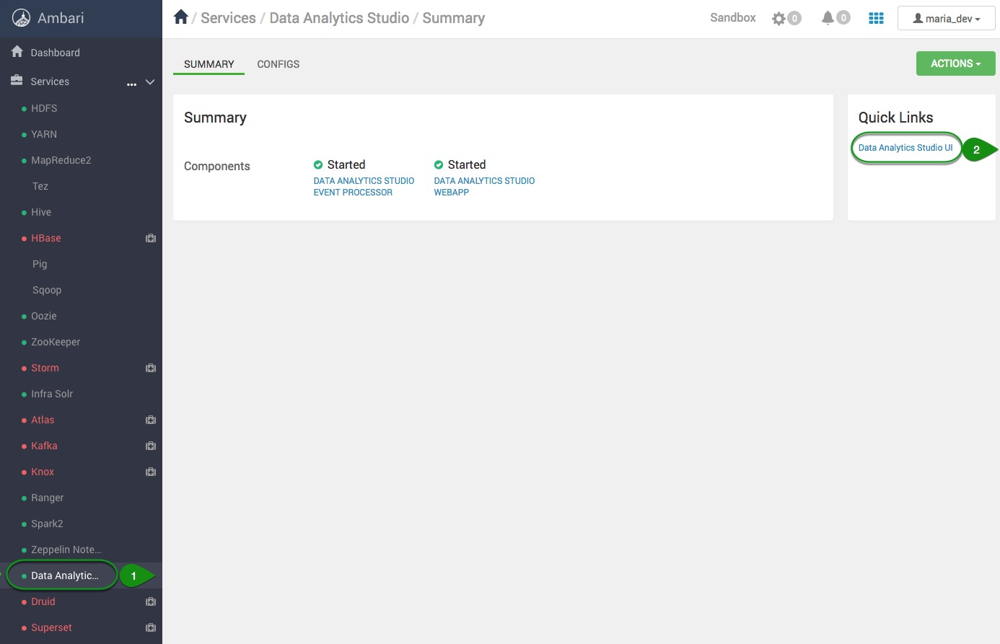

3\. On the DAS UI, click on **Database**

4\. Select the **+** next to **TABLES**

5\. Click on **UPLOAD TABLE**

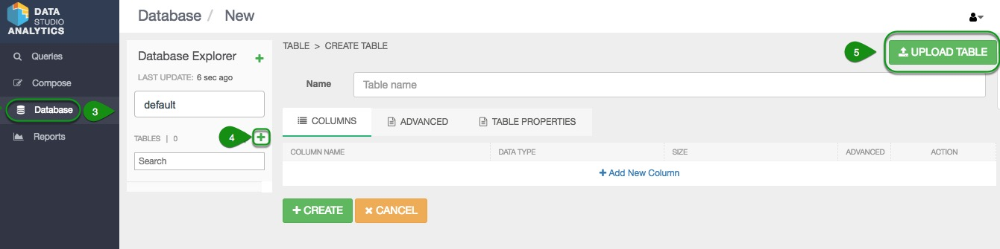

Once there, we are going to create the first table for the **product.tsv** file by uploading it as follows:

6\. Click **Clear** for **Field Delimiter** and then Enter **TAB-(horizontal tab)**

7\. Check the **Is first row header?**

8\. Select **Upload from Local**

9\. **Click to Browse**, go to the location where you downloaded the **retail-store-logs-sample-data.zip** folder and select the **products.tsv** file.

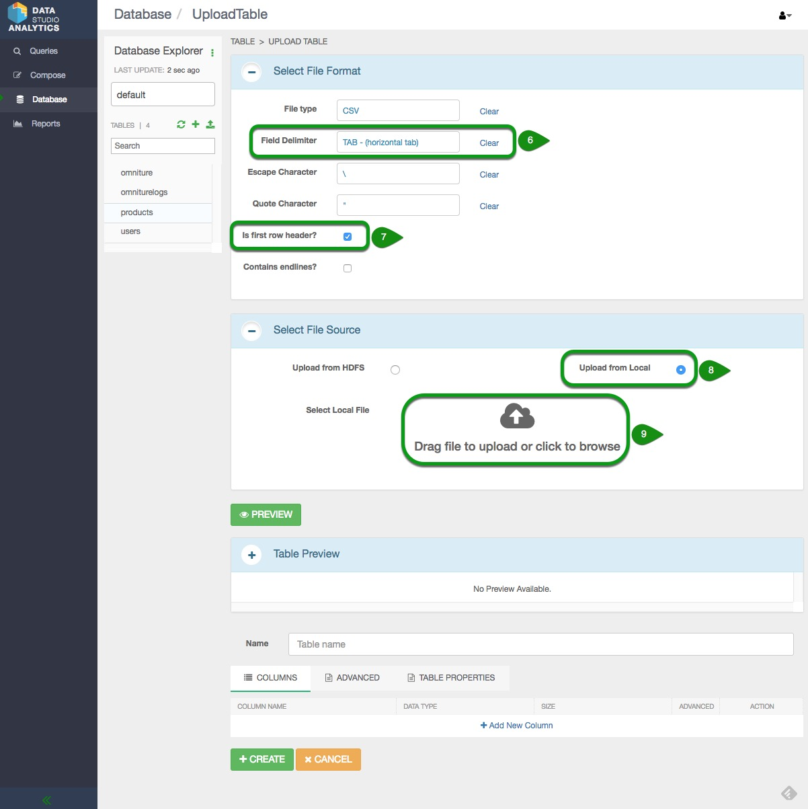

10\. Once the file has been updated, click on  **+CREATE** at the bottom of the page

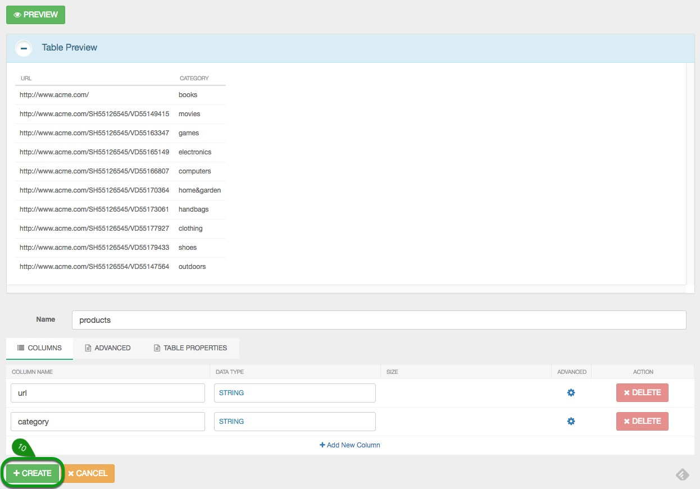

11\. Verify that the **products** table was created by clicking on **DATA PREVIEW**. There data should look like the image below:

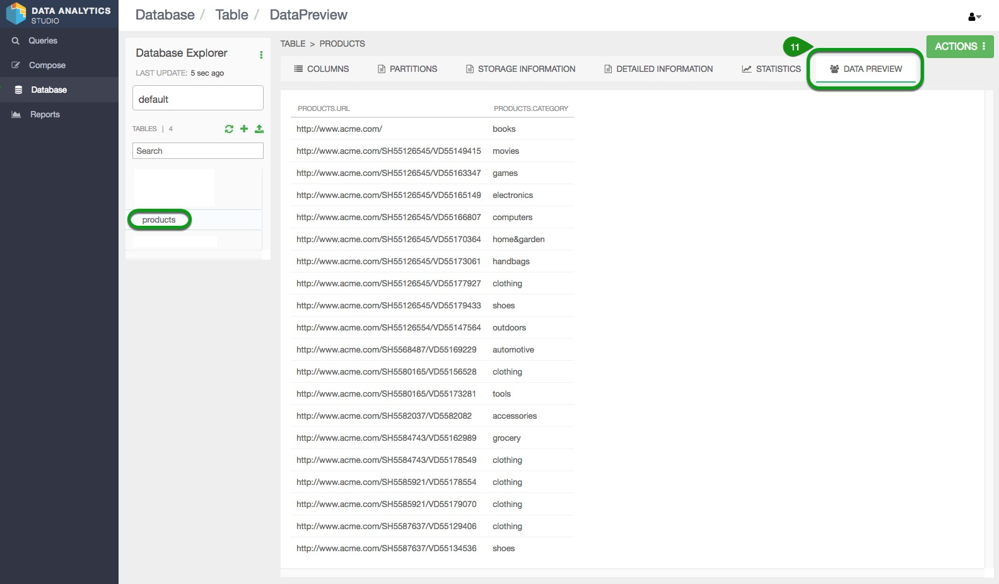

12\. Following steps 4 to 11 create and verify the table for **users**. You will be asked to enter the **Precision** for the column titled **GENDER_CD**, enter 1.

The **DATA PREVIEW** for **users** should look like the table below:

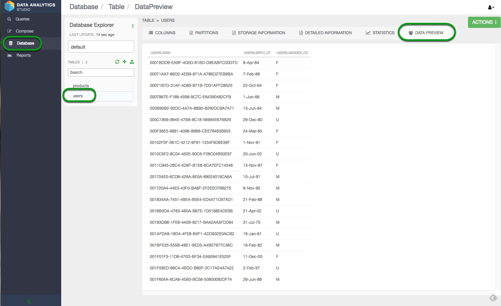

### Create a Hive Table via a Query

The file omniture-logs requires particular formatting so we will use the query option in DAS to create the table.

1\. Go back to the DAS UI and select **Compose**

2\. Copy the query below and paste it in the DAS **Worksheet1**

```SQL
CREATE TABLE omniturelogs (col_1 STRING,col_2 STRING,col_3 STRING,col_4 STRING,col_5 STRING,col_6 STRING,col_7 STRING,col_8 STRING,col_9 STRING,col_10 STRING,col_11 STRING,col_12 STRING,col_13 STRING,col_14 STRING,col_15 STRING,col_16 STRING,col_17 STRING,col_18 STRING,col_19 STRING,col_20 STRING,col_21 STRING,col_22 STRING,col_23 STRING,col_24 STRING,col_25 STRING,col_26 STRING,col_27 STRING,col_28 STRING,col_29 STRING,col_30 STRING,col_31 STRING,col_32 STRING,col_33 STRING,col_34 STRING,col_35 STRING,col_36 STRING,col_37 STRING,col_38 STRING,col_39 STRING,col_40 STRING,col_41 STRING,col_42 STRING,col_43 STRING,col_44 STRING,col_45 STRING,col_46 STRING,col_47 STRING,col_48 STRING,col_49 STRING,col_50 STRING,col_51 STRING,col_52 STRING,col_53 STRING)
ROW FORMAT DELIMITED
FIELDS TERMINATED by '\t'
STORED AS TEXTFILE
TBLPROPERTIES ("skip.header.line.count"="1");
```

>Note: The query will take a few minutes to process.

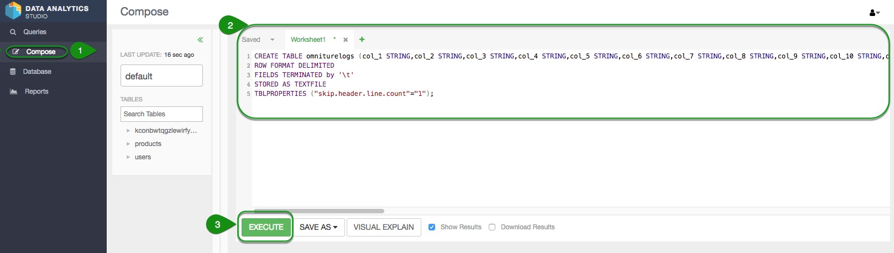

3\. Click on **Execute**

4\. Verify that the table **omniturelogs** was created by going to **Compose** then look for **omniturelogs** under the **Database Explorer** > **TABLES**.

## Load Data Into a Table

We will be using HDFS **Files View** for loading the data into the **omniturelog** table.  

1\. Hover over to the **Ambari Views** icon

2\. Select **Files View**

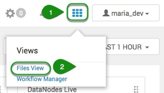

3\. Click on the **tmp** folder

4\. Create a **New Folder** and name it **maria_dev**

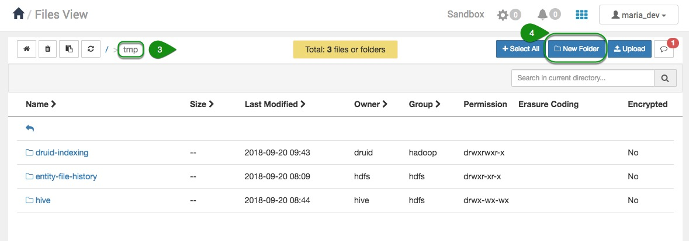

5\. Select the **maria_dev** folder

6\. Click on **Permissions**

7\. Ensure that everyone has access to read, write and execute by clicking on the missing permission per user.

8\. Click on **Save**

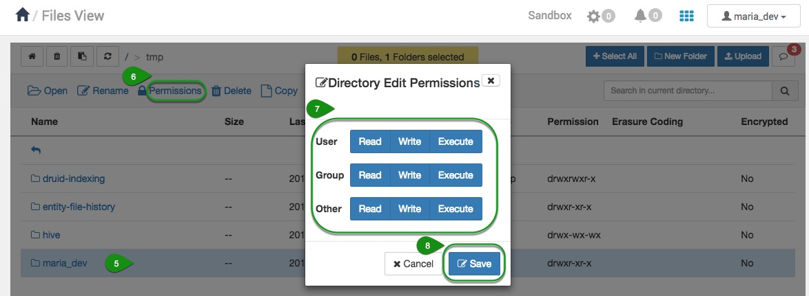

9\. Inside the **maria_dev** folder, select **Upload** to upload the file **omniture-logs.tsv** file


View after loading the file:
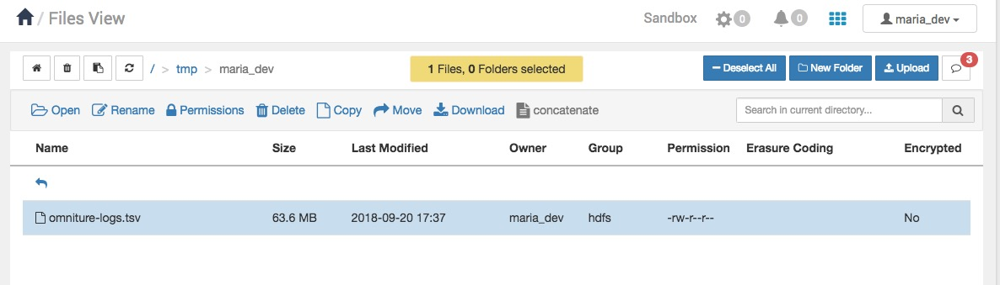

Let's run a simple query to take the data we stored in HDFS and populate our new Hive table.  Go back to **DAS** and under **Compose** for **Worksheet1** and click on the **+**. This will create a new query **Worksheet2**.

10\. Paste the following query into **Worksheet2**

```SQL
LOAD DATA INPATH '/tmp/maria_dev/omniture-logs.tsv' OVERWRITE INTO TABLE omniturelogs;
```

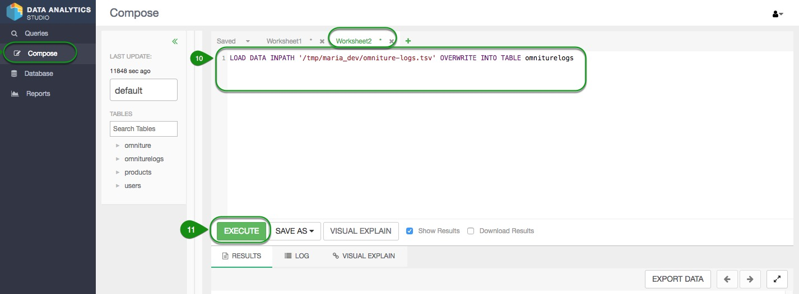

11\. Execute the query

12\. Verify that the data was loaded properly by going to **Database** > **TABLES** >**onmniturelogs** > **Data PREVIEW** tab.

## Save and Execute a Query

Suppose we want to write a query, but not necessarily execute it immediately or perhaps we want to save it for future multiple uses.

1\. Go to **Compose**

2\. Add a new worksheet by clicking on **+** next to **Worksheet2**

3\. Copy/paste the following query

```SQL
CREATE VIEW omniture AS
SELECT col_2 ts, col_8 ip, col_13 url, col_14 swid, col_50 city, col_51 country, col_53 state
FROM omniturelogs
```

4\. Click **Save As** and save the query as "**SavedQuery1**"

5\. Select the check mark

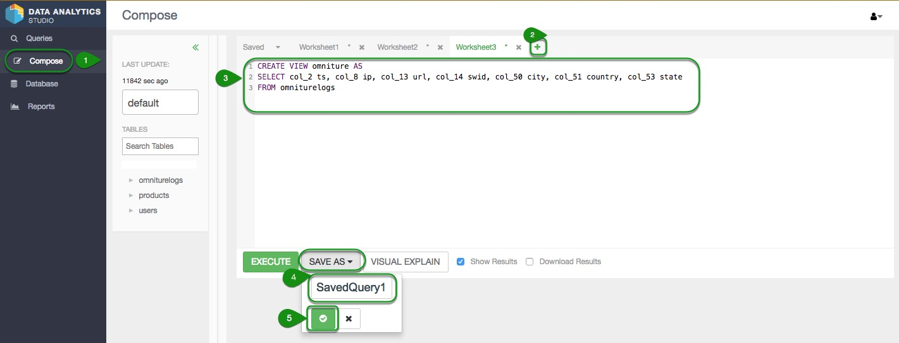

>Note: The query will take a few minutes to process.

To view your saved queries, navigate to the "**Saved**" tab.  For now, let's open our saved query **SavedQuery1**.

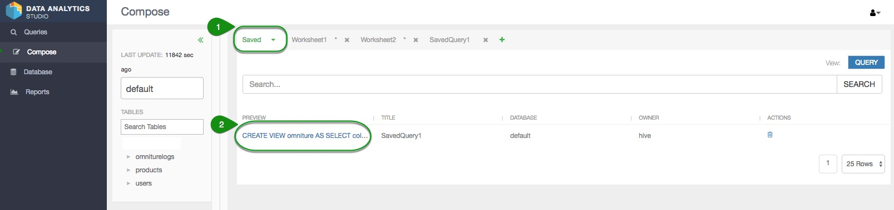

The "**SavedQuery1**" tab should automatically open up, with your saved query pre-loaded.  Click "**Execute**" to run this query, which will create a Hive view named "**omniture**", a refined subset of data with only a handful of fields.

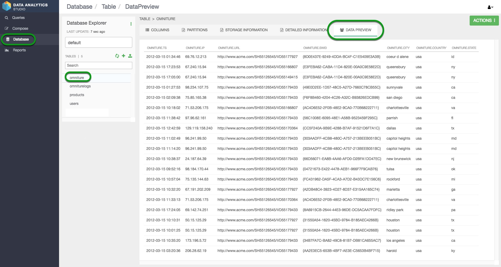

## Join Data From Multiple Tables

Let's play with our data further, taking specific fields from different tables and creating a custom table from them.

Copy/paste the query below in a new **Worksheet4** and **Execute**.

Use the steps in  [Create a Hive Table via a Query](https://hortonworks.com/tutorial/loading-and-querying-data-with-hadoop/#create-a-hive-table-via-a-query) for reference.

```SQL
CREATE TABLE webloganalytics as
SELECT to_date(o.ts) logdate, o.url, o.ip, o.city, upper(o.state) state,
o.country, p.category, CAST(datediff(from_unixtime(unix_timestamp()), from_unixtime(unix_timestamp(u.birth_dt, 'dd-MMM-yy'))) / 365 AS INT) age, u.gender_cd
FROM omniture o
INNER JOIN products p
ON o.url = p.url
LEFT OUTER JOIN users u
ON o.swid = concat('{', u.swid , '}');
```

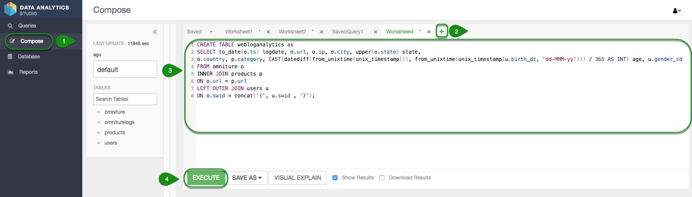

The **Data Preview** for **webloganalytics** should look like the table below:


You can download the **webloganalytics.csv** file by entering the following query in **Compose**:

~~~SQL
SELECT logdate, url, ip, city, state, country, category, age, gender_cd
FROM webloganalytics;
~~~

This query will show the content of table webloganalytics. You can then click on **EXPORT DATA** > **DOWNLOAD AS CSV**. This will download the csv file in your local machine.

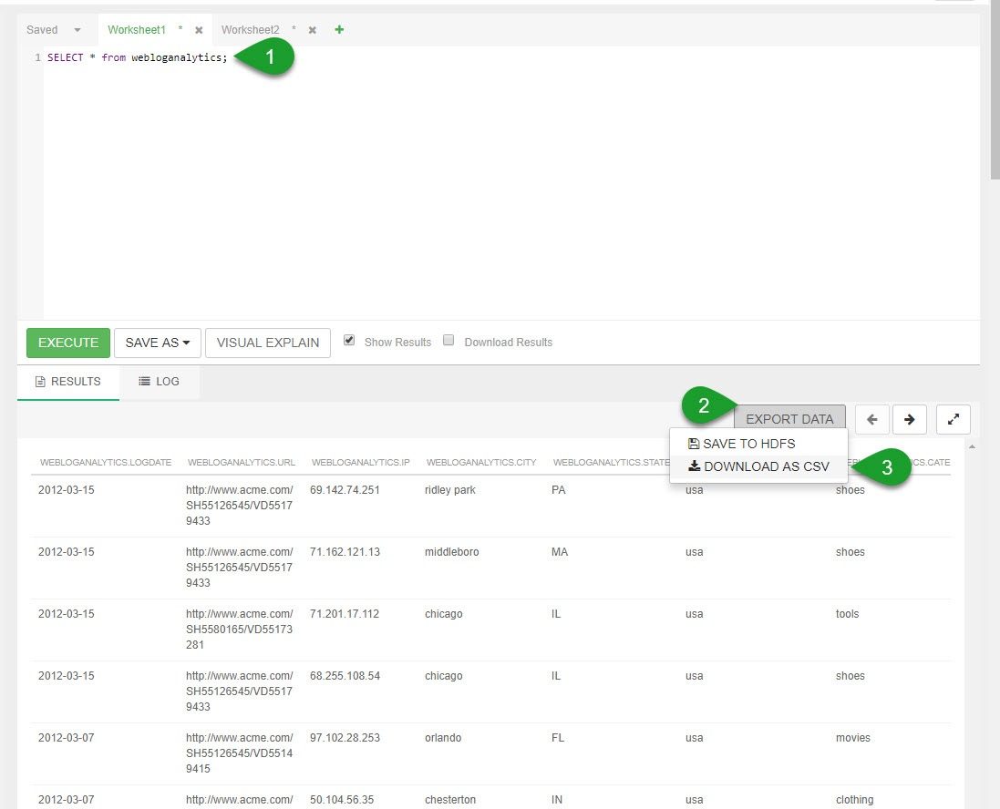

>NOTE: The webloganalytics.csv file will be used for the tutorial Visualizing Website Clickstream Data which is located in the section of Further Reading.

## Summary

Excellent!  We've learned how to upload data into HDFS, create tables and load data into them, and run queries for data refinement and enrichment by using Ambari's convenient and robust Data Analytics Studio.

## Further Reading

- Follow up on this tutorial, by performing more analytics and using visualization tools to find value in the tutorial [Visualizing Website Clickstream Data](https://hortonworks.com/tutorial/visualize-website-clickstream-data/)
- Check out [more Hive tutorials](http://hortonworks.com/hadoop/hive/#tutorials).
- For information on Hive operators, functions and the language, check out the [LanguageManual DDL](https://cwiki.apache.org/confluence/display/Hive/LanguageManual+DDL) and [LanguageManual UDF](https://cwiki.apache.org/confluence/display/Hive/LanguageManual+UDF).
