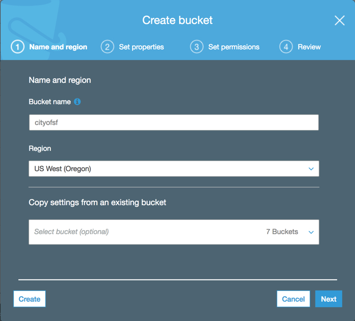
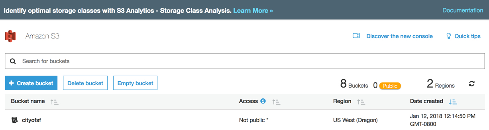
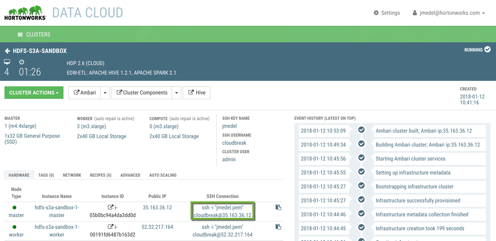
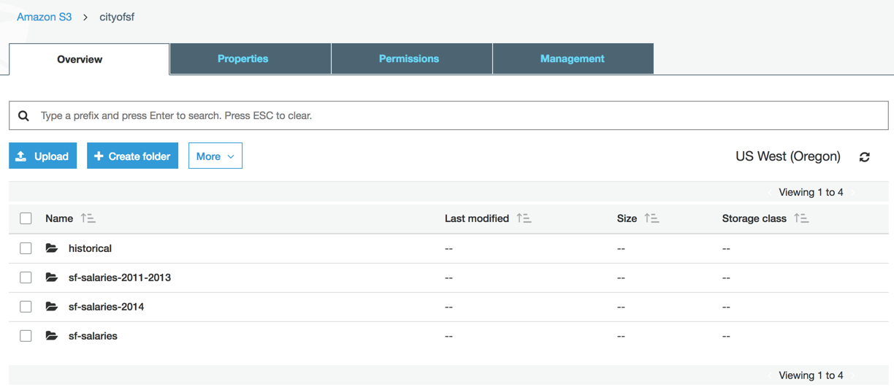

# Manage Files on HDFS via Cli/Ambari Files View

## Manage Files on S3 with Hadoop S3A Client

## Introduction

Long term data storage in the cloud with HDFS is not ideal because virtual cluster environments have a short life span. As virtual servers go away, so does the data. The difficulty is HDFS data is not able to outlive virtual machine instances used by the cluster. The solution for long term data storage in the cloud for a virtual Hadoop cluster is to use Amazon Storage Service S3. You have been tasked by the City of SF to learn to use Apache Hadoop S3A FileSystem Client to manage San Francisco Salary data files on S3.

The features you will explore include:
- Performing HDFS Shell Operations within S3
- Storing, listing and retrieving data with object store model
- Reading and Writing to S3 with Apache Hadoop
- Copying Data between HDFS and S3

## Prerequisites

[Deployed Hortonworks Data Cloud using Amazon Web Services](http://hortonworks.github.io/hdp-aws/)
- It’s required that you go through the tutorial above to setup your AWS Cloud Controller and Hortonworks Data Cloud (HDC) Cluster since we will be transferring data between S3 and HDFS using HDC

## Outline

-   [Section 1: S3A Client Concepts](#section-1-s3a-client-concepts)
-   [Section 2: Setup S3 and HDC Integration](#section-2-set-up-s3-and-hdc-integration)
-   [Section 3: S3A Shell Client File Operations on S3 & HDFS](#section-3-s3a-shell-client-file-operations-on-s3-&-HDFS)
-   [Summary](#summary)
-   [Further Reading](#further-reading)
-   [Appendix A: S3N Backward Compatibility](#appendix-a-s3n-backward-compatibility)
-   [Appendix B: Cleaning Up HDFS and S3 Data](#appendix-b-cleaning-up-hdfs-and-s3-data)
-   [Appendix C: Unsupported Sub-Commands](#appendix-c-unsupported-sub-commands)

## Section 1: S3A Client Concepts 

### Amazon S3

Amazon S3 is an object store. S3 manages its data as objects while HDFS along with other file systems manage data as a file hierarchy and block storage. A cluster within the AWS environment includes a group of virtual instances running in EC2. These instances accumulate together to form an HDFS filesystem in their virtual disk drivers analogous to physical Hadoop clusters. Similar to HDFS, the cloud environment uses replication to distribute copies of data onto multiple virtual servers. The outcome is heightened performance while reading data and recovering data from virtual server failures.

### S3A File System client

S3A is a filesystem client that enables Hadoop users to perform Hadoop FileSystem shell commands to interact with Amazon S3. Hortonworks Data Cloud powered by Hadoop uses the Apache Hadoop S3A Client to perform these operations. S3A client has Amazon libraries that allow for interaction with S3. The prefix: `s3a://` enables users to access S3 Data Storage.

### Commands May Be Slow on S3 (Steps Labeled Slow)

Since most filesystem shell operations use renaming in the final stage of their operations, we must be cautious with certain shell command used to interact with S3 as it can spark long delays. Since S3 is an object store, these operations duration time is proportional to the size of the objects. All steps with a (Cautious) label will cover how to deal with these shell operations to avoid long delays.

### HDFS Command Example to Access S3A

Hadoop S3A Client makes it possible to perform hadoop shell operations with S3. To perform Hadoop Shell commands to interact with Amazon S3 Object Store instead of HDFS FileSystem, we must specify the fully qualified URI with s3a scheme and the appropriate bucket:

`hdfs dfs <operation> s3a://<bucket>/dir1`

Let’s break down to above command to better understand how HDFS shell interacts with S3. `hdfs dfs` specifies we want to perform an operation using HDFS shell. <`operation`> indicates a particular action to be performed against a directory or file. `s3a://` is the prefix needed to access S3Data Storage. <`bucket`> specifies which container we will interact with from S3.

Example of the above command using our current bucket name:

`hdfs dfs -ls s3a://cityofsf/`

Note: Your bucket name may be different than the one specified in the the directory path above. When naming buckets, we chose only lower case letters, refer to S3 documentation for more information on bucket naming conventions.

## Section 2: Setup S3 and HDC Integration

We will setup our S3 bucket and enable cloudbreak user to have access to a particular directory of our HDFS instance. Once these two setup procedures are complete, we will be ready to cleanse the San Francisco Salary Datasets.
One of the sections of the tutorial.

### Create S3 bucket

Login to Amazon AWS account. At the top left of the page near the AWS icon, there is a services menu. Click it, all the services of AWS will appear. Under Storage & Content Delivery, select S3.

S3 contains at the root directory a list of all the buckets. If this is your first time creating a bucket, there will be no buckets present.

1\. Press the “`Create Bucket`” button. A window “Create a Bucket - Select a Bucket Name and Region” appears.

Specify the name “`cityofsf`” or a name relating to your particular project and choose the appropriate region. Click Next.

For Set properties and Set permissions keep default properties, select Next for both. Under Review, click Create bucket.

Congratulations! We just created the bucket also known as the container we will interact with for cleansing the sf salary data.

Shown is the cityofsf created. The status above the table states there are 8 buckets total and 2 regions within the table.

### Access HDFS in HDC for AWS

1\. SSH into cluster node

The SSH information is located in the cloud controller UI:

Open your (linux, mac, windows) terminal, enter:

`ssh -i "jmedel.pem" cloudbreak@35.163.36.12`

If you are not using windows developer mode and accessing the ubuntu shell, then use putty to ssh into the AWS shell.

For steps on using Putty, refer to https://www.siteground.com/tutorials/ssh/putty/

**Download San Francisco Salaries onto AWS local file system:**

~~~
cd ~/Downloads
# download sf-salaries-2011-2013
wget https://github.com/hortonworks/data-tutorials/raw/master/tutorials/hdp/manage-files-on-hdfs-via-cli-ambari-files-view/assets/sf-salary-datasets/sf-salaries-2011-2013.csv
# download sf-salaries-2014
wget https://github.com/hortonworks/data-tutorials/raw/master/tutorials/hdp/manage-files-on-hdfs-via-cli-ambari-files-view/assets/sf-salary-datasets/sf-salaries-2014.csv
mkdir sf-salary-datasets
mv sf-salaries-2011-2013.csv sf-salaries-2014.csv sf-salary-datasets/
~~~

## Section 3: Cleanse San Francisco Salary datasets 

Now that we learned by example how HDFS shell gains access to perform operations on S3, let’s begin to cleanse the San Francisco Salary Datasets.

### Step 1: Create Directory

Takes the path of the bucket with zero or more directories as an argument and creates a directory or multiple directories.

~~~
#Definition
    # hdfs dfs -mdkir s3a://<bucket>/<dir(s)>
~~~

Let’s create a new directory(s) to backup the SF Salary Datasets on S3.

`hdfs dfs -mkdir s3a://cityofsf/sf-salaries
hdfs dfs -mkdir s3a://cityofsf/historical
hdfs dfs -mkdir s3a://cityofsf/sf-salaries-2011-2013  s3a://cityofsf/sf-salaries-2014`

In the above hdfs shell operation, we instructed hdfs to create 3 directories within our cityofsf S3 bucket. For one operation, we created 1 directory and the other 2 directories.

### Step 2: Copy File from Local FileSystem to S3 (Slow)

Uploads one file or multiple files from local filesystem to S3.

~~~
#Definition
	# hdfs dfs -put -d <local_home>/<dst_dir> s3a://<bucket>/<dir(s)_src>
~~~

We specify -d options for direct upload to avoid long delays.

Let’s upload our local filesystem files to S3, it may take 2-5 minutes.

`hdfs dfs -put ~/sf-salaries-2011-2013.csv s3a://cityofsf/sf-salaries-2011-2013
hdfs dfs -put ~/sf-salaries-2014.csv s3a://cityofsf/sf-salaries-2014`

The above shell command copies sf-salaries-2014.csv from the local filesystem to s3 sf-salaries-2014 folder.

### Step 3: View Contents of a File

Prints the contents of the file to the screen.

~~~
#Definition
	  #hdfs dfs -cat s3a://<bucket>/<filename>
~~~    

Let’s view the contents of the SF Salary dataset from 2011-2013.

`hdfs dfs -cat s3a://cityofsf/sf-salaries-2011-2013/sf-salaries-2011-2013.csv`

Outputs the contents of sf-salaries-2011-2013.csv into the terminal. Same operation can be done on sf-salaries-2014.csv.

### Step 4: Print Object, Unzippinng if Necessary (Optional)

Prints the contents of the file, unzips it if needed. This approach could be an alternative to using the -cat command in step 3

~~~
#Definition
	# hdfs dfs -text s3a://<bucket>/<filename>
~~~

Let’s view the contents of the SF Salary dataset from 2011-2013.

`hdfs dfs -text s3a://cityofsf/sf-salaries-2011-2013/sf-salaries-2011-2013.csv`

Outputs the contents of sf_salaries_2011_2014.csv into the terminal, but first extracts the file if compressed.

### Step 5: Concatenate Source File(s) with Local Destination Files

Takes a source directory file or files as input and concatenates files in src into the local destination file.

~~~
#Definition
	# hdfs dfs -getmerge s3a://<bucket>/<dir(s)-src> <local_fs_home>/<dst-dir>
	# hdfs dfs -getmerge s3a://<bucket>/<dir(s)-src1> s3a://<bucket>/<dir(s)-src2> <local-fs-home>/<dst-dir>
~~~

Concatenates files in the same directory or from multiple directories as long as we specify their location and outputs them to the local file system, as can be seen in the **Usage** below.

~~~
hdfs dfs -getmerge s3a://cityofsf/sf-salaries-2011-2013 s3a://cityofsf/sf-salaries-2014 ~/cityofsf/sf-salaries-2011-2014.csv
~~~

Merges the files in sf-salaries-2011-2013 and sf-salaries-2014 to `sf-salaries-2011-2014.csv`
in the root directory of the local filesystem. The first file contained about 120,000 rows and the second file contained almost 30,000 rows. This file operation is important because it will save you time from having to manually concatenate them.

Upload new local file from AWS local file system to S3 storage:

`hdfs dfs -put ~/cityofsf/sf-salaries-2011-2014.csv s3a://cityofsf/sf-salaries`

### Step 6: Transfer AWS S3 File to HDFS

Copies/Downloads file(s) from AWS Object Store S3 bucket to the HDFS File System, which cloudbreak user has write access

~~~
#Definition
	# hdfs dfs -cp s3a://<bucket>/<file-src> /<hdfs-dir-dst>
~~~

Earlier we concatenated the SF salaries data from 2011 - 2013 with the most up to date data from `sf-salaries-2014`. We will send this new data in sf-salaries-2011-2014.csv to HDFS `\/user/cityofsf` for data analysis.

`hdfs dfs -cp s3a://cityofsf/sf-salaries/sf-salaries-2011-2014.csv /tmp`

Let’s verify the file copied successfully to our HDFS directory /user/cityofsf

`hdfs dfs -ls`

You can also check Ambari Files View /tmp folder to see the .csv file.

### Step 7: Transfer HDFS File to AWS S3

We are going to use the cp operation to copy/download file(s) from the HDFS directory to AWS Object Store S3 bucket

~~~
#Definition
	# hdfs dfs -cp /user/<hdfs-dir(s)>/<hdfs-src>  s3a://<bucket>/<dir(s)>/
~~~

When the sf_salaries_2011_2014 dataset is done being analyzed, we should transfer it from HDFS to S3 for safe long term storage.

`hdfs dfs -cp /tmp/sf-salaries-2011-2014.csv s3a://cityofsf/sf-salaries`

You will receive notification in terminal that the file already exists in s3, but now you know the command format to transfer an HDFS file to AWS S3.

### Step 8: List Files (Slow)

As the number of files and directories in a bucket increases, the time to complete this operation will increase.

#### 8.1 Count Numver of Directories, Files and Bytes

Counts the number of directories, files and bytes under path(s) specified by file pattern.

~~~
#Definition
	# hdfs dfs -count s3a://<bucket>/<dir(s)>
~~~

Let’s obtain these metrics for the sf-salaries-2011-2013.csv

`hdfs dfs -count s3a://cityofsf/sf-salaries-2011-2013/sf-salaries-2011-2013.csv`

#### 8.2 Display Size of Files and Directories

~~~
#Definition
	# hdfs dfs -du s3a://<bucket>/<dir(s)>
	# hdfs dfs -du s3a://<bucket>/<dir(s)>/<filename>
~~~

Let’s obtain the size of the data size to compare size of the concatenated sf_salaries_2011_2014 file to the previous two files.

`hdfs dfs -du s3a://cityofsf/sf-salaries-2011-2013/sf-salaries-2011-2013.csv`

### Step 9: Other Slow Shell Commands (Slow)

#### 9.1 Find All Files in S3 Bucket

Mentions one by one all files in the bucket

~~~
#Definition
	# hdfs dfs -find s3a://<bucket>/ -print
~~~

Let’s list all files starting in the cityofsf container and folders onward:

`hdfs dfs -find s3a://cityofsf/ -print`

#### 9.2 Find All Files with Specified Parameter

Lists all files with extension \*.csv in the bucket

~~~
#Definition
	# hdfs dfs -find s3a://<bucket>/ -name \*.txt -print
~~~

Note: remember to use escape to stop the bash shell from trying to consistently perform operation.

Let’s list all files with the extension \*.csv in the container cityofsf

`hdfs dfs -find s3a://cityofsf/ -name \*.csv -print`

#### 9.3 Move Files Between Directories

Transfers files from one folder to another
~~~
#Definition
	# hdfs dfs -mv s3a://<bucket>/<file1> s3a://<bucket>/<historical_dir>
~~~

Let’s move the sf_salaries_2011_2014.csv to the historical folder.

`hdfs dfs -mv s3a://cityofsf/sf-salaries/sf-salaries-2011-2014.csv s3a://cityofsf/historical`

The files have been moved to a historical folder since they were combined into a new file.

Note: We must consider that when moving files, the duration time depends on the file size. Similarly, if we move a directory, the duration time depends on the number and size of all files within and under that directory.
What happens when the operation is interrupted?
S3 Object Store is left in an undefined state.

### Step 10: Delete Files (Slow)

#### 10.1 Remove Objects and Directories
Deletes Objects and Directories Full of Objects.

~~~
#Definition
	# hdfs dfs -rm s3a://<bucket>/<dir(s)>
~~~

Let’s permanently remove the datasets we are no longer using. Normally the rm operation sends objects to the trash whereas using -skipTrash bypasses the trash and deletes them.
~~~
hdfs dfs -rm -skipTrash s3a://cityofsf/sf-salaries-2011-2013/sf-salaries-2011-2013.csv
hdfs dfs -rm -skipTrash s3a://cityofsf/sf-salaries-2014/sf-salaries-2014.csv
~~~

The rm shell operation can eat up storage cost if the object sizes are too large, we use -skipTrash option to avoid these costs.

## Summary

Congratulations on learning to use the S3A FileSystem Client to manage files on S3 and HDFS. You performed HDFS shell operations to create new folders and files. You also executed move, copy, delete, merge and other HDFS shell commands to migrate the City of SF’s data to Amazon S3 Cloud Storage in addition to organizing the SF salary directories and datasets for easier navigation. When the data was needed for analysis on the Virtual Hadoop Cluster, you learned to transport the data along migrate the data between virtual hadoop and S3 for when long term data storage was needed.

## Further Reading

- [Data Storage on Amazon S3](http://hortonworks.github.io/hdp-aws/s3-storage/#filesystem-shell-usage)
- [Using the S3A FielSystem Client](http://hortonworks.github.io/hdp-aws/s3-s3aclient/index.html)
- [File System Shell Guide](https://hadoop.apache.org/docs/r1.0.4/file_system_shell.html)
- [Copy Between a Cluster (HDFS) and S3 Buckets](https://community.hortonworks.com/content/kbentry/67321/how-to-copy-data-between-a-cluster-hdfs-and-s3-buc.html)

> Note: A tutorial does not go as in depth as documentation, so we suggest you include links here to all documents you may have utilized to build this tutorial.

### Appendix A: S3N Backward Compatibility

In earlier releases of Hadoop 2.7+, it used the S3N client to communicate with the S3N storage. The previous prefix to access the storage was prefix: s3n://. The current version S3A supports backward compatibility and users can still use the latest prefix: `s3a://` in replace of `s3n://` to perform operations on data in S3.

### Appendix B: Cleaning Up HDFS and S3 Data

IWhen you are done using the sf_salary_2011_2014.csv data, you can remove it from HDFS using:

`hdfs dfs -rm -skipTrash /tmp/sf-salaries-2011-2014.csv`

We can perform similar operation on the data stored in S3 using:

`hdfs dfs -rm -skipTrash s3a://cityofsf/sf-salaries/sf-salaries-2011-2014.csv`

Alternative approach for deleting both dataset is to use HDFS Files View and S3 Dashboard. Removing the datasets is a good idea from these data storages when no longer needed because any files in these storages will be added onto charges.

###Appendix C: Unsupported Sub-Commands

S3 shell doesn’t implement the same feature set as HDFS. So using these commands in S3 will not produce the same results as HDFS. Be cautious when using these Hadoop shell operations.

-appendToFile
-checksum
-chgrp
-chmod
-chown
-createSnapshot
-deleteSnapshot
-df
-getfacl
-getfattr
-renameSnapshot
-setfacl
-setfattr
-setrep
-truncate
