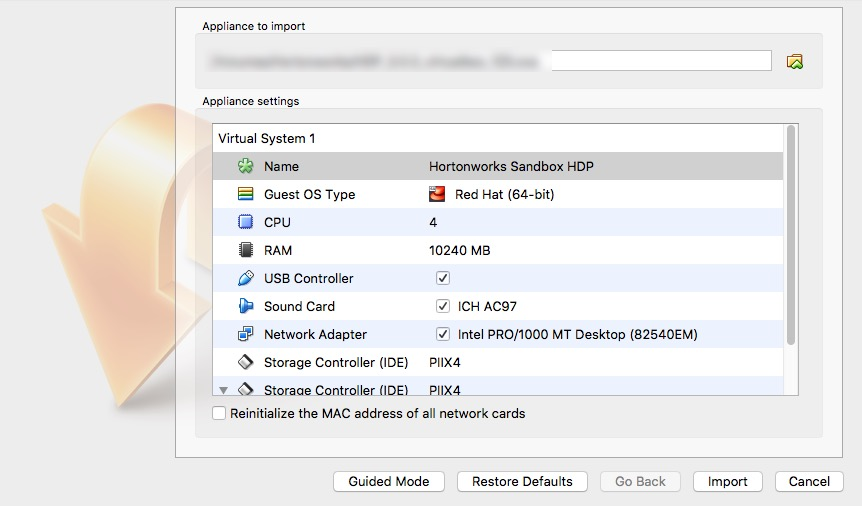
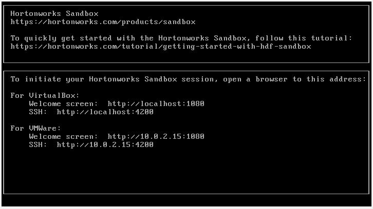
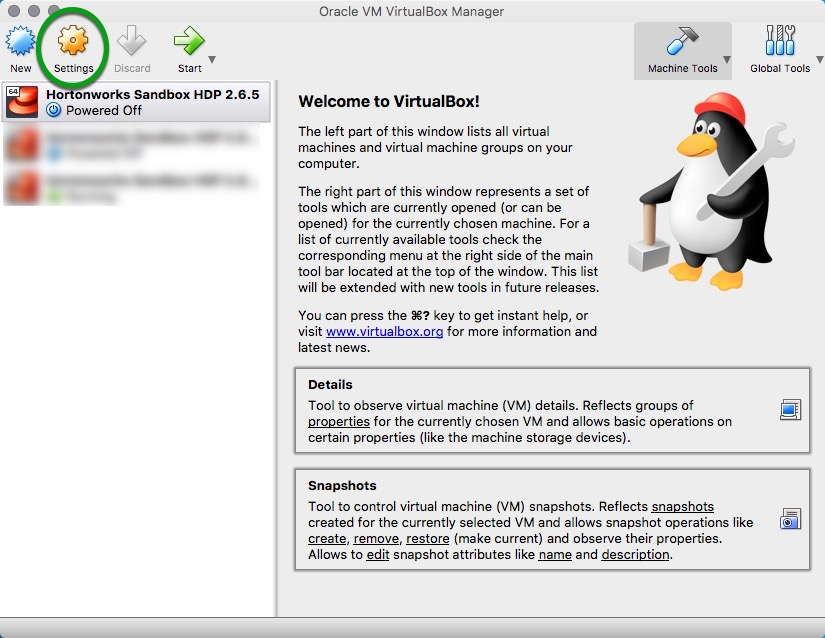
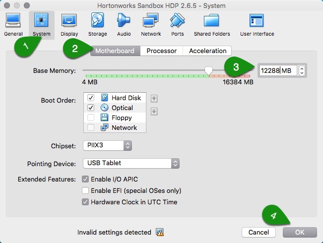

# Deploying Hortonworks Sandbox on VirtualBox

## Introduction

This tutorial walks through the general approach for installing the Hortonworks Sandbox (HDP or HDF) onto VirtualBox on your computer.

## Prerequisites

-   [Download the Hortonworks Sandbox](https://hortonworks.com/downloads/#sandbox)
-   [VirtualBox Installed](https://www.virtualbox.org/wiki/Downloads), version 5.1 or newer
-   A computer with minimum **8 GB RAM** to spare

## Outline

-   [Import the Hortonworks Sandbox](#import-the-hortonworks-sandbox)
-   [Start the Hortonworks Sandbox](#start-the-hortonworks-sandbox)
-   [Enable Connected Data Architecture (CDA) - Advanced Topic](#enable-connected-data-architecture-cda---advanced-topic)
-   [Further Reading](#further-reading)

## Import the Hortonworks Sandbox

Start by importing the Hortonworks Sandbox into VirtualBox:

-   Open VirtualBox and navigate to **File -> Import Appliance**. Select the sandbox image you downloaded and click **Open**.

You should end up with a screen like this:



> Note: Make sure to allocate at least 8 GB (8192 MB) of RAM for the sandbox.

Click **Import** and wait for VirtualBox to import the sandbox.

## Start the Hortonworks Sandbox

Once the sandbox has finished being imported, you may start it by selecting the sandbox and clicking "**Start**" from the VirtualBox menu.


A console window opens and displays the boot process. This process take a few minutes. When you see the following screen, you may begin using the sandbox.



Welcome to the Hortonworks Sandbox!

## Enable Connected Data Architecture (CDA) - Advanced Topic

**Prerequisite**:
-   A computer with minimum **12 GB of RAM** to spare
-   Have already deployed the latest HDP/HDF sandbox
-   Update virtual machine settings to minimum 12 GB (12288 MB)

Hortonworks Connected Data Architecture (CDA) allows you to play with both data-in-motion (HDF) and data-at-rest (HDP) sandboxes simultaneously.

**HDF (Data-In-Motion)**

Data-In-Motion is the idea where data is being ingested from all sorts of different devices into a flow or stream. While the data is moving throughout this flow, components or as NiFi calls them “processors” are performing actions on the data to modify, transform, aggregate and route it. Data-In-Motion covers a lot of the preprocessing stage in building a Big Data Application. For instance, data preprocessing is where Data Engineers work with the raw data to format it into a better schema, so Data Scientists can focus on analyzing and visualizing the data.

**HDP (Data-At-Rest)**

Data-At-Rest is the idea where data is not moving and is stored in a database or robust datastore across a distributed data storage such as Hadoop Distributed File System (HDFS). Instead of sending the data to the queries, the queries are being sent to the data to find meaningful insights. At this stage data, data processing and analysis occurs in building a Big Data Application.

### Update Virtual Machine Memory

**VirtualBox Manager -> Settings**



**System -> Motherboard -> Base Memory -> OK**



### Run Script to Enable CDA

The sandbox comes prepackaged with the script needed to enable CDA. Assuming you have already deployed the **HDP sandbox**, you need to **SSH** into Sandbox VM using password `hadoop`:

-   Issue command: `ssh root@sandbox-hdp.hortonworks.com -p 2200`

> Note: if you originally deployed HDF sandbox, replace **`sandbox-hdp`** with **`sandbox-hdf`** in the ssh command above.

-   Run bash script:

```
cd /sandbox/deploy-scripts/
sh enable-vm-cda.sh
```

The script output will be similar to:


## Further Reading

-   [Sandbox Architecture](https://hortonworks.com/tutorial/sandbox-architecture/)
-   Follow-up with the tutorial: [Learning the Ropes of the HDP Sandbox](https://hortonworks.com/tutorial/learning-the-ropes-of-the-hortonworks-sandbox)
-   [Browse available tutorials](https://hortonworks.com/tutorials/)
