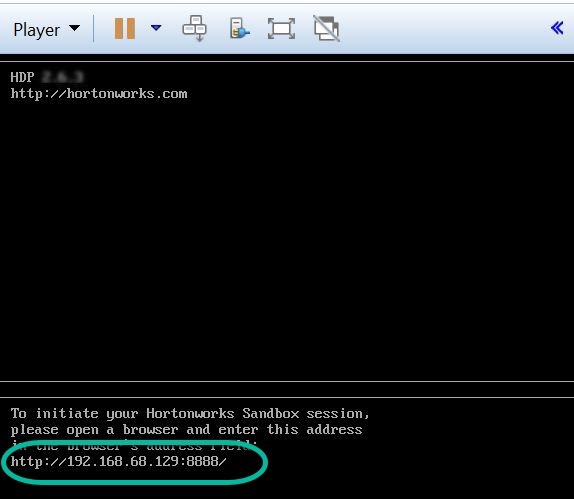
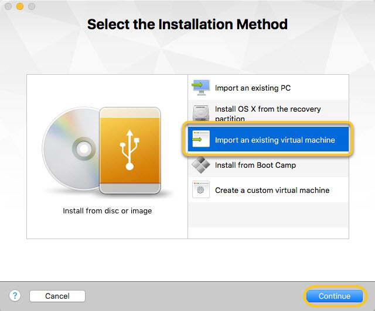

# Deploying Hortonworks Sandbox on VMWare

## Introduction

This tutorial walks through the general approach for installing the Hortonworks Sandbox (HDP or HDF) onto VMware on your computer.

## Prerequisites

-   [Download the Hortonworks Sandbox](https://hortonworks.com/downloads/#sandbox)
-   VMWare Installed, version 14 or newer
    -   [VMWare Workstation For Linux](http://www.vmware.com/products/workstation-for-linux.html)
    -   [VMWare Workstation For Windows](http://www.vmware.com/products/workstation.html)
    -   [VMWare Fusion For Mac](http://www.vmware.com/products/fusion.html)
-   A computer with at least **8 GB of RAM to spare**.

## Outline

-   [Import Hortonworks Sandbox on Windows](#import-hortonworks-sandbox-on-windows)
-   [Import Hortonworks Sandbox on macOS](#import-hortonworks-sandbox-on-macos)
-   [Further Reading](#further-reading)

## Import Hortonworks Sandbox on Windows

Open VMWare and select "**Open a Virtual Machine**":

Browse and select the sandbox image you downloaded and click **Open**.

Next, you're given the opportunity to save the virtual machine under a different name and/or location. After changes are made, click **Import**. You should then see the importing progress dialog:

Once import is complete, you will see the newly imported machine listed.

Select the virtual machine you want to start and click **Play virtual machine**.

When the virtual machine fully boots up, you will see a similar screen as below.

Enter the URL into your browser - you're ready to begin using the sandbox.

Welcome to the Hortonworks Sandbox!

## Import Hortonworks Sandbox on macOS

Open VMWare and select "**Import an existing virtual machine**" and click **Continue**.

"**Choose File...**" to browse to and select the sandbox image you downloaded.  Click the **Continue** button.

Next, you're given the opportunity to save the virtual machine under a different name.  If you have no preference in renaming, you can just leave the default name and click Save.  You should then see the importing progress dialog:

Once finished, the following screen is displayed:

Click the **Finish** button and start your new virtual machine.  A window opens and displays the boot process.  Once the virtual machine fully boots up, you may begin using the sandbox.

Welcome to the Hortonworks Sandbox!

## Further Reading

-   Follow-up with the tutorial: [Learning the Ropes of the HDP Sandbox](https://hortonworks.com/tutorial/learning-the-ropes-of-the-hortonworks-sandbox)
