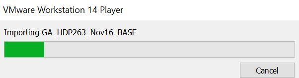
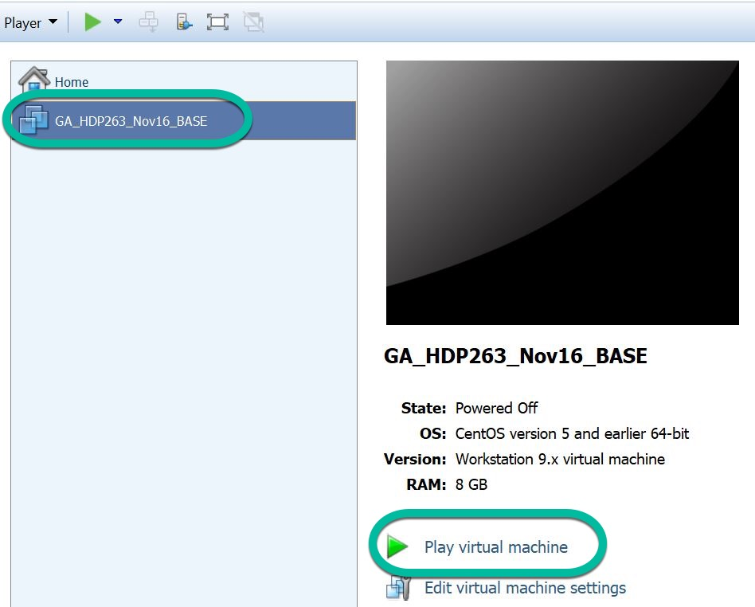
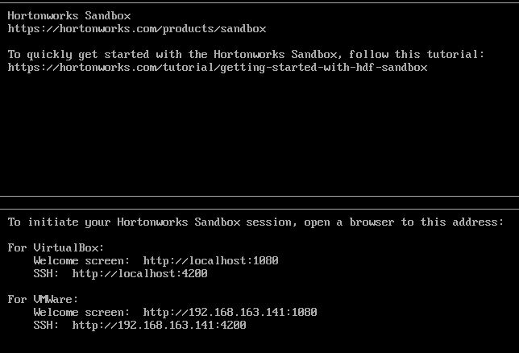
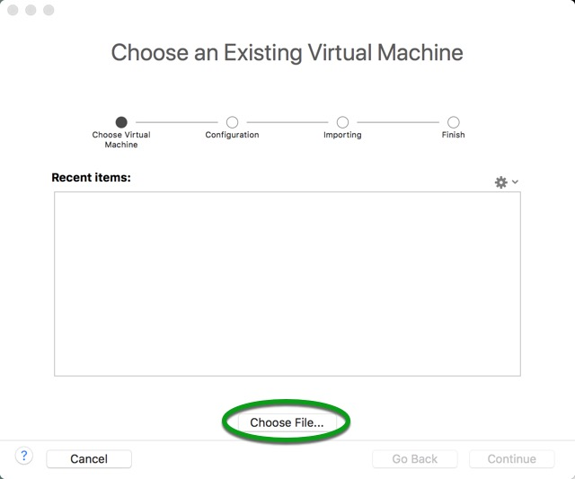
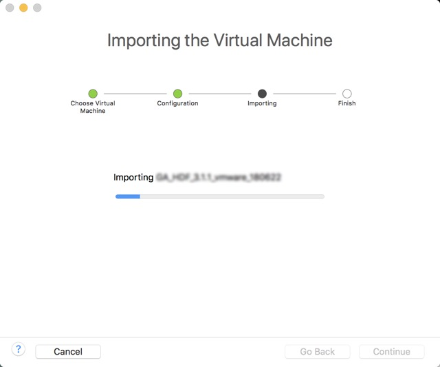
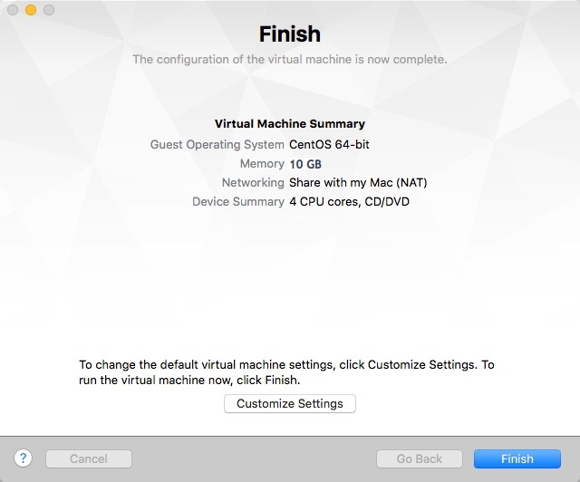
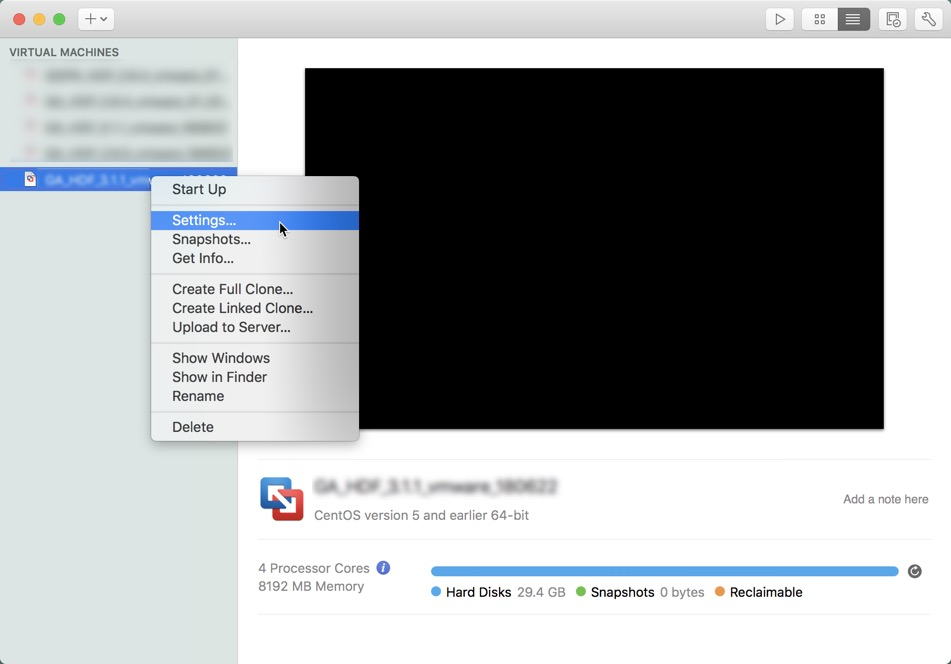
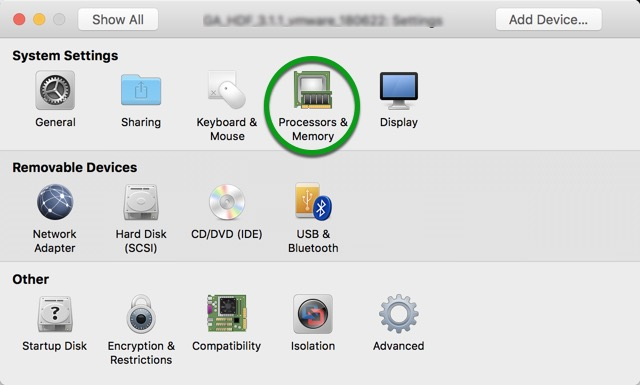
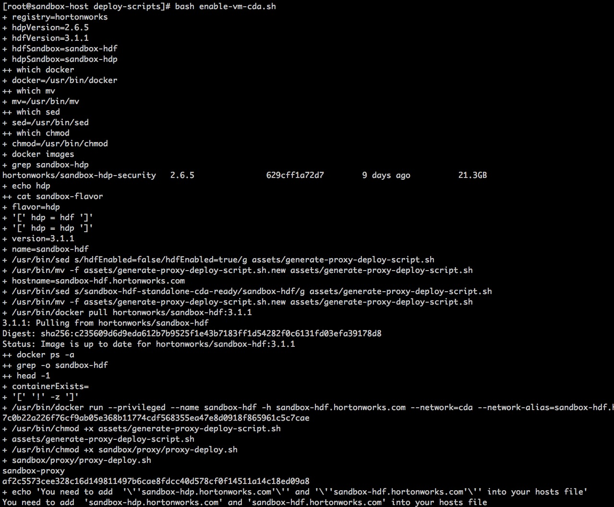

# Deploying Hortonworks Sandbox on VMWare

## Introduction

This tutorial walks through the general approach for installing the Hortonworks Sandbox (HDP or HDF) onto VMware on your computer.

## Prerequisites

-   [Download the Hortonworks Sandbox](https://hortonworks.com/downloads/#sandbox)
-   VMWare Installed, version 14 or newer
    -   [VMWare Workstation For Linux/Windows](https://www.vmware.com/products/workstation-pro.html)
    -   [VMWare Fusion For macOS](http://www.vmware.com/products/fusion.html)
-   A computer with minimum **8 GB RAM** to spare

## Outline

-   [Import Hortonworks Sandbox](#import-hortonworks-sandbox)
    -   [VMWare Workstation](#vmware-workstation)
    -   [VMWare Fusion](#vmware-fusion)
-   [Enable Connected Data Architecture (CDA) - Advanced Topic](#enable-connected-data-architecture-cda---advanced-topic)
-   [Further Reading](#further-reading)

## Import Hortonworks Sandbox

### VMWare Workstation

Open VMWare and select **Open a Virtual Machine**:


Browse and select the sandbox image you downloaded and click **Open**.

Next, you're given the opportunity to save the virtual machine under a different name and/or location. After changes are made, click **Import**. You should then see the importing progress dialog:



Once import is complete, you will see the newly imported machine listed.

Select the virtual machine you want to start and click **Play virtual machine**.



When the virtual machine fully boots up, you will see a similar screen as below.

Enter the URL into your browser - you're ready to begin using the sandbox.



Welcome to the Hortonworks Sandbox!

### VMWare Fusion

Open VMWare and navigate to **File -> Import... -> Choose File...**.



Select the sandbox image you downloaded and click **Open**, then **Continue**.

You are given the opportunity to save the virtual machine under a different name/location. If you have no preference in renaming, you can just leave the default name and click Save. You should then see the importing progress dialog:



Once finished, the following screen is displayed:



Click **Finish** to start your new virtual machine.

When the virtual machine fully boots up, you will see a similar screen as below.

Enter the URL into your browser - you're ready to begin using the sandbox.


Welcome to the Hortonworks Sandbox!

## Enable Connected Data Architecture (CDA) - Advanced Topic

**Prerequisite**:
-   A computer with minimum **12 GB of RAM** to spare
-   Have already deployed the latest HDP/HDF sandbox
-   Update virtual machine settings to minimum 12 GB (12288 MB)

Hortonworks Connected Data Architecture (CDA) allows you to play with both data-in-motion (HDF) and data-at-rest (HDP) sandboxes simultaneously.

**HDF (Data-In-Motion)**

Data-In-Motion is the idea where data is being ingested from all sorts of different devices into a flow or stream. While the data is moving throughout this flow, components or as NiFi calls them “processors” are performing actions on the data to modify, transform, aggregate and route it. Data-In-Motion covers a lot of the preprocessing stage in building a Big Data Application. For instance, data preprocessing is where Data Engineers work with the raw data to format it into a better schema, so Data Scientists can focus on analyzing and visualizing the data.

**HDP (Data-At-Rest)**

Data-At-Rest is the idea where data is not moving and is stored in a database or robust datastore across a distributed data storage such as Hadoop Distributed File System (HDFS). Instead of sending the data to the queries, the queries are being sent to the data to find meaningful insights. At this stage data, data processing and analysis occurs in building a Big Data Application.

### Update Virtual Machine Memory

Make sure the virtual machine is shutdown before modifying configurations. **Right-click** on virtual machine and select **Settings...**.



Select **Processors & Memory** and modify memory accordingly. Restart virtual machine.



### Run Script to Enable CDA

The sandbox comes prepackaged with the script needed to enable CDA. Assuming you have already deployed the **HDP sandbox**, you need to **SSH** into Sandbox VM using password `hadoop`:

-   Issue command: `ssh root@sandbox-hdp.hortonworks.com -p 22`

> Note: if you originally deployed HDF sandbox, replace **`sandbox-hdp`** with **`sandbox-hdf`** in the ssh command above.

-   Run bash script:

```
cd /sandbox/deploy-scripts/
sh enable-vm-cda.sh
```

The script output will be similar to:



## Further Reading

-   [Sandbox Architecture](https://hortonworks.com/tutorial/sandbox-architecture/)
-   Follow-up with the tutorial: [Learning the Ropes of the HDP Sandbox](https://hortonworks.com/tutorial/learning-the-ropes-of-the-hortonworks-sandbox)
-   [Browse available tutorials](https://hortonworks.com/tutorials/)
