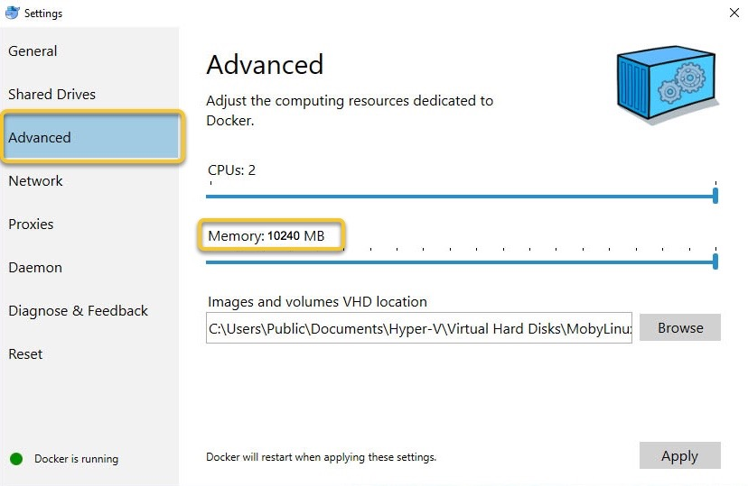
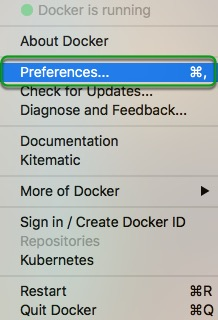
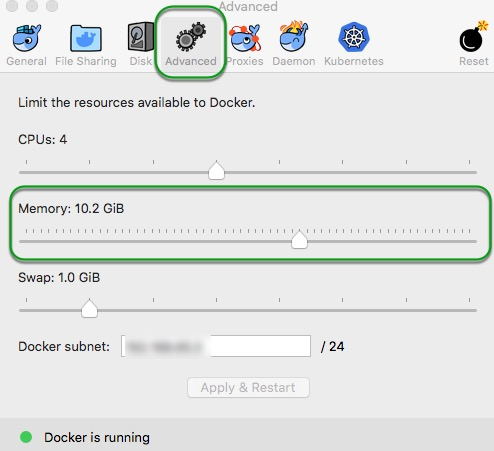
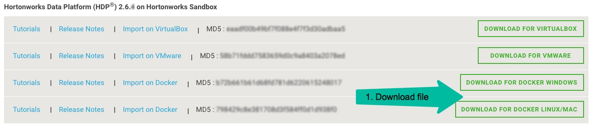
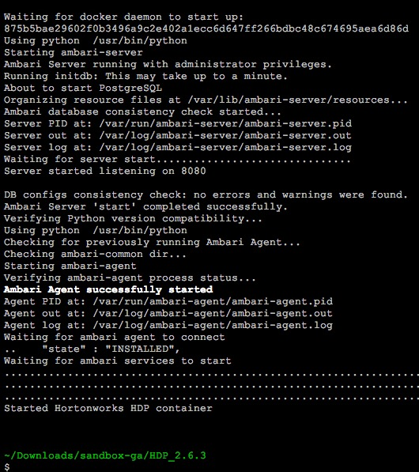
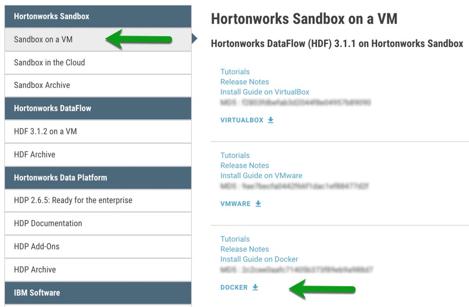
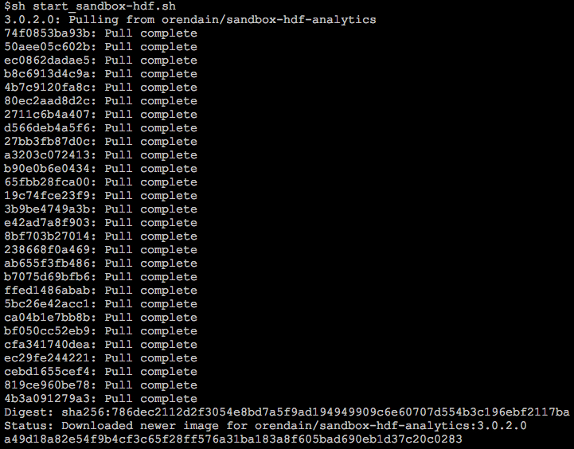
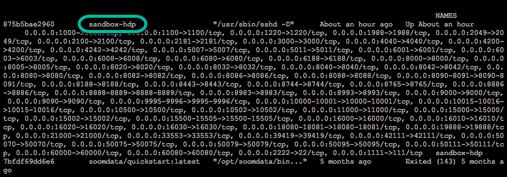

# Deploying Hortonworks Sandbox on Docker

## Introduction

This tutorial walks through the general approach for installing the Hortonworks Sandbox (HDP or HDF) onto Docker on your computer.

## Prerequisites

-   Docker Installed, version 17.09 or newer
    -   [Docker For Linux](https://docs.docker.com/engine/installation/linux/)
    -   [Docker For Windows](https://docs.docker.com/docker-for-windows/install/)
    -   [Docker For Mac](https://docs.docker.com/docker-for-mac/install/)
-   A computer with **8 - 12 GB of RAM to spare**.

## Outline

-   [Configure Docker Memory](#configure-docker-memory)
    -   [For Linux](#for-linux)
    -   [For Windows](#for-windows)
    -   [For Mac](#for-mac)
-   [Deploy Sandbox](#deploy-sandbox)
    -   [For HDP Sandbox](#for-hdp-sandbox)
    -   [For HDF Sandbox](#for-hdf-sandbox)
-   [Check Sandbox Deployment](#check-sandbox-deployment)
-   [Remove Sandbox](#remove-sandbox)
-   [Further Reading](#further-reading)
-   [Appendix A: Troubleshooting](#appendix-a-troubleshooting)

## Configure Docker Memory

### For Linux

No special configuration needed for Linux.

### For Windows

After [installing Docker For Windows](https://docs.docker.com/docker-for-windows/install/), open the application and click on the Docker icon in the menu bar.  Select **Settings**.


Select the **Advanced** tab and adjust the dedicated memory to **at least 8GB of RAM**.



### For Mac

After [installing Docker For Mac](https://docs.docker.com/docker-for-mac/install/), open the application and click on the Docker icon in the menu bar.  Select **Preferences**.



Select the **Advanced** tab and adjust the dedicated memory to **at least 8GB of RAM**.



## Deploy Sandbox

### For HDP Sandbox

**Load Sandbox Into Docker**

-   Download latest scripts [Hortonworks Data Platform (HDP) for Docker](https://hortonworks.com/downloads/#sandbox) and decompress **zip** file.

[](https://hortonworks.com/downloads/#sandbox)

Naming convention for scripts are:

-   For Linux/Mac: **start-sandbox-hdp-standalone_{version}.sh**
-   For Windows: **start-sandbox-hdp-standalone_{version}.ps1**

>Note: You will need to run script every time you want to restart the sandbox. It will setup and start the sandbox for you, creating the sandbox docker container in the process if necessary.

Linux/Mac:

~~~
cd /path/to/script
sh start-sandbox-hdp-standalone_{version}.sh
~~~

Windows Powershell:

~~~
cd /path/to/script
powershell -ExecutionPolicy ByPass -File start-sandbox-hdp-standalone_{version}.ps1
~~~

The script output will be similar to:



**Stop HDP Sandbox**

When you want to stop/shutdown your HDP sandbox, run the following command:

~~~
docker stop {sandbox-container-hdp}
~~~

**Start HDP Sandbox**

When you want to re-start your sandbox, re-run the script as you did above.

### For HDF Sandbox

**Install/Deploy/Start HDF Sandbox**

-   Download latest scripts [Hortonworks DataFlow (HDF) for Docker](https://hortonworks.com/downloads/#sandbox) and decompress **zip** file.

[](https://hortonworks.com/downloads/#sandbox)

Naming convention for scripts are:

-   For Linux/Mac: **deploy-sandbox-hdf-standalone_{version}.sh**
-   For Windows: **deploy-sandbox-hdf-standalone_{version}.ps1**

>Note: You only need to run script once. It will setup and start the sandbox for you, creating the sandbox docker container in the process if necessary.

Linux/Mac:

~~~
cd /path/to/script
sh deploy-sandbox-hdf-standalone_{version}.sh
~~~

Windows Powershell:

~~~
cd /path/to/script
powershell -ExecutionPolicy ByPass -File deploy-sandbox-hdf-standalone_{version}.ps1
~~~

You should see something similar to the following:



**Stop HDF Sandbox**

When you want to shutdown your sandbox, run the following command:

~~~
docker stop {sandbox-container-hdf}
~~~

**Start HDF Sandbox**

When you want to re-start your sandbox, run the following command:

~~~
docker start {sandbox-container-hdf}
~~~

### Check Sandbox Deployment

Make sure Sandbox docker container is running by issuing command:

-   ```docker ps -a```

You should see something like:



### Remove Sandbox

A container is an instance of the Sandbox image. So, if you have multiple containers and want to remove one, issue the following commands:

-   Stop container: ```docker stop {sandbox-container-name}```
-   Remove container: ```docker rm {sandbox-container-name}```

If you want to remove the Sandbox Docker image, issue the following command after stopping and removing the Docker container:

```docker rmi {sandbox-image-name}```

## Further Reading

-   Follow-up with the tutorial: [Learning the Ropes of the Hortonworks Sandbox](https://hortonworks.com/tutorial/learning-the-ropes-of-the-hortonworks-sandbox)
-   [Browse all tutorials available on the Hortonworks site](https://hortonworks.com/tutorials/)

### Appendix A: Troubleshooting

**No space left on device**:

-   Potential Solution
    -   [Increase the size of base Docker for Mac VM image](<https://community.hortonworks.com/content/kbentry/65901/how-to-increase-the-size-of-the-base-docker-for-ma.html>)
