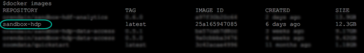
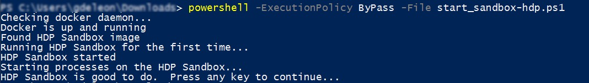

# Deploying Hortonworks Sandbox on Docker

## Introduction

This tutorial walks through the general approach for installing the Hortonworks Sandbox (HDP or HDF) onto Docker on your computer.

## Prerequisites

-   Docker Installed, version 17.09 or newer
    -   [Docker For Linux](https://docs.docker.com/engine/installation/linux/)
    -   [Docker For Windows](https://docs.docker.com/docker-for-windows/install/)
    -   [Docker For Mac](https://docs.docker.com/docker-for-mac/install/)
-   A computer with **8 - 12 GB of RAM to spare**.

## Outline

-   [Configure Docker Memory](#configure-docker-memory)
    -   [For Linux](#for-linux)
    -   [For Windows](#for-windows)
    -   [For Mac](#for-mac)
-   [Deploy Sandbox](#deploy-sandbox)
    -   [For HDP Sandbox](#for-hdp-sandbox)
    -   [For HDF Sandbox](#for-hdf-sandbox)
-   [Check Sandbox Deployment](#check-sandbox-deployment)
-   [Remove Sandbox](#remove-sandbox)
-   [Further Reading](#further-reading)
-   [Appendix A: Troubleshooting](#appendix-a-troubleshooting)

## Configure Docker Memory

### For Linux

No special configuration needed for Linux.

### For Windows

After [installing Docker For Windows](https://docs.docker.com/docker-for-windows/install/), open the application and click on the Docker icon in the menu bar.  Select **Settings**.


Select the **Advanced** tab and adjust the dedicated memory to **at least 8GB of RAM**.


### For Mac

After [installing Docker For Mac](https://docs.docker.com/docker-for-mac/install/), open the application and click on the Docker icon in the menu bar.  Select **Preferences**.


Select the **Advanced** tab and adjust the dedicated memory to **at least 8GB of RAM**.


## Deploy Sandbox

### For HDP Sandbox

**Load Sandbox Into Docker**

After you've [downloaded the sandbox](https://hortonworks.com/downloads/#sandbox), open a console/terminal and issue the following command to load the sandbox image:

-   ```docker load -i <sandbox-docker-image-path>```

Make sure the image was imported successfully - run the following command:

-   ```docker images```

You should see **sandbox-hdp** on the list.



**Start HDP Sandbox**

Download one of the following scripts and save it somewhere on your computer.

-   For Linux/Mac: Use this [start_sandbox-hdp.sh](assets/start_sandbox-hdp.sh)
-   For Windows: Use this [start_sandbox-hdp.ps1](assets/start_sandbox-hdp.ps1)

Run the script you just downloaded.  It will setup and start the sandbox for you, creating the sandbox docker container in the process if necessary.

Linux/Mac:

~~~
cd /path/to/start_sandbox-script
sh start_sandbox-hdp.sh
~~~

Windows Powershell:

~~~
cd /path/to/start_sandbox-script
powershell -ExecutionPolicy ByPass -File start_sandbox-hdp.ps1
~~~

You should see something like the following after script completion:


or



**Stop HDP Sandbox**

Linux/Mac/Windows:

When you want to shutdown your sandbox, run the following command:

~~~
docker stop {sandbox-container-hdp}
~~~

### For HDF Sandbox

**Install/Deploy/Start HDF Sandbox**

Download one of the following scripts and save it somewhere on your computer.

-   For Linux/Mac: Use this [sandbox-hdf-deploy.sh](assets/sandbox-hdf-deploy.sh)
-   For Windows: Use this [sandbox-hdf-deploy.ps1](assets/sandbox-hdf-deploy.ps1)

Run the script you just downloaded one time.  It will setup and start the sandbox for you, creating the sandbox docker container in the process if necessary.

Linux/Mac:

~~~
cd /path/to/start_sandbox-script
sh sandbox-hdf-deploy.sh
~~~

Windows Powershell:

~~~
cd /path/to/start_sandbox-script
powershell -ExecutionPolicy ByPass -File sandbox-hdf-deploy.ps1
~~~

You should see something like the following after script completion:


**Stop HDF Sandbox**

When you want to shutdown your sandbox, run the following command:

~~~
docker stop {sandbox-container-hdf}
~~~

**Start HDF Sandbox**

When you want to re-start your sandbox, run the following command:

~~~
docker start {sandbox-container-hdf}
~~~

### Check Sandbox Deployment

Make sure Sandbox docker container is running by issuing command:

-   ```docker ps -a```

You should see something like:


### Remove Sandbox

A container is an instance of the Sandbox image. So, if you have multiple containers and want to remove one, issue the following commands:

-   Stop container: ```docker stop {sandbox-container-name}```
-   Remove container: ```docker rm {sandbox-container-name}```

If you want to remove the Sandbox Docker image, issue the following command after stopping and removing the Docker container:

```docker rmi {sandbox-image-name}```

## Further Reading

-   Follow-up with the tutorial: [Learning the Ropes of the Hortonworks Sandbox](https://hortonworks.com/tutorial/learning-the-ropes-of-the-hortonworks-sandbox)
-   [Browse all tutorials available on the Hortonworks site](https://hortonworks.com/tutorials/)

### Appendix A: Troubleshooting

**No space left on device**:

-   Potential Solution
    -   [Increase the size of base Docker for Mac VM image](<https://community.hortonworks.com/content/kbentry/65901/how-to-increase-the-size-of-the-base-docker-for-ma.html>)
