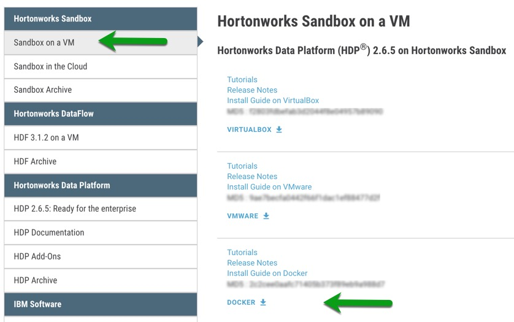
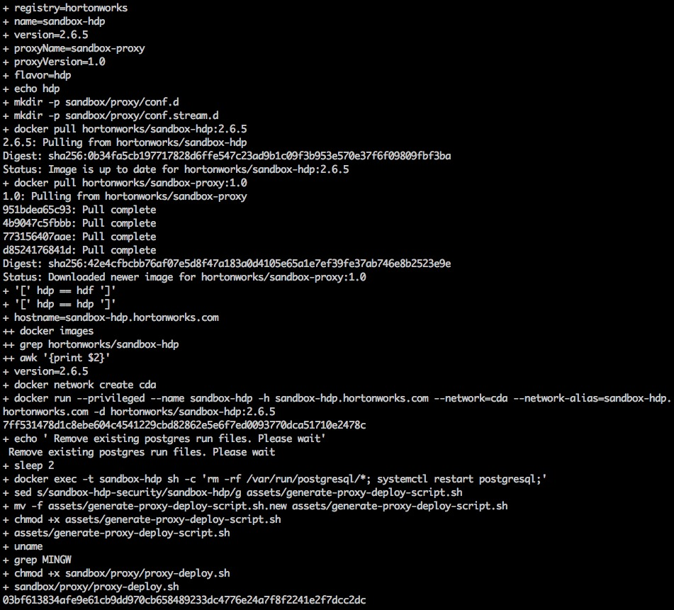
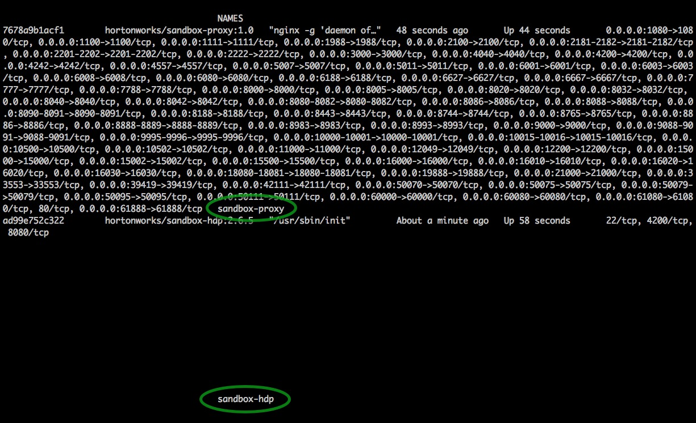
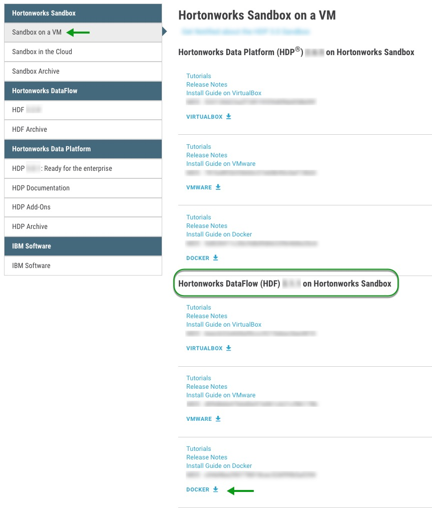
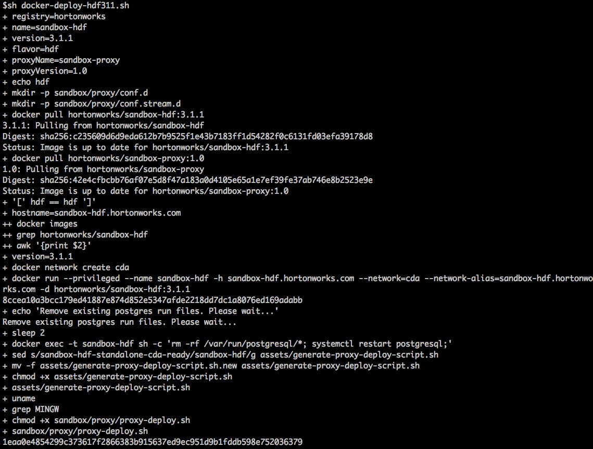
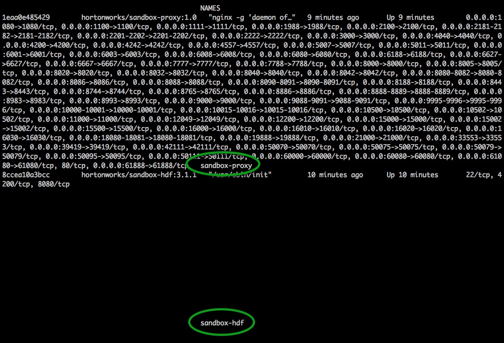
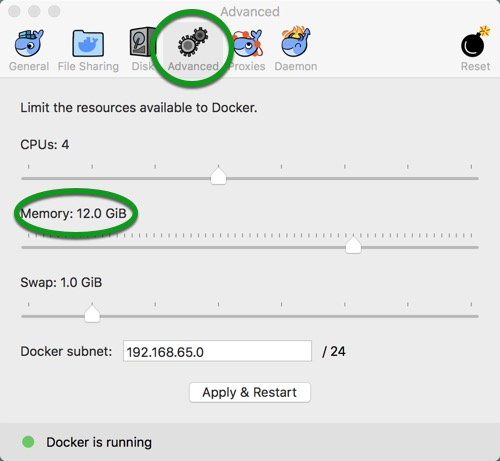
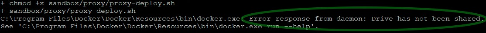
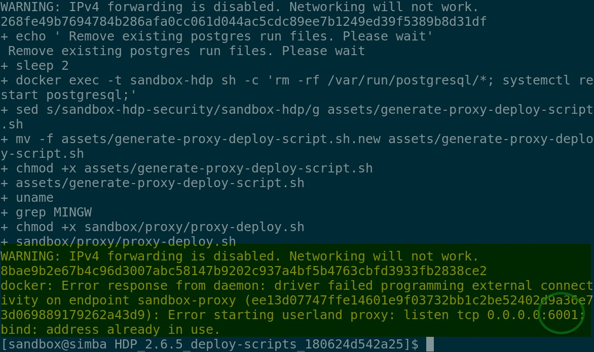

# Deploying Hortonworks Sandbox on Docker

## Introduction

This tutorial walks through the general approach for installing the Hortonworks Sandbox (HDP or HDF) onto Docker on your computer.

## Prerequisites

- Docker Installed, version 17.09 or newer
  - [Docker For Linux](https://docs.docker.com/engine/installation/linux/)
  - [Docker For Windows](https://docs.docker.com/docker-for-windows/install/)
  - [Docker For Mac](https://docs.docker.com/docker-for-mac/install/)
- A computer with minimum **10 GB RAM** dedicated to the virtual machine
- Microsoft Windows users must have **bash shell** installed. Instructions have been tested using [Git Bash](https://git-scm.com/downloads).

## Outline

- [Memory Configuration](#memory-configuration)
  - [Memory For Linux](#memory-for-linux)
  - [Memory For Windows](#memory-for-windows)
  - [Memory For Mac](#memory-for-mac)
- [HDP Deployment](#hdp-deployment)
  - [Deploy HDP Sandbox](#deploy-hdp-sandbox)
  - [Verify HDP Sandbox](#verify-hdp-sandbox)
  - [Stop HDP Sandbox](#stop-hdp-sandbox)
  - [Restart HDP Sandbox](#restart-hdp-sandbox)
  - [Remove HDP Sandbox](#remove-hdp-sandbox)
- [HDF Deployment](#hdf-deployment)
  - [Deploy HDF Sandbox](#deploy-hdf-sandbox)
  - [Verify HDF Sandbox](#verify-hdf-sandbox)
  - [Stop HDF Sandbox](#stop-hdf-sandbox)
  - [Restart HDF Sandbox](#restart-hdf-sandbox)
  - [Remove HDF Sandbox](#remove-hdf-sandbox)
- [Enable Connected Data Architecture (CDA) - Advanced Topic](#enable-connected-data-architecture-cda---advanced-topic)
- [Further Reading](#further-reading)
- [Appendix A: Troubleshooting](#appendix-a-troubleshooting)
  - [Drive not shared](#drive-not-shared)
  - [No space left on device](#no-space-left-on-device)
  - [Port Conflict](#port-conflict)

## Memory Configuration

### Memory For Linux

No special configuration needed for Linux.

### Memory For Windows

After [installing Docker For Windows](https://docs.docker.com/docker-for-windows/install/), open the application and click on the Docker icon in the menu bar.  Select **Settings**.


Select the **Advanced** tab and adjust the dedicated memory to **at least 10GB of RAM**.


### Memory For Mac

After [installing Docker For Mac](https://docs.docker.com/docker-for-mac/install/), open the application and click on the Docker icon in the menu bar.  Select **Preferences**.


Select the **Advanced** tab and adjust the dedicated memory to **at least 12GB of RAM**.


## HDP Deployment

### Deploy HDP Sandbox

**Install/Deploy/Start HDP Sandbox**

- Download latest scripts [Hortonworks Data Platform (HDP) for Docker](https://www.cloudera.com/downloads/hortonworks-sandbox/hdp.html?utm_source=mktg-tutorial) and decompress **zip** file.

[](https://www.cloudera.com/downloads/hortonworks-sandbox/hdp.html?utm_source=mktg-tutorial)

In the decompressed folder, you will find shell script **docker-deploy-{version}.sh**. From the command line, Linux / Mac / Windows(Git Bash), run the script:

```bash
cd /path/to/script
sh docker-deploy-{HDPversion}.sh
```

> Note: You only need to run script once. It will setup and start the sandbox for you, creating the sandbox docker container in the process if necessary.
>
> Note: The decompressed folder has other scripts and folders. We will ignore those for now. They will be used later in advanced tutorials.

The script output will be similar to:



### Verify HDP Sandbox

Verify HDP sandbox was deployed successfully by issuing the command:

```bash
docker ps
```

You should see something like:



### Stop HDP Sandbox

When you want to stop/shutdown your HDP sandbox, run the following commands:

```bash
docker stop sandbox-hdp
docker stop sandbox-proxy
```

### Restart HDP Sandbox

When you want to re-start your sandbox, run the following commands:

```bash
docker start sandbox-hdp
docker start sandbox-proxy
```

### Remove HDP Sandbox

A container is an instance of the Sandbox image. You must **stop** container dependancies before removing it. Issue the following commands:

```bash
docker stop sandbox-hdp
docker stop sandbox-proxy
docker rm sandbox-hdp
docker rm sandbox-proxy
```

If you want to remove the HDP Sandbox image, issue the following command after stopping and removing the containers:

```bash
docker rmi hortonworks/sandbox-hdp:{release}
```

## HDF Deployment

### Deploy HDF Sandbox

**Install/Deploy/Start HDF Sandbox**

- Download latest scripts [Hortonworks DataFlow (HDF) for Docker](https://www.cloudera.com/downloads/hortonworks-sandbox/hdf.html?utm_source=mktg-tutorial) and decompress **zip** file.

[](https://www.cloudera.com/downloads/hortonworks-sandbox/hdf.html?utm_source=mktg-tutorial)

In the decompressed folder, you will find shell script **docker-deploy-{version}.sh**. From the command line, Linux / Mac / Windows(Git Bash), run the script:

```bash
cd /path/to/script
sh docker-deploy-{HDFversion}.sh
```

> Note: You only need to run script once. It will setup and start the sandbox for you, creating the sandbox docker container in the process if necessary.
>
> Note: The decompressed folder has other scripts and folders. We will ignore those for now. They will be used later in advanced tutorials.

The script output will be similar to:



### Verify HDF Sandbox

Verify HDF sandbox was deployed successfully by issuing the command:

```bash
docker ps
```

You should see something like:



### Stop HDF Sandbox

When you want to stop/shutdown your HDF sandbox, run the following commands:

```bash
docker stop sandbox-hdf
docker stop sandbox-proxy
```

### Restart HDF Sandbox

When you want to re-start your HDF sandbox, run the following commands:

```bash
docker start sandbox-hdf
docker start sandbox-proxy
```

### Remove HDF Sandbox

A container is an instance of the Sandbox image. You must **stop** container dependencies before removing it. Issue the following commands:

```bash
docker stop sandbox-hdf
docker stop sandbox-proxy
docker rm sandbox-hdf
docker rm sandbox-proxy
```

If you want to remove the HDF Sandbox image, issue the following command after stopping and removing the containers:

```bash
docker rmi hortonworks/sandbox-hdf:{release}
```

## Enable Connected Data Architecture (CDA) - Advanced Topic

**Prerequisite**:
- A computer with minimum **22 GB of RAM** dedicated to the virtual machine
- Have already deployed the latest HDP/HDF sandbox
- Update Docker settings to use minimum 16 GB (16384 MB)

Hortonworks Connected Data Architecture (CDA) allows you to play with both data-in-motion (HDF) and data-at-rest (HDP) sandboxes simultaneously.

**HDF (Data-In-Motion)**

Data-In-Motion is the idea where data is being ingested from all sorts of different devices into a flow or stream. While the data is moving throughout this flow, components or as NiFi calls them “processors” are performing actions on the data to modify, transform, aggregate and route it. Data-In-Motion covers a lot of the preprocessing stage in building a Big Data Application. For instance, data preprocessing is where Data Engineers work with the raw data to format it into a better schema, so Data Scientists can focus on analyzing and visualizing the data.

**HDP (Data-At-Rest)**

Data-At-Rest is the idea where data is not moving and is stored in a database or robust datastore across a distributed data storage such as Hadoop Distributed File System (HDFS). Instead of sending the data to the queries, the queries are being sent to the data to find meaningful insights. At this stage data, data processing and analysis occurs in building a Big Data Application.

### Update Docker Memory

Select **Docker -> Preferences... -> Advanced** and set memory accordingly. Restart Docker.



### Run Script to Enable CDA

When you first deployed the sandbox, a suite of deployment scripts were downloaded - refer to [Deploy HDP Sandbox](#deploy-hdp-sandbox) as an example.

In the decompressed folder, you will find shell script **enable-native-cda.sh**. From the command line, Linux / Mac / Windows(Git Bash), run the script:

```bash
cd /path/to/script
sh enable-native-cda.sh
```

The script output will be similar to:


## Further Reading

-   [Video: How to deploy sandbox using Docker](https://youtu.be/5TJMudSNn9c)
-   [Sandbox Architecture](https://hortonworks.com/tutorial/sandbox-architecture/)
-   Follow-up with the tutorial: [Learning the Ropes of the HDP Sandbox](https://hortonworks.com/tutorial/learning-the-ropes-of-the-hortonworks-sandbox)
-   [Browse available tutorials](https://hortonworks.com/tutorials/)

## Appendix A: Troubleshooting

### Drive not shared



- Docker needs **write** access to the drive where the **docker-deploy-{version}.sh** is executed.

- The easiest solution is to execute script from **Downloads** folder.

- Otherwise, go to **Docker Preferences/Settings** -> **File Sharing/Shared Drives** -> **Add/Select** path/drive where deploy-scripts are located and try again.

### No space left on device

- Potential Solution
  - [Increase the size of base Docker for Mac VM image](<https://community.hortonworks.com/content/kbentry/65901/how-to-increase-the-size-of-the-base-docker-for-ma.html>)

### Port Conflict

While running the deployment script, you may run into conflicting port issue(s) similar to:



In the picture about, we had a port conflict with **6001**.

Go to the location where you saved the Docker deployment scripts - refer to [Deploy HDP Sandbox](#deploy-hdp-sandbox) as an example. You will notice a new directory **sandbox** was created.

- Edit file **`sandbox/proxy/proxy-deploy.sh`**
- Modify conflicting port (first in keypair). For example, **`6001:6001`** to **`16001:6001`**
- Save/Exit the File
- Run bash script: **`bash sandbox/proxy/proxy-deploy.sh`**
- Repeat steps for continued port conflicts

Verify sandbox was deployed successfully by issuing the command:

```bash
docker ps
```

You should see something like:


