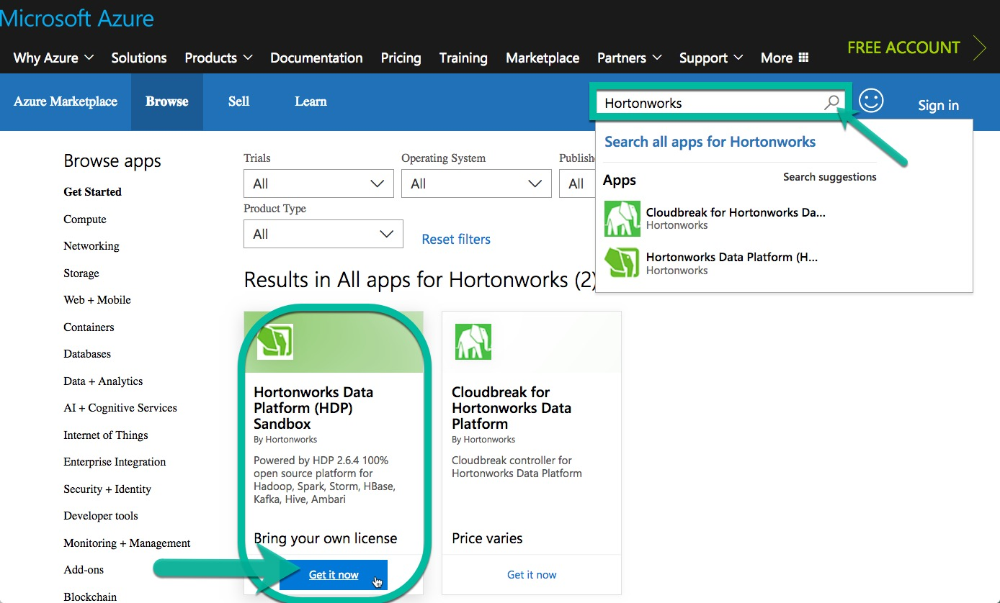
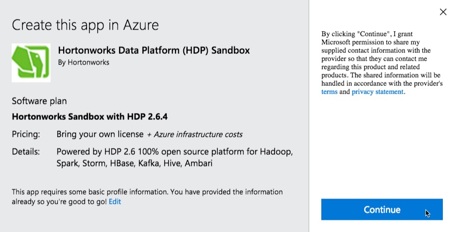
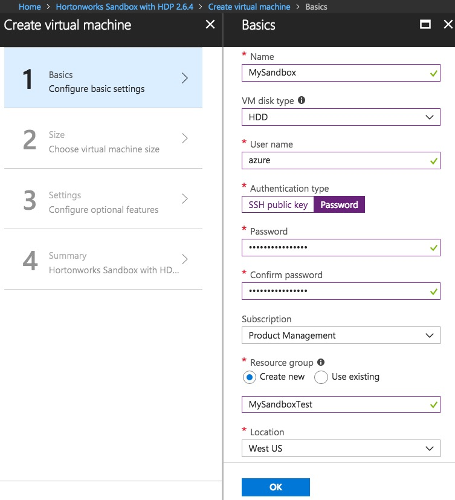
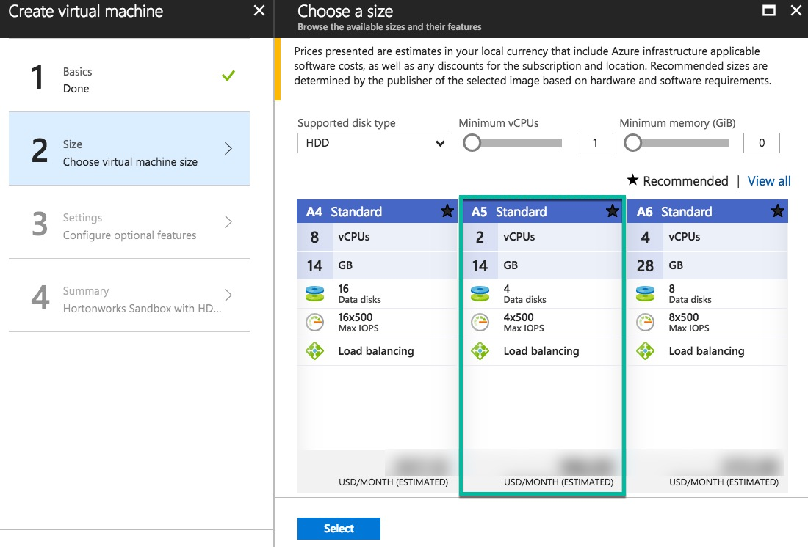
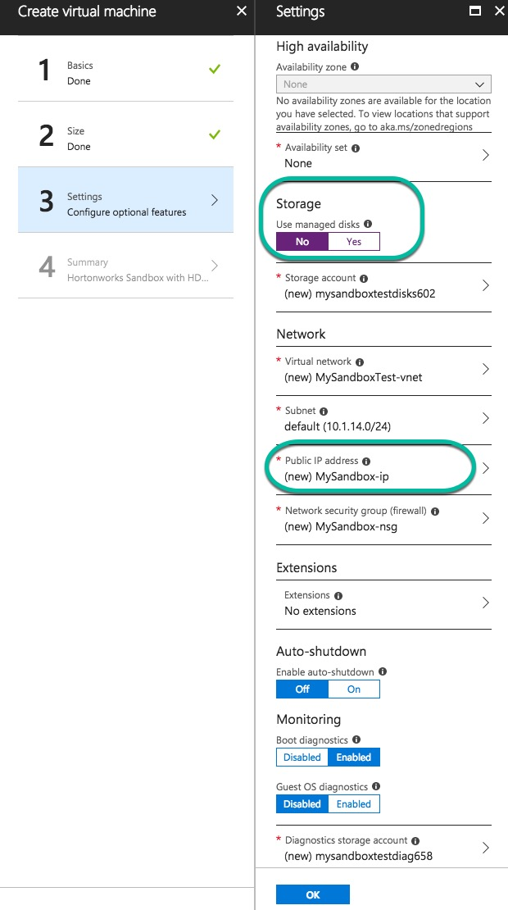
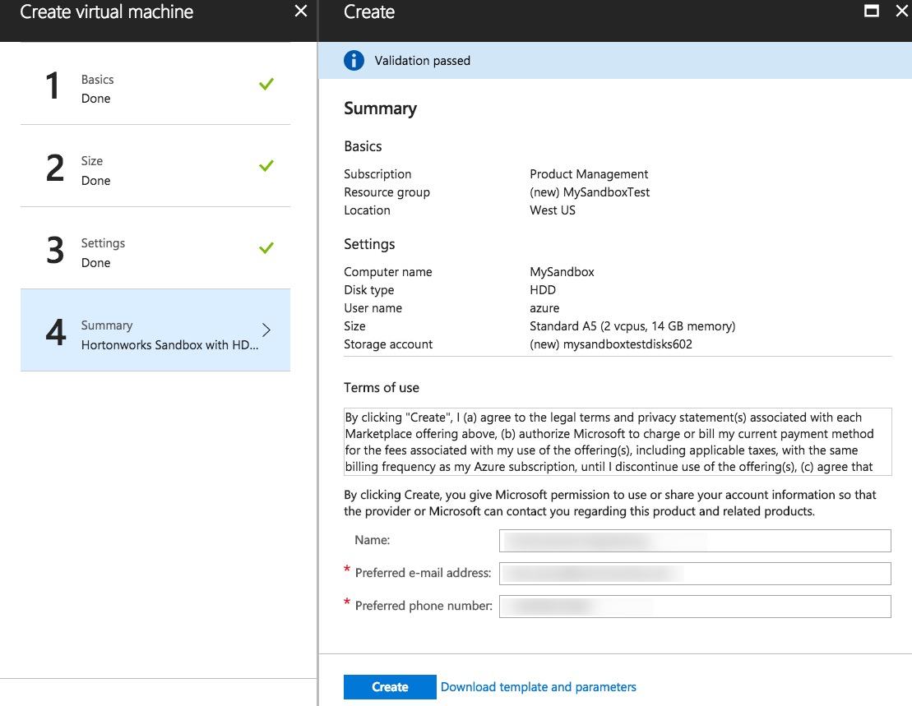
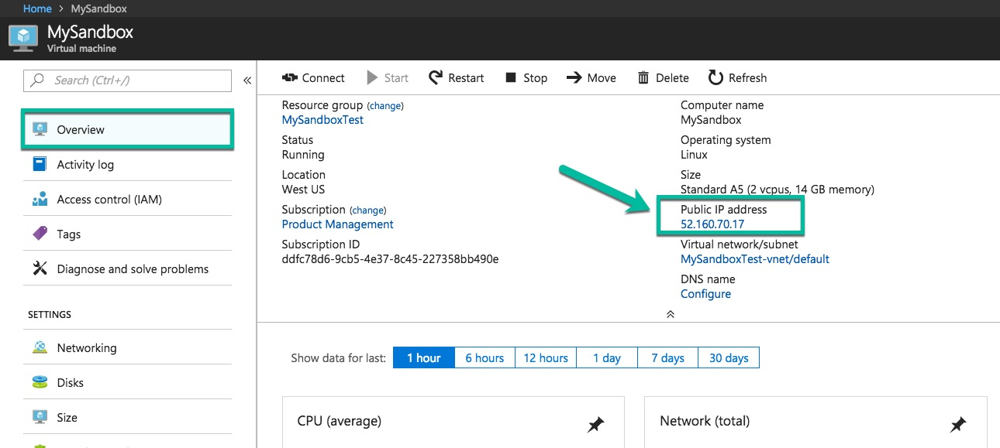
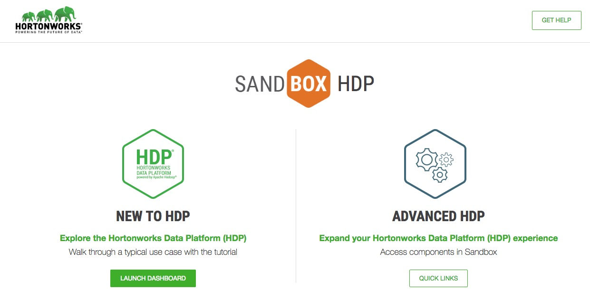

# Deploying Hortonworks Sandbox on Microsoft Azure

## Introduction

The Azure cloud infrastructure has become a common place for users to deploy virtual machines on the cloud due to its flexibility, ease of deployment, and cost benefits.  Microsoft has expanded Azure to include a marketplace with thousands of certified, open source, and community software applications and developer services, pre-configured for Microsoft Azure.  This tutorial covers deploying the Hortonworks Sandbox offering via the Azure Marketplace.

## Prerequisites

- Must have a [Microsoft Azure](https://azure.microsoft.com) account

## Outline

- [Create Hortonworks Data Platform Sandbox in Azure](#create-hortonworks-data-platform-sandbox-in-azure)
- [Creating the Sandbox](#creating-the-sandbox)
- [Configure SSH Tunneling](#configure-ssh-tunneling)
- [Using SSH](#using-ssh)
  - [Using PuTTY](#using-putty)
- [Splash Screen](#splash-screen)
- [Summary](#summary)
- [Further Reading](#further-reading)

## Create Hortonworks Data Platform Sandbox in Azure

- Go to [Microsoft Azure Marketplace](https://azuremarketplace.microsoft.com/en-us/marketplace)
- Enter **Hortonworks** in the search bar and click search icon
- Locate **Hortonworks Data Platform (HDP) Sandbox** and click **Get it now**



>Note: You may be prompted to sign in to Microsoft Azure Marketplace.

- Click **Continue** to confirm you want to create application in Azure



## Creating the Sandbox

An explanation of the Hortonworks Sandbox will come on the screen. When ready to begin the deployment process, click **Create** at the bottom of the screen.


A few forms need to be filled out:

### Basics Form

- **Name**: This is the name you want to use to reference the machine.  In our example, we use `MySandbox`
- **VM disk type**: Type if storage you want to use. In our example, we use standard disks (**HDD**)
- **User name**: The name of the user account that will be used to log into the machine.  Throughout these tutorials, we will use azure as the user name.
- **Authentication type**: By default, the machine will be deployed and allow you to connect via SSH key or password.  In this example, we opt to use a password.
- **Subscription**: The subscription to deploy the machine under.  Select one already in your list.
- **Resource group**: The name of the resource group to create, or use an existing one. In our example, we create a new group.
- **Location**: Which region in the Azure offering to deploy the machine to.

>Note: Make sure to write down or remember your username and password.  If using SSH, ensure you have the corresponding private key.  Otherwise, you will not be able to log in to the machine.



### Size Form

Choose a size for the virtual machine. In our example, we are using **A5 Standard**.



### Settings Form

Choose optional features that you would like. In general, you may use the defaults provided.

>Note: If you choose default dynamic IP address, the IP address will be modified after every reboot.

In our example, we decided to modify the following features:

- **Storage**: we do not want managed disks
- **Public IP Address**: use **Static** Assignment




### Summary Form

Look over the Offer details (pricing) and virtual machine summary.
- Click **Create** to begin the deployment process

This process will take a few minutes.  After deployment is complete, we can move on to connecting to the sandbox.



## Configure SSH Tunneling

SSH tunneling allows us a way to port forward securely, without actually opening the machine's ports for the entire world to access.  Follow these steps to access the endpoints of your Azure deployment from your computer.

### Using SSH

Use your favorite editor and edit your `~/.ssh/config` file. For example:

```bash
vi ~/.ssh/config
```

Insert the following statements to the file:

```bash
Host azureSandbox
  Port 22
  User azure-username
  HostName azure-public-ip
  LocalForward 8080 127.0.0.1:8080
  LocalForward 8088 127.0.0.1:8088
  LocalForward 8888 127.0.0.1:8888
  LocalForward 9995 127.0.0.1:9995
  LocalForward 9996 127.0.0.1:9996
  LocalForward 8886 127.0.0.1:8886
  LocalForward 10500 127.0.0.1:10500
  LocalForward 4200 127.0.0.1:4200
  LocalForward 2222 127.0.0.1:2222
```

>Note: Spacing and capitalization is important.

- Replace **azure-username** with user name used during [sandbox creation](#basics-form)
- Replace **azure-public-ip** with public IP provided
 
- Save and close file

You are now able to SSH into the sandbox on Azure by using the command:

```bash
ssh azureSandbox
```

You will be asked to enter the password, which you created during [sandbox creation](#basics-form).

>Note: The Azure virtual machine may take a few minutes to fully startup. If the VM is not started, you may get **"System is booting up - Access Denied"** message. Give it a few minutes, then try to logon again.

That's it!

Keep this SSH connection open for the duration of your interaction with the sandbox on Azure.

### Using PuTTY

Open PuTTY.  A window titled "**PuTTY Configuration**" will open.  In the left sidebar, navigate to "**Connection > SSH > Tunnels**" as shown in the picture below.


We want to add a forwarded port.  In the "**Source port**" field, enter `8080`.  In the "**Destination**" field, enter `127.0.0.1:8080`.  Click on "**Add**" to add this port forward.  Do the same for the following common sandbox ports, plus any custom ones you would like.

```bash
8080 -> 127.0.0.1:8080
8088 -> 127.0.0.1:8088
8888 -> 127.0.0.1:8888
9995 -> 127.0.0.1:9995
9996 -> 127.0.0.1:9996
8886 -> 127.0.0.1:8886
10500 -> 127.0.0.1:10500
4200 -> 127.0.0.1:4200
2222 -> 127.0.0.1:2222
```

Next, in the left sidebar, navigate to "**Session**" as shown in the picture below.


In the "**Host Name (or IP address)**" field, enter the Azure IP address from the previous section.  Make sure that the port is set to `22`.  Finally, click on "**Open**".

A login window opens.


Enter the user name you specified during Azure deployment (in our case, we used the login `azure`).  You'll be asked for a password, which is also the password you specified during deployment.

>Note: The Azure virtual machine may take a few minutes to fully startup. If the VM is not started, you may get **"System is booting up - Access Denied"** message. Give it a few minutes, then try to logon again.

## Splash Screen

Now that you have port forwarded necessary ports, you can explore the sandbox as you see fit. Point your browser to [http://localhost:8888](http://localhost:8888) for the sandbox's splash screen.


Fill out the form and hit **Submit** to access the sandbox.



That's it!

## Summary

You can now access all forwarded ports by pointing a browser to `http://localhost:portNumber`. For example: [http://localhost:8080](http://localhost:8080) will connect to the Azure machine and sandbox over port 8080, which is Ambari.

SSH tunneling allows us a way to port forward securely, without actually opening the machine's ports for the entire world to access.

## Further Reading

Now that you've got HDP up and running, check out our other tutorials to learn how to leverage its power.

-   [Sandbox Architecture](https://hortonworks.com/tutorial/sandbox-architecture/)
-   [Learning the Ropes of the HDP Sandbox](https://hortonworks.com/tutorial/learning-the-ropes-of-the-hortonworks-sandbox)
-   [SSH Tunneling Explained](https://chamibuddhika.wordpress.com/2012/03/21/ssh-tunnelling-explained)
