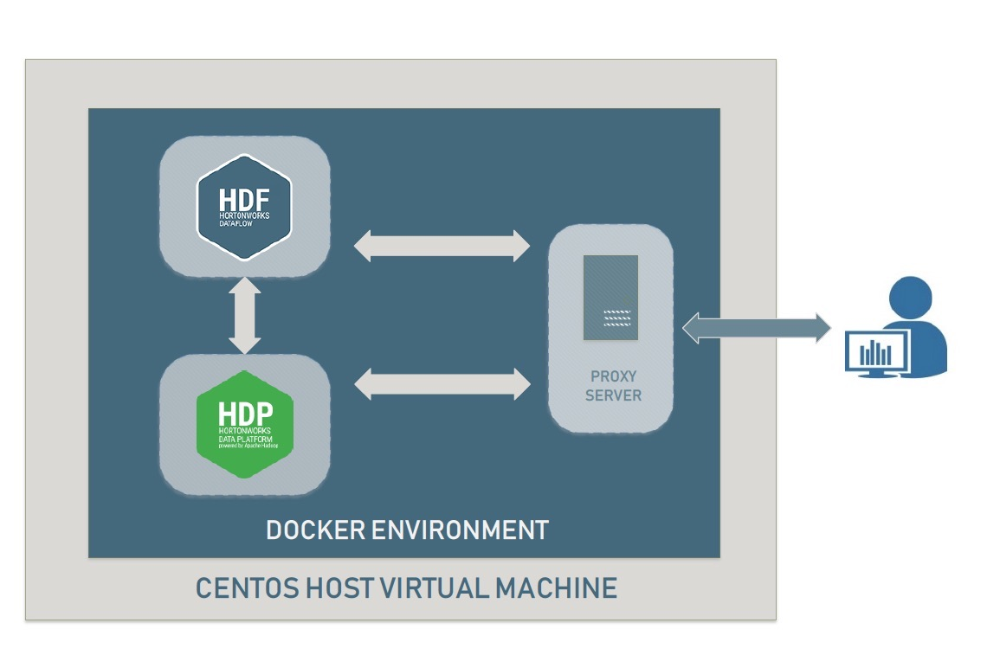
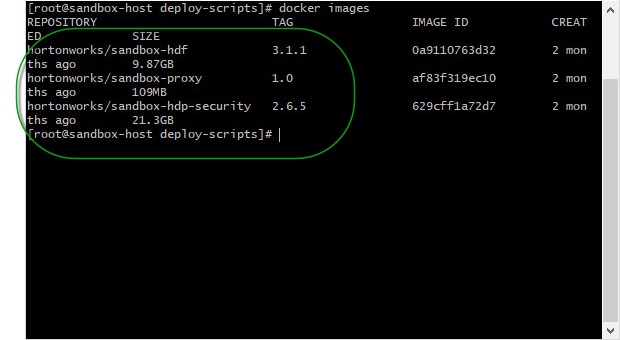
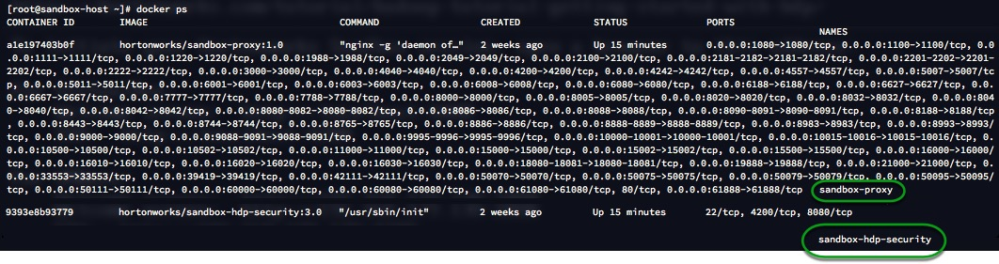
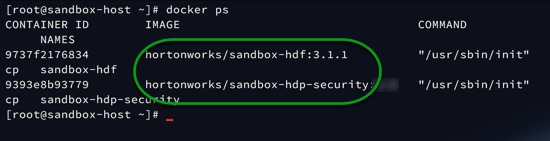
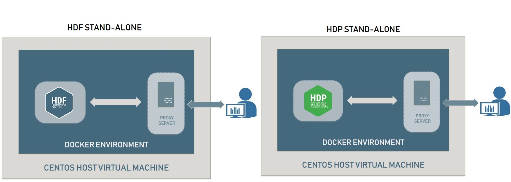
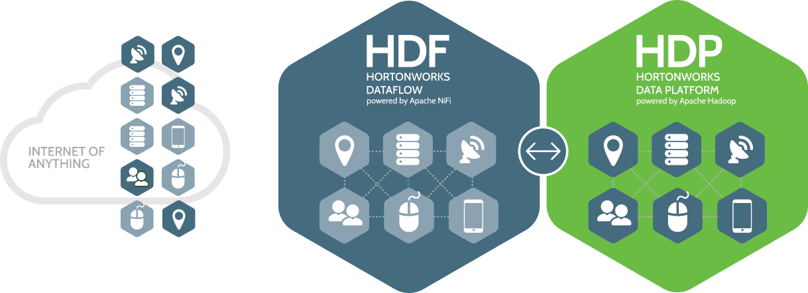
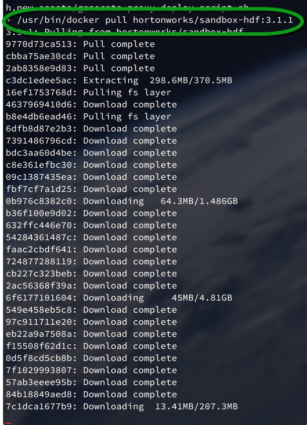
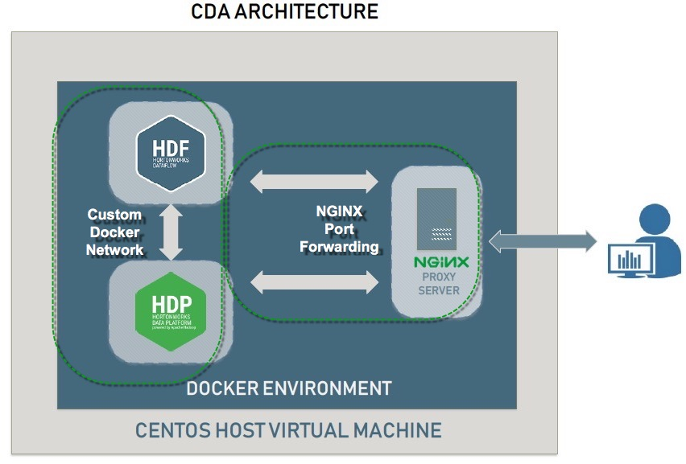

# Sandbox Port Forwarding Guide

# CDA and Sandbox Architecture

## Introduction

This tutorial will explain the current Hortonworks Sandbox architecture, starting in HDP 2.6.5 a new Sandbox structure is introduced making it possible to instantiate two single node clusters (i.e. HDP and HDF) within a single Sandbox with the purpose of combining the best features of the Data-At-Rest and Data-In-Motion methodologies in a single environment. Have a look at the graphical representation of the Sandbox below, it shows where the Sandbox exists in relation to the outside world, the instance depicted is of the Connected Data Architecure (CDA) if you are not yet familiarized with the concept of CDA do not worry, we will review it at a later section.

At a high level the Sandbox is a Linux (CentOS 7) Virtual Machine leveraging docker to host different Sandbox distributions, namely [HDP](https://hortonworks.com/products/data-platforms/hdp/) or [HDF](https://hortonworks.com/products/data-platforms/hdf/). In order to orchestrate communication between the outside world and the Sandbox a reverse proxy server NGINX is containerized and configured to only open the ports needed to the outside enabling us to granularly interact with each container.

## Prerequisites

- Sandbox [Deployment and Install Guide](https://hortonworks.com/tutorial/sandbox-deployment-and-install-guide/)
- Learning the Ropes of the [HDP Sandbox](https://hortonworks.com/tutorial/learning-the-ropes-of-the-hortonworks-sandbox/)
- Learning the Ropes of the [HDF Sandbox](https://hortonworks.com/tutorial/getting-started-with-hdf-sandbox/)
- Basic understanding of [Docker Containers](https://docs.docker.com/engine/docker-overview/)

## Outline

- [Docker Architecture](#docker-architecture)
- [Sandbox Proxy](#sandbox-proxy)
- [HDP vs HDF](#hdp-vs-hdf)
- [What is CDA?](#what-is-cda)
- [Summary](#summary)
- [Further Reading](#further-reading)

## Docker Architecture

In the Docker architecture above, Docker registry are services used for storing Docker images, such as Docker Hub. Docker Host is the computer Docker runs on. Diving deeper into the host, you can see the Docker Daemon, which is used to create and manage Docker objects, such as images, containers, networks and volumes. The user or client is able to interact with Docker daemon via Client Docker CLI. The Docker daemon is a long-running program also known as a server. The CLI utilizes Docker’s REST API to interact with the Docker daemon. As you can observe, the Docker Engine is a client-server application comprised of Client Docker CLI, REST API and Docker daemon.

## Sandbox Proxy

On this new architecture NGINX is used as a reverse proxy server; traditionally, a proxy server is used as an intermediary which forwards traffic across multiple clients in the internet. In contrast, a reverse proxy server resides behind a firewall and directs incoming requests to specific back-end servers, in our case these severs are the HDP and HDF containers.

### Why a Reverse Proxy Server is Needed

One of the biggest obstacles to overcome with this architecture is keeping ports consistent and reduce conflicts as much as possible between containers; for example, we wanted to keep Ambari UI as port 8080 across any Sandbox. The best solution is to keep the default ports as they are but distinguish the back-end server by domain name, this is why in this build we must change the host's name from:

~~~text
sandbox.hortonworks.com:<PORT>
~~~

to

~~~text
sandbox-hdp.hortonworks.com:<PORT>

and

sandbox-hdf.hortonworks.com:<PORT>
~~~

This allows us to maintain consistency across different Sandboxes and avoid conflicts, so when CDA is deployed we may reach Ambari UI at:

~~~text
sandbox-hdp.hortonworks.com:8080
~~~

and

~~~text
sandbox-hdf.hortonworks.com:8080
~~~

In this example Ambari UI is reachable for different Sandboxes at the same time by specifying the domain name of the Sandbox we are trying to reach:

Cool stuff right? Now let's take a look at where out containers are in relation to our virtual environment.

### View Running Containers

If you would like to visualize the running Sandbox container and proxy you you must log on to the host, you may chose to follow along; however, this is not necessary.

In this architecture you may log on to the Sandbox or the host, here is a complete list of the TCP open ports for SSH services:

| Destination     | TCP Port for SSH |
|:---------------:|:----------------:|
| HDP             | 2201             |
| HDF             | 2202             |
| VM - VirtualBox | 2200             |
| VM - VMWare     | 22               |

If you are running the  VirtualBox VM:

~~~bash
# SSH on to VirtualBox Virtual Machine
ssh root@sandbox-hdp.hortonworks.com -p 2200
~~~

Or if you are using VMWare:

~~~bash
# SSH on to VMWare Virtual Machine
ssh root@sandbox-hdp.hortonworks.com -p 22
~~~

> Note: The default password is **hadoop**.

Now that you are in the Virtual Machine hosting the containers we can see what Docker images are ready for deployment:

~~~bash
docker images
~~~

Furthermore, we can see what containers are currently running by using the following command:

~~~bash
docker ps
~~~

If you started out with HDP you will see two containers running, the first is the NGINX proxy container followed by a list of open ports and where they are being forwarded. Since HDP was used as a base in this example we can see that it is listed as a running container.

 here is some context on the information displayed:

|                      CONTAINER ID                      |                                   IMAGE                                  |                                          COMMAND                                          |                 CREATED                 |                              STATUS                             |                                            PORTS                                            |                              NAMES                              |
|:------------------------------------------------------:|:------------------------------------------------------------------------:|:-----------------------------------------------------------------------------------------:|:---------------------------------------:|:---------------------------------------------------------------:|:-------------------------------------------------------------------------------------------:|:---------------------------------------------------------------:|
| Container ID given to an instantiated image by docker. | The executable package from which your container has been instantiated.  | Command used to instantiate your container, typically this is the path of an initialization script. | How long ago the container was created. | A container may be:  UP  UP-PAUSED  RESTARTING  DEAD  CREATED  EXITED. | Open ports. Note that the proxy container also tells us where ports are being forwarded to. | This is the container name e.g. "sandbox-hdp" & "sandbox-proxy" |

When CDA has been deployed both HDP and HDF are displayed as running containers:

### Native Docker Sandbox

The Sandbox may also run using Docker which is native to the host operating system; for example, rather than running a VM to instantiate the containers you may directly interact with the docker daemon. In the Docker architecure for the Sandbox you directly interact with Docker environment as your native operating system is the host for the Sandboxes.

## HDP vs HDF

### HDF (Data-In-Motion)

Data-In-Motion is the idea where data is being ingested from all sorts of different devices into a flow or stream. While the data is moving throughout this flow, components or as NiFi calls them “processors” are performing actions on the data to modify, transform, aggregate and route it. Data-In-Motion covers a lot of the preprocessing stage in building a Big Data Application. For instance, data preprocessing is where Data Engineers work with the raw data to format it into a better schema, so Data Scientists can focus on analyzing and visualizing the data.

### HDP (Data-At-Rest)

Data-At-Rest is the idea where data is not moving and is stored in a database or robust datastore across a distributed data storage such as Hadoop Distributed File System (HDFS). Instead of sending the data to the queries, the queries are being sent to the data to find meaningful insights. At this stage data, data processing and analysis occurs in building a Big Data Application.

## What is CDA?

Hortonworks Connected Data Architecture (CDA) is composed of both Hortonworks DataFlow (HDF) and Hortonworks DataPlatform (HDP) sandboxes and allows you to play with both data-in-motion and data-at-rest frameworks simultaneously.

### Why CDA?

As data is coming in from the edge, it is collected, curated and analyzed in real-time, on premise or in the cloud using the HDF framework. Once the data has been captured you can convert the your Data-In-Motion into Data-At-Rest with the HDP framework to gain further insights.

### How CDA is made possible in the sandbox

In order for HDF to send data into HDP, both sandboxes need to be set up to communicate with each other. If you would like to know more about the deployment of CDA check out the [Sandbox Deployment and Install Guide](https://hortonworks.com/tutorial/sandbox-deployment-and-install-guide/) under the **Advanced Topic** section. When CDA is enabled a script internal to the Sandbox takes into account what base you started with and calls on the Docker daemon to instantiate the image of the complementing Sandbox flavour (e.g. HDP installs HDF, and HDF installs HDP).

In the image below we used HDP as our base and launched the initialization script for CDA. As you can see all the needed components for HDF are being loaded into a new container:

A custom Docker network was created between the running containers through Docker Engine, this is one of the many advantages of being a container because inside the Docker Engine containers can communicate directly with each other through a Docker network named bridge, thus making it possible for the clusters to communicate.

## Summary

Congratulations, you have learned a great deal about the structure of our Sandbox, and how HDP and HDF single node clusters are implemented. Additionally, you have learned what CDA is and how it can be used to capture insights from both Data-At-Rest and Data-In-Motion. Additionally, you have learned about the inter-container communication made possible by Docker's internal network and communication with the outside world done via NGINX. Now that you know the internal workings of CDA on the Sandbox, bring your understanding to practice with these great CDA ready tutorials:

- [Analyze IOT Weather Station Data via Connected Data Architecture](https://hortonworks.com/tutorial/analyze-iot-weather-station-data-via-connected-data-architecture)
- [Real-Time Event Processing in NiFi, SAM, Schema Registry, and SuperSet](https://hortonworks.com/tutorial/real-time-event-processing-in-nifi-sam-schema-registry-and-superset/)
- [Deploy Machine Learning Models using Spark Structured Streaming](https://hortonworks.com/tutorial/deploying-machine-learning-models-using-spark-structured-streaming/)

## Further Reading

- [Hortonworks Connected Data Platforms](https://hortonworks.com/products/data-platforms/)
- [HDP Documentation](https://docs.hortonworks.com/HDPDocuments/HDP2/HDP-2.6.5/index.html)
- [Hortonworks Next-Gen Data Platforms and Solutions](https://hortonworks.com/products/)