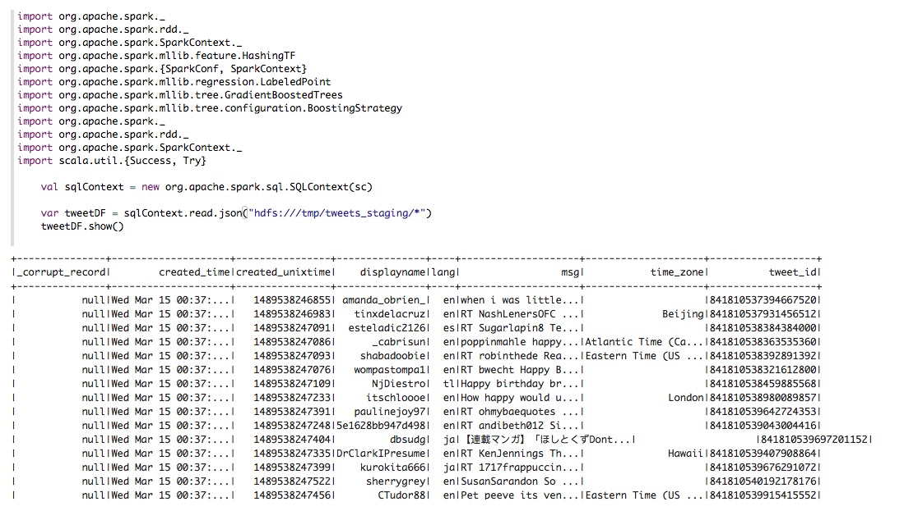
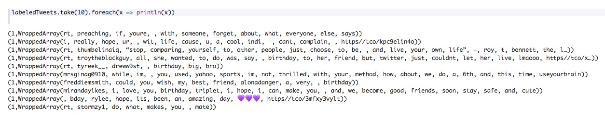
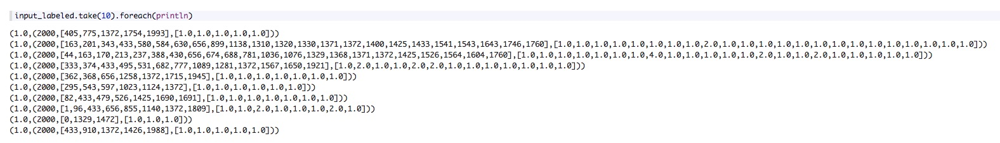
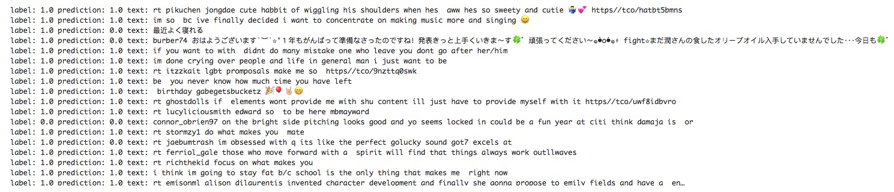
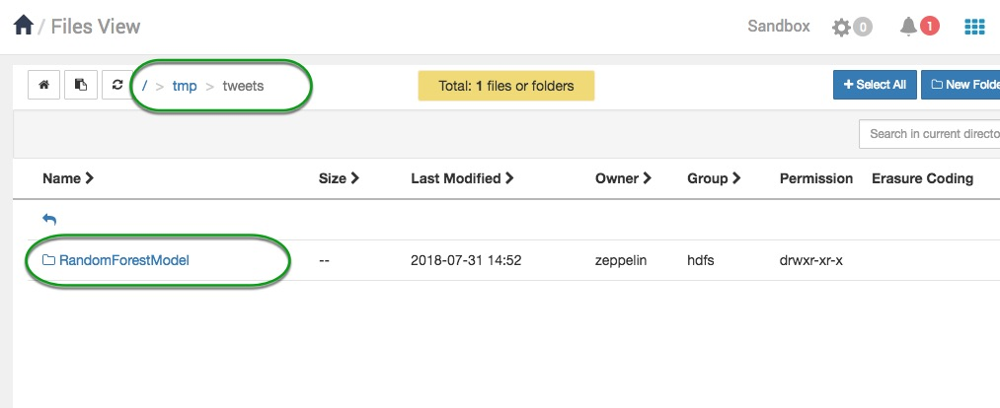

# Sentiment Analysis with Apache Spark

## Introduction

This tutorial will teach you how to build sentiment analysis algorithms with Apache Spark. We will be doing data transformation using Scala and Apache Spark 2, and we will be classifying tweets as happy or sad using a Gradient Boosting algorithm. Although this tutorial is focused on sentiment analysis, Gradient Boosting is a versatile technique that can be applied to many classification problems. You should be able to reuse this code to classify text in many other ways, such as spam or not spam, news or not news, provided you can create enough labeled examples with which to train a model.

This tutorial will first guide you through important concepts needed to understand the algorithms that will be used, once you understand the concepts we will provide you with a link to import the Zeppelin Notebook. It is imperative that you read and understand the tutorial concepts in order to enjoy this tutorial to it's full potential.

## Prerequisites

Before starting this model you should make sure HDFS and Spark2 are started.

- Downloaded and installed latest [Hortonworks Latest Hortonworks Data Platform (HDP) Sandbox](https://hortonworks.com/downloads/)
- [Learning the Ropes of the HDP Sandbox](https://hortonworks.com/tutorial/learning-the-ropes-of-the-hortonworks-sandbox/)
- Installed and binded the [Zeppelin Shell interpreter](https://hortonworks.com/tutorial/getting-started-with-apache-zeppelin/#installing-zeppein-shell) to the Zeppelin Notebook used in this tutorial

## Outline

- [Concepts](#concepts)
- [Clean and Label Records](#clean-records)
- [Transform Data for Machine Learning](#transform-data)
- [Split into Training and Validation Sets](#split-into-training-and-validation-sets)
- [Build the Model](#build-the-model)
- [Import the Zeppelin Notebook](#import-the-zeppelin-notebook)
- [Summary](#summary)
- [Further Reading](#further-reading)

## Concepts

### Download Tweets

Gradient Boosting is a supervised machine learning algorithm, which means we will have to provide it with many examples of statements that are labeled as happy or sad. In an ideal world we would prefer to have a large dataset where a group of experts hand-labeled each statement as happy or sad. Since we don’t have that dataset we can improvise by streaming tweets that contain the words “happy” or “sad”, and use the presence of these words as our labels. This isn’t perfect: a few sentences like “I’m not happy” will end up being incorrectly labeled as happy. If you wanted more accurate labeled data, you could use a part of speech tagger like Stanford NLP or SyntaxNet, which would let you make sure the word “happy” is always describing “I” or “I’m” and the word “not” isn’t applied to “happy”. However, this basic labeling will be good enough to train a working model.

If you’ve followed the [first sentiment analysis tutorial](https://hortonworks.com/tutorial/analyzing-social-media-and-customer-sentiment-with-apache-nifi-and-hdp-search/) you’ve learned how to use Nifi to stream live tweets to your local computer and HDFS storage. If you’ve followed this tutorial you can stream your own tweets by configuring the GetTwitter processor to filter on “happy” and “sad”. If you’re running on the sandbox and want to process a large amount of tweets, you may also want to raise the amount of memory available to YARN and Spark2. You can do that by modifying the setting “Memory allocated for all YARN containers on a node” to > 4G for YARN and spark_daemon_memory to > 4G for Spark2.

## Load data into Spark

Let's load the tweets into Spark. Spark makes it easy to load JSON-formatted data into a dataframe.
After running the respective paragraph on the accompanying [Zeppelin Notebook](assets/sentiment-analysis-spark.json) the output should look like this.

## Clean Records

We want to remove any tweet that doesn't contain "happy" or "sad". We've also chosen to select an equal number of happy and sad tweets to prevent bias in the model. Since we've loaded our data into a Spark DataFrame, we can use SQL-like statements to transform and select our data.

### Label Data

Now label each happy tweet as 1 and unhappy tweets as 0. In order to prevent our model from cheating, we’re going to remove the words happy and sad from the tweets. This will force it to infer whether the user is happy or sad by the presence of other words.

Finally, we also split each tweet into a collection of words. For convenience we convert the Spark Dataframe to an RDD which lets you easily transform data using the map function.

We now have a collection of tuples of the form (Int, Seq[String]), where a 1 for the first term indicates happy and 0 indicates sad. The second term is a sequence of words, including emojis. We removed the words happy and sad from the list of words.

Let's take a look.

Output:

## Transform Data

Gradient Boosting expects as input a vector (feature array) of fixed length, so we need a way to convert our tweets into some numeric vector that represents that tweet. A standard way to do this is to use the [hashing trick](https://en.wikipedia.org/wiki/Feature_hashing), in which we hash each word and index it into a fixed-length array. What we get back is an array that represents the count of each word in the tweet. This approach is called the [bag of words model](https://en.wikipedia.org/wiki/Bag-of-words_model), which means we are representing each sentence or document as a collection of discrete words and ignore grammar or the order in which words appear in a sentence. An alternative approach to bag of words would be to use an algorithm like Doc2Vec or Latent Semantic Indexing, which would use machine learning to build a vector representations of tweets.

In Spark we’re using HashingTF for feature hashing. Note that we’re using an array of size 2000. Since this is smaller than the size of the vocabulary we’ll encounter on Twitter, it means two words with different meaning can be hashed to the same location in the array. Although it would seem this would be an issue, in practice this preserves enough information that the model still works. This is actually one of the strengths of feature hashing, that it allows you to represent a large or growing vocabulary in a fixed amount of space.

  Let’s take a look at how our vectors were hashed:

## Split into Training and Validation Sets

When training any machine learning model you want to separate your data into a training set and a validation set. The training set is what you actually use to build the model, whereas the validation set is used to evaluate the model’s performance afterwards on data that it has never encountered before. This is extremely important, because a model can have very high accuracy when evaluating training data but fail spectacularly when it encounters data it hasn’t seen before.

This situation is called **overfitting**. A good predictive model will build a generalized representation of your data in a way that reflects real things going on in your problem domain, and this generalization gives it predictive power. A model that overfits will instead try to predict the exact answer for each piece of your input data, and in doing so it will fail to generalize. The way we know a model is overfitting is when it has high accuracy on the training dataset but poor or no accuracy when tested against the validation set. This is why it’s important to always test your model against a validation set.

### Fixing overfitting

A little overfitting is usually expected and can often be ignored. If you see that your validation accuracy is very low compared to your training accuracy, you can fix this overfitting by either increasing the size of your training data or by decreasing the number of parameters in your model. By decreasing the number of parameters you decrease the model’s ability to memorize large numbers of patterns. This forces it to build a model of your data in general, which makes it represent your problem domain instead of just memorizing your training data.

## Build the Model

We’re using a Gradient Boosting model. The reason we chose Gradient Boosting for classification over some other model is because it’s easy to use (doesn’t require tons of parameter tuning), and it tends to have a high classification accuracy. For this reason it is frequently used in machine learning competitions.

The tuning parameters we’re using here are:
-number of iterations (passes over the data)
-Max Depth of each decision tree

In practice when building machine learning models you usually have to test different settings and combinations of tuning parameters until you find one that works best. For this reason it’s usually best to first train the model on a subset of data or with a small number of iterations. This lets you quickly experiment with different tuning parameter combinations.

This step may take a few minutes on a sandbox VM. If you’re running on a sandbox and it’s taking more than five minutes you may want to stop the process and decrease the number of iterations.

### Evaluate model

Let's evaluate the model to see how it performed against our training and test set.

Here's the output:

~~~text
unhappy messages in Training Set: 1362 happy messages: 1318
happy % correct: 0.7132018209408194
unhappy % correct: 0.9265785609397944
testErr: Double = 0.1783582089552239
Test Error Training Set: 0.1783582089552239

unhappy messages in Validation Set: 601 happy messages: 583
happy % correct: 0.6500857632933105
unhappy % correct: 0.9018302828618968
testErr: Double = 0.22212837837837837
Test Error Validation Set: 0.22212837837837837
~~~

The results show that the model is very good at detecting unhappy messages (90% accuracy), and significantly less adept at identifying happy messages (65% accuracy). To improve this we could provide the model more examples of happy messages to learn from.

Also note that our training accuracy is slightly higher than our validation accuracy. This is an example of slightly overfitting the training data. Since the training accuracy is only slightly higher than the validation accuracy, this is normal and not something we should concerned about. However, if the validation accuracy was significantly worse than the training accuracy it would mean the model had grossly overfit its training data. In that situation, you would want to either increase the amount of data available for training or decrease the number of parameters (the complexity) of the model.

Now let’s inspect individual tweets and see how the model interpreted them. This can often provide some insight into what the model is doing right and wrong.

Output:

Once you've trained your first model, you should go back and tweak the model parameters to see if you can increase model accuracy. In this case, try tweaking the depth of each tree and the number of iterations over the training data. You could also let the model see a greater percentage of happy tweets than unhappy tweets to see if that improves prediction accuracy for happy tweets.

### Export the Model

Once your model is as accurate as you can make it, you can export it for production use. Models trained with Spark can be easily loaded back into a Spark Streaming workflow for use in production.

The model will be saved in HDFS under the directory path specified in the Notebook:

~~~scala
model.save(sc, "hdfs:///tmp/tweets/RandomForestModel")
~~~

## Import the Zeppelin Notebook

 Great! now you are familiar with the concepts used in this tutorial and you are ready to Import the *Sentiment Analysis with Apache Spark* notebook into your Zeppelin environment. (If at any point you have any issues, make sure to checkout the [Getting Started with Apache Zeppelin](https://hortonworks.com/tutorial/getting-started-with-apache-zeppelin/) tutorial).

To import the notebook, go to the Zeppelin home screen.

1\. Click **Import note**

2\. Select **Add from URL**

3\. Copy and paste the following URL into the **Note URL**

~~~text
https://raw.githubusercontent.com/hortonworks/data-tutorials/master/tutorials/hdp/sentiment-analysis-with-apache-spark/assets/Sentiment%20Analysis.json
~~~

4\. Click on **Import Note**

Once your notebook is imported, you can open it from the Zeppelin home screen by:

5\. Clicking **Clicking on the Sentiment Analysis Spark**

Once the **Sentiment Analysis Spark** notebook is up, follow all the directions within the notebook to complete the tutorial.

## Summary

You’ve now seen how to build a sentiment analysis model. The techniques you’ve seen here can be directly applied to other text classification models, such as spam classification. Try running this code with other keywords besides happy and sad and see what models you can build.

## Further Reading

- [Analyzing Social Media and Customer Sentiment with Apache Nifi and HDP Search](https://hortonworks.com/tutorial/analyzing-social-media-and-customer-sentiment-with-apache-nifi-and-hdp-search/)
- [Data Science Starter Kit.](https://hortonworks.com/info/data-science-cloud/)
- [Hortonworks Community Connection](https://community.hortonworks.com/index.html)
- Sentiment Analysis [CDA Tutorial](https://hortonworks.com/tutorial/analyzing-social-media-and-customer-sentiment-with-apache-nifi-and-hdp-search/)