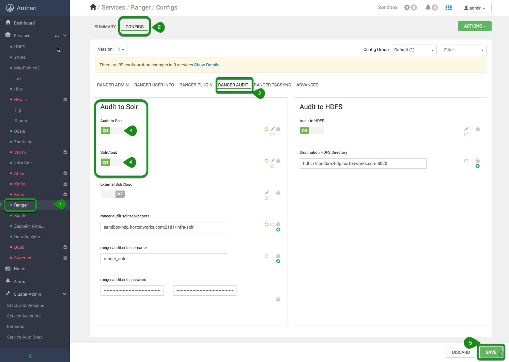
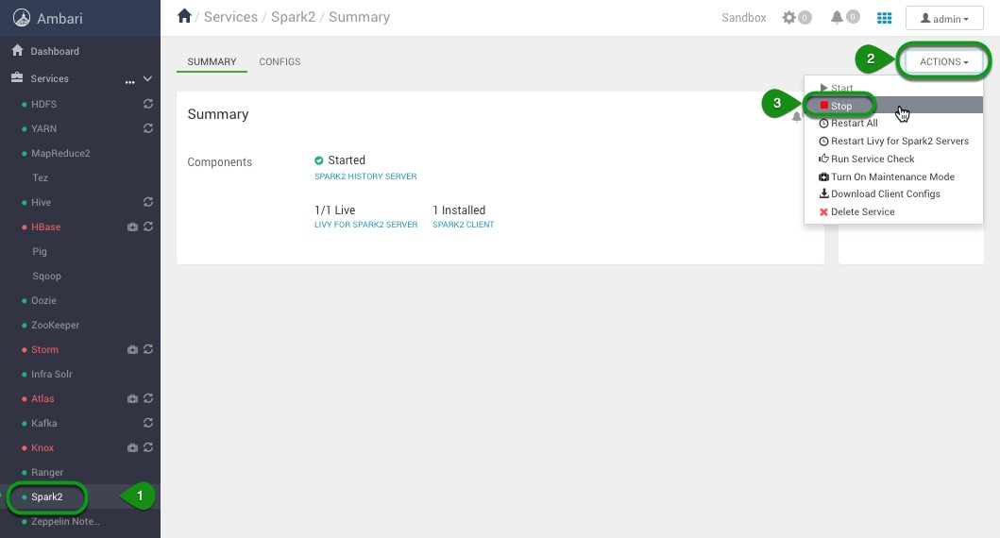
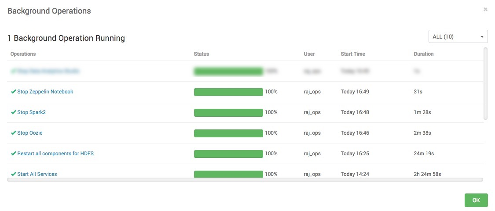
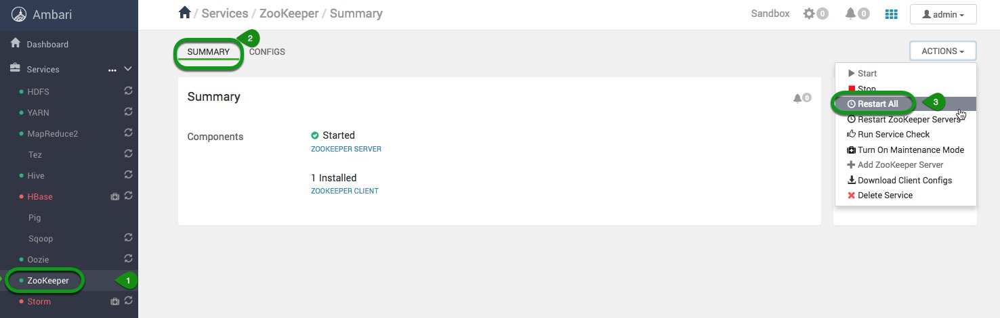
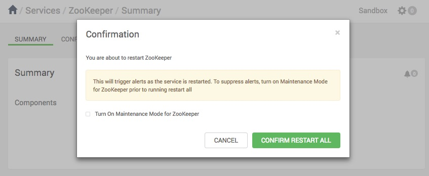
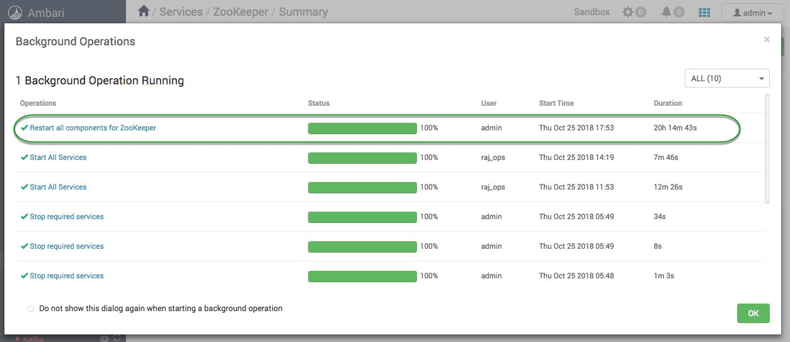
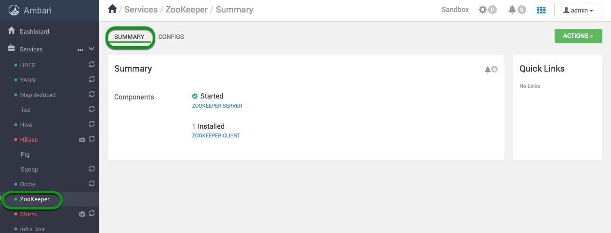
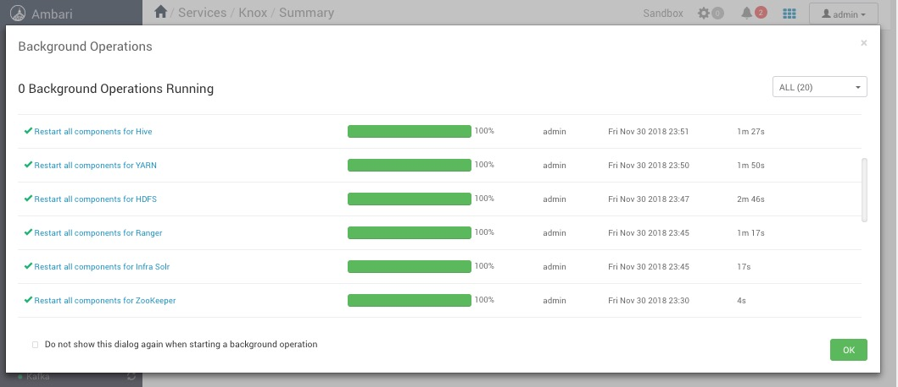

# Tag Based Policies with Apache Ranger and Apache Atlas

## Setting up the environment

## Introduction

In this section of the tutorial we will prepare the Sandbox environment by enabling relevant services and turning off services that are not used.

## Prerequisites

- Downloaded and deployed the [Hortonworks Data Platform (HDP)](https://www.cloudera.com/downloads/hortonworks-sandbox/hdp.html?utm_source=mktg-tutorial) Sandbox
- [Learning the Ropes of the HDP Sandbox](https://hortonworks.com/tutorial/learning-the-ropes-of-the-hortonworks-sandbox/)

## Outline

- [Concepts](#concepts)
- [Enable Ranger Audit to Solr](#enable-Ranger-Audit-to-Solr)
- [Stop Services not Used in Tag Based Policies](#stop-services-not-used-in-tag-based-policies)
- [Restart Affected Services](#restart-affected-services)
- [Verify "ranger_audits" is created in Ambari Infra Solr](#verify-"ranger_audits"-is-created-in-ambari-infra-solr)
- [Summary](#summary)
- [Further Reading](#further-reading)

## Concepts

Before we begin creating, assigning, and editing tag policies we must enable Ranger audit to Solr and start the services needed to assign policies. Additionally, we will stop services not necessary for this tutorial.

Furthermore, we should become acquainted with the personas who reside within the HDP Sandbox.

Here is a brief description of them:

- raj_ops: Big Data Operations
- maria_dev: Big Data Developer

Raj is our administrator and thus has full access to most of Ambari's services.
Maria is our developer and thus has limited access to our cluster's services.

**Username** – raj_ops
**Password** – raj_ops

**Username** – maria_dev
**Password** – maria_dev

In order to set up our environment we will use our cluster administrator **admin**.

## Enable Ranger Audit to Solr

Use your HDP **admin** credentials to sign in.

**Table 1**: Ambari Login credentials

| Username | Password |
|:---:|:---:|
| admin | **your password |

If this is your first time setting up the **admin** password follow the instructions in [Setup Ambari Admin Password Manually](https://hortonworks.com/tutorial/learning-the-ropes-of-the-hortonworks-sandbox/#admin-password-reset).

Once in Ambari click on the **Ranger** service on the service Stack on the left and follow these steps to enable audit to Solr:

1\. Ensure you are in the **Ranger** service

2\. Select the **Configs** tab

3\. Go to the **Ranger Audit** tab

4\. Turn **ON** Ranger's Audit to Solr and SolrCloud features

5\. **Save** this configuration

In the **Save Configuration** window that appears, write `Enable Audit to Solr and SolrCloud Feature`, then select **Save**, next click **OK** button on Dependent Configurations window.
Finally, click **Proceed Anyway** on the **Save Configuration Changes** window, and click **OK**.

## Stop Services Not Used in Tag Based Policies

Before we restart all the services that were affected by enabling the Audit to Solr and SolrCloud, we need to stop services that will not be used as part of the Tag Based Policies tutorial. We do this because we will be starting additional services, our sandbox is meant to have limited resources and might not respond well to having many services on at the same time.

We will start with Spark2. Go to the Spark2 service, click on the **Stop** button located in **Service Actions**.

1\. Stop the following services in this order:

- Spark2
- Zeppelin

## Restart Affected Services

 Enabling Solr and SolrCloud affected other services on the stack. In order for the changes that we made to take effect on our sandbox we need to restart the affected services. We will start with Zookeeper.

### Restart the Zookeeper Service

1\. Select **Zookeeper**, then click on **Service Actions**. Click on **Restart All** to restart all components of Zookeeper. It will also restart all affected components of Zookeeper.

2\. On the **Confirmation** window, press **Confirm Restart All**.

**Background Operation Running** window will appear showing Zookeeper currently is being restarted. This window will appear for other services you perform a service action upon.

Click **OK** button in bottom right corner.

3\. Once Zookeeper finishes restarting, you will be able to see the components health.

4\. Let's get back to Ambari Dashboard, click on the Ambari icon  in the top left corner.

### Restart the Remaining Services

1\. We will follow a similar approach as we did with the Zookeeper service to restart all the remaining services.

Restart the remaining services in this order:

- Infra Solr
- Ranger
- HDFS
- YARN
- Hive
- HBase (Turn Off Maintenance Mode then Restart All HBase)
- Storm (Turn Off Maintenance Mode then Restart All Storm)
- Atlas (Turn Off Maintenance Mode then Restart All Atlas)
- Kafka
- Knox  (Turn off Maintenance Mode then Restart All Knox)

If **Knox** doesn't restart due to the **KNOX GATEWAY** failing, then:

- Click on **Knox Gateway**

- Find **Knox Gateway** under components and Start **Knox Gateway**

- Go back to Knox's **Host Actions** and **Restart All Components**

2\. In your **Background Operations Running** window, it should show that all the above services are being restarted.

### Verify "ranger_audits" is created in Ambari Infra Solr

Once services have been restarted, you should verify that **ranger_audits** is started:

**Ambari** -> **Infra Solr** -> **Quick Links** -> **Solr Admin UI**

Make sure "ranger_audits" is displayed in Ambari Infra Solr as in the picture below:

**Dashboard** -> **Cloud** -> **Graph**

## Summary

Great now that we have set up the environment for us to work with let's get to work assigning Tag Based Policies with Atlas.

## Further Reading

- Downloaded and deployed the [Hortonworks Data Platform (HDP)](https://www.cloudera.com/downloads/hortonworks-sandbox/hdp.html?utm_source=mktg-tutorial) Sandbox
- [Learning the Ropes of the HDP Sandbox](https://hortonworks.com/tutorial/learning-the-ropes-of-the-hortonworks-sandbox/)
